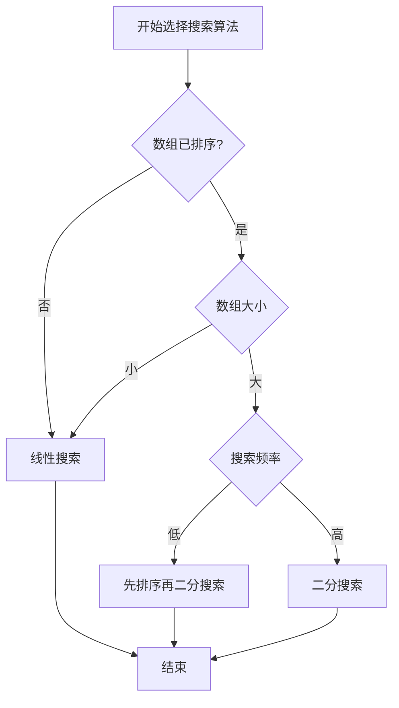

# C++ 数组搜索

在程序开发中，在数组中查找特定元素是一项非常常见的操作。无论是查找用户输入的值，还是验证数据是否存在，搜索算法都是计算机科学中的基础知识。本文将介绍在C++中如何实现和应用不同的数组搜索技术。

## 数组搜索概述

数组搜索是指在数组中查找特定元素的过程。根据数组是否有序，以及对效率的要求，可以选择不同的搜索算法。常见的数组搜索算法包括：

1. 线性搜索（Linear Search）
2. 二分搜索（Binary Search）
3. 跳跃搜索（Jump Search）
4. 插值搜索（Interpolation Search）

本文将重点介绍最常用的线性搜索和二分搜索算法。

## 线性搜索（Linear Search）

### 基本概念

线性搜索是最简单的搜索算法，它按顺序查找数组中的每个元素，直到找到目标值或遍历完整个数组。

### 算法步骤

1. 从数组的第一个元素开始
2. 将当前元素与要查找的值进行比较
3. 如果匹配，返回当前位置
4. 如果不匹配，移动到下一个元素
5. 如果遍历完整个数组仍未找到，返回表示"未找到"的值（通常是-1）

### 代码实现

```cpp
#include <iostream>
using namespace std;

// 线性搜索函数
int linearSearch(int arr[], int size, int key) {
    for (int i = 0; i < size; i++) {
        if (arr[i] == key) {
            return i;  // 找到元素，返回索引
        }
    }
    return -1;  // 未找到元素
}

int main() {
    int arr[] = {10, 23, 5, 17, 42, 8, 31};
    int size = sizeof(arr) / sizeof(arr[0]);
    int key = 17;
    
    int result = linearSearch(arr, size, key);
    
    if (result == -1) {
        cout << "元素 " << key << " 未在数组中找到" << endl;
    } else {
        cout << "元素 " << key << " 在数组中的索引位置是: " << result << endl;
    }
    
    return 0;
}
```

**输出结果:**
```
元素 17 在数组中的索引位置是: 3
```

### 复杂度分析

- **时间复杂度**: O(n)，其中n是数组的大小。在最坏情况下，我们可能需要遍历整个数组才能找到元素。
- **空间复杂度**: O(1)，因为只使用了常量额外空间。

:::note
线性搜索适用于小型数组或未排序的数组。对于大型数组，特别是已排序的数组，我们应该考虑使用更高效的算法，如二分搜索。
:::

## 二分搜索（Binary Search）

### 基本概念

二分搜索是一种高效的搜索算法，但前提是数组必须是已排序的。它通过反复将搜索区间分成两半，并确定目标值在哪一半，从而快速缩小搜索范围。

### 算法步骤

1. 将数组排序（如果尚未排序）
2. 设置左边界`left=0`和右边界`right=size-1`
3. 当`left <= right`时，计算中间索引`mid = (left + right) / 2`
4. 如果`arr[mid]`等于目标值，返回`mid`
5. 如果`arr[mid]`小于目标值，将`left`设置为`mid+1`
6. 如果`arr[mid]`大于目标值，将`right`设置为`mid-1`
7. 如果遍历结束仍未找到，返回`-1`

### 代码实现

```cpp
#include <iostream>
#include <algorithm>  // 用于sort函数
using namespace std;

// 二分搜索函数
int binarySearch(int arr[], int left, int right, int key) {
    while (left <= right) {
        int mid = left + (right - left) / 2;  // 避免可能的整数溢出
        
        // 检查中间元素是否为key
        if (arr[mid] == key) {
            return mid;
        }
        
        // 如果key大于中间元素，忽略左半部分
        if (arr[mid] < key) {
            left = mid + 1;
        }
        // 如果key小于中间元素，忽略右半部分
        else {
            right = mid - 1;
        }
    }
    
    // 元素不存在
    return -1;
}

int main() {
    int arr[] = {5, 8, 10, 17, 23, 31, 42};  // 已排序数组
    int size = sizeof(arr) / sizeof(arr[0]);
    int key = 17;
    
    int result = binarySearch(arr, 0, size - 1, key);
    
    if (result == -1) {
        cout << "元素 " << key << " 未在数组中找到" << endl;
    } else {
        cout << "元素 " << key << " 在数组中的索引位置是: " << result << endl;
    }
    
    return 0;
}
```

**输出结果:**
```
元素 17 在数组中的索引位置是: 3
```

:::caution
二分搜索要求数组必须是已排序的。如果数组未排序，你需要先对其进行排序，例如使用`std::sort(arr, arr + size)`。
:::

### 递归实现二分搜索

二分搜索也可以使用递归方式实现：

```cpp
// 递归实现二分搜索
int binarySearchRecursive(int arr[], int left, int right, int key) {
    if (left <= right) {
        int mid = left + (right - left) / 2;
        
        // 如果元素在中间
        if (arr[mid] == key) {
            return mid;
        }
        
        // 如果元素小于中间值，在左半部分查找
        if (arr[mid] > key) {
            return binarySearchRecursive(arr, left, mid - 1, key);
        }
        
        // 否则，在右半部分查找
        return binarySearchRecursive(arr, mid + 1, right, key);
    }
    
    // 元素不存在
    return -1;
}
```

### 复杂度分析

- **时间复杂度**: O(log n)，每次比较后搜索范围减半。
- **空间复杂度**: 
  - 迭代版本: O(1)
  - 递归版本: O(log n)，因为递归调用栈的开销

## 实际应用场景

### 1. 数据库查询

假设我们有一个学生记录数组，需要根据学号查找特定学生：

```cpp
#include <iostream>
#include <string>
#include <algorithm>
using namespace std;

struct Student {
    int id;
    string name;
    float gpa;
};

// 用于排序的比较函数
bool compareById(const Student& a, const Student& b) {
    return a.id < b.id;
}

// 根据ID查找学生
int findStudentById(Student arr[], int size, int studentId) {
    // 确保数组按ID排序
    sort(arr, arr + size, compareById);
    
    int left = 0, right = size - 1;
    while (left <= right) {
        int mid = left + (right - left) / 2;
        
        if (arr[mid].id == studentId) {
            return mid;
        }
        
        if (arr[mid].id < studentId) {
            left = mid + 1;
        } else {
            right = mid - 1;
        }
    }
    
    return -1;
}

int main() {
    Student students[] = {
        {1005, "Alice", 3.8},
        {1002, "Bob", 3.5},
        {1007, "Charlie", 3.9},
        {1001, "David", 3.2},
        {1004, "Eve", 4.0}
    };
    
    int size = sizeof(students) / sizeof(students[0]);
    int searchId = 1004;
    
    int result = findStudentById(students, size, searchId);
    
    if (result != -1) {
        cout << "找到学生: ID=" << students[result].id 
             << ", 姓名=" << students[result].name 
             << ", GPA=" << students[result].gpa << endl;
    } else {
        cout << "未找到ID为 " << searchId << " 的学生" << endl;
    }
    
    return 0;
}
```

### 2. 游戏开发中的敌人搜索

在游戏开发中，可能需要根据敌人ID查找特定敌人：

```cpp
#include <iostream>
#include <string>
using namespace std;

struct Enemy {
    int id;
    string name;
    int health;
    int damage;
};

// 在敌人数组中查找特定ID的敌人
// 假设敌人较多但ID分布稀疏，使用线性搜索
int findEnemyById(Enemy enemies[], int size, int enemyId) {
    for (int i = 0; i < size; i++) {
        if (enemies[i].id == enemyId) {
            return i;
        }
    }
    return -1;
}

int main() {
    Enemy enemies[] = {
        {101, "Goblin", 50, 5},
        {205, "Orc", 100, 10},
        {173, "Dragon", 500, 50},
        {142, "Skeleton", 30, 8},
        {287, "Troll", 150, 20}
    };
    
    int size = sizeof(enemies) / sizeof(enemies[0]);
    int targetId = 173;  // 查找Dragon
    
    int result = findEnemyById(enemies, size, targetId);
    
    if (result != -1) {
        cout << "找到敌人: " << enemies[result].name 
             << ", 生命值=" << enemies[result].health 
             << ", 攻击力=" << enemies[result].damage << endl;
    } else {
        cout << "未找到ID为 " << targetId << " 的敌人" << endl;
    }
    
    return 0;
}
```

## 选择合适的搜索算法

下面是一个流程图，帮助你选择合适的搜索算法：



## 搜索算法比较

| 算法 | 时间复杂度 | 空间复杂度 | 是否需要排序 | 适用场景 |
|------|-----------|-----------|------------|---------|
| 线性搜索 | O(n) | O(1) | 否 | 小型数组，未排序数组 |
| 二分搜索 | O(log n) | O(1)（迭代）<br/>O(log n)（递归） | 是 | 大型已排序数组 |

## 总结

1. **线性搜索**是最简单的搜索算法，适用于小型或未排序的数组，时间复杂度为O(n)。

2. **二分搜索**是一种高效的算法，但要求数组必须是已排序的，时间复杂度为O(log n)。

3. 在选择搜索算法时，需要考虑以下因素：
   - 数组是否已排序
   - 数组大小
   - 搜索频率
   - 是否需要动态更新数组

4. 对于经常需要搜索的大型数据集，值得先进行排序，然后使用二分搜索。

## 练习题

1. 实现一个修改版的线性搜索，找出数组中所有匹配目标值的索引位置。

2. 使用二分搜索找出数组中第一次出现目标值的位置（如果有重复元素）。

3. 实现一个函数，在未排序数组中找到最接近给定值的元素。

4. 修改二分搜索，使其在找不到元素时，返回该元素应插入的位置，保持数组有序。

5. 实现跳跃搜索算法，并与线性搜索和二分搜索进行性能对比。

:::tip
搜索算法是编程基础中的重要部分，掌握不同的搜索策略将帮助你编写更高效的代码。在实际应用中，根据数据特性和需求选择合适的算法至关重要。
:::