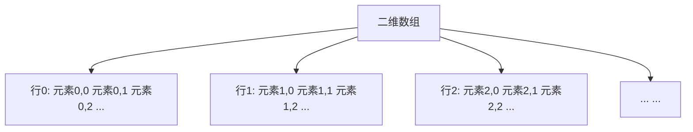

# C++ 二维数组

二维数组是C++中非常实用的数据结构，它可以看作是"数组的数组"，允许我们以表格形式（行和列）组织和存储数据。掌握二维数组对于处理表格数据、矩阵运算、图像处理等应用至关重要。

## 什么是二维数组？

二维数组是一种特殊的数组，它由多个一维数组组成，可以表示为"行"和"列"的二维表格结构。在内存中，二维数组实际上是按行存储的一维数组。



## 声明和初始化二维数组

### 基本声明

二维数组的声明格式如下：

```cpp
数据类型 数组名[行数][列数];
```

例如：

```cpp
int matrix[3][4]; // 声明一个3行4列的整数二维数组
```

### 初始化方法

#### 1. 声明时初始化

```cpp
int matrix[3][4] = {
    {1, 2, 3, 4},   // 第一行
    {5, 6, 7, 8},   // 第二行
    {9, 10, 11, 12} // 第三行
};
```

#### 2. 省略内部大括号

```cpp
int matrix[3][4] = {1, 2, 3, 4, 5, 6, 7, 8, 9, 10, 11, 12};
```

这种方法会按行顺序填充数组元素。

#### 3. 部分初始化

```cpp
int matrix[3][4] = {
    {1, 2},        // 剩余元素被初始化为0
    {5, 6, 7},     // 剩余元素被初始化为0
    {9, 10, 11, 12}
};
```

未初始化的元素会自动设置为0。

#### 4. C++11中使用大括号初始化

```cpp
int matrix[][4] = {
    {1, 2, 3, 4},
    {5, 6, 7, 8},
    {9, 10, 11, 12}
};
```

行数可以省略，编译器会自动计算，但列数必须明确指定。

## 访问二维数组元素

我们可以使用两个下标来访问二维数组的元素：

```cpp
数组名[行索引][列索引]
```

:::note
在C++中，数组索引从0开始计数。因此，对于一个3×4的数组，行索引的范围是0到2，列索引的范围是0到3。
:::

### 示例：访问和修改数组元素

```cpp
#include <iostream>
using namespace std;

int main() {
    int matrix[3][4] = {
        {1, 2, 3, 4},
        {5, 6, 7, 8},
        {9, 10, 11, 12}
    };
    
    // 访问元素
    cout << "matrix[1][2] = " << matrix[1][2] << endl; // 输出: 7
    
    // 修改元素
    matrix[1][2] = 20;
    cout << "修改后的matrix[1][2] = " << matrix[1][2] << endl; // 输出: 20
    
    return 0;
}
```

输出：
```
matrix[1][2] = 7
修改后的matrix[1][2] = 20
```

## 遍历二维数组

### 使用嵌套循环遍历

```cpp
#include <iostream>
using namespace std;

int main() {
    int matrix[3][4] = {
        {1, 2, 3, 4},
        {5, 6, 7, 8},
        {9, 10, 11, 12}
    };
    
    // 使用嵌套for循环遍历二维数组
    for (int i = 0; i < 3; i++) {
        for (int j = 0; j < 4; j++) {
            cout << matrix[i][j] << "\t";
        }
        cout << endl;
    }
    
    return 0;
}
```

输出：
```
1    2    3    4
5    6    7    8
9    10   11   12
```

### 使用C++11范围for循环遍历

```cpp
#include <iostream>
using namespace std;

int main() {
    int matrix[3][4] = {
        {1, 2, 3, 4},
        {5, 6, 7, 8},
        {9, 10, 11, 12}
    };
    
    // 使用C++11范围for循环遍历二维数组
    for (const auto& row : matrix) {
        for (int element : row) {
            cout << element << "\t";
        }
        cout << endl;
    }
    
    return 0;
}
```

输出结果与前面的示例相同。

## 二维数组的内存分配

在C++中，二维数组在内存中是以行优先（row-major）的顺序存储的，即先存储第一行的所有元素，然后是第二行，依此类推。

```mermaid
graph LR
    A[内存布局] --> B[1 2 3 4 | 5 6 7 8 | 9 10 11 12]
    C[行0] -.-> D[1 2 3 4]
    E[行1] -.-> F[5 6 7 8]
    G[行2] -.-> H[9 10 11 12]
```

## 二维数组作为函数参数

### 传递固定大小的二维数组

```cpp
void processMatrix(int matrix[3][4]) {
    // 处理二维数组
}
```

### 使用模板参数

```cpp
template <size_t Rows, size_t Cols>
void processMatrix(int (&matrix)[Rows][Cols]) {
    // 处理任意大小的二维数组
}
```

### 使用指针

```cpp
void processMatrix(int** matrix, int rows, int cols) {
    // 处理动态分配的二维数组
}
```

:::caution
使用指针方式时，二维数组必须是动态分配的，而非普通的二维数组。普通二维数组与二级指针的内存布局不同。
:::

## 实际应用示例

### 示例1：矩阵相加

```cpp
#include <iostream>
using namespace std;

int main() {
    int matrixA[2][3] = {
        {1, 2, 3},
        {4, 5, 6}
    };
    
    int matrixB[2][3] = {
        {7, 8, 9},
        {10, 11, 12}
    };
    
    int result[2][3];
    
    // 矩阵相加
    for (int i = 0; i < 2; i++) {
        for (int j = 0; j < 3; j++) {
            result[i][j] = matrixA[i][j] + matrixB[i][j];
        }
    }
    
    // 输出结果矩阵
    cout << "矩阵相加结果：" << endl;
    for (int i = 0; i < 2; i++) {
        for (int j = 0; j < 3; j++) {
            cout << result[i][j] << "\t";
        }
        cout << endl;
    }
    
    return 0;
}
```

输出：
```
矩阵相加结果：
8    10   12
14   16   18
```

### 示例2：图像处理 - 简单模糊滤镜

假设我们有一个表示灰度图像的二维数组，可以实现简单的模糊效果：

```cpp
#include <iostream>
using namespace std;

int main() {
    // 原始图像数据 (5x5灰度图像)
    int image[5][5] = {
        {10, 20, 30, 40, 50},
        {20, 30, 40, 50, 60},
        {30, 40, 50, 60, 70},
        {40, 50, 60, 70, 80},
        {50, 60, 70, 80, 90}
    };
    
    // 模糊后的图像
    int blurred[5][5] = {0};
    
    // 应用3x3均值模糊滤镜（边界不处理）
    for (int i = 1; i < 4; i++) {
        for (int j = 1; j < 4; j++) {
            int sum = 0;
            // 3x3区域求和
            for (int di = -1; di <= 1; di++) {
                for (int dj = -1; dj <= 1; dj++) {
                    sum += image[i + di][j + dj];
                }
            }
            // 均值
            blurred[i][j] = sum / 9;
        }
    }
    
    // 输出原始图像
    cout << "原始图像：" << endl;
    for (int i = 0; i < 5; i++) {
        for (int j = 0; j < 5; j++) {
            cout << image[i][j] << "\t";
        }
        cout << endl;
    }
    
    // 输出模糊后的图像
    cout << "\n模糊后的图像：" << endl;
    for (int i = 0; i < 5; i++) {
        for (int j = 0; j < 5; j++) {
            cout << blurred[i][j] << "\t";
        }
        cout << endl;
    }
    
    return 0;
}
```

## 二维数组与动态内存分配

有时我们需要在运行时确定二维数组的大小，这时可以使用动态内存分配：

### 方法1：使用vector

```cpp
#include <iostream>
#include <vector>
using namespace std;

int main() {
    int rows = 3, cols = 4;
    
    // 创建一个rows x cols的二维vector
    vector<vector<int>> matrix(rows, vector<int>(cols, 0));
    
    // 赋值
    for (int i = 0; i < rows; i++) {
        for (int j = 0; j < cols; j++) {
            matrix[i][j] = i * cols + j + 1;
        }
    }
    
    // 输出
    for (const auto& row : matrix) {
        for (int val : row) {
            cout << val << "\t";
        }
        cout << endl;
    }
    
    return 0;
}
```

### 方法2：使用动态分配的数组

```cpp
#include <iostream>
using namespace std;

int main() {
    int rows = 3, cols = 4;
    
    // 分配行指针数组
    int** matrix = new int*[rows];
    
    // 分配每一行
    for (int i = 0; i < rows; i++) {
        matrix[i] = new int[cols];
    }
    
    // 赋值
    for (int i = 0; i < rows; i++) {
        for (int j = 0; j < cols; j++) {
            matrix[i][j] = i * cols + j + 1;
        }
    }
    
    // 输出
    for (int i = 0; i < rows; i++) {
        for (int j = 0; j < cols; j++) {
            cout << matrix[i][j] << "\t";
        }
        cout << endl;
    }
    
    // 释放内存
    for (int i = 0; i < rows; i++) {
        delete[] matrix[i];
    }
    delete[] matrix;
    
    return 0;
}
```

:::warning
使用动态分配的二维数组时，记得在使用完毕后释放内存，以避免内存泄漏。
:::

## 常见错误与注意事项

1. **数组越界**：访问超出数组边界的元素会导致未定义行为。

2. **行列混淆**：确保正确区分行索引和列索引。

3. **初始化不完整**：部分初始化时，未指定的元素会被初始化为0。

4. **传递给函数**：传递二维数组时，需要指定列数（但行数可以省略）。

5. **动态内存管理**：使用`new`分配的内存必须用`delete`释放。

## 总结

二维数组是C++中处理表格数据的重要工具：

- 可以看作"数组的数组"，以行和列的形式组织数据
- 声明格式：`数据类型 数组名[行数][列数]`
- 可以在声明时初始化，也可以后续赋值
- 使用双重索引访问元素：`数组名[行索引][列索引]`
- 通常使用嵌套循环进行遍历
- 可以作为函数参数传递，但需注意参数传递的特点
- 可以使用动态内存分配或vector创建运行时大小的二维数组

掌握二维数组的使用，对于处理矩阵计算、图像处理、游戏开发和数据分析等领域非常重要。

## 练习

1. 编写程序，创建一个3x3的二维数组，并实现矩阵转置（行列互换）。

2. 实现矩阵乘法，计算两个矩阵的乘积。

3. 创建一个程序，使用二维数组表示一个棋盘，并实现简单的棋盘游戏（如井字棋）。

4. 实现一个图像旋转算法，将表示为二维数组的图像旋转90度。

5. 使用二维数组存储学生的成绩（每行代表一个学生，每列代表一门课程），计算每个学生的平均成绩和每门课程的平均成绩。

通过这些练习，您将能够更好地掌握二维数组的各种操作和应用场景。