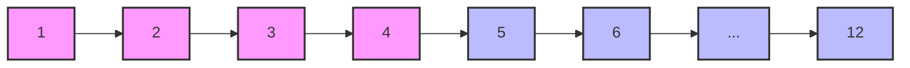

# C++ 多维数组

在C++编程中，多维数组是一种强大的数据结构，它允许我们以表格或矩阵形式组织和存储数据。如果说一维数组是一条线，那么多维数组就是一个平面或空间，能够更直观地表示复杂数据。

## 什么是多维数组？

多维数组简单来说就是"数组的数组"。最常见的多维数组是二维数组，它可以被想象成一个表格，有行和列。三维数组则可以想象成一个立方体，有层、行和列，以此类推。

## 二维数组

### 定义与初始化

二维数组的定义格式如下：

```cpp
数据类型 数组名[行数][列数];
```

例如，定义一个有3行4列的整型二维数组：

```cpp
int matrix[3][4];
```

初始化二维数组有多种方式：

1. 在定义时进行完全初始化：

```cpp
int matrix[3][4] = {
    {1, 2, 3, 4},   // 第一行
    {5, 6, 7, 8},   // 第二行
    {9, 10, 11, 12} // 第三行
};
```

2. 部分初始化（未初始化的元素自动设为0）：

```cpp
int matrix[3][4] = {
    {1, 2},
    {5, 6, 7},
    {9}
};
```

3. 省略内部花括号（按行优先顺序填充）：

```cpp
int matrix[3][4] = {1, 2, 3, 4, 5, 6, 7, 8, 9, 10, 11, 12};
```

### 访问二维数组元素

访问二维数组的元素需要使用两个索引，第一个表示行，第二个表示列：

```cpp
#include <iostream>
using namespace std;

int main() {
    int matrix[3][4] = {
        {1, 2, 3, 4},
        {5, 6, 7, 8},
        {9, 10, 11, 12}
    };
    
    // 访问第2行第3列的元素（索引从0开始）
    cout << "matrix[1][2] = " << matrix[1][2] << endl;
    
    // 修改第3行第1列的元素
    matrix[2][0] = 99;
    cout << "修改后 matrix[2][0] = " << matrix[2][0] << endl;
    
    return 0;
}
```

输出:
```
matrix[1][2] = 7
修改后 matrix[2][0] = 99
```

### 遍历二维数组

使用嵌套循环是遍历二维数组的标准方法：

```cpp
#include <iostream>
using namespace std;

int main() {
    int matrix[3][4] = {
        {1, 2, 3, 4},
        {5, 6, 7, 8},
        {9, 10, 11, 12}
    };
    
    // 遍历并打印二维数组
    for (int i = 0; i < 3; i++) {
        for (int j = 0; j < 4; j++) {
            cout << matrix[i][j] << "\t";
        }
        cout << endl;  // 每行结束后换行
    }
    
    return 0;
}
```

输出:
```
1    2    3    4
5    6    7    8
9    10   11   12
```

## 多维数组内存布局

C++中的多维数组在内存中是以行主序（row-major order）存储的，这意味着同一行的元素在内存中是连续存储的。



理解这一点对于优化代码性能很重要，因为按照内存布局顺序访问数组元素可以提高缓存命中率。

## 三维及更高维度数组

C++支持三维及更高维度的数组。三维数组可以看作是多个二维数组的集合：

```cpp
// 定义一个2x3x4的三维数组
int cube[2][3][4];

// 初始化
int cube[2][3][4] = {
    { // 第一层
        {1, 2, 3, 4},
        {5, 6, 7, 8},
        {9, 10, 11, 12}
    },
    { // 第二层
        {13, 14, 15, 16},
        {17, 18, 19, 20},
        {21, 22, 23, 24}
    }
};
```

访问三维数组元素：

```cpp
// 访问第2层，第1行，第3列的元素
int value = cube[1][0][2];  // value为15
```

:::note
随着维度的增加，数组变得越来越复杂，不仅在理解上，而且在内存消耗方面也会急剧增加。因此，通常情况下，二维和三维数组是最常用的。
:::

## 动态多维数组

在实际应用中，我们可能需要在运行时确定数组的大小。使用`new`和`delete`操作符可以创建动态多维数组：

```cpp
#include <iostream>
using namespace std;

int main() {
    int rows, cols;
    cout << "输入行数和列数: ";
    cin >> rows >> cols;
    
    // 创建动态二维数组
    int** matrix = new int*[rows];
    for (int i = 0; i < rows; i++) {
        matrix[i] = new int[cols];
    }
    
    // 初始化和使用数组
    for (int i = 0; i < rows; i++) {
        for (int j = 0; j < cols; j++) {
            matrix[i][j] = i * cols + j;
            cout << matrix[i][j] << "\t";
        }
        cout << endl;
    }
    
    // 释放内存
    for (int i = 0; i < rows; i++) {
        delete[] matrix[i];
    }
    delete[] matrix;
    
    return 0;
}
```

输出示例（假设输入3 4）:
```
输入行数和列数: 3 4
0    1    2    3
4    5    6    7
8    9    10   11
```

:::caution
使用动态分配的多维数组时，必须记住手动释放所有分配的内存，否则会导致内存泄漏。在现代C++中，更推荐使用`std::vector`等容器来替代动态数组。
:::

## 多维数组的实际应用

多维数组在实际编程中有广泛的应用，以下是一些常见场景：

### 1. 图像处理

图像可以表示为像素的二维数组，每个像素包含颜色信息：

```cpp
// 简单的灰度图像表示
int image[100][100]; // 100x100像素的灰度图像

// 图像模糊处理
void blurImage(int original[100][100], int result[100][100]) {
    for (int i = 1; i < 99; i++) {
        for (int j = 1; j < 99; j++) {
            result[i][j] = (original[i-1][j-1] + original[i-1][j] + original[i-1][j+1] +
                           original[i][j-1] + original[i][j] + original[i][j+1] +
                           original[i+1][j-1] + original[i+1][j] + original[i+1][j+1]) / 9;
        }
    }
}
```

### 2. 游戏开发

游戏地图或棋盘通常使用二维数组表示：

```cpp
// 井字游戏棋盘
char ticTacToe[3][3] = {
    {' ', ' ', ' '},
    {' ', ' ', ' '},
    {' ', ' ', ' '}
};

// 放置一个'X'在中间位置
ticTacToe[1][1] = 'X';
```

### 3. 数学计算

矩阵运算在线性代数中非常重要，可以使用二维数组实现：

```cpp
// 矩阵加法
void matrixAddition(int A[3][3], int B[3][3], int C[3][3]) {
    for (int i = 0; i < 3; i++) {
        for (int j = 0; j < 3; j++) {
            C[i][j] = A[i][j] + B[i][j];
        }
    }
}

// 矩阵乘法
void matrixMultiplication(int A[3][3], int B[3][3], int C[3][3]) {
    for (int i = 0; i < 3; i++) {
        for (int j = 0; j < 3; j++) {
            C[i][j] = 0;
            for (int k = 0; k < 3; k++) {
                C[i][j] += A[i][k] * B[k][j];
            }
        }
    }
}
```

## 使用多维数组的实用示例

下面是一个更完整的示例，展示了如何使用二维数组来实现简单的学生成绩管理系统：

```cpp
#include <iostream>
#include <string>
#include <iomanip>
using namespace std;

int main() {
    const int STUDENTS = 3;
    const int SUBJECTS = 4;
    
    // 存储学生姓名
    string names[STUDENTS] = {"Alice", "Bob", "Charlie"};
    
    // 存储各科目名称
    string subjects[SUBJECTS] = {"数学", "物理", "化学", "生物"};
    
    // 存储成绩的二维数组
    double grades[STUDENTS][SUBJECTS] = {
        {95.5, 85.0, 77.5, 88.0},
        {80.0, 92.5, 81.0, 79.5},
        {88.5, 84.0, 93.5, 90.0}
    };
    
    // 计算每个学生的平均成绩
    double studentAvg[STUDENTS] = {0};
    for (int i = 0; i < STUDENTS; i++) {
        double sum = 0;
        for (int j = 0; j < SUBJECTS; j++) {
            sum += grades[i][j];
        }
        studentAvg[i] = sum / SUBJECTS;
    }
    
    // 计算每个科目的平均成绩
    double subjectAvg[SUBJECTS] = {0};
    for (int j = 0; j < SUBJECTS; j++) {
        double sum = 0;
        for (int i = 0; i < STUDENTS; i++) {
            sum += grades[i][j];
        }
        subjectAvg[j] = sum / STUDENTS;
    }
    
    // 打印表头
    cout << setw(10) << "姓名";
    for (int j = 0; j < SUBJECTS; j++) {
        cout << setw(10) << subjects[j];
    }
    cout << setw(10) << "平均分" << endl;
    
    // 打印每个学生的成绩和平均分
    for (int i = 0; i < STUDENTS; i++) {
        cout << setw(10) << names[i];
        for (int j = 0; j < SUBJECTS; j++) {
            cout << setw(10) << fixed << setprecision(1) << grades[i][j];
        }
        cout << setw(10) << fixed << setprecision(1) << studentAvg[i] << endl;
    }
    
    // 打印每个科目的平均分
    cout << setw(10) << "平均分";
    for (int j = 0; j < SUBJECTS; j++) {
        cout << setw(10) << fixed << setprecision(1) << subjectAvg[j];
    }
    cout << endl;
    
    return 0;
}
```

输出:
```
      姓名       数学       物理       化学       生物      平均分
     Alice       95.5       85.0       77.5       88.0       86.5
       Bob       80.0       92.5       81.0       79.5       83.3
   Charlie       88.5       84.0       93.5       90.0       89.0
     平均分       88.0       87.2       84.0       85.8
```

## 总结

多维数组是C++中一种强大的数据结构，特别适合表示具有天然多维特性的数据，如矩阵、图像、游戏地图等。在本教程中，我们学习了：

1. 多维数组的基本概念
2. 二维数组的定义、初始化和访问
3. 如何遍历多维数组
4. 多维数组在内存中的布局
5. 三维及更高维度数组的使用
6. 动态多维数组的创建和管理
7. 多维数组的实际应用场景

尽管多维数组功能强大，但在处理大型或维度不确定的数据时，现代C++更推荐使用`std::vector<std::vector<T>>`或专门的矩阵库，它们提供了更好的内存管理和更丰富的功能。

## 练习

1. 创建一个3×3的二维数组，并编写程序将其转置（行变列，列变行）。
2. 编写程序，使用二维数组实现矩阵乘法。
3. 创建一个二维数组表示一个迷宫（0表示通路，1表示墙），然后编写算法找出从入口到出口的路径。
4. 实现一个使用三维数组的简单3D空间游戏，如三维井字游戏。
5. 比较使用动态分配的二维数组和`std::vector<std::vector<int>>`的性能差异。

:::tip
多维数组虽然概念简单，但掌握其高效使用需要持续练习。尝试将它们应用到实际问题中，这样可以更好地理解和巩固所学知识。
:::