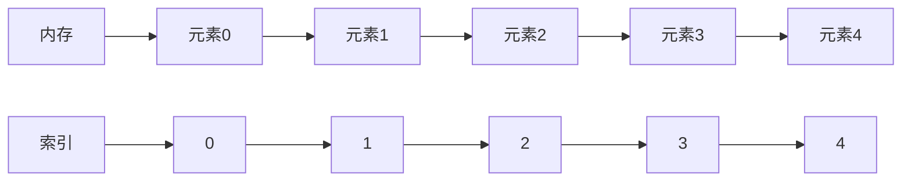

# C++ 数组声明

数组是C++中最基本的数据结构之一，它允许我们在连续的内存空间中存储相同类型的多个元素。掌握数组的声明和初始化是学习C++编程的基础步骤。

## 什么是数组？

数组是一种线性数据结构，由相同类型的元素按顺序存储在连续的内存位置中。每个元素都可以通过索引（下标）直接访问。在C++中，数组索引从0开始，这意味着第一个元素的索引是0，第二个是1，依此类推。



## 基本语法

C++中数组的声明遵循以下基本语法：

```cpp
数据类型 数组名[数组大小];
```

其中：
- `数据类型`：指定数组中元素的类型（如int, char, double等）
- `数组名`：数组的标识符
- `数组大小`：方括号中的正整数，表示数组可以存储的元素数量

## 数组声明方式

### 1. 声明未初始化的数组

当你只声明数组但不进行初始化时，数组中的元素将包含未定义的值（垃圾值）。

```cpp
int numbers[5]; // 声明一个包含5个整数的数组
char letters[10]; // 声明一个包含10个字符的数组
double prices[100]; // 声明一个包含100个双精度浮点数的数组
```

:::caution
未初始化的数组含有垃圾值，在使用前应该进行初始化，否则可能导致程序出现意外行为。
:::

### 2. 声明并初始化数组

#### 使用初始化列表

```cpp
int numbers[5] = {10, 20, 30, 40, 50}; // 完全初始化
char name[6] = {'H', 'e', 'l', 'l', 'o', '\0'}; // 字符数组
```

#### 部分初始化

如果提供的初始值少于数组大小，剩余元素会被自动初始化为0。

```cpp
int partialArray[5] = {1, 2, 3}; // 等价于 {1, 2, 3, 0, 0}
```

#### 省略数组大小

当使用初始化列表时，可以省略数组大小，编译器会根据初始化值的数量自动确定大小。

```cpp
int autoSized[] = {5, 10, 15, 20}; // 编译器自动确定大小为4
```

#### 使用特定值初始化所有元素

```cpp
int allZeros[10] = {0}; // 所有10个元素都初始化为0
```

### 3. C++11及以后的初始化方式

C++11引入了新的初始化语法，使用花括号但无需等号：

```cpp
int modern[5]{1, 2, 3, 4, 5}; // C++11语法，无需等号
char vowels[]{'a', 'e', 'i', 'o', 'u'};
```

## 字符数组与字符串

C++中的字符串本质上是以空字符`'\0'`结尾的字符数组。声明字符串有以下几种方式：

```cpp
// 逐个字符初始化，需要手动添加空字符
char greeting[6] = {'H', 'e', 'l', 'l', 'o', '\0'};

// 使用字符串字面量
char message[] = "Hello"; // 编译器会自动添加'\0'，实际大小为6
```

:::tip
使用字符串字面量初始化时，编译器会自动在末尾添加空字符`'\0'`，因此数组的实际大小会比字符串的可见长度大1。
:::

## 多维数组

C++也支持多维数组，最常见的是二维数组：

```cpp
// 声明一个3行4列的二维数组
int matrix[3][4];

// 声明并初始化二维数组
int grid[2][3] = {
    {1, 2, 3},   // 第一行
    {4, 5, 6}    // 第二行
};

// C++11语法
int modern_grid[2][3]{
    {7, 8, 9},
    {10, 11, 12}
};
```

## 实际应用示例

### 示例1：计算学生成绩平均分

```cpp
#include <iostream>
using namespace std;

int main() {
    const int STUDENT_COUNT = 5;
    int scores[STUDENT_COUNT] = {85, 92, 78, 90, 88};
    
    int sum = 0;
    for (int i = 0; i < STUDENT_COUNT; i++) {
        sum += scores[i];
    }
    
    double average = static_cast<double>(sum) / STUDENT_COUNT;
    
    cout << "学生成绩: ";
    for (int i = 0; i < STUDENT_COUNT; i++) {
        cout << scores[i] << " ";
    }
    cout << endl;
    
    cout << "平均分: " << average << endl;
    
    return 0;
}
```

输出：
```
学生成绩: 85 92 78 90 88 
平均分: 86.6
```

### 示例2：棋盘游戏中的二维数组应用

```cpp
#include <iostream>
using namespace std;

int main() {
    // 初始化3x3的井字棋棋盘
    // 0表示空，1表示X，2表示O
    int board[3][3] = {
        {0, 1, 0},
        {0, 1, 2},
        {2, 0, 0}
    };
    
    cout << "井字棋棋盘状态:" << endl;
    for (int i = 0; i < 3; i++) {
        for (int j = 0; j < 3; j++) {
            char symbol;
            if (board[i][j] == 0) symbol = ' ';
            else if (board[i][j] == 1) symbol = 'X';
            else symbol = 'O';
            
            cout << " " << symbol << " ";
            if (j < 2) cout << "|";
        }
        cout << endl;
        if (i < 2) cout << "---+---+---" << endl;
    }
    
    return 0;
}
```

输出：
```
井字棋棋盘状态:
   | X |   
---+---+---
   | X | O 
---+---+---
 O |   |   
```

## 数组大小的限制

在C++中，数组大小必须是编译时常量，这意味着：

```cpp
// 正确：使用字面量常量
int array1[5];

// 正确：使用const常量
const int SIZE = 10;
int array2[SIZE];

// 错误：不能使用变量作为数组大小
int size = 15;
int array3[size]; // 编译错误

// 在C++11后，可以使用constexpr
constexpr int BUFFER_SIZE = 100;
char buffer[BUFFER_SIZE];
```

:::warning
C++标准允许使用变长数组(VLA)的编译器实现，但这不是标准C++功能。如果需要运行时确定大小的数组，应使用`std::vector`。
:::

## 总结

数组声明是C++编程的基础知识。主要记住以下几点：

1. 数组是存储相同类型元素的连续内存块
2. 声明语法为`类型 名称[大小]`
3. 数组索引从0开始
4. 可以在声明时使用初始化列表
5. 字符串是以空字符结尾的字符数组
6. C++支持多维数组

## 练习

1. 声明一个包含10个整数的数组，并初始化为1到10的值。
2. 创建一个字符数组存储你的名字，确保以空字符结尾。
3. 声明一个3x3的二维浮点数数组，并用0.0初始化所有元素。
4. 声明一个数组存储一周七天的名称，然后打印出来。

## 附加资源

- 深入学习C++动态数组，可以研究`std::vector`容器
- 了解C++的`std::array`，这是数组的安全替代品
- 探索C++中数组与指针的关系