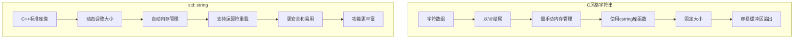

# C++ 字符串基础

## 引言

在C++编程中，字符串是我们经常需要处理的数据类型之一。字符串本质上是字符的序列，可以用来表示文本信息。C++提供了两种主要的字符串处理方式：C风格字符串（字符数组）和C++标准库中的`std::string`类。本文将为您详细介绍C++字符串的基础知识，帮助您掌握字符串的创建、操作和应用。

## C风格字符串

### 基本概念

C风格字符串实际上是以空字符(`'\0'`)结尾的字符数组。这个空字符标志着字符串的结束。

```cpp
char greeting[6] = {'H', 'e', 'l', 'l', 'o', '\0'};
// 或者更简便的方式
char greeting[] = "Hello";  // 编译器会自动添加结束符'\0'
```

### 常见操作

C标准库（在`<cstring>`头文件中）提供了一系列函数来操作C风格字符串：

```cpp
#include <iostream>
#include <cstring>

int main() {
    char str1[20] = "Hello";
    char str2[20] = "World";
    char str3[40];
    
    // 获取字符串长度
    std::cout << "str1长度: " << strlen(str1) << std::endl;
    
    // 字符串拼接
    strcat(str1, str2);
    std::cout << "拼接后: " << str1 << std::endl;
    
    // 字符串复制
    strcpy(str3, str1);
    std::cout << "复制后的str3: " << str3 << std::endl;
    
    // 字符串比较
    if (strcmp(str1, str3) == 0) {
        std::cout << "str1和str3相等" << std::endl;
    } else {
        std::cout << "str1和str3不相等" << std::endl;
    }
    
    return 0;
}
```

输出结果：
```
str1长度: 5
拼接后: HelloWorld
复制后的str3: HelloWorld
str1和str3相等
```

### C风格字符串的局限性

C风格字符串存在一些局限性：

1. 需要手动管理内存
2. 容易发生缓冲区溢出
3. 字符串操作不够直观
4. 没有内置的安全检查机制

:::caution
使用C风格字符串时要小心缓冲区溢出问题，这可能导致程序崩溃或安全漏洞。
:::

## C++ 标准库字符串(std::string)

为了克服C风格字符串的局限性，C++标准库提供了`std::string`类，它在`<string>`头文件中定义。

### 创建和初始化

```cpp
#include <iostream>
#include <string>

int main() {
    // 不同的初始化方式
    std::string s1;                  // 空字符串
    std::string s2 = "Hello";        // 从C风格字符串初始化
    std::string s3("World");         // 使用构造函数
    std::string s4(10, 'a');         // 创建包含10个'a'的字符串
    std::string s5 = s2;             // 从另一个string复制
    
    // 显示所有字符串
    std::cout << "s1: " << s1 << std::endl;
    std::cout << "s2: " << s2 << std::endl;
    std::cout << "s3: " << s3 << std::endl;
    std::cout << "s4: " << s4 << std::endl;
    std::cout << "s5: " << s5 << std::endl;
    
    return 0;
}
```

输出结果：
```
s1: 
s2: Hello
s3: World
s4: aaaaaaaaaa
s5: Hello
```

### std::string的常用操作

#### 1. 字符串拼接

```cpp
std::string firstName = "John";
std::string lastName = "Doe";

// 使用+运算符拼接
std::string fullName = firstName + " " + lastName;
std::cout << "全名: " << fullName << std::endl;

// 使用append方法
firstName.append(" ").append(lastName);
std::cout << "使用append方法: " << firstName << std::endl;
```

输出结果：
```
全名: John Doe
使用append方法: John Doe
```

#### 2. 访问字符

```cpp
std::string str = "Hello";

// 使用下标访问
for (size_t i = 0; i < str.length(); ++i) {
    std::cout << "str[" << i << "] = " << str[i] << std::endl;
}

// 使用at()方法（带边界检查）
try {
    std::cout << "第一个字符: " << str.at(0) << std::endl;
    std::cout << "越界访问: " << str.at(10) << std::endl;  // 将抛出异常
} catch (const std::out_of_range& e) {
    std::cout << "捕获异常: " << e.what() << std::endl;
}
```

输出结果：
```
str[0] = H
str[1] = e
str[2] = l
str[3] = l
str[4] = o
第一个字符: H
捕获异常: basic_string::at: __n (which is 10) >= this->size() (which is 5)
```

#### 3. 字符串长度和容量

```cpp
std::string str = "Hello World";

std::cout << "长度: " << str.length() << std::endl;    // 或使用str.size()
std::cout << "容量: " << str.capacity() << std::endl;  // 当前分配的存储
std::cout << "最大容量: " << str.max_size() << std::endl;
```

#### 4. 字符串查找和替换

```cpp
std::string text = "The quick brown fox jumps over the lazy dog";

// 查找
size_t pos = text.find("fox");
if (pos != std::string::npos) {
    std::cout << "在位置 " << pos << " 找到'fox'" << std::endl;
}

// 替换
text.replace(pos, 3, "cat");
std::cout << "替换后: " << text << std::endl;
```

输出结果：
```
在位置 16 找到'fox'
替换后: The quick brown cat jumps over the lazy dog
```

#### 5. 子字符串提取

```cpp
std::string sentence = "C++ programming is fun!";

// 从位置7开始提取11个字符
std::string sub = sentence.substr(7, 11);
std::cout << "子字符串: " << sub << std::endl;
```

输出结果：
```
子字符串: programming
```

#### 6. 字符串转换

```cpp
// 数字转字符串
int number = 42;
std::string numStr = std::to_string(number);
std::cout << "数字转字符串: " << numStr << std::endl;

// 字符串转数字
std::string str = "3.14159";
double pi = std::stod(str);  // 字符串转double
std::cout << "字符串转数字: " << pi << std::endl;

// 另一个例子
std::string intStr = "42";
int num = std::stoi(intStr);  // 字符串转int
std::cout << "字符串转整数: " << num << std::endl;
```

输出结果：
```
数字转字符串: 42
字符串转数字: 3.14159
字符串转整数: 42
```

## 字符串处理的实际应用

### 案例一：用户输入验证

```cpp
#include <iostream>
#include <string>
#include <cctype>  // 用于isdigit()函数

bool validatePassword(const std::string& password) {
    // 密码必须至少8个字符
    if (password.length() < 8) {
        return false;
    }
    
    bool hasUpper = false;
    bool hasLower = false;
    bool hasDigit = false;
    
    for (char ch : password) {
        if (isupper(ch)) hasUpper = true;
        if (islower(ch)) hasLower = true;
        if (isdigit(ch)) hasDigit = true;
    }
    
    // 密码必须包含大写字母、小写字母和数字
    return hasUpper && hasLower && hasDigit;
}

int main() {
    std::string password;
    
    do {
        std::cout << "请输入密码 (至少8个字符，包含大小写字母和数字): ";
        std::getline(std::cin, password);
        
        if (!validatePassword(password)) {
            std::cout << "密码不符合要求，请重新输入！" << std::endl;
        } else {
            std::cout << "密码设置成功！" << std::endl;
            break;
        }
    } while (true);
    
    return 0;
}
```

### 案例二：文本分析工具

以下是一个简单的文本分析工具，可以统计单词数量和出现频率：

```cpp
#include <iostream>
#include <string>
#include <sstream>
#include <map>
#include <algorithm>

void analyzeText(const std::string& text) {
    // 统计字符数（包括空格）
    std::cout << "文本总字符数: " << text.length() << std::endl;
    
    // 统计单词数
    std::stringstream ss(text);
    std::string word;
    int wordCount = 0;
    std::map<std::string, int> wordFrequency;
    
    while (ss >> word) {
        // 移除标点符号
        word.erase(std::remove_if(word.begin(), word.end(), 
                                  [](char c) { return ispunct(c); }),
                   word.end());
        
        // 转换为小写
        std::transform(word.begin(), word.end(), word.begin(), 
                      [](unsigned char c){ return std::tolower(c); });
        
        if (!word.empty()) {
            wordCount++;
            wordFrequency[word]++;
        }
    }
    
    std::cout << "单词总数: " << wordCount << std::endl;
    
    // 显示前5个最常用的单词
    std::cout << "\n最常用的单词:" << std::endl;
    
    // 将map转换为vector以便排序
    std::vector<std::pair<std::string, int>> wordFreqVec(
        wordFrequency.begin(), wordFrequency.end());
    
    std::sort(wordFreqVec.begin(), wordFreqVec.end(),
             [](const auto& a, const auto& b) { return a.second > b.second; });
    
    int count = 0;
    for (const auto& pair : wordFreqVec) {
        if (count++ >= 5) break;
        std::cout << pair.first << ": " << pair.second << " 次" << std::endl;
    }
}

int main() {
    std::string text = "C++ 是一种强大的编程语言。C++ 支持多种编程范式，"
                      "包括面向对象、过程式和泛型编程。C++ 也是最流行的编程语言之一。";
    
    analyzeText(text);
    
    return 0;
}
```

输出结果类似于：
```
文本总字符数: 86
单词总数: 19

最常用的单词:
c++: 3 次
编程: 3 次
语言: 2 次
是: 2 次
一种: 1 次
```

## C风格字符串与std::string的比较

下面是C风格字符串和std::string的主要区别对比：



:::tip
对于新的C++代码，几乎总是推荐使用`std::string`而不是C风格字符串，除非有特殊的性能要求或接口限制。
:::

## 字符串处理最佳实践

1. **使用std::string而非C风格字符串**：更安全、更灵活。

2. **避免不必要的复制**：传递大型字符串时考虑使用引用。
   ```cpp
   void processString(const std::string& str) {  // 使用const引用
       // 处理字符串...
   }
   ```

3. **使用字符串视图**：在C++17中，可以使用`std::string_view`进行非修改性字符串操作，避免复制开销。
   ```cpp
   #include <string_view>
   
   void analyzeString(std::string_view sv) {
       // 使用string_view进行只读操作...
   }
   ```

4. **使用`reserve()`避免频繁重新分配**：当你知道字符串可能会变得很大时，预先分配容量。
   ```cpp
   std::string result;
   result.reserve(1000);  // 预分配1000字符的空间
   ```

5. **使用`+=`或`append()`进行多次追加**：比多次使用`+`运算符更高效。

## 总结

本文详细介绍了C++中字符串的两种主要表示方式：C风格字符串和标准库的`std::string`类。我们讨论了它们的基本特性、常用操作以及实际应用案例。

- **C风格字符串**是C++从C语言继承的传统字符串表示方式，它是以空字符结尾的字符数组。虽然在某些情况下仍然有用，但它缺乏现代字符串处理所需的安全性和便利性。

- **std::string**是C++标准库提供的字符串类，它封装了字符串操作，提供了自动内存管理和丰富的操作接口，是现代C++编程中处理文本的首选方式。

无论您是处理用户输入、文件内容还是网络通信，掌握字符串处理都是C++编程的基本技能。随着经验的积累，您将能够更有效地使用这些工具来解决各种文本处理问题。

## 练习

1. 编写一个程序，接受用户输入的一句话，然后统计其中的元音字母(a, e, i, o, u)的数量。

2. 实现一个简单的回文判断函数，检查给定的字符串是否为回文（正读和反读都一样）。忽略大小写和非字母字符。

3. 创建一个密码生成器，随机生成指定长度的密码，包含大小写字母、数字和特殊字符。

4. 编写一个函数，接受一个字符串，将其中的所有单词首字母大写（如"hello world"转换为"Hello World"）。

5. 实现一个URL解析器，将URL字符串分解为协议、域名、路径等组成部分。

## 参考资源

- [C++ 参考手册 - std::string](https://en.cppreference.com/w/cpp/string/basic_string)
- [C++ 参考手册 - 字符串文字](https://en.cppreference.com/w/cpp/language/string_literal)
- [C++ 标准库 - `<cstring>`](https://en.cppreference.com/w/cpp/header/cstring)
- [C++ 标准库 - `<string>`](https://en.cppreference.com/w/cpp/header/string)

通过持续练习和实际应用，您将能够熟练掌握C++字符串的各种操作和技巧，为开发更复杂的程序奠定基础。