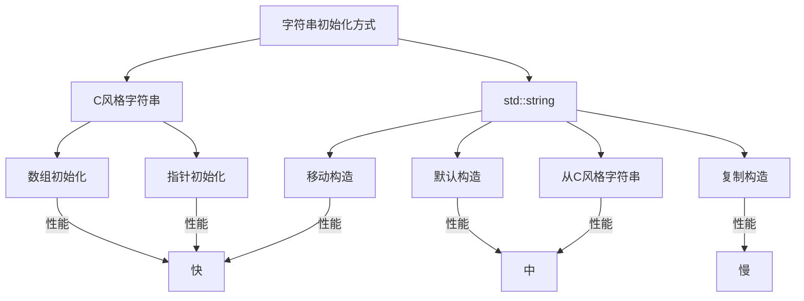

# C++ 字符串初始化

## 引言

在C++编程中，字符串是最常用的数据类型之一，用于存储和操作文本数据。与许多其他编程语言不同，C++提供了多种方式来初始化和操作字符串。本文将详细介绍C++中字符串初始化的各种方法，包括C风格字符串和C++标准库中的`std::string`类。

## C++ 中的字符串类型

在C++中，主要有两种表示字符串的方式：

1. **C风格字符串**：由字符数组表示，以空字符`'\0'`结尾
2. **C++标准库字符串**：使用`std::string`类，提供更多便捷的操作

## C风格字符串初始化

C风格字符串本质上是字符数组，以空字符(`'\0'`)结尾。

### 1. 使用字符数组初始化

```cpp
#include <iostream>

int main() {
    // 方法1：声明并初始化
    char greeting1[] = "Hello World";
    
    // 方法2：明确指定数组大小（需要考虑空字符）
    char greeting2[12] = "Hello World";
    
    // 方法3：逐字符初始化（最后一个字符必须是空字符）
    char greeting3[] = {'H', 'e', 'l', 'l', 'o', '\0'};
    
    // 输出结果
    std::cout << "greeting1: " << greeting1 << std::endl;
    std::cout << "greeting2: " << greeting2 << std::endl;
    std::cout << "greeting3: " << greeting3 << std::endl;
    
    return 0;
}
```

输出结果：
```
greeting1: Hello World
greeting2: Hello World
greeting3: Hello
```

:::caution 警告
当使用逐字符初始化时，务必在字符串末尾添加空字符`'\0'`，否则会导致未定义行为。
:::

### 2. 使用指针初始化

```cpp
#include <iostream>

int main() {
    // 方法1：使用字符串字面量直接初始化指针
    const char* str1 = "Hello World";
    
    // 方法2：先初始化数组，再赋值给指针
    char arr[] = "Hello C++";
    const char* str2 = arr;
    
    std::cout << "str1: " << str1 << std::endl;
    std::cout << "str2: " << str2 << std::endl;
    
    return 0;
}
```

输出结果：
```
str1: Hello World
str2: Hello C++
```

:::note 注意
当使用字符串字面量初始化字符指针时，应该使用`const char*`，因为字符串字面量存储在只读内存区域。
:::

## std::string类初始化

C++标准库提供的`std::string`类使得字符串处理更加方便和安全。使用前需要包含`<string>`头文件。

### 1. 基本初始化方法

```cpp
#include <iostream>
#include <string>

int main() {
    // 方法1：默认构造函数（空字符串）
    std::string s1;
    
    // 方法2：从C风格字符串初始化
    std::string s2 = "Hello World";
    
    // 方法3：使用构造函数
    std::string s3("C++ Programming");
    
    // 方法4：复制构造
    std::string s4 = s3;
    
    // 方法5：使用std::string::assign()
    std::string s5;
    s5.assign("Learning C++");
    
    // 输出结果
    std::cout << "s1: " << s1 << std::endl;
    std::cout << "s2: " << s2 << std::endl;
    std::cout << "s3: " << s3 << std::endl;
    std::cout << "s4: " << s4 << std::endl;
    std::cout << "s5: " << s5 << std::endl;
    
    return 0;
}
```

输出结果：
```
s1: 
s2: Hello World
s3: C++ Programming
s4: C++ Programming
s5: Learning C++
```

### 2. 高级初始化方法

```cpp
#include <iostream>
#include <string>

int main() {
    // 方法1：重复字符初始化
    std::string stars(10, '*'); // 创建包含10个*的字符串
    
    // 方法2：从C风格字符串的一部分初始化
    const char* phrase = "The quick brown fox";
    std::string part(phrase, 4); // 取前4个字符
    
    // 方法3：从另一个std::string的子串初始化
    std::string sentence = "Programming is fun";
    std::string word(sentence, 0, 11); // 从索引0开始，取11个字符
    
    // 方法4：从字符数组初始化
    char charArray[] = {'H', 'e', 'l', 'l', 'o', '\0'};
    std::string greeting(charArray);
    
    // 输出结果
    std::cout << "stars: " << stars << std::endl;
    std::cout << "part: " << part << std::endl;
    std::cout << "word: " << word << std::endl;
    std::cout << "greeting: " << greeting << std::endl;
    
    return 0;
}
```

输出结果：
```
stars: **********
part: The 
word: Programming
greeting: Hello
```

## C++ 11及更高版本的字符串初始化

C++11引入了新的初始化语法，使字符串初始化更加简洁。

```cpp
#include <iostream>
#include <string>

int main() {
    // 使用花括号初始化
    std::string s1{"Hello C++11"};
    
    // 使用auto关键字和初始化列表
    auto s2 = std::string{"Modern C++"};
    
    // 移动语义初始化（C++11）
    std::string temp = "Temporary String";
    std::string s3 = std::move(temp); // temp现在为空
    
    // 输出结果
    std::cout << "s1: " << s1 << std::endl;
    std::cout << "s2: " << s2 << std::endl;
    std::cout << "s3: " << s3 << std::endl;
    std::cout << "temp after move: " << temp << std::endl; // temp可能为空或未定义状态
    
    return 0;
}
```

输出结果：
```
s1: Hello C++11
s2: Modern C++
s3: Temporary String
temp after move: 
```

## 实际应用案例

### 案例1：用户输入处理

```cpp
#include <iostream>
#include <string>

int main() {
    std::string firstName;
    std::string lastName;
    
    std::cout << "请输入您的名字: ";
    std::getline(std::cin, firstName);
    
    std::cout << "请输入您的姓氏: ";
    std::getline(std::cin, lastName);
    
    // 使用字符串初始化创建全名
    std::string fullName = firstName + " " + lastName;
    
    std::cout << "您的全名是: " << fullName << std::endl;
    std::cout << "全名长度: " << fullName.length() << " 个字符" << std::endl;
    
    return 0;
}
```

输入示例：
```
请输入您的名字: John
请输入您的姓氏: Doe
```

输出结果：
```
您的全名是: John Doe
全名长度: 8 个字符
```

### 案例2：文本处理程序

```cpp
#include <iostream>
#include <string>
#include <algorithm>

int main() {
    // 初始化一段文本
    std::string text = "The quick brown fox jumps over the lazy dog";
    
    // 查找子字符串
    std::string searchWord = "fox";
    size_t position = text.find(searchWord);
    
    if (position != std::string::npos) {
        std::cout << "找到 '" << searchWord << "' 在位置: " << position << std::endl;
        
        // 替换子字符串
        text.replace(position, searchWord.length(), "cat");
    }
    
    // 转换为大写
    std::string uppercaseText = text;
    std::transform(uppercaseText.begin(), uppercaseText.end(), 
                  uppercaseText.begin(), ::toupper);
    
    // 显示处理结果
    std::cout << "替换后的文本: " << text << std::endl;
    std::cout << "大写转换: " << uppercaseText << std::endl;
    
    return 0;
}
```

输出结果：
```
找到 'fox' 在位置: 16
替换后的文本: The quick brown cat jumps over the lazy dog
大写转换: THE QUICK BROWN CAT JUMPS OVER THE LAZY DOG
```

## 字符串初始化性能比较

不同的字符串初始化方法在性能上有所差异。下面是一个简单的比较：



## 总结

C++提供了多种字符串初始化的方式，从传统的C风格字符串到现代的`std::string`类。初学者应该掌握：

1. C风格字符串是字符数组，必须以空字符结尾
2. `std::string`类提供了更安全、更便捷的字符串处理方式
3. C++11及更高版本提供了更现代的初始化语法

在实际项目中，除特殊情况外，一般推荐使用`std::string`，因为它具有内存管理自动化、安全性高、提供丰富的操作方法等优势。

## 练习

1. 编写程序，使用不同的初始化方式创建5个字符串，并显示它们的内容和长度
2. 创建一个函数，接受C风格字符串，将其转换为`std::string`，并返回字符串的反转版本
3. 编写一个简单的程序，从用户获取文本输入，并统计其中的元音字母数量
4. 尝试比较C风格字符串和`std::string`在字符串连接操作上的使用差异

## 进一步学习资源

- [C++ Reference - std::string](https://en.cppreference.com/w/cpp/string/basic_string)
- [C++ Core Guidelines - String](https://isocpp.github.io/CppCoreGuidelines/CppCoreGuidelines#slstr-string-rules)
- 《Effective C++》第三版，Scott Meyers著
- 《C++ Primer》第五版，Stanley B. Lippman著