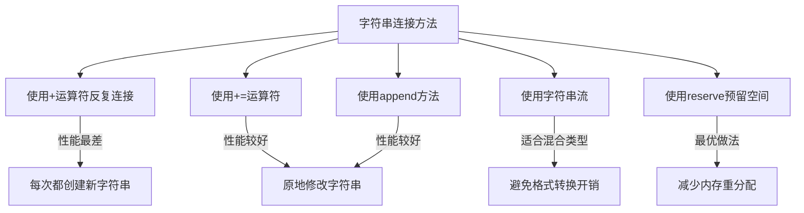

# C++ 字符串连接

在C++编程中，字符串连接（String Concatenation）是一项基础而重要的操作。它指的是将两个或多个字符串合并成一个新的字符串。无论是构建消息、创建文件路径还是生成报告，字符串连接都是日常编程中不可缺少的功能。

## 什么是字符串连接？

字符串连接是将两个或多个字符串合并成一个单一字符串的过程。例如，将 "Hello" 和 "World" 连接起来，得到 "HelloWorld"。

C++提供了多种方法来连接字符串：

1. 使用 `+` 运算符（C++ 标准库 std::string）
2. 使用 `append()` 方法
3. 使用 `+=` 运算符
4. 使用 `strcat()` 函数（C风格字符串）

让我们逐一了解这些方法。

## 使用 + 运算符连接字符串

最直观和常用的字符串连接方法是使用 `+` 运算符。

```cpp
#include <iostream>
#include <string>

int main() {
    std::string firstName = "John";
    std::string lastName = "Doe";
    
    // 使用+运算符连接两个字符串
    std::string fullName = firstName + " " + lastName;
    
    std::cout << "全名: " << fullName << std::endl;
    
    return 0;
}
```

**输出：**
```
全名: John Doe
```

:::note
使用 `+` 运算符连接字符串时，至少有一个操作数必须是 `std::string` 类型。如果两个操作数都是C风格字符串（字符数组或字符指针），则会导致编译错误。
:::

## 使用 append() 方法

`std::string` 类提供了 `append()` 方法，用于向字符串末尾添加内容：

```cpp
#include <iostream>
#include <string>

int main() {
    std::string message = "Hello";
    
    // 使用append方法连接字符串
    message.append(" ");
    message.append("World");
    
    std::cout << "消息: " << message << std::endl;
    
    // append也可以指定要添加的字符数量
    std::string text = "C++";
    text.append(" is powerful", 0, 4); // 只添加" is "部分
    
    std::cout << "文本: " << text << std::endl;
    
    return 0;
}
```

**输出：**
```
消息: Hello World
文本: C++ is 
```

## 使用 += 运算符

`+=` 运算符是 `append()` 方法的快捷方式，使用起来更为简洁：

```cpp
#include <iostream>
#include <string>

int main() {
    std::string greeting = "Hello";
    
    // 使用+=运算符连接字符串
    greeting += ", ";
    greeting += "how are you?";
    
    std::cout << greeting << std::endl;
    
    return 0;
}
```

**输出：**
```
Hello, how are you?
```

## 使用 strcat() 函数（C风格）

对于C风格字符串（字符数组），可以使用 `strcat()` 或 `strncat()` 函数：

```cpp
#include <iostream>
#include <cstring>

int main() {
    char firstName[20] = "John";
    char lastName[20] = "Doe";
    char fullName[40];
    
    // 首先复制第一个字符串到目标
    strcpy(fullName, firstName);
    
    // 添加空格
    strcat(fullName, " ");
    
    // 连接第二个字符串
    strcat(fullName, lastName);
    
    std::cout << "全名: " << fullName << std::endl;
    
    return 0;
}
```

**输出：**
```
全名: John Doe
```

:::caution
使用 `strcat()` 时要特别小心，确保目标数组有足够的空间来容纳所有连接的字符串，否则会导致缓冲区溢出。推荐使用更安全的 `strncat()` 函数，它允许指定最大复制长度。
:::

## 字符串流进行连接

对于复杂的字符串连接，尤其是涉及不同数据类型的连接，可以使用字符串流：

```cpp
#include <iostream>
#include <sstream>
#include <string>

int main() {
    std::stringstream ss;
    
    std::string name = "Alice";
    int age = 25;
    double height = 1.65;
    
    // 使用字符串流连接不同类型的数据
    ss << "姓名: " << name << ", 年龄: " << age << ", 身高: " << height << "m";
    
    std::string information = ss.str();
    std::cout << information << std::endl;
    
    return 0;
}
```

**输出：**
```
姓名: Alice, 年龄: 25, 身高: 1.65m
```

## 连接字符串与数字

将数字转换为字符串并连接：

```cpp
#include <iostream>
#include <string>

int main() {
    std::string text = "Chapter ";
    int chapterNumber = 5;
    
    // 直接连接（会将int转换为string）
    std::string result = text + std::to_string(chapterNumber);
    
    std::cout << result << std::endl;
    
    return 0;
}
```

**输出：**
```
Chapter 5
```

## 字符串连接的性能考虑

在处理大量字符串连接时，性能是一个重要考量。下面是几种方法的性能比较：



如果需要进行大量字符串连接，建议先使用 `reserve()` 方法预留足够的空间：

```cpp
#include <iostream>
#include <string>

int main() {
    const int count = 1000;
    std::string result;
    
    // 预先分配足够的内存空间
    result.reserve(count * 10); // 假设每个添加的字符串平均长度为10
    
    for(int i = 0; i < count; i++) {
        result += "Item " + std::to_string(i) + ", ";
    }
    
    std::cout << "结果长度: " << result.length() << std::endl;
    
    return 0;
}
```

**输出：**
```
结果长度: 8890
```

## 实际应用场景

### 1. 构建文件路径

```cpp
#include <iostream>
#include <string>

int main() {
    std::string baseDir = "/home/user";
    std::string project = "cpp_project";
    std::string filename = "main.cpp";
    
    // 构建完整文件路径
    std::string fullPath = baseDir + "/" + project + "/" + filename;
    
    std::cout << "完整路径: " << fullPath << std::endl;
    
    return 0;
}
```

**输出：**
```
完整路径: /home/user/cpp_project/main.cpp
```

### 2. 创建SQL查询语句

```cpp
#include <iostream>
#include <string>

int main() {
    std::string tableName = "users";
    std::string userName = "john_doe";
    int userAge = 25;
    
    // 构建SQL插入语句
    std::string query = "INSERT INTO " + tableName + 
                        " (name, age) VALUES ('" + 
                        userName + "', " + 
                        std::to_string(userAge) + ")";
    
    std::cout << "SQL查询: " << query << std::endl;
    
    return 0;
}
```

**输出：**
```
SQL查询: INSERT INTO users (name, age) VALUES ('john_doe', 25)
```

:::warning
在实际应用中构建SQL语句时，应该使用参数化查询或预处理语句来避免SQL注入攻击，而不是直接连接字符串。
:::

### 3. 生成报告或格式化输出

```cpp
#include <iostream>
#include <string>
#include <iomanip>
#include <sstream>

std::string formatCurrency(double amount) {
    std::stringstream ss;
    ss << std::fixed << std::setprecision(2) << "$" << amount;
    return ss.str();
}

int main() {
    std::string productName = "笔记本电脑";
    double price = 899.99;
    int quantity = 3;
    double total = price * quantity;
    
    std::string receipt = "商品: " + productName + "\n" +
                         "单价: " + formatCurrency(price) + "\n" +
                         "数量: " + std::to_string(quantity) + "\n" +
                         "总计: " + formatCurrency(total);
    
    std::cout << receipt << std::endl;
    
    return 0;
}
```

**输出：**
```
商品: 笔记本电脑
单价: $899.99
数量: 3
总计: $2699.97
```

## 总结

C++提供了多种方式来连接字符串：

1. **`+` 和 `+=` 运算符**：最直观的连接方式，适合简单的字符串连接
2. **`append()` 方法**：提供更多控制选项，如指定要添加的字符数量
3. **C风格函数 `strcat()`**：用于C风格字符串，但需要注意缓冲区溢出
4. **字符串流**：适合混合不同类型数据的连接

在处理大量字符串连接时，使用 `reserve()` 方法预分配内存可以显著提高性能。

字符串连接是日常编程中的基础操作，掌握不同的连接方法及其适用场景可以帮助你写出更高效的代码。

## 练习题

1. 编写一个程序，接受用户输入的名和姓，然后以"姓, 名"的格式连接并输出。
2. 创建一个函数，将整数数组转换为以逗号分隔的字符串，如 `[1, 2, 3]` → `"1,2,3"`。
3. 编写一个程序，连接文件路径，确保路径分隔符 (`/` 或 `\`) 不会重复出现。
4. 实现一个函数，生成包含指定数量星号 `*` 的字符串（如 `repeatChar('*', 5)` 返回 `"*****"`）。
5. 比较使用 `+` 运算符和 `append()` 方法在大量字符串连接时的性能差异。

:::tip
记住，在进行大量字符串连接操作时，预分配内存空间和选择合适的连接方法能显著提高程序性能！
:::