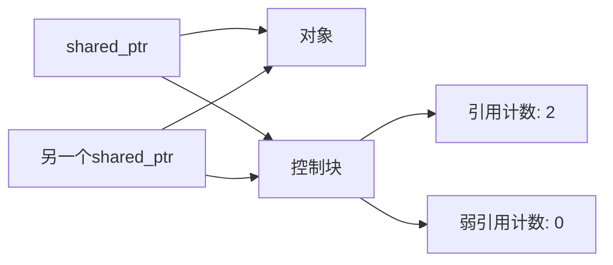

# C++ 智能指针

## 智能指针简介

在C++编程中，内存管理一直是容易出错且棘手的问题。传统的动态内存管理（使用`new`和`delete`）常常导致内存泄漏和悬挂指针等问题。智能指针是C++标准库提供的一种自动化内存管理工具，它能够在适当的时机自动释放动态分配的内存，大大简化了内存管理流程，提高了代码的安全性和可靠性。

:::tip
智能指针的核心优势在于它遵循"RAII"(Resource Acquisition Is Initialization)原则，即资源的获取与对象初始化同时发生，资源的释放与对象销毁同时发生。
:::

## 为什么需要智能指针？

考虑以下使用普通指针的代码：

```cpp
void someFunction() {
    // 分配内存
    int* ptr = new int(10);
    
    // 使用指针
    *ptr = 20;
    
    // 如果这里有异常发生或提前返回，可能导致内存泄漏
    if (*ptr > 15) {
        return; // 内存泄漏！
    }
    
    // 释放内存
    delete ptr;
}
```

上面的代码存在潜在的内存泄漏风险。而使用智能指针，我们可以避免这类问题：

```cpp
#include <memory>

void someFunction() {
    // 创建智能指针
    std::unique_ptr<int> ptr = std::make_unique<int>(10);
    
    // 使用指针
    *ptr = 20;
    
    // 即使这里提前返回，智能指针也会在函数结束时自动释放内存
    if (*ptr > 15) {
        return; // 安全，不会造成内存泄漏
    }
    
    // 不需要手动释放内存
}
```

## C++ 中的智能指针类型

C++11及更新标准提供了三种主要的智能指针类型：

1. `std::unique_ptr` - 独占所有权模型
2. `std::shared_ptr` - 共享所有权模型
3. `std::weak_ptr` - 弱引用，配合`shared_ptr`使用

这三种智能指针都定义在`<memory>`头文件中。

## 1. std::unique_ptr

`unique_ptr`是一种独占式智能指针，它保证同一时间只有一个指针可以指向特定的对象。当`unique_ptr`被销毁时，它所管理的对象也会被自动销毁。

### 创建和使用unique_ptr

```cpp
#include <iostream>
#include <memory>

int main() {
    // 方法1：使用make_unique (C++14及以后)
    std::unique_ptr<int> p1 = std::make_unique<int>(42);
    
    // 方法2：使用构造函数 (C++11)
    std::unique_ptr<int> p2(new int(100));
    
    // 使用智能指针
    std::cout << "p1 points to: " << *p1 << std::endl;
    std::cout << "p2 points to: " << *p2 << std::endl;
    
    // 修改指向的值
    *p1 = 55;
    std::cout << "Modified p1: " << *p1 << std::endl;
    
    // 自动内存管理 - 不需要delete
    return 0;
}
```

**输出：**
```
p1 points to: 42
p2 points to: 100
Modified p1: 55
```

### unique_ptr的所有权转移

`unique_ptr`不能被复制，但可以被移动，这意味着所有权可以从一个`unique_ptr`转移到另一个。

```cpp
#include <iostream>
#include <memory>

int main() {
    std::unique_ptr<int> original = std::make_unique<int>(100);
    
    // 以下代码会编译错误 - 不能复制unique_ptr
    // std::unique_ptr<int> copy = original;
    
    // 移动所有权是允许的
    std::unique_ptr<int> moved = std::move(original);
    
    // 现在original不再拥有任何对象
    if (original == nullptr) {
        std::cout << "original不再指向任何对象" << std::endl;
    }
    
    std::cout << "moved points to: " << *moved << std::endl;
    
    return 0;
}
```

**输出：**
```
original不再指向任何对象
moved points to: 100
```

## 2. std::shared_ptr

`shared_ptr`允许多个指针指向同一个对象。它实现了引用计数机制，当最后一个`shared_ptr`离开作用域时，才会删除所管理的对象。

### 创建和使用shared_ptr

```cpp
#include <iostream>
#include <memory>

int main() {
    // 创建shared_ptr
    std::shared_ptr<int> p1 = std::make_shared<int>(42);
    
    // 创建指向同一对象的另一个shared_ptr
    std::shared_ptr<int> p2 = p1;
    
    // 查看引用计数
    std::cout << "引用计数: " << p1.use_count() << std::endl;
    
    // 修改对象值
    *p1 = 100;
    
    // 两个指针指向同一个对象，所以p2也会看到修改后的值
    std::cout << "p1: " << *p1 << std::endl;
    std::cout << "p2: " << *p2 << std::endl;
    
    // p1离开作用域
    {
        std::shared_ptr<int> p3 = p1;
        std::cout << "内部块，引用计数: " << p1.use_count() << std::endl;
    } // p3离开作用域，引用计数减1
    
    std::cout << "外部块，引用计数: " << p1.use_count() << std::endl;
    
    return 0;
}
```

**输出：**
```
引用计数: 2
p1: 100
p2: 100
内部块，引用计数: 3
外部块，引用计数: 2
```

## 3. std::weak_ptr

`weak_ptr`是一种弱引用智能指针，它不会增加引用计数。主要用来解决`shared_ptr`的循环引用问题，以及观察`shared_ptr`所管理的对象是否仍然存在。

### weak_ptr的用法

```cpp
#include <iostream>
#include <memory>

int main() {
    // 创建shared_ptr
    std::shared_ptr<int> shared = std::make_shared<int>(42);
    
    // 从shared_ptr创建weak_ptr
    std::weak_ptr<int> weak = shared;
    
    std::cout << "shared_ptr引用计数: " << shared.use_count() << std::endl;
    
    // 检查weak_ptr是否已过期
    if (!weak.expired()) {
        // 从weak_ptr获取shared_ptr
        std::shared_ptr<int> shared2 = weak.lock();
        if (shared2) {
            std::cout << "值: " << *shared2 << std::endl;
            std::cout << "引用计数现在是: " << shared.use_count() << std::endl;
        }
    }
    
    // 重置原始shared_ptr
    shared.reset();
    std::cout << "重置原始shared_ptr后" << std::endl;
    
    // 再次检查weak_ptr
    if (weak.expired()) {
        std::cout << "weak_ptr已过期" << std::endl;
    } else {
        std::cout << "weak_ptr仍然有效" << std::endl;
    }
    
    return 0;
}
```

**输出：**
```
shared_ptr引用计数: 1
值: 42
引用计数现在是: 2
重置原始shared_ptr后
weak_ptr已过期
```

## 智能指针的实际应用场景

### 场景1：函数返回动态创建的对象

传统方法（容易导致内存泄漏）：

```cpp
// 不推荐的方式
Resource* createResource() {
    return new Resource();
}

// 调用
Resource* res = createResource();
// 使用res...
delete res; // 如果忘记这行，就会内存泄漏
```

使用智能指针：

```cpp
std::unique_ptr<Resource> createResource() {
    return std::make_unique<Resource>();
}

// 调用
auto res = createResource();
// 使用res...
// 自动清理，无需担心内存泄漏
```

### 场景2：处理类之间的关系

假设我们有一个树形数据结构，其中每个节点既需要指向父节点，也需要指向子节点：

```cpp
#include <iostream>
#include <memory>
#include <vector>
#include <string>

class TreeNode {
private:
    std::string data;
    std::weak_ptr<TreeNode> parent;  // 使用weak_ptr避免循环引用
    std::vector<std::shared_ptr<TreeNode>> children;

public:
    TreeNode(const std::string& value) : data(value) {}

    void addChild(const std::shared_ptr<TreeNode>& child) {
        children.push_back(child);
        child->parent = shared_from_this();  // 设置子节点的父节点
    }

    std::shared_ptr<TreeNode> getParent() const {
        return parent.lock();  // 尝试获取父节点的shared_ptr
    }
    
    std::string getData() const {
        return data;
    }
    
    void printChildren() const {
        for (const auto& child : children) {
            std::cout << child->getData() << " ";
        }
        std::cout << std::endl;
    }
};

int main() {
    // 创建节点
    auto root = std::make_shared<TreeNode>("Root");
    auto child1 = std::make_shared<TreeNode>("Child1");
    auto child2 = std::make_shared<TreeNode>("Child2");
    
    // 建立关系
    root->addChild(child1);
    root->addChild(child2);
    
    // 输出信息
    std::cout << "Root的子节点: ";
    root->printChildren();
    
    std::cout << "Child1的父节点: " << child1->getParent()->getData() << std::endl;
    
    return 0;
}
```

**输出：**
```
Root的子节点: Child1 Child2 
Child1的父节点: Root
```

这个例子中，如果使用`shared_ptr`而不是`weak_ptr`来表示父节点的关系，就会导致循环引用，从而引发内存泄漏。

### 场景3：自定义删除器

有时我们需要在删除对象时执行一些额外的操作，可以为智能指针指定自定义的删除器：

```cpp
#include <iostream>
#include <memory>
#include <fstream>

void closeFile(std::FILE* fp) {
    std::cout << "关闭文件" << std::endl;
    std::fclose(fp);
}

int main() {
    {
        // 使用自定义删除器的unique_ptr
        std::unique_ptr<std::FILE, decltype(&closeFile)> filePtr(std::fopen("test.txt", "w"), &closeFile);
        
        if (filePtr) {
            std::fputs("Hello, Smart Pointers!", filePtr.get());
            std::cout << "写入文件成功" << std::endl;
        }
        
        // 文件会在filePtr离开作用域时自动关闭
    }
    
    std::cout << "离开作用域后" << std::endl;
    
    return 0;
}
```

**输出：**
```
写入文件成功
关闭文件
离开作用域后
```

## 智能指针的注意事项和最佳实践

1. **优先使用`make_unique`和`make_shared`**：
   - 这些函数提供了异常安全性
   - 对于`shared_ptr`，它们可以更高效地分配内存

2. **避免使用原始指针**：
   - 尽可能在整个程序中使用智能指针
   - 如果必须使用原始指针，确保所有权明确

3. **避免循环引用**：
   - `shared_ptr`循环引用会导致内存泄漏
   - 使用`weak_ptr`打破循环

4. **不要混用不同类型的智能指针**：
   - 例如不要用`delete`手动释放智能指针管理的内存

5. **避免从原始指针创建多个独立的`shared_ptr`**：

```cpp
// 错误示范 - 会导致同一内存被释放两次
int* rawPtr = new int(42);
std::shared_ptr<int> p1(rawPtr);
std::shared_ptr<int> p2(rawPtr); // 危险！

// 正确方式
auto p1 = std::make_shared<int>(42);
auto p2 = p1; // p2和p1共享所有权
```

## 智能指针性能考虑

1. **`unique_ptr`**：几乎没有性能开销，大小通常与原始指针相同。

2. **`shared_ptr`**：
   - 包含两个指针（一个指向对象，一个指向控制块）
   - 引用计数操作是原子的，可能导致轻微的性能开销
   - 使用`make_shared`可以减少内存分配次数



## 总结

智能指针是现代C++程序中内存管理的基础工具，它们能够大大减少内存泄漏和其他常见的内存相关错误。

- **`unique_ptr`**：独占所有权，轻量级，适合用于表示独占资源
- **`shared_ptr`**：共享所有权，通过引用计数跟踪资源的使用情况
- **`weak_ptr`**：弱引用，不增加引用计数，用于打破循环引用

:::tip
关于使用智能指针的一个基本原则：如果你需要动态分配内存，优先考虑使用`unique_ptr`。只有在真正需要共享所有权时才使用`shared_ptr`。`weak_ptr`主要用于辅助`shared_ptr`解决特定问题。
:::

## 练习

1. 实现一个简单的内存泄漏检测工具，分别使用原始指针和智能指针，观察区别。

2. 创建一个包含大量对象的数据结构（如链表或树），分别使用原始指针和智能指针实现，比较代码的复杂度和安全性。

3. 写一个程序模拟循环引用的情况，然后使用`weak_ptr`解决它。

## 进一步学习资源

- C++标准库文档中关于智能指针的部分
- 《Effective Modern C++》 by Scott Meyers（特别是关于智能指针的章节）
- C++ Core Guidelines中关于资源管理的部分

通过掌握智能指针，你将能够编写更安全、更易维护的C++代码，并避免许多常见的内存管理陷阱。