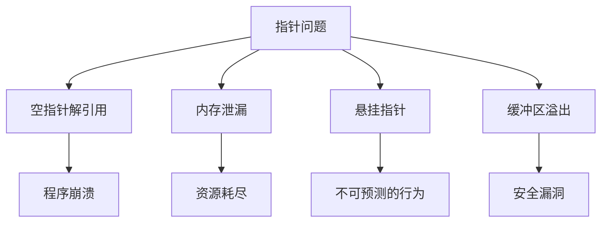

# C++ 空指针

在C++编程中，指针是一种强大但也容易出错的特性。理解空指针的概念对于编写稳健、无错误的代码至关重要。本文将详细探讨空指针的概念、用法以及如何避免相关问题。

## 什么是空指针？

空指针是一种不指向任何有效内存位置的指针。在C++中，空指针表示指针变量当前没有指向任何对象或函数。

:::note
空指针和未初始化的指针是不同的概念。未初始化的指针包含随机值，而空指针被明确设置为不指向任何地方。
:::

## 空指针的表示方法

在C++的演化过程中，表示空指针的方式也在不断发展：

### 1. NULL宏（传统C风格）

在传统C和早期C++中，通常使用`NULL`宏来表示空指针：

```cpp
#include <iostream>
using namespace std;

int main() {
    int* ptr = NULL;
    
    if (ptr == NULL) {
        cout << "ptr是一个空指针" << endl;
    }
    
    return 0;
}
```

**输出：**
```
ptr是一个空指针
```

`NULL`实际上通常被定义为整数0，这可能导致在某些情况下的类型歧义。

### 2. 0（整数零）

直接使用数字0也是表示空指针的方法：

```cpp
int* ptr = 0;  // ptr是空指针
```

### 3. nullptr（现代C++，推荐）

C++11引入了`nullptr`关键字，这是表示空指针的推荐方式：

```cpp
#include <iostream>
using namespace std;

int main() {
    int* ptr = nullptr;
    
    if (ptr == nullptr) {
        cout << "ptr是一个空指针" << endl;
    }
    
    return 0;
}
```

**输出：**
```
ptr是一个空指针
```

`nullptr`是一个独立的类型`std::nullptr_t`，它可以隐式转换为任何指针类型，但不能转换为整数类型，从而避免了`NULL`的类型歧义问题。

## 为什么需要空指针？

空指针在实际编程中有多种重要用途：

1. **标记指针未初始化或无效状态**
2. **函数返回值表示失败**
3. **作为函数参数的默认值**
4. **终止链表等数据结构**

## 空指针的判断

检查指针是否为空是一个良好的编程习惯：

```cpp
#include <iostream>
using namespace std;

void processData(int* data) {
    // 首先检查指针是否为空
    if (data == nullptr) {
        cout << "错误：提供了空指针" << endl;
        return;
    }
    
    // 安全地使用指针
    cout << "数据值: " << *data << endl;
}

int main() {
    int value = 42;
    int* validPtr = &value;
    int* nullPtr = nullptr;
    
    processData(validPtr);  // 有效指针
    processData(nullPtr);   // 空指针
    
    return 0;
}
```

**输出：**
```
数据值: 42
错误：提供了空指针
```

## 空指针解引用的危险

尝试解引用空指针是一个严重的错误，会导致未定义行为，通常会引起程序崩溃：

```cpp
int* ptr = nullptr;
int value = *ptr;  // 危险！这会导致程序崩溃
```

:::warning
永远不要解引用空指针！在使用指针之前，始终检查它是否为空。
:::

## nullptr与NULL和0的区别

以下示例展示了三者在函数重载中的不同行为：

```cpp
#include <iostream>
using namespace std;

void func(int n) {
    cout << "调用 func(int)" << endl;
}

void func(char* p) {
    cout << "调用 func(char*)" << endl;
}

int main() {
    func(0);       // 调用 func(int)
    func(NULL);    // 在大多数编译器上调用 func(int)，因为NULL通常定义为0
    func(nullptr); // 调用 func(char*)
    
    return 0;
}
```

**输出：**
```
调用 func(int)
调用 func(int)
调用 func(char*)
```

这展示了为什么`nullptr`在现代C++中更可取：它总是被视为指针类型，而不是整数。

## 智能指针与空指针

在现代C++中，直接使用原始指针的情况越来越少，更常见的是使用智能指针：

```cpp
#include <iostream>
#include <memory>
using namespace std;

int main() {
    // 创建一个智能指针
    std::unique_ptr<int> smartPtr(nullptr);
    
    // 检查智能指针是否为空
    if (!smartPtr) {
        cout << "智能指针当前为空" << endl;
    }
    
    // 为智能指针分配新对象
    smartPtr.reset(new int(100));
    
    // 再次检查
    if (smartPtr) {
        cout << "智能指针现在指向值: " << *smartPtr << endl;
    }
    
    return 0;
}
```

**输出：**
```
智能指针当前为空
智能指针现在指向值: 100
```

## 实际应用案例

### 案例1：函数返回值表示操作成功或失败

```cpp
#include <iostream>
#include <string>
using namespace std;

// 尝试查找一个名字，如果找到则返回指针，否则返回nullptr
string* findName(string names[], int size, const string& target) {
    for (int i = 0; i < size; i++) {
        if (names[i] == target) {
            return &names[i];  // 找到名字，返回指针
        }
    }
    return nullptr;  // 没找到，返回空指针
}

int main() {
    string nameList[] = {"Alice", "Bob", "Charlie", "David"};
    int size = sizeof(nameList) / sizeof(nameList[0]);
    
    string searchName = "Bob";
    string* result = findName(nameList, size, searchName);
    
    if (result != nullptr) {
        cout << "找到名字: " << *result << endl;
    } else {
        cout << "未找到名字: " << searchName << endl;
    }
    
    // 尝试查找不存在的名字
    searchName = "Eve";
    result = findName(nameList, size, searchName);
    
    if (result != nullptr) {
        cout << "找到名字: " << *result << endl;
    } else {
        cout << "未找到名字: " << searchName << endl;
    }
    
    return 0;
}
```

**输出：**
```
找到名字: Bob
未找到名字: Eve
```

### 案例2：链表实现中的空指针应用

```cpp
#include <iostream>
using namespace std;

// 简单链表节点定义
struct Node {
    int data;
    Node* next;
    
    Node(int val) : data(val), next(nullptr) {}
};

// 添加节点到链表末尾
void appendNode(Node*& head, int value) {
    Node* newNode = new Node(value);
    
    if (head == nullptr) {
        head = newNode;
        return;
    }
    
    Node* current = head;
    while (current->next != nullptr) {
        current = current->next;
    }
    current->next = newNode;
}

// 打印链表内容
void printList(Node* head) {
    if (head == nullptr) {
        cout << "链表为空" << endl;
        return;
    }
    
    Node* current = head;
    while (current != nullptr) {
        cout << current->data;
        if (current->next != nullptr) {
            cout << " -> ";
        }
        current = current->next;
    }
    cout << endl;
}

// 释放链表内存
void deleteList(Node*& head) {
    while (head != nullptr) {
        Node* temp = head;
        head = head->next;
        delete temp;
    }
}

int main() {
    Node* myList = nullptr;  // 初始化为空链表
    
    printList(myList);  // 显示空链表
    
    // 添加几个节点
    appendNode(myList, 10);
    appendNode(myList, 20);
    appendNode(myList, 30);
    
    printList(myList);  // 显示当前链表
    
    // 清理内存
    deleteList(myList);
    
    return 0;
}
```

**输出：**
```
链表为空
10 -> 20 -> 30
```

在这个例子中，空指针用于：
1. 表示链表的结束（每个节点的`next`初始为`nullptr`）
2. 表示空链表（初始`head`为`nullptr`）
3. 在遍历和操作中检测链表的边界条件

## 空指针的最佳实践

1. **总是初始化指针**：未初始化的指针包含垃圾值，这比空指针更危险。
   ```cpp
   int* ptr = nullptr;  // 良好习惯
   ```

2. **在解引用前检查空指针**：
   ```cpp
   if (ptr != nullptr) {
       *ptr = 100;  // 安全解引用
   }
   ```

3. **使用nullptr而不是NULL或0**：`nullptr`是类型安全的，是现代C++的推荐做法。

4. **考虑使用智能指针**：智能指针提供自动内存管理，减少出错可能。
   ```cpp
   std::unique_ptr<int> ptr = std::make_unique<int>(42);
   ```

5. **函数参数中明确指针是否可为空**：
   ```cpp
   // 明确指示此函数接受空指针
   void processData(int* data /*可为nullptr*/) {
       if (data) { /* 处理 */ }
   }
   ```

## 空指针与内存安全

空指针本身不会导致内存泄漏，但与指针相关的常见问题包括：



## 总结

空指针是C++中的一个基础但至关重要的概念。合理使用空指针可以帮助构建健壮的程序，避免常见的内存相关错误。现代C++推荐使用`nullptr`来表示空指针，并推广智能指针来自动管理内存资源。

在编写代码时，培养良好的指针使用习惯，始终检查指针有效性，将使你的程序更加稳定和可靠。

## 练习

1. 编写一个函数，接受一个整型指针参数，如果指针不为空，则返回指针指向的值，否则返回默认值-1。

2. 创建一个简单的二叉树结构，并实现一个函数来判断树是否为空。

3. 修改链表案例中的代码，添加一个函数来查找特定值的节点，如果找到则返回该节点的指针，否则返回空指针。

4. 编写一个程序，展示`nullptr`、`NULL`和`0`在函数重载解析中的不同行为。

## 进一步阅读

- C++11标准中的`nullptr`关键字
- 智能指针（`std::unique_ptr`、`std::shared_ptr`和`std::weak_ptr`）
- 内存安全和指针相关的常见错误
- C++核心指南关于指针使用的建议