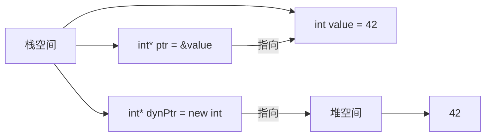

# C++ 指针与内存管理

## 什么是指针

指针是C++中一种特殊类型的变量，它存储的是内存地址而非实际值。通过指针，我们可以间接访问和操作存储在特定内存位置的数据。指针允许程序员直接操作内存，这带来了极大的灵活性和性能优势，但同时也增加了编程复杂性和潜在的错误风险。

### 指针的基本语法

```cpp
// 声明指针
数据类型 *指针名;

// 示例
int *ptr;      // 声明一个指向整数的指针
char *cptr;    // 声明一个指向字符的指针
double *dptr;  // 声明一个指向双精度浮点数的指针
```

## 指针的基本操作

### 1. 获取变量的地址

使用 `&` 运算符可以获取变量的内存地址：

```cpp
int num = 10;
int *ptr = &num;  // ptr现在存储了num变量的内存地址
```

### 2. 通过指针访问值

使用 `*` 运算符可以访问指针所指向的内存位置中的值，这个操作被称为"解引用"：

```cpp
int num = 10;
int *ptr = &num;
cout << *ptr;  // 输出10，即num的值
*ptr = 20;     // 修改指针所指向内存位置的值
cout << num;   // 输出20，num的值已经被修改
```

### 完整示例

```cpp
#include <iostream>
using namespace std;

int main() {
    int num = 10;
    int *ptr = &num;
    
    cout << "num 的值: " << num << endl;
    cout << "num 的地址: " << &num << endl;
    cout << "ptr 存储的地址: " << ptr << endl;
    cout << "通过ptr访问的值: " << *ptr << endl;
    
    *ptr = 20;  // 通过指针修改值
    cout << "修改后，num 的值: " << num << endl;
    
    return 0;
}
```

**输出：**
```
num 的值: 10
num 的地址: 0x7ffd5fbff8ac
ptr 存储的地址: 0x7ffd5fbff8ac
通过ptr访问的值: 10
修改后，num 的值: 20
```

## 指针与数组

在C++中，数组名实际上就是指向数组第一个元素的指针。这种关系使得指针和数组之间有着紧密的联系。

```cpp
#include <iostream>
using namespace std;

int main() {
    int arr[5] = {10, 20, 30, 40, 50};
    int *ptr = arr;  // ptr指向数组的第一个元素
    
    cout << "通过数组名访问元素: " << arr[2] << endl;
    cout << "通过指针访问元素: " << *(ptr+2) << endl;
    
    return 0;
}
```

**输出：**
```
通过数组名访问元素: 30
通过指针访问元素: 30
```

:::note
指针算术运算与数据类型有关。例如，`ptr+1`表示移动到下一个元素，实际内存偏移量等于该类型的大小（例如int为4字节）。
:::

## 动态内存管理

C++中的动态内存分配允许我们在程序运行时根据需要分配内存，这对于需要在运行时确定大小的数据结构非常有用。

### 使用new和delete

```cpp
// 分配单个对象的内存
int *ptr = new int;      // 分配一个int大小的内存
*ptr = 10;               // 给分配的内存赋值
delete ptr;              // 释放内存

// 分配数组
int *arr = new int[5];   // 分配能容纳5个int的连续内存块
arr[0] = 10;             // 可以像普通数组一样使用
delete[] arr;            // 释放数组内存（注意使用delete[]）
```

### 动态内存管理示例

```cpp
#include <iostream>
using namespace std;

int main() {
    // 动态分配一个整数
    int *num = new int;
    *num = 100;
    cout << "动态分配的整数值: " << *num << endl;
    delete num;  // 释放内存
    
    // 动态分配数组
    int size;
    cout << "请输入数组大小: ";
    cin >> size;
    
    int *arr = new int[size];  // 根据用户输入分配数组
    
    // 初始化数组
    for(int i = 0; i < size; i++) {
        arr[i] = i * 10;
    }
    
    // 输出数组内容
    cout << "数组内容: ";
    for(int i = 0; i < size; i++) {
        cout << arr[i] << " ";
    }
    cout << endl;
    
    delete[] arr;  // 释放数组内存
    
    return 0;
}
```

**可能的输出：**
```
动态分配的整数值: 100
请输入数组大小: 5
数组内容: 0 10 20 30 40
```

## 内存管理的常见问题

### 1. 内存泄漏

当动态分配的内存未被释放时，会导致内存泄漏，使程序占用的内存不断增长。

```cpp
void memoryLeak() {
    int *ptr = new int;  // 分配内存
    // 函数结束，但没有delete ptr，导致内存泄漏
}
```

### 2. 悬挂指针

指向已释放内存的指针称为悬挂指针，访问这种指针会导致未定义行为。

```cpp
int *ptr = new int;
delete ptr;    // 内存已释放
*ptr = 10;     // 危险！访问已释放的内存
```

:::warning
使用已释放内存的指针会导致程序行为不可预测，可能导致崩溃或安全问题！
:::

### 3. 双重释放

对同一内存地址执行多次释放操作会导致程序错误。

```cpp
int *ptr = new int;
delete ptr;    // 首次释放
delete ptr;    // 错误！双重释放
```

## 智能指针

为了避免手动内存管理中的常见错误，C++11引入了智能指针，它们能够自动管理内存的生命周期。

### 1. `std::unique_ptr`

独占所有权的智能指针，不能被复制，但可以被移动。

```cpp
#include <iostream>
#include <memory>
using namespace std;

int main() {
    // 创建unique_ptr
    unique_ptr<int> ptr1(new int(10));
    cout << "ptr1管理的值: " << *ptr1 << endl;
    
    // 转移所有权
    unique_ptr<int> ptr2 = move(ptr1);
    cout << "ptr2管理的值: " << *ptr2 << endl;
    
    // ptr1现在为空
    if (ptr1 == nullptr) {
        cout << "ptr1现在不拥有任何对象" << endl;
    }
    
    return 0;  // ptr2自动释放内存
}
```

**输出：**
```
ptr1管理的值: 10
ptr2管理的值: 10
ptr1现在不拥有任何对象
```

### 2. `std::shared_ptr`

共享所有权的智能指针，通过引用计数机制，当最后一个指向对象的shared_ptr被销毁时，对象才会被删除。

```cpp
#include <iostream>
#include <memory>
using namespace std;

int main() {
    // 创建shared_ptr
    shared_ptr<int> ptr1 = make_shared<int>(20);
    cout << "引用计数: " << ptr1.use_count() << endl;  // 输出1
    
    {
        shared_ptr<int> ptr2 = ptr1;  // 共享所有权
        cout << "作用域内，引用计数: " << ptr1.use_count() << endl;  // 输出2
    }  // ptr2离开作用域，引用计数减1
    
    cout << "作用域后，引用计数: " << ptr1.use_count() << endl;  // 输出1
    cout << "ptr1管理的值: " << *ptr1 << endl;  // 仍然可以访问
    
    return 0;  // ptr1离开作用域，引用计数减为0，对象被删除
}
```

**输出：**
```
引用计数: 1
作用域内，引用计数: 2
作用域后，引用计数: 1
ptr1管理的值: 20
```

### 3. `std::weak_ptr`

弱引用，不会增加引用计数，用于解决`shared_ptr`可能导致的循环引用问题。

```cpp
#include <iostream>
#include <memory>
using namespace std;

int main() {
    shared_ptr<int> sharedPtr = make_shared<int>(30);
    weak_ptr<int> weakPtr = sharedPtr;
    
    cout << "shared_ptr引用计数: " << sharedPtr.use_count() << endl;  // 输出1，weak_ptr不增加计数
    
    // 使用weak_ptr
    if (auto temp = weakPtr.lock()) {  // 尝试获取shared_ptr
        cout << "weak_ptr可访问值: " << *temp << endl;
    } else {
        cout << "weak_ptr指向的对象已不存在" << endl;
    }
    
    sharedPtr.reset();  // 释放shared_ptr管理的对象
    
    // 检查weak_ptr所指向的对象是否还存在
    if (auto temp = weakPtr.lock()) {
        cout << "weak_ptr可访问值: " << *temp << endl;
    } else {
        cout << "weak_ptr指向的对象已不存在" << endl;
    }
    
    return 0;
}
```

**输出：**
```
shared_ptr引用计数: 1
weak_ptr可访问值: 30
weak_ptr指向的对象已不存在
```

## 内存模型可视化

下面的图表展示了指针和动态内存分配的概念：



## 实际应用案例：动态数组类

下面是一个使用指针实现的简单动态数组类，展示了指针和内存管理的实际应用：

```cpp
#include <iostream>
using namespace std;

class DynamicArray {
private:
    int* arr;       // 指向动态分配的数组
    int size;       // 数组大小
    
public:
    // 构造函数
    DynamicArray(int initialSize) {
        size = initialSize;
        arr = new int[size];  // 动态分配内存
        for (int i = 0; i < size; i++) {
            arr[i] = 0;  // 初始化为0
        }
    }
    
    // 析构函数 - 当对象被销毁时自动调用
    ~DynamicArray() {
        delete[] arr;  // 释放动态分配的内存
        cout << "内存已释放" << endl;
    }
    
    // 设置元素值
    void setValue(int index, int value) {
        if (index >= 0 && index < size) {
            arr[index] = value;
        } else {
            cout << "索引越界!" << endl;
        }
    }
    
    // 获取元素值
    int getValue(int index) {
        if (index >= 0 && index < size) {
            return arr[index];
        } else {
            cout << "索引越界!" << endl;
            return -1;
        }
    }
    
    // 打印数组
    void print() {
        for (int i = 0; i < size; i++) {
            cout << arr[i] << " ";
        }
        cout << endl;
    }
};

int main() {
    DynamicArray array(5);  // 创建一个大小为5的动态数组
    
    // 设置一些值
    array.setValue(0, 10);
    array.setValue(1, 20);
    array.setValue(2, 30);
    
    // 打印数组
    cout << "数组内容: ";
    array.print();
    
    // 尝试越界访问
    array.setValue(10, 100);
    
    return 0;  // 当array离开作用域时，析构函数会被调用，释放内存
}
```

**输出：**
```
数组内容: 10 20 30 0 0 
索引越界!
内存已释放
```

## 总结

指针是C++中强大而灵活的工具，它允许程序员直接操作内存，实现高效的数据结构和算法。本文涵盖了以下重要内容：

1. 指针的基本概念和操作（声明、初始化、解引用）
2. 指针与数组的关系
3. 动态内存分配和释放（`new`和`delete`）
4. 常见的内存管理问题（内存泄漏、悬挂指针、双重释放）
5. 现代C++中的智能指针（`unique_ptr`、`shared_ptr`、`weak_ptr`）
6. 实际案例应用

正确使用指针和内存管理是编写高效、无错误C++程序的关键。随着经验的积累，你将能更加自信地使用这些功能，并充分发挥C++的性能潜力。

## 练习题

1. 编写一个函数，使用指针交换两个整数的值。
2. 实现一个简单的动态字符串类，包含构造函数、析构函数、添加字符和打印字符串的方法。
3. 修改上面的动态数组类，添加一个调整数组大小的方法。
4. 使用智能指针重写动态数组类，避免手动内存管理。

## 进一步学习资源

- 《C++ Primer》 - Stanley B. Lippman, Josée Lajoie, Barbara E. Moo
- 《Effective C++》 - Scott Meyers，特别是关于资源管理的章节
- [cppreference.com](https://en.cppreference.com/w/) - 关于智能指针和内存管理的详细文档
- [Compiler Explorer](https://godbolt.org/) - 在线工具，可以查看C++代码生成的汇编代码

:::tip
记住，熟练掌握指针需要大量练习。通过编写小程序并使用调试工具观察内存，你将逐渐建立对指针的直觉。
:::