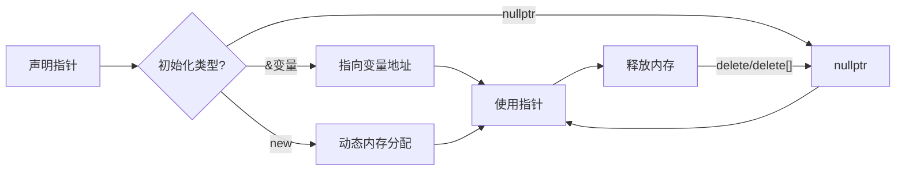

# C++ 指针初始化

在C++编程中，指针是一种强大但也容易出错的变量类型。它们存储内存地址而不是实际数据，让我们能够间接地访问和操作数据。正确初始化指针是安全使用指针的第一步，也是避免许多常见运行时错误的关键。

## 什么是指针初始化？

指针初始化是指为指针变量分配一个初始值的过程。这个初始值通常是：

1. 某个变量的地址
2. 动态分配的内存地址
3. 空指针（nullptr）
4. 另一个指针的值

未正确初始化的指针被称为"野指针"，它们指向未定义的内存位置，使用它们可能导致程序崩溃或不可预测的行为。

## 基本指针初始化语法

```cpp
// 声明指针语法
数据类型* 指针名称;

// 初始化指针语法
数据类型* 指针名称 = 初始值;
```

## 初始化指针的不同方法

### 1. 初始化为nullptr（推荐）

在C++11及更新版本中，最佳做法是使用`nullptr`来初始化不指向任何对象的指针：

```cpp
int* ptr = nullptr; // 现代C++推荐方式
```

输出：
```
ptr的值：0x0
```

:::tip
在C++11之前，可以使用`NULL`或`0`，但`nullptr`是专门为指针设计的，更加类型安全。
:::

### 2. 指向已有变量

```cpp
int number = 42;
int* ptr = &number; // 指针指向number变量的地址
```

输出：
```
number的值: 42
ptr指向的地址: 0x7ffd8c5b3c0c
ptr指向的值: 42
```

### 3. 指向动态分配的内存

```cpp
int* dynamicPtr = new int; // 分配但未初始化
*dynamicPtr = 100; // 为分配的内存赋值

int* initializedPtr = new int(200); // 分配并初始化
```

输出：
```
dynamicPtr指向的值: 100
initializedPtr指向的值: 200
```

:::caution
使用`new`分配内存后，记得在适当的时机使用`delete`释放内存，避免内存泄漏。
:::

### 4. 数组指针初始化

```cpp
// 静态数组指针
int numbers[5] = {1, 2, 3, 4, 5};
int* arrPtr = numbers; // 数组名是数组首元素的地址

// 动态数组指针
int* dynamicArray = new int[5]{10, 20, 30, 40, 50};
```

输出：
```
arrPtr[0]: 1
arrPtr[1]: 2
dynamicArray[0]: 10
dynamicArray[1]: 20
```

:::warning
动态分配的数组必须使用`delete[]`释放，而不是`delete`。
:::

## 指针初始化的常见错误

### 1. 未初始化指针

```cpp
int* ptr; // 未初始化
// *ptr = 10; // 危险！可能导致段错误或程序崩溃
```

### 2. 悬空指针（Dangling Pointer）

```cpp
int* ptr = new int(42);
delete ptr;
// *ptr = 10; // 危险！指针已经不再指向有效内存
```

### 3. 内存泄漏

```cpp
void leakMemory() {
    int* ptr = new int(42);
    // 函数结束时未释放内存，导致内存泄漏
}
```

## 指针初始化的最佳实践

1. **始终初始化指针**：声明指针时，立即初始化它，如果不确定指向什么，就初始化为`nullptr`。

2. **使用智能指针**：现代C++提供了智能指针，它们能自动管理内存。
   
```cpp
#include <memory>

// 独占所有权
std::unique_ptr<int> uPtr = std::make_unique<int>(42);

// 共享所有权
std::shared_ptr<int> sPtr = std::make_shared<int>(100);
```

3. **避免原始指针的过度使用**：尽量使用引用、智能指针或容器来减少原始指针的使用。

4. **务必释放动态内存**：使用`delete`或`delete[]`释放不再需要的动态内存。

## 指针初始化的实际应用

### 动态内存管理示例

```cpp
#include <iostream>

class DynamicArray {
private:
    int* data;
    size_t size;
    
public:
    DynamicArray(size_t arraySize) : size(arraySize) {
        // 初始化指针为动态分配的数组
        data = new int[size]();  // 使用()初始化所有元素为0
    }
    
    ~DynamicArray() {
        // 析构函数中释放内存
        delete[] data;
        data = nullptr;  // 防止悬空指针
    }
    
    void setValue(size_t index, int value) {
        if (index < size) {
            data[index] = value;
        }
    }
    
    int getValue(size_t index) const {
        if (index < size) {
            return data[index];
        }
        return -1; // 表示错误
    }
};

int main() {
    DynamicArray arr(5);
    
    // 设置值
    for (size_t i = 0; i < 5; ++i) {
        arr.setValue(i, i * 10);
    }
    
    // 读取值
    for (size_t i = 0; i < 5; ++i) {
        std::cout << "arr[" << i << "] = " << arr.getValue(i) << std::endl;
    }
    
    return 0;
}
```

输出：
```
arr[0] = 0
arr[1] = 10
arr[2] = 20
arr[3] = 30
arr[4] = 40
```

这个例子展示了如何在类中安全地管理动态内存，包括正确的指针初始化和资源释放。

### 函数参数中的指针应用

```cpp
#include <iostream>

// 交换两个整数的值
void swap(int* a, int* b) {
    if (a != nullptr && b != nullptr) {
        int temp = *a;
        *a = *b;
        *b = temp;
    }
}

int main() {
    int x = 5, y = 10;
    
    std::cout << "交换前: x = " << x << ", y = " << y << std::endl;
    
    swap(&x, &y);
    
    std::cout << "交换后: x = " << x << ", y = " << y << std::endl;
    
    return 0;
}
```

输出：
```
交换前: x = 5, y = 10
交换后: x = 10, y = 5
```

## 指针初始化过程可视化

下图展示了指针初始化的过程：



## 总结

指针初始化是C++编程中一个基础但重要的概念。正确初始化指针可以：

- 避免未定义行为和程序崩溃
- 防止内存泄漏
- 提高代码可读性和可维护性

记住，每次声明指针时都应当立即初始化它，无论是赋予有效地址还是`nullptr`。随着编程经验的积累，你会发现智能指针是原始指针的优秀替代品，它们可以自动管理内存，减少常见的指针错误。

## 练习

1. 实现一个函数，它接受一个整数指针和一个大小，然后动态创建一个指定大小的数组，并返回该数组的指针。

2. 修改上面的函数，使它使用智能指针而不是原始指针。

3. 创建一个简单的链表结构，其中每个节点包含一个整数值和一个指向下一个节点的指针。实现添加和删除节点的功能。

:::note
这些练习旨在帮助你更好地理解和应用指针初始化概念。尝试独立完成它们，如果遇到困难，再回顾本文内容。
:::

通过掌握指针初始化的基本知识，你已经向成为熟练的C++程序员迈出了重要的一步！