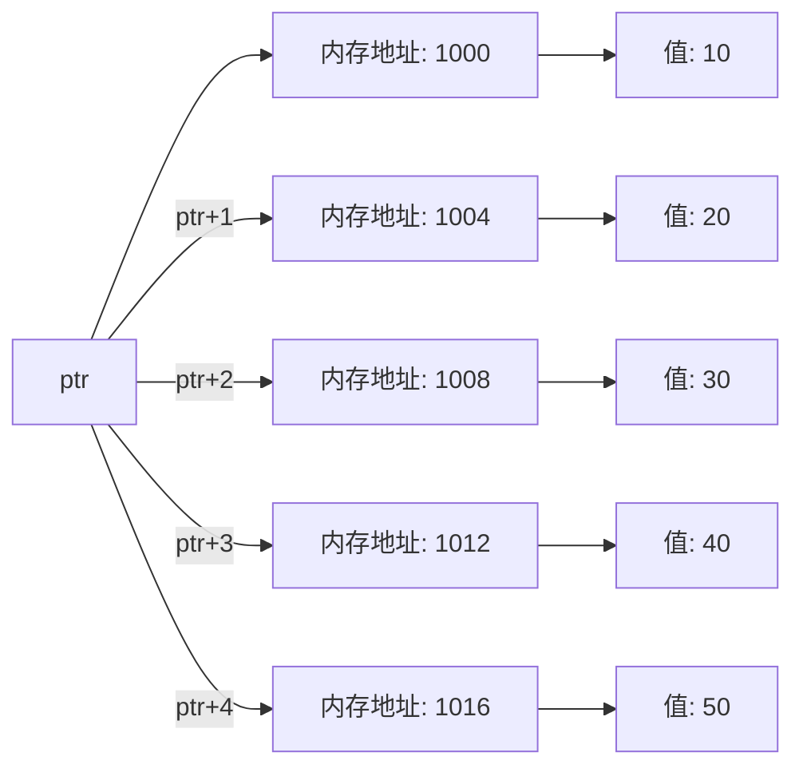

# C++ 指针运算

## 引言

指针是C++中最强大但也最容易引起困惑的特性之一。指针不仅可以存储内存地址，还可以参与各种运算操作。在本教程中，我们将深入探讨C++中指针运算的基本原理、常见操作以及实际应用场景，帮助初学者更好地理解和掌握这一重要概念。

## 什么是指针运算？

指针运算是对指针变量进行的算术或比较操作。与普通变量不同，指针运算考虑了数据类型的大小，这使得指针运算特别适合处理数组和内存管理等任务。

## 指针运算的基本类型

### 1. 指针的加减法

当我们对指针进行加减运算时，实际上是改变指针指向的内存地址。重要的是，指针的加减运算是基于其所指向数据类型的大小进行的。

```cpp
#include <iostream>
using namespace std;

int main() {
    int arr[] = {10, 20, 30, 40, 50};
    int *ptr = arr;  // ptr指向数组的第一个元素
    
    cout << "ptr的初始值: " << ptr << endl;
    cout << "*ptr的值: " << *ptr << endl;  // 输出: 10
    
    ptr = ptr + 1;  // 指针加1，移动到下一个整数位置
    cout << "ptr + 1后: " << ptr << endl;
    cout << "*ptr的值: " << *ptr << endl;  // 输出: 20
    
    ptr += 2;  // 指针再加2，移动到后面第二个整数位置
    cout << "ptr += 2后: " << ptr << endl;
    cout << "*ptr的值: " << *ptr << endl;  // 输出: 40
    
    return 0;
}
```

:::note
上述代码的输出中，指针地址的实际值会因系统而异，但指针值的增加量将是`sizeof(int)`的倍数（通常是4字节）。
:::

### 2. 指针的递增和递减

指针也可以使用递增(`++`)和递减(`--`)操作符。

```cpp
#include <iostream>
using namespace std;

int main() {
    int numbers[] = {5, 10, 15, 20, 25};
    int *p = numbers;
    
    cout << "使用前置递增:" << endl;
    cout << *p << endl;      // 输出: 5
    cout << *(++p) << endl;  // 先递增指针，再解引用: 10
    
    cout << "\n使用后置递增:" << endl;
    cout << *p << endl;      // 输出: 10
    cout << *(p++) << endl;  // 先使用当前值，再递增: 10
    cout << *p << endl;      // 现在p指向下一个元素: 15
    
    return 0;
}
```

### 3. 指针的比较

指针可以使用比较操作符(`==`, `!=`, `<`, `>`, `<=`, `>=`)进行比较，通常用于判断指针在内存中的相对位置。

```cpp
#include <iostream>
using namespace std;

int main() {
    int arr[] = {1, 2, 3, 4, 5};
    int *p1 = &arr[0];
    int *p2 = &arr[3];
    
    if (p1 < p2) {
        cout << "p1指向的内存地址在p2之前" << endl;
    }
    
    // 计算两个指针之间的元素数
    cout << "p1和p2之间有 " << p2 - p1 << " 个元素" << endl;  // 输出: 3
    
    return 0;
}
```

## 指针运算与数组

指针运算与数组有着紧密的关系，因为数组名本身在多数情况下会被转换为指向其第一个元素的指针。

```cpp
#include <iostream>
using namespace std;

int main() {
    int arr[] = {10, 20, 30, 40, 50};
    int *ptr = arr;  // ptr指向arr[0]
    
    // 使用指针遍历数组
    cout << "使用指针遍历数组:" << endl;
    for (int i = 0; i < 5; i++) {
        cout << *(ptr + i) << " ";  // 输出: 10 20 30 40 50
    }
    cout << endl;
    
    // 另一种使用指针遍历数组的方式
    cout << "另一种遍历方式:" << endl;
    ptr = arr;  // 重置指针到数组开始
    for (int i = 0; i < 5; i++) {
        cout << *ptr << " ";  // 输出当前指针指向的值
        ptr++;                // 移动到下一个元素
    }
    cout << endl;
    
    return 0;
}
```

### 理解指针运算的内存模型

下面是一个简单的图表，展示了指针运算如何在内存中工作：



:::caution
请注意，上图中的内存地址假设每个`int`类型大小为4字节。实际大小可能因系统而异。
:::

## 指针运算的常见错误

1. **类型不匹配的指针运算**：不同类型的指针之间不能直接进行算术运算。

2. **越界访问**：指针运算可能导致访问超出数组范围的内存，这会导致未定义行为。

```cpp
int arr[5] = {1, 2, 3, 4, 5};
int *p = arr;
*(p + 10) = 100;  // 危险！这超出了数组的范围
```

3. **对空指针或无效指针进行解引用**：

```cpp
int *ptr = nullptr;
*ptr = 10;  // 严重错误：对nullptr解引用会导致程序崩溃
```

## 实际应用场景

### 1. 高效的数组处理

指针运算在处理大型数组时可以提供比索引访问更高的效率：

```cpp
#include <iostream>
#include <chrono>
using namespace std;

int main() {
    const int SIZE = 100000;
    int *array = new int[SIZE];
    
    // 使用指针填充数组
    int *p = array;
    for (int i = 0; i < SIZE; i++) {
        *p++ = i;
    }
    
    // 使用指针计算数组元素的总和
    int sum = 0;
    p = array;
    for (int i = 0; i < SIZE; i++) {
        sum += *p++;
    }
    
    cout << "数组元素的总和: " << sum << endl;
    
    delete[] array;  // 释放内存
    return 0;
}
```

### 2. 字符串处理

指针运算在C风格字符串处理中非常常见：

```cpp
#include <iostream>
using namespace std;

// 自定义字符串长度函数
size_t myStrlen(const char *str) {
    const char *p = str;
    while (*p != '\0') {
        p++;
    }
    return p - str;
}

// 自定义字符串复制函数
void myStrcpy(char *dest, const char *src) {
    while (*src != '\0') {
        *dest++ = *src++;
    }
    *dest = '\0';  // 不要忘记添加字符串结束符
}

int main() {
    const char *hello = "Hello, World!";
    cout << "字符串长度: " << myStrlen(hello) << endl;
    
    char copy[20];
    myStrcpy(copy, hello);
    cout << "复制的字符串: " << copy << endl;
    
    return 0;
}
```

### 3. 动态内存管理

指针运算在实现自定义内存分配器或内存池时非常有用：

```cpp
#include <iostream>
using namespace std;

// 简单的内存池示例
class SimpleMemoryPool {
private:
    char* memory;
    size_t size;
    char* current;
    
public:
    SimpleMemoryPool(size_t poolSize) : size(poolSize) {
        memory = new char[size];
        current = memory;
    }
    
    ~SimpleMemoryPool() {
        delete[] memory;
    }
    
    // 从池中分配内存
    void* allocate(size_t bytes) {
        if (current + bytes > memory + size) {
            return nullptr;  // 内存不足
        }
        
        void* result = current;
        current += bytes;
        return result;
    }
    
    // 重置内存池（不实际释放内存，只重置指针）
    void reset() {
        current = memory;
    }
};

int main() {
    SimpleMemoryPool pool(1024);  // 1KB的内存池
    
    // 分配内存并使用
    int* numbers = static_cast<int*>(pool.allocate(5 * sizeof(int)));
    if (numbers) {
        for (int i = 0; i < 5; i++) {
            numbers[i] = i * 10;
        }
        
        for (int i = 0; i < 5; i++) {
            cout << numbers[i] << " ";
        }
        cout << endl;
    }
    
    // 重置内存池
    pool.reset();
    
    return 0;
}
```

:::tip
对于实际应用，建议使用C++标准库提供的容器和智能指针，而不是直接操作原始指针，除非有特殊的性能需求。
:::

## 总结

指针运算是C++中强大而灵活的特性，了解它的工作原理对于编写高效的代码至关重要。在本教程中，我们学习了：

1. 指针加减运算的基本原理
2. 指针的递增和递减操作
3. 指针的比较操作
4. 指针与数组的紧密联系
5. 指针运算的常见错误
6. 指针运算在实际应用中的用途

尽管指针运算强大，但它也容易导致程序错误，如内存泄漏或段错误。因此，在现代C++编程中，除非是为了特定的性能优化目的，否则应该优先使用标准库提供的容器和算法，以及智能指针来管理动态内存。

## 练习题

1. 编写一个函数，使用指针运算反转一个整数数组。
2. 实现一个函数，只使用指针操作来合并两个已排序的数组。
3. 编写一个自定义的`memcpy`函数，使用指针运算复制一段内存到另一段内存。
4. 创建一个函数，使用指针算术来查找数组中的最大值。
5. 实现一个二分查找算法，仅使用指针运算（不使用数组索引）。

## 进一步阅读

- C++标准库中的迭代器概念很大程度上是基于指针运算的抽象
- 智能指针如何改进传统指针管理
- 在现代C++中安全地使用指针的最佳实践

掌握指针运算将帮助你更深入地理解C++内存模型，并能够编写更高效的代码，特别是在性能关键的应用程序中。