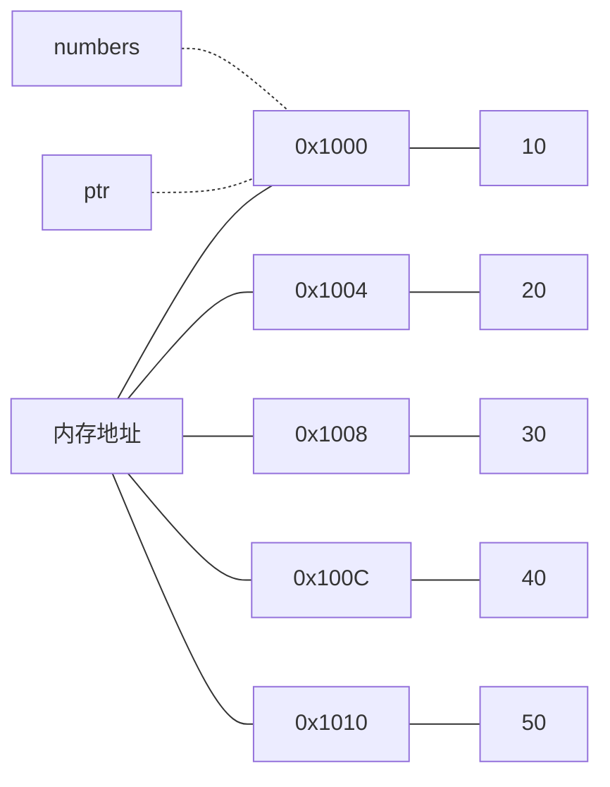

# C++ 数组指针

数组和指针是C++中两个基础但又容易混淆的概念。当这两个概念结合时，常常会给初学者带来困惑。本文将全面介绍C++中的数组指针，帮助你理解它们之间的关系和正确使用方法。

## 数组与指针的基础关系

在C++中，数组名在大多数情况下会自动转换为指向数组第一个元素的指针。这是理解数组指针的关键基础。

```cpp
int numbers[5] = {10, 20, 30, 40, 50};
int* ptr = numbers; // ptr指向数组的第一个元素

// 以下两种表达式等价
std::cout << numbers[0] << std::endl; // 输出: 10
std::cout << *ptr << std::endl;       // 输出: 10
```

输出结果:
```
10
10
```

:::note
虽然数组名常常会转换为指针，但数组名本身并不是指针变量。它是一个固定地址的常量，不能被赋予新值。
:::

## 数组指针的语法

在C++中，有几种与数组相关的指针类型：

1. 指向数组元素的指针（最常见）
2. 指向整个数组的指针（数组指针）

### 指向数组元素的指针

```cpp
int numbers[5] = {10, 20, 30, 40, 50};
int* ptr = numbers; // 指向int的指针，指向数组第一个元素

// 通过指针访问数组元素
for (int i = 0; i < 5; i++) {
    std::cout << *(ptr + i) << " "; // 指针算术运算
}
```

输出结果:
```
10 20 30 40 50
```

### 指向整个数组的指针（真正的数组指针）

```cpp
int numbers[5] = {10, 20, 30, 40, 50};
int (*arrayPtr)[5] = &numbers; // arrayPtr是指向包含5个int元素的数组的指针

// 访问数组元素
std::cout << (*arrayPtr)[0] << std::endl; // 输出: 10
std::cout << (*arrayPtr)[2] << std::endl; // 输出: 30
```

输出结果:
```
10
30
```

:::caution
`int* ptr[5]`和`int (*ptr)[5]`是不同的！前者是一个包含5个int指针的数组，后者是指向包含5个int元素的数组的指针。括号很重要！
:::

## 指针算术与数组索引

指针和数组紧密相关，以至于可以使用相似的语法来访问元素：

```cpp
int numbers[5] = {10, 20, 30, 40, 50};
int* ptr = numbers;

// 以下表达式都等价于numbers[2]
std::cout << numbers[2] << std::endl;  // 使用数组索引
std::cout << *(numbers + 2) << std::endl; // 数组名作为指针
std::cout << *(ptr + 2) << std::endl;  // 指针算术
std::cout << ptr[2] << std::endl;      // 指针索引
```

输出结果:
```
30
30
30
30
```

这展示了指针索引和数组索引的等价性：`ptr[i]` 等价于 `*(ptr + i)`。

## 数组指针的内存模型

为了更好地理解数组指针，让我们看看它们在内存中的表示：



## 多维数组与指针

多维数组与指针的关系更为复杂，但遵循相同的原则：

```cpp
int matrix[3][4] = {
    {1, 2, 3, 4},
    {5, 6, 7, 8},
    {9, 10, 11, 12}
};

// 指向矩阵第一行的指针
int* rowPtr = matrix[0];
std::cout << rowPtr[2] << std::endl; // 输出: 3

// 指向整个二维数组的指针
int (*matrixPtr)[3][4] = &matrix;
std::cout << (*matrixPtr)[1][2] << std::endl; // 输出: 7

// matrix实际上是一个数组指针类型：int (*)[4]
int (*rowsPtr)[4] = matrix;
std::cout << rowsPtr[1][2] << std::endl; // 输出: 7
```

输出结果:
```
3
7
7
```

## 函数参数中的数组指针

在函数参数中，数组类型会自动转换为指针类型：

```cpp
// 以下三个函数声明是等价的
void processArray(int arr[10]);
void processArray(int arr[]);
void processArray(int* arr);

// 如果要传递二维数组，必须指定除第一维以外的所有维度
void process2DArray(int matrix[][4], int rows);
```

实际例子：

```cpp
void printArray(int* arr, int size) {
    for (int i = 0; i < size; i++) {
        std::cout << arr[i] << " ";
    }
    std::cout << std::endl;
}

int main() {
    int numbers[5] = {10, 20, 30, 40, 50};
    printArray(numbers, 5);
    return 0;
}
```

输出结果:
```
10 20 30 40 50
```

## 常见错误和陷阱

使用数组指针时容易犯的错误：

### 1. 数组越界访问

```cpp
int arr[5] = {1, 2, 3, 4, 5};
int* ptr = arr;
std::cout << ptr[10] << std::endl; // 越界！未定义行为
```

:::warning
C++不会自动检查数组边界。访问超出数组范围的元素会导致未定义行为，可能导致程序崩溃或安全漏洞。
:::

### 2. 混淆数组指针与指针数组

```cpp
int* array[5];    // 指针数组：包含5个int指针的数组
int (*array)[5];  // 数组指针：指向包含5个int元素的数组的指针
```

### 3. 返回局部数组的指针

```cpp
int* createArray() {
    int localArray[5] = {1, 2, 3, 4, 5};
    return localArray; // 错误！返回局部变量的指针
}
```

:::caution
局部变量在函数返回后会被销毁，因此返回指向局部数组的指针会导致悬垂指针问题。
:::

## 实际应用场景

### 1. 动态内存管理

```cpp
// 创建动态数组
int* dynamicArray = new int[100];

// 使用数组
for (int i = 0; i < 100; i++) {
    dynamicArray[i] = i * 2;
}

// 处理完成后释放内存
delete[] dynamicArray;
```

### 2. 高效数据处理

当处理大型数据结构时，通过指针传递数组可以避免不必要的数据复制：

```cpp
void processLargeDataSet(const int* data, size_t size) {
    // 处理数据但不复制它
    double sum = 0;
    for (size_t i = 0; i < size; i++) {
        sum += data[i];
    }
    std::cout << "Average: " << sum / size << std::endl;
}
```

### 3. 实现自定义容器

```cpp
class IntVector {
private:
    int* data;
    size_t capacity;
    size_t size;

public:
    IntVector(size_t initialCapacity = 10) : 
        capacity(initialCapacity), size(0) {
        data = new int[capacity];
    }
    
    ~IntVector() {
        delete[] data;
    }
    
    void push_back(int value) {
        if (size >= capacity) {
            // 扩展数组
            capacity *= 2;
            int* newData = new int[capacity];
            for (size_t i = 0; i < size; i++) {
                newData[i] = data[i];
            }
            delete[] data;
            data = newData;
        }
        
        data[size++] = value;
    }
    
    int& operator[](size_t index) {
        return data[index];
    }
    
    size_t getSize() const {
        return size;
    }
};
```

## 现代C++中的数组指针

在现代C++中，我们有更安全的替代方案：

### 使用std::array

```cpp
#include <array>
#include <iostream>

int main() {
    std::array<int, 5> numbers = {10, 20, 30, 40, 50};
    
    // 使用迭代器
    for (auto it = numbers.begin(); it != numbers.end(); ++it) {
        std::cout << *it << " ";
    }
    std::cout << std::endl;
    
    // 使用范围for循环
    for (int num : numbers) {
        std::cout << num << " ";
    }
    std::cout << std::endl;
    
    return 0;
}
```

输出结果:
```
10 20 30 40 50
10 20 30 40 50
```

### 使用std::vector进行动态数组

```cpp
#include <vector>
#include <iostream>

int main() {
    std::vector<int> numbers = {10, 20, 30};
    numbers.push_back(40);
    numbers.push_back(50);
    
    for (int num : numbers) {
        std::cout << num << " ";
    }
    std::cout << std::endl;
    
    return 0;
}
```

输出结果:
```
10 20 30 40 50
```

## 总结

数组指针是C++编程中的一个重要概念，理解它需要掌握以下要点：

1. 数组名通常会隐式转换为指向其第一个元素的指针
2. 指针算术允许我们通过指针遍历数组
3. 指向数组的指针和指针数组是不同的概念
4. 在函数参数中，数组类型会自动转换为指针类型
5. 现代C++提供了更安全的替代方案，如`std::array`和`std::vector`

熟练掌握数组指针的概念和正确使用方法，对于理解C++更高级的概念和编写高效代码至关重要。通过不断练习和实践，你会越来越熟悉这些概念。

## 练习

为了巩固所学知识，尝试完成以下练习：

1. 编写一个函数，接受一个整数数组和其大小，返回数组中最大元素的指针。
2. 实现一个简单的矩阵转置函数，使用指针操作二维数组。
3. 创建一个程序，使用指针交换两个数组的内容，不使用额外的存储空间。
4. 使用指针实现冒泡排序算法。
5. 比较使用下标访问和使用指针访问数组元素的性能差异。

## 扩展资源

- [C++ Reference - Pointers](https://en.cppreference.com/w/cpp/language/pointer)
- [C++ Reference - std::array](https://en.cppreference.com/w/cpp/container/array)
- [C++ Reference - std::vector](https://en.cppreference.com/w/cpp/container/vector)
- 《C++ Primer》第4章：数组和指针
- 《Effective C++》Item 13：使用对象管理资源

通过深入理解数组指针，你将为学习更复杂的C++概念打下坚实的基础。