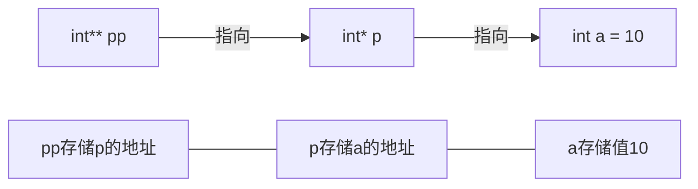
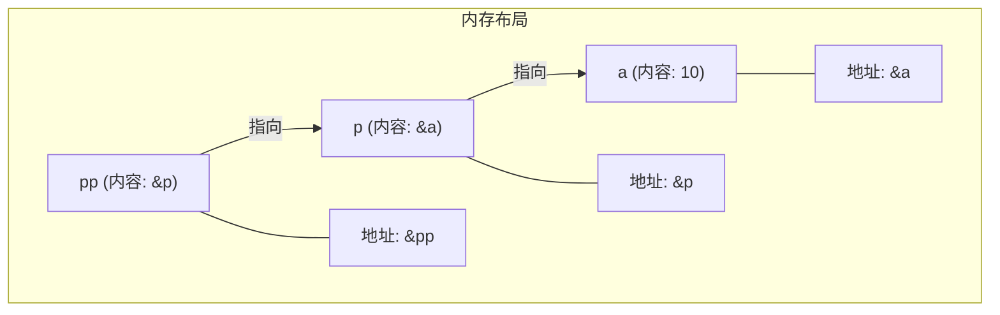

# C++ 指向指针的指针

## 引言

在C++编程的旅程中，指针是一个既强大又常常令人困惑的概念。而当你开始深入学习时，会发现指针还可以指向另一个指针，形成所谓的"指向指针的指针"（Pointer to Pointer）或"多级指针"。本文将带你探索这个看似复杂但实际上非常实用的概念。

## 什么是指向指针的指针

简单来说，指向指针的指针是一个指针变量，它存储的是另一个指针变量的地址。常常用两个星号（`**`）表示。

### 基本概念解析

让我们从内存的角度来理解：
1. 普通变量（如`int a`）直接存储数据值
2. 指针变量（如`int* p`）存储某个变量的内存地址
3. 指向指针的指针（如`int** pp`）存储某个指针变量的内存地址



## 语法和声明

### 声明指向指针的指针

```cpp
int a = 10;     // 普通整型变量
int* p = &a;    // 指向整型变量的指针
int** pp = &p;  // 指向指针的指针
```

在这个例子中：
- `a`是一个整型变量，值为10
- `p`是指向`a`的指针，存储了`a`的地址
- `pp`是指向`p`的指针，存储了`p`的地址

### 完整示例代码

```cpp
#include <iostream>
using namespace std;

int main() {
    int a = 10;           // 声明一个整型变量
    int* p = &a;          // 声明一个指向整型的指针并初始化
    int** pp = &p;        // 声明一个指向指针的指针并初始化
    
    cout << "变量a的值: " << a << endl;
    cout << "通过指针p访问a的值: " << *p << endl;
    cout << "通过指针的指针pp访问a的值: " << **pp << endl;
    
    cout << "\n内存地址信息:" << endl;
    cout << "a的地址: " << &a << endl;
    cout << "p存储的地址(即a的地址): " << p << endl;
    cout << "p自己的地址: " << &p << endl;
    cout << "pp存储的地址(即p的地址): " << pp << endl;
    
    return 0;
}
```

**输出结果：**
```
变量a的值: 10
通过指针p访问a的值: 10
通过指针的指针pp访问a的值: 10

内存地址信息:
a的地址: 0x7ffeeb3bb8ac
p存储的地址(即a的地址): 0x7ffeeb3bb8ac
p自己的地址: 0x7ffeeb3bb8a0
pp存储的地址(即p的地址): 0x7ffeeb3bb8a0
```

## 通过指向指针的指针修改值

指向指针的指针不仅能访问原始值，还能通过多级解引用来修改原始值。

```cpp
#include <iostream>
using namespace std;

int main() {
    int a = 10;
    int* p = &a;
    int** pp = &p;
    
    cout << "原始值: a = " << a << endl;
    
    // 通过指针p修改a的值
    *p = 20;
    cout << "通过p修改后: a = " << a << endl;
    
    // 通过指针的指针pp修改a的值
    **pp = 30;
    cout << "通过pp修改后: a = " << a << endl;
    
    return 0;
}
```

**输出结果：**
```
原始值: a = 10
通过p修改后: a = 20
通过pp修改后: a = 30
```

## 指向指针的指针的应用场景

多级指针在实际编程中有多种应用场景，以下是几个常见例子：

### 1. 动态二维数组

在C++中创建动态二维数组时，通常会使用指向指针的指针：

```cpp
#include <iostream>
using namespace std;

int main() {
    int rows = 3;
    int cols = 4;
    
    // 创建动态二维数组
    int** matrix = new int*[rows];
    for (int i = 0; i < rows; i++) {
        matrix[i] = new int[cols];
        // 初始化数据
        for (int j = 0; j < cols; j++) {
            matrix[i][j] = i * cols + j;
        }
    }
    
    // 打印二维数组
    cout << "二维数组内容:" << endl;
    for (int i = 0; i < rows; i++) {
        for (int j = 0; j < cols; j++) {
            cout << matrix[i][j] << "\t";
        }
        cout << endl;
    }
    
    // 释放内存
    for (int i = 0; i < rows; i++) {
        delete[] matrix[i];
    }
    delete[] matrix;
    
    return 0;
}
```

**输出结果：**
```
二维数组内容:
0	1	2	3	
4	5	6	7	
8	9	10	11	
```

### 2. 函数参数中修改指针

当你需要在函数中修改指针本身（而不仅是指针指向的值）时，需要传递指针的地址：

```cpp
#include <iostream>
using namespace std;

// 这个函数通过指针的指针修改指针变量的值
void allocateMemory(int** ptr, int size) {
    *ptr = new int[size]; // 修改指针本身
    for (int i = 0; i < size; i++) {
        (*ptr)[i] = i * 10; // 初始化数组
    }
}

int main() {
    int* data = nullptr;
    int size = 5;
    
    allocateMemory(&data, size);
    
    // 打印数组内容
    cout << "动态分配的数组内容:" << endl;
    for (int i = 0; i < size; i++) {
        cout << data[i] << " ";
    }
    cout << endl;
    
    // 释放内存
    delete[] data;
    return 0;
}
```

**输出结果：**
```
动态分配的数组内容:
0 10 20 30 40 
```

### 3. 字符串数组处理

处理C风格字符串数组时，常用指向指针的指针：

```cpp
#include <iostream>
using namespace std;

void printStrings(char** strings, int count) {
    cout << "字符串列表:" << endl;
    for (int i = 0; i < count; i++) {
        cout << i + 1 << ". " << strings[i] << endl;
    }
}

int main() {
    const char* languages[] = {
        "C++",
        "Python",
        "Java",
        "JavaScript",
        "Go"
    };
    
    printStrings((char**)languages, 5);
    return 0;
}
```

**输出结果：**
```
字符串列表:
1. C++
2. Python
3. Java
4. JavaScript
5. Go
```

:::caution 警告
在使用多级指针时，需要特别注意内存管理。内存泄漏和段错误在多级指针操作中更容易发生。
:::

## 指向指针的指针的内存分析

让我们深入分析一下指向指针的指针的内存模型：



每一级指针解引用都会导致一次内存跳转：
- `pp` 存储的是 `p` 的地址
- `*pp` 解引用后得到 `p`，也就是 `a` 的地址
- `**pp` 再次解引用后得到 `a` 的值，即 10

## 更高级别的指针

理论上，C++允许创建更高级别的指针，例如指向指针的指针的指针（`***ppp`）。不过在实际编程中，很少需要超过两级的指针，因为代码复杂度会迅速增加。

```cpp
int a = 10;
int* p = &a;
int** pp = &p;
int*** ppp = &pp;  // 三级指针

cout << ***ppp << endl;  // 输出10
```

:::tip 提示
一般情况下，如果你发现自己需要使用超过两级的指针，往往意味着应该重新考虑程序设计，使用类或结构体可能是更好的选择。
:::

## 实际应用案例：命令行参数处理

在C++程序中处理命令行参数是指向指针的指针的一个典型应用：

```cpp
#include <iostream>
using namespace std;

int main(int argc, char** argv) {
    cout << "程序名称: " << argv[0] << endl;
    cout << "参数数量: " << argc-1 << endl;
    
    if (argc > 1) {
        cout << "参数列表:" << endl;
        for (int i = 1; i < argc; i++) {
            cout << i << ": " << argv[i] << endl;
        }
    }
    
    return 0;
}
```

如果我们将这个程序编译为 `args_demo`，然后运行 `./args_demo hello world`，输出将是：

```
程序名称: ./args_demo
参数数量: 2
参数列表:
1: hello
2: world
```

在这个例子中，`argv` 是一个指向指针的指针，它指向一个存储字符串（字符指针）的数组。

## 总结

指向指针的指针是C++中一个强大但需要谨慎使用的特性。这种结构允许创建复杂的数据结构和执行高级内存操作。总结要点：

1. 指向指针的指针是存储另一个指针地址的指针
2. 使用双星号（`**`）声明
3. 需要双重解引用（`**pp`）才能访问原始值
4. 主要应用于动态二维数组、函数中修改指针和处理字符串数组
5. 使用时需要特别注意内存管理以避免内存泄漏和段错误

## 练习题

为了巩固所学知识，试着完成以下练习：

1. 创建一个程序，使用指向指针的指针实现3×3动态二维数组，并计算每行的和。
2. 编写一个函数，接受一个字符串数组（使用指向指针的指针），对字符串进行排序。
3. 创建一个函数，通过指向指针的指针交换两个指针变量的值（而不是它们指向的对象的值）。

## 额外资源

如果你想深入学习指向指针的指针及相关概念，推荐以下资源：

- C++ Primer（第5版）- 深入讨论了C++指针的高级用法
- 《Effective C++》- Scott Meyers - 提供了很多关于指针使用的最佳实践
- cppreference.com - 提供了关于指针的详细技术文档

记住，熟练运用指针需要大量练习和经验。随着你编写更多C++代码，你会越来越自如地处理各种复杂的指针操作。

:::note
指针是C++中最强大但也最容易出错的特性之一。掌握指向指针的指针将帮助你理解许多复杂的C++库和系统级编程概念。
:::