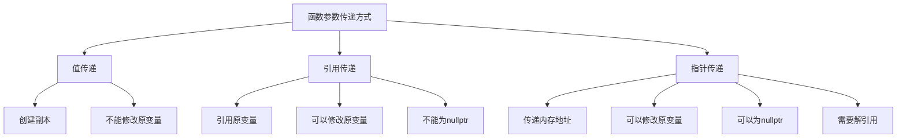

# C++ 指针传递给函数

指针是C++中的一个重要概念，它使我们能够直接操作内存地址，提供了内存操作的灵活性。而将指针传递给函数则是C++编程中的一个常见且强大的技术，它可以帮助我们在函数间高效地共享和修改数据。本文将详细介绍如何在C++中将指针传递给函数，以及这种技术的各种应用场景。

## 指针传递基础概念

在C++中，函数传参有三种主要方式：值传递、引用传递和指针传递。指针传递是指将变量的内存地址（而非变量本身的值）传递给函数。这使得函数能够直接访问并修改调用者的变量。

### 值传递与指针传递的区别

```cpp
// 值传递示例
void modifyValue(int x) {
    x = 100;  // 修改的是副本，不会影响原变量
}

// 指针传递示例
void modifyValueWithPointer(int* ptr) {
    *ptr = 100;  // 通过指针修改原变量的值
}

int main() {
    int a = 5;
    modifyValue(a);
    std::cout << "使用值传递后，a = " << a << std::endl;  // 输出: a = 5
    
    modifyValueWithPointer(&a);
    std::cout << "使用指针传递后，a = " << a << std::endl;  // 输出: a = 100
    
    return 0;
}
```

在这个例子中，`modifyValue`函数无法修改原始变量`a`的值，因为它操作的是`a`的一个副本。而`modifyValueWithPointer`函数通过指针访问并修改了`a`的实际内容。

## 指针作为函数参数

### 基本语法

将指针传递给函数的基本语法如下：

```cpp
// 函数定义
void functionName(dataType* pointerName) {
    // 使用pointerName指向的数据
}

// 函数调用
dataType variable;
functionName(&variable);  // 传递变量地址
```

### 多级指针作为函数参数

C++也支持将多级指针（如指向指针的指针）作为函数参数传递：

```cpp
void modifyPointer(int** pptr) {
    int* newPtr = new int(200);
    *pptr = newPtr;  // 修改指针本身
}

int main() {
    int* ptr = new int(10);
    std::cout << "原始值: " << *ptr << std::endl;  // 输出: 原始值: 10
    
    modifyPointer(&ptr);
    std::cout << "修改后的值: " << *ptr << std::endl;  // 输出: 修改后的值: 200
    
    delete ptr;  // 释放内存
    return 0;
}
```

:::caution
在使用动态分配内存时，记得使用`delete`释放内存以避免内存泄漏。
:::

## 常见应用场景

### 修改多个变量

指针传递允许函数同时修改多个变量：

```cpp
void swapValues(int* a, int* b) {
    int temp = *a;
    *a = *b;
    *b = temp;
}

int main() {
    int x = 10, y = 20;
    std::cout << "交换前: x = " << x << ", y = " << y << std::endl;
    
    swapValues(&x, &y);
    std::cout << "交换后: x = " << x << ", y = " << y << std::endl;
    
    return 0;
}
```

输出：
```
交换前: x = 10, y = 20
交换后: x = 20, y = 10
```

### 处理大型数据结构

当需要传递大型数据结构时，使用指针可以避免复制整个数据结构，从而提高效率：

```cpp
struct LargeObject {
    int data[10000];
    // 其他成员...
};

void processObject(LargeObject* obj) {
    // 处理对象而不复制它
    obj->data[0] = 100;
}

int main() {
    LargeObject myObject;
    myObject.data[0] = 0;
    
    processObject(&myObject);
    std::cout << "处理后的值: " << myObject.data[0] << std::endl;  // 输出: 100
    
    return 0;
}
```

### 动态内存管理

指针传递在动态内存管理中非常有用：

```cpp
void createArray(int** arr, int size) {
    *arr = new int[size];
    for (int i = 0; i < size; i++) {
        (*arr)[i] = i * 10;
    }
}

int main() {
    int* dynamicArray = nullptr;
    int size = 5;
    
    createArray(&dynamicArray, size);
    
    for (int i = 0; i < size; i++) {
        std::cout << dynamicArray[i] << " ";  // 输出: 0 10 20 30 40
    }
    std::cout << std::endl;
    
    delete[] dynamicArray;  // 释放分配的内存
    return 0;
}
```

## 指针传递的注意事项

### 空指针检查

在使用传入的指针之前，应该始终检查它是否为空（nullptr）：

```cpp
void safeProcess(int* ptr) {
    if (ptr == nullptr) {
        std::cout << "警告: 收到空指针!" << std::endl;
        return;
    }
    *ptr = 42;
}

int main() {
    int* validPtr = new int(10);
    int* nullPtr = nullptr;
    
    safeProcess(validPtr);  // 正常处理
    safeProcess(nullPtr);   // 安全处理空指针
    
    std::cout << "validPtr的值: " << *validPtr << std::endl;  // 输出: 42
    
    delete validPtr;
    return 0;
}
```

### const指针参数

使用`const`关键字可以防止函数修改指针所指向的数据：

```cpp
// 只读取，不修改
void readOnly(const int* ptr) {
    // *ptr = 100;  // 错误：不能修改const指针指向的内容
    std::cout << "值: " << *ptr << std::endl;
}

// 可以修改指针指向的数据
void readWrite(int* ptr) {
    *ptr = 100;  // 允许
    std::cout << "修改后的值: " << *ptr << std::endl;
}

int main() {
    int a = 5;
    readOnly(&a);     // 正确：只读取
    readWrite(&a);    // 正确：可以修改
    std::cout << "在main中，a = " << a << std::endl;  // 输出: a = 100
    
    return 0;
}
```

## 实际应用案例

### 1. 链表操作

链表是指针传递的典型应用场景，以下是一个简单的链表节点插入示例：

```cpp
struct Node {
    int data;
    Node* next;
    
    Node(int val) : data(val), next(nullptr) {}
};

void insertAtBeginning(Node** head, int value) {
    Node* newNode = new Node(value);
    newNode->next = *head;
    *head = newNode;
}

void printList(Node* head) {
    while (head) {
        std::cout << head->data << " -> ";
        head = head->next;
    }
    std::cout << "nullptr" << std::endl;
}

int main() {
    Node* head = nullptr;
    
    // 插入节点
    insertAtBeginning(&head, 3);
    insertAtBeginning(&head, 2);
    insertAtBeginning(&head, 1);
    
    // 打印链表
    printList(head);  // 输出: 1 -> 2 -> 3 -> nullptr
    
    // 清理内存
    while (head) {
        Node* temp = head;
        head = head->next;
        delete temp;
    }
    
    return 0;
}
```

### 2. 图像处理

在图像处理中，我们经常需要处理大量像素数据，使用指针可以高效地处理这些数据：

```cpp
// 简化的图像结构
struct Image {
    int width;
    int height;
    unsigned char* pixels;
    
    Image(int w, int h) : width(w), height(h) {
        pixels = new unsigned char[w * h];
        std::memset(pixels, 0, w * h);  // 初始化为0
    }
    
    ~Image() {
        delete[] pixels;
    }
};

// 反转图像亮度
void invertImage(Image* img) {
    for (int i = 0; i < img->width * img->height; i++) {
        img->pixels[i] = 255 - img->pixels[i];  // 反转像素值
    }
}

int main() {
    // 创建一个10x10的图像
    Image myImg(10, 10);
    
    // 设置一些像素值
    for (int i = 0; i < 10 * 10; i++) {
        myImg.pixels[i] = (i % 256);
    }
    
    // 显示反转前的前几个像素值
    std::cout << "反转前: ";
    for (int i = 0; i < 5; i++) {
        std::cout << static_cast<int>(myImg.pixels[i]) << " ";
    }
    std::cout << std::endl;
    
    // 反转图像
    invertImage(&myImg);
    
    // 显示反转后的前几个像素值
    std::cout << "反转后: ";
    for (int i = 0; i < 5; i++) {
        std::cout << static_cast<int>(myImg.pixels[i]) << " ";
    }
    std::cout << std::endl;
    
    return 0;
}
```

## 指针传递与引用传递对比

指针传递和引用传递都可以修改原始变量，但有一些区别：



以下是一个比较示例：

```cpp
// 使用引用
void incrementByReference(int& num) {
    num++;
}

// 使用指针
void incrementByPointer(int* num) {
    if (num)  // 检查是否为nullptr
        (*num)++;
}

int main() {
    int a = 10;
    
    incrementByReference(a);
    std::cout << "使用引用后，a = " << a << std::endl;  // 输出: a = 11
    
    incrementByPointer(&a);
    std::cout << "使用指针后，a = " << a << std::endl;  // 输出: a = 12
    
    // 指针可以为nullptr
    int* nullPtr = nullptr;
    incrementByPointer(nullPtr);  // 安全处理
    
    // 引用不能为nullptr
    // incrementByReference(*nullPtr);  // 这会导致运行时错误
    
    return 0;
}
```

:::tip
- 使用引用时语法更简洁，不需要解引用操作。
- 使用指针时可以处理nullptr的情况，并且指针本身可以被修改。
- 在大多数情况下，如果不需要处理nullptr或更改指针本身，使用引用会更简洁安全。
:::

## 总结

指针传递给函数是C++中一个强大的特性，它允许我们：

1. 在函数内直接修改函数外部的变量
2. 高效处理大型数据结构，避免不必要的内存复制
3. 实现动态内存管理和复杂数据结构（如链表、树等）
4. 处理多个返回值的情况

然而，指针传递也需要更加小心，以避免常见的指针问题，如悬空指针、内存泄漏和解引用空指针等。在许多情况下，引用传递可能是一个更安全的选择，特别是当不需要处理nullptr的情况时。

理解指针传递是成为一名高效C++开发者的重要一步。通过合理使用指针传递，你可以编写更高效、更灵活的代码。

## 练习

1. 编写一个函数`findMinMax`，接受一个整数数组和两个指针参数，分别用于存储数组中的最小值和最大值。

2. 使用指针参数实现一个函数，可以在调用后交换三个整数变量的值（a变为b，b变为c，c变为a）。

3. 创建一个简单的字符串处理函数，该函数接受一个字符指针并计算字符串的长度，不使用C++标准库函数。

4. 实现一个函数，它接受一个指向整数数组的指针和数组大小，然后动态分配一个新数组，其中包含原始数组元素的平方，并通过指针参数返回这个新数组。

:::note
学习资源推荐：
- 《C++ Primer》第六章：函数
- cppreference.com上的指针和函数参数部分
- 《Effective C++》关于引用和指针的条款
:::