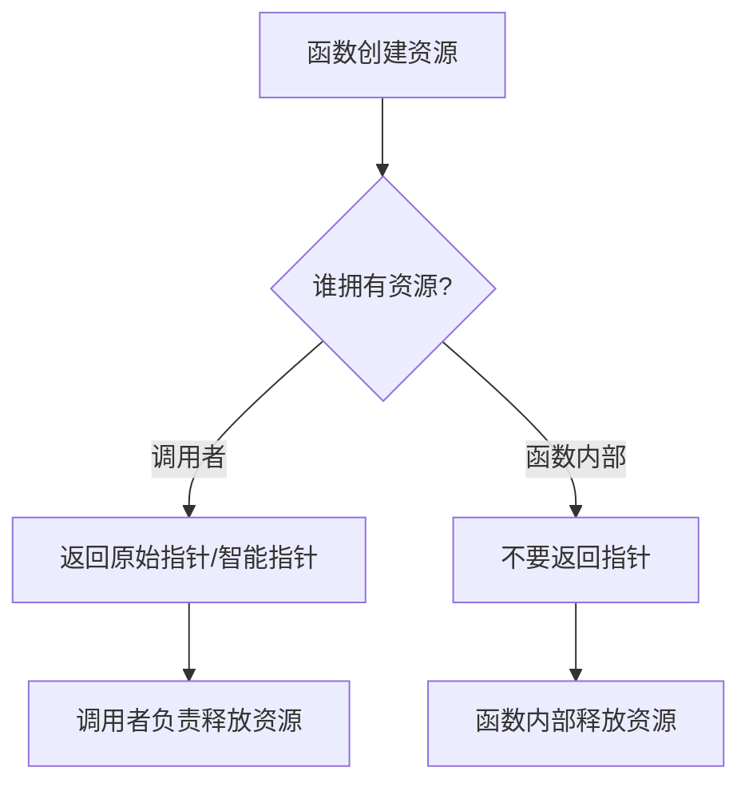

# C++ 从函数返回指针

在C++编程中，函数不仅可以返回基本数据类型的值，还可以返回指针。从函数返回指针是C++中一个重要的概念，它能够帮助我们实现更加灵活的内存管理和数据访问策略。本文将详细介绍如何在C++中从函数返回指针，以及在这个过程中需要注意的问题。

## 指针返回的基本概念

当函数需要返回一个复杂对象、动态分配的内存或者需要在函数调用后继续存在的数据时，返回指针是一个常用的方法。一个返回指针的函数的基本语法如下：

```cpp
返回类型* 函数名(参数列表) {
    // 函数体
    return 指针;
}
```

这里的`返回类型*`表示函数返回一个指向该类型的指针。

## 从函数返回指针的不同方式

### 1. 返回局部变量的指针（危险！）

:::caution 警告
返回指向局部变量的指针是危险的，因为局部变量在函数结束后会被销毁。
:::

```cpp
#include <iostream>

int* createLocalInt() {
    int x = 10;  // 局部变量
    return &x;   // 返回局部变量的地址（危险！）
}

int main() {
    int* ptr = createLocalInt();
    // 此时ptr指向的内存已经不再有效
    std::cout << "值：" << *ptr << std::endl;  // 未定义行为
    
    return 0;
}
```

上面的代码展示了一个常见的错误：函数返回了指向局部变量的指针。当`createLocalInt()`函数执行完毕后，局部变量`x`就会被销毁，因此`ptr`指向的是一个已经不存在的内存区域，尝试访问这个地址会导致未定义行为。

### 2. 返回静态局部变量的指针

使用静态局部变量可以确保变量在函数返回后依然存在：

```cpp
#include <iostream>

int* createStaticInt() {
    static int x = 10;  // 静态局部变量
    return &x;          // 返回静态变量的地址（安全）
}

int main() {
    int* ptr = createStaticInt();
    std::cout << "值：" << *ptr << std::endl;  // 输出：值：10
    
    *ptr = 20;  // 修改指针指向的值
    std::cout << "修改后的值：" << *ptr << std::endl;  // 输出：修改后的值：20
    
    int* anotherPtr = createStaticInt();
    std::cout << "另一个指针的值：" << *anotherPtr << std::endl;  // 输出：另一个指针的值：20
    
    return 0;
}
```

在这个例子中，`createStaticInt()`返回的指针指向一个静态局部变量，这个变量在程序的整个生命周期中都存在，因此即使在函数返回后依然可以安全地使用这个指针。

### 3. 返回动态分配内存的指针

另一种常见的方法是返回指向堆内存（通过`new`操作符分配）的指针：

```cpp
#include <iostream>

int* createDynamicInt() {
    int* ptr = new int(10);  // 动态分配内存
    return ptr;              // 返回指向动态分配内存的指针
}

int main() {
    int* ptr = createDynamicInt();
    std::cout << "值：" << *ptr << std::endl;  // 输出：值：10
    
    *ptr = 20;
    std::cout << "修改后的值：" << *ptr << std::endl;  // 输出：修改后的值：20
    
    delete ptr;  // 必须释放动态分配的内存
    ptr = nullptr;  // 良好的实践
    
    return 0;
}
```

这种方法的优点是我们可以动态分配任意大小的内存，缺点是必须记得手动释放内存以避免内存泄漏。

### 4. 返回函数参数的指针

函数也可以返回通过参数传入的指针：

```cpp
#include <iostream>

int* processingPointer(int* ptr) {
    *ptr = *ptr * 2;  // 将指针指向的值加倍
    return ptr;       // 返回传入的指针
}

int main() {
    int value = 5;
    int* result = processingPointer(&value);
    
    std::cout << "Value: " << value << std::endl;        // 输出：Value: 10
    std::cout << "Result: " << *result << std::endl;     // 输出：Result: 10
    std::cout << "Are they the same? " << (result == &value) << std::endl;  // 输出：Are they the same? 1
    
    return 0;
}
```

在这个例子中，函数接收一个指针，处理指针指向的数据，然后返回这个指针。这种方法既安全又高效，因为我们既没有制造新的内存泄漏风险，也没有复制不必要的数据。

## 实际应用案例：动态字符串处理

下面是一个实际案例，展示如何使用从函数返回指针来实现动态字符串处理：

```cpp
#include <iostream>
#include <cstring>

char* concatenateStrings(const char* str1, const char* str2) {
    // 计算需要分配的内存大小
    size_t len1 = strlen(str1);
    size_t len2 = strlen(str2);
    
    // 动态分配内存（+1是为了结尾的空字符）
    char* result = new char[len1 + len2 + 1];
    
    // 复制第一个字符串
    strcpy(result, str1);
    
    // 追加第二个字符串
    strcat(result, str2);
    
    return result;
}

int main() {
    const char* firstName = "John";
    const char* lastName = "Doe";
    
    char* fullName = concatenateStrings(firstName, lastName);
    std::cout << "Full name: " << fullName << std::endl;  // 输出：Full name: JohnDoe
    
    // 使用完毕后释放内存
    delete[] fullName;
    fullName = nullptr;
    
    return 0;
}
```

在这个例子中，`concatenateStrings`函数接收两个字符串，动态分配一块足够大的内存来容纳这两个字符串的组合，然后返回指向这个新字符串的指针。这展示了从函数返回指针的一个实际应用场景。

## 使用智能指针优化内存管理

在现代C++中，我们可以使用智能指针来自动管理内存，从而减少内存泄漏的风险：

```cpp
#include <iostream>
#include <memory>

std::unique_ptr<int> createUniqueInt() {
    return std::make_unique<int>(10);
}

std::shared_ptr<int> createSharedInt() {
    return std::make_shared<int>(20);
}

int main() {
    // 使用unique_ptr
    std::unique_ptr<int> uniquePtr = createUniqueInt();
    std::cout << "Unique ptr值：" << *uniquePtr << std::endl;  // 输出：Unique ptr值：10
    
    // 使用shared_ptr
    std::shared_ptr<int> sharedPtr1 = createSharedInt();
    std::cout << "Shared ptr1值：" << *sharedPtr1 << std::endl;  // 输出：Shared ptr1值：20
    
    {
        std::shared_ptr<int> sharedPtr2 = sharedPtr1;  // 两个指针共享同一个对象
        std::cout << "Shared ptr2值：" << *sharedPtr2 << std::endl;  // 输出：Shared ptr2值：20
        std::cout << "引用计数：" << sharedPtr1.use_count() << std::endl;  // 输出：引用计数：2
    }  // sharedPtr2超出作用域，引用计数减1
    
    std::cout << "引用计数：" << sharedPtr1.use_count() << std::endl;  // 输出：引用计数：1
    
    return 0;
}  // 程序结束，sharedPtr1和uniquePtr超出作用域，自动释放内存
```

使用智能指针可以很大程度上避免手动内存管理的问题，这是现代C++推荐的做法。

## 从函数返回指针的注意事项

1. **避免返回指向局部变量的指针**：局部变量在函数返回时会被销毁。
2. **确保正确释放内存**：如果返回的是动态分配的内存，确保在适当的时候释放它，或者使用智能指针自动管理。
3. **考虑使用引用替代**：在某些情况下，返回引用可能比返回指针更安全、更直观。
4. **防止空指针**：在返回指针之前，确保它不是空指针，或在文档中明确说明可能返回空指针的情况。
5. **使用智能指针**：在适当的情况下，考虑返回智能指针而不是原始指针。

## 返回值的所有权

返回指针时，应该明确指针所有权的转移：



## 总结

从函数返回指针是C++中一项强大但需要谨慎处理的技术。通过本文，我们学习了如何安全地从函数返回指针，包括使用静态局部变量、动态内存分配以及智能指针等方法。我们也了解了在这个过程中需要注意的一些问题，比如避免返回指向局部变量的指针以及确保正确释放动态分配的内存。

在现代C++编程中，尽量使用智能指针和RAII（资源获取即初始化）原则来管理资源，这样可以大大减少内存泄漏和悬挂指针等问题的风险。

## 练习题

1. 编写一个函数，动态创建一个整数数组，并返回指向这个数组的指针。
2. 实现一个使用智能指针返回动态创建对象的函数。
3. 修改上面的`concatenateStrings`函数，使它使用`std::string`而不是C风格字符串，思考这么做有什么优势。

:::tip 提示
通过完成这些练习，你将更好地理解和掌握如何在C++中从函数返回指针。
:::