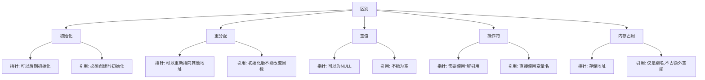

# C++ 引用基础

## 引用的概念

在C++中，引用（Reference）是一个已存在变量的别名（另一个名字）。一旦引用被初始化为某个变量，就可以使用该引用名称来访问和修改原变量的值。引用必须在创建时初始化，并且一旦引用被初始化后，它不能再引用其他变量。

:::note
引用可以看作是对象的"另一个名字"，通过引用对变量进行的任何操作都等同于对原变量的操作。
:::

## 引用的语法

引用的声明语法如下：

```cpp
数据类型& 引用名 = 变量名;
```

其中，`&` 符号用于声明一个引用。

### 基本示例

```cpp
#include <iostream>
using namespace std;

int main() {
    int original = 10;  // 原始变量
    int& ref = original;  // 创建引用

    cout << "Original value: " << original << endl;
    cout << "Reference value: " << ref << endl;

    // 通过引用修改值
    ref = 20;
    cout << "After modification:" << endl;
    cout << "Original value: " << original << endl;
    cout << "Reference value: " << ref << endl;

    // 通过原始变量修改值
    original = 30;
    cout << "After another modification:" << endl;
    cout << "Original value: " << original << endl;
    cout << "Reference value: " << ref << endl;

    return 0;
}
```

**输出结果**：
```
Original value: 10
Reference value: 10
After modification:
Original value: 20
Reference value: 20
After another modification:
Original value: 30
Reference value: 30
```

## 引用的特性

引用具有以下重要特性：

1. **必须初始化**：引用在声明时必须初始化，不存在空引用。

```cpp
int& invalidRef;  // 错误：引用必须初始化
int x = 5;
int& validRef = x;  // 正确
```

2. **不能更改引用目标**：一旦引用被初始化为某个变量，就不能再让它引用其他变量。

```cpp
int x = 5;
int y = 10;
int& ref = x;  // ref引用x
ref = y;       // 这不是让ref引用y，而是将y的值赋给x
```

3. **没有引用的引用**：C++不允许创建引用的引用。

4. **没有空引用**：引用必须指向某个变量，不能是NULL。

## 引用与指针的区别

引用和指针都是C++中用于间接访问变量的机制，但它们有着明显的区别：



### 示例比较

```cpp
#include <iostream>
using namespace std;

int main() {
    int value = 10;
    
    // 使用指针
    int* ptr = &value;
    *ptr = 20;  // 需要解引用
    
    // 使用引用
    int& ref = value;
    ref = 30;   // 直接使用
    
    cout << "Value: " << value << endl;
    
    return 0;
}
```

**输出结果**：
```
Value: 30
```

## 引用的常见应用

### 1. 函数参数传递

引用用作函数参数，可以避免值传递的开销，同时允许函数修改传入的参数。

```cpp
#include <iostream>
using namespace std;

// 使用引用参数来交换两个数
void swap(int& a, int& b) {
    int temp = a;
    a = b;
    b = temp;
}

int main() {
    int x = 5, y = 10;
    
    cout << "Before swap: x = " << x << ", y = " << y << endl;
    swap(x, y);
    cout << "After swap: x = " << x << ", y = " << y << endl;
    
    return 0;
}
```

**输出结果**：
```
Before swap: x = 5, y = 10
After swap: x = 10, y = 5
```

### 2. 函数返回值

引用也可以作为函数的返回值，允许函数调用出现在赋值语句的左侧。

```cpp
#include <iostream>
using namespace std;

// 返回数组元素引用
int& getElement(int arr[], int index) {
    return arr[index];
}

int main() {
    int arr[5] = {1, 2, 3, 4, 5};
    
    cout << "原始数组: ";
    for (int i = 0; i < 5; i++)
        cout << arr[i] << " ";
    cout << endl;
    
    // 使用函数返回的引用赋值
    getElement(arr, 2) = 30;
    
    cout << "修改后数组: ";
    for (int i = 0; i < 5; i++)
        cout << arr[i] << " ";
    cout << endl;
    
    return 0;
}
```

**输出结果**：
```
原始数组: 1 2 3 4 5
修改后数组: 1 2 30 4 5
```

:::caution
函数返回局部变量的引用是危险的，因为局部变量在函数返回后会被销毁。
:::

### 3. 常量引用

常量引用是指向常量的引用，可以用来高效传递不希望被修改的大型对象。

```cpp
#include <iostream>
#include <string>
using namespace std;

void printString(const string& s) {
    // s = "attempt to modify";  // 错误：不能修改常量引用指向的值
    cout << s << endl;
}

int main() {
    string message = "Hello, C++ References!";
    printString(message);
    return 0;
}
```

**输出结果**：
```
Hello, C++ References!
```

## 实际案例：学生成绩管理系统

下面是一个简单的学生成绩管理系统，展示了引用在实际应用中的使用：

```cpp
#include <iostream>
#include <string>
#include <vector>
using namespace std;

class Student {
private:
    string name;
    vector<int> scores;

public:
    Student(string n) : name(n) {}
    
    void addScore(int score) {
        scores.push_back(score);
    }
    
    // 返回名字的引用
    string& getName() {
        return name;
    }
    
    // 返回指定位置成绩的引用
    int& getScore(int index) {
        if (index >= 0 && index < scores.size())
            return scores[index];
        throw out_of_range("Index out of range");
    }
    
    void printInfo() {
        cout << "Student: " << name << endl;
        cout << "Scores: ";
        for (int score : scores)
            cout << score << " ";
        cout << endl;
    }
};

int main() {
    // 创建学生对象
    Student student("Alice");
    student.addScore(85);
    student.addScore(90);
    student.addScore(78);
    
    student.printInfo();
    
    // 使用引用修改学生姓名
    string& nameRef = student.getName();
    nameRef = "Alice Smith";
    
    // 使用引用修改成绩
    int& scoreRef = student.getScore(1);
    scoreRef = 95;
    
    cout << "\nAfter modification:\n";
    student.printInfo();
    
    return 0;
}
```

**输出结果**：
```
Student: Alice
Scores: 85 90 78 

After modification:
Student: Alice Smith
Scores: 85 95 78 
```

## 总结

C++引用是一个强大的语言特性，它为变量提供别名，使代码更简洁、更易理解，同时避免了使用指针时可能出现的一些复杂性和错误。引用主要用于：

1. 函数参数传递，特别是避免复制大型对象
2. 函数返回值，允许函数调用出现在赋值语句左侧
3. 作为类成员函数的返回类型，提供对私有成员的受控访问

引用的关键特性是必须初始化且无法重新绑定到其他变量，这与指针不同。掌握引用的使用对于编写高效的C++代码至关重要。

## 练习

1. 编写一个函数，使用引用参数查找并返回数组中的最大值。
2. 创建一个函数，使用常量引用接收一个大型结构体，并计算其中特定成员的总和。
3. 实现一个简单的链表，其中节点的下一个指针使用引用而不是指针。
4. 编写一个函数，可以交换两个字符串的内容，使用引用参数。

:::tip
记住，引用是不能为空的，不能重新绑定到另一个变量，并且必须在创建时初始化。这些特性使得引用比指针更安全，但灵活性较低。
:::