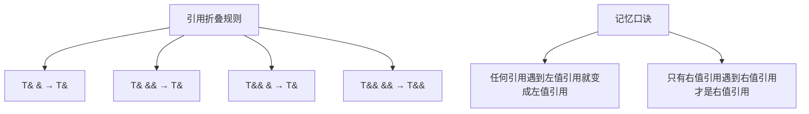

# C++ 引用折叠

## 什么是引用折叠

在C++中，引用折叠（Reference Collapsing）是一种处理"引用的引用"的规则，主要出现在模板实例化和类型别名（typedef/using）中。尽管C++语法不允许我们直接声明"引用的引用"，例如 `int& &r`，但在某些上下文中，特别是在模板参数推导过程中，这种情况会间接发生。

:::note
引用折叠是C++11引入的一个重要特性，它为实现通用引用和完美转发提供了基础。
:::

## 引用折叠规则

C++标准定义了以下引用折叠规则：

1. `T& &` 折叠为 `T&` (左值引用的左值引用折叠为左值引用)
2. `T& &&` 折叠为 `T&` (右值引用的左值引用折叠为左值引用)
3. `T&& &` 折叠为 `T&` (左值引用的右值引用折叠为左值引用) 
4. `T&& &&` 折叠为 `T&&` (右值引用的右值引用折叠为右值引用)

简单来说，只有当两个引用都是右值引用时，结果才是右值引用，否则结果都是左值引用。

## 引用折叠的应用场景

### 1. 模板参数推导中的引用折叠

当我们在模板中使用右值引用参数，且传递给它一个左值时，会发生特殊的类型推导和引用折叠。这与"通用引用"（Universal Reference）或"转发引用"（Forwarding Reference）概念密切相关。

```cpp
template <typename T>
void func(T&& param) {  // T&& 在这里是通用引用，不仅仅是右值引用
    // 函数体
}

int main() {
    int x = 10;
    
    func(x);      // x是左值，T推导为int&，param类型为int& && 折叠为 int&
    func(10);     // 10是右值，T推导为int，param类型为int&&
    
    return 0;
}
```

### 2. auto&&与引用折叠

在C++11及更高版本中，`auto&&`也遵循引用折叠规则：

```cpp
int x = 10;
auto&& r1 = x;    // x是左值，auto推导为int&，r1类型为int& && 折叠为int&
auto&& r2 = 10;   // 10是右值，auto推导为int，r2类型为int&&
```

### 3. typedef与using中的引用折叠

引用折叠也适用于类型别名：

```cpp
template<typename T>
struct Widget {
    typedef T&& RvalueRefToT;  // 当T为int&时，会变成int& &&，折叠为int&
};

int main() {
    Widget<int>::RvalueRefToT r1 = 10;  // r1是int&&
    
    Widget<int&>::RvalueRefToT r2 = 5;  // 编译错误，r2是int&，不能绑定到右值5
    int y = 20;
    Widget<int&>::RvalueRefToT r3 = y;  // r3是int&
    
    return 0;
}
```

## 完美转发中的引用折叠

引用折叠最重要的应用是在实现完美转发（Perfect Forwarding）时。完美转发允许我们将函数参数"按原样"转发给另一个函数，保留其值类别（左值或右值）。

```cpp
template <typename T>
void wrapper(T&& arg) {
    // std::forward保持arg的原始值类别
    originalFunction(std::forward<T>(arg));
}

void originalFunction(int& x) {
    std::cout << "左值引用版本被调用" << std::endl;
}

void originalFunction(int&& x) {
    std::cout << "右值引用版本被调用" << std::endl;
}

int main() {
    int a = 10;
    wrapper(a);    // 输出：左值引用版本被调用
    wrapper(20);   // 输出：右值引用版本被调用
    
    return 0;
}
```

在这个例子中，`std::forward<T>`利用了引用折叠规则来实现完美转发：

1. 当 `arg` 是通过左值传递的，`T` 被推导为 `int&`，`std::forward<int&>(arg)` 返回左值引用
2. 当 `arg` 是通过右值传递的，`T` 被推导为 `int`，`std::forward<int>(arg)` 返回右值引用

## std::forward的实现原理

`std::forward`的简化实现如下：

```cpp
template<typename T>
T&& forward(typename std::remove_reference<T>::type& arg) {
    return static_cast<T&&>(arg);
}
```

当我们调用 `forward<T>(arg)` 时：

1. 如果 `T` 是 `int&`（左值引用），返回类型 `T&&` 会被折叠为 `int&`
2. 如果 `T` 是 `int`（非引用），返回类型 `T&&` 就是 `int&&`

这样，`std::forward` 就可以根据模板参数推导的结果，正确地保留参数的值类别。

## 引用折叠的可视化理解

我们可以用下面的图表来理解引用折叠规则：



## 实际应用案例：构建通用工厂函数

以下是一个实际应用案例，展示了如何使用引用折叠和完美转发来实现通用工厂函数：

```cpp
#include <iostream>
#include <memory>
#include <utility>

class Widget {
public:
    Widget(int n) : data(n) { 
        std::cout << "构造Widget，数据=" << data << std::endl; 
    }
    
    Widget(const Widget& w) : data(w.data) {
        std::cout << "复制构造Widget" << std::endl;
    }
    
    Widget(Widget&& w) : data(w.data) {
        w.data = 0;
        std::cout << "移动构造Widget" << std::endl;
    }
    
    int getData() const { return data; }
    
private:
    int data;
};

// 通用工厂函数，完美转发构造函数参数
template <typename T, typename... Args>
std::unique_ptr<T> makeWidget(Args&&... args) {
    return std::unique_ptr<T>(new T(std::forward<Args>(args)...));
}

int main() {
    // 使用右值
    auto w1 = makeWidget<Widget>(42);
    std::cout << "w1数据: " << w1->getData() << std::endl;
    
    // 使用左值
    int value = 100;
    auto w2 = makeWidget<Widget>(value);
    std::cout << "w2数据: " << w2->getData() << std::endl;
    
    // 使用另一个Widget对象
    Widget existingWidget(200);
    
    // 这会调用复制构造函数(因为传递的是左值)
    auto w3 = makeWidget<Widget>(existingWidget);
    std::cout << "w3数据: " << w3->getData() << std::endl;
    
    // 这会调用移动构造函数(因为传递的是右值)
    auto w4 = makeWidget<Widget>(std::move(existingWidget));
    std::cout << "w4数据: " << w4->getData() << std::endl;
    std::cout << "原widget数据: " << existingWidget.getData() << std::endl;
    
    return 0;
}
```

输出结果：
```
构造Widget，数据=42
w1数据: 42
构造Widget，数据=100
w2数据: 100
构造Widget，数据=200
复制构造Widget
w3数据: 200
移动构造Widget
w4数据: 200
原widget数据: 0
```

在这个例子中，`makeWidget`函数能够完美转发构造函数参数，不论它们是左值还是右值。这是通过引用折叠和`std::forward`实现的。

## 总结

引用折叠是C++11引入的重要特性，它解决了如何处理"引用的引用"的问题，特别是在模板实例化和类型推导中。主要要点包括：

1. 引用折叠规则：只有当两个引用都是右值引用时，结果才是右值引用，否则结果都是左值引用
2. 引用折叠在模板参数推导、auto类型推导和类型别名中都会发生
3. 引用折叠是实现完美转发的关键机制
4. `std::forward`依赖引用折叠来保持参数的值类别（左值或右值）

理解引用折叠对于深入掌握C++模板编程、通用引用和完美转发至关重要，也是实现高效、通用C++库的基础。

## 练习

1. 尝试写一个函数模板，它接受一个通用引用，并根据参数是左值还是右值打印不同的消息。
2. 实现一个简单的通用包装函数，它能完美转发任意数量的参数到另一个函数。
3. 解释以下代码中发生的引用折叠：
   ```cpp
   template<typename T>
   void foo(T&& x) {
       T&& y = std::forward<T>(x);
   }
   ```

## 延伸阅读

- C++标准文档中关于引用折叠的部分
- Scott Meyers的《Effective Modern C++》，特别是关于通用引用和完美转发的章节
- Howard Hinnant关于引用折叠和完美转发的文章