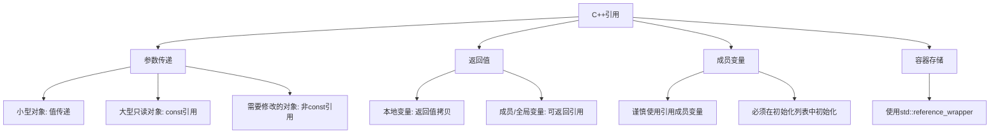

# C++ 引用最佳实践

引用是C++相对于C语言的重要扩展之一，它为我们提供了一种操作变量的替代方式。引用可以视为变量的别名，使用恰当时能够提高代码的可读性、效率和安全性。本文将介绍C++引用的最佳实践，帮助初学者避免常见陷阱并高效地利用这一功能。

## 引用基础回顾

在深入最佳实践之前，让我们简单回顾一下什么是引用：

```cpp
int original = 10;     // 原始变量
int& ref = original;   // 引用变量，ref成为original的别名
ref = 20;              // 修改ref的值，同时也修改了original的值
```

输出结果：
```
original = 20
```

引用与指针不同的是，引用必须在声明时初始化，并且一旦绑定到一个变量，就不能再绑定到另一个变量。

## 引用的最佳实践

### 1. 函数参数传递

#### 使用常量引用传递只读大型对象

```cpp
// 不推荐: 浪费资源的值传递
void printStudent(Student student) {
    std::cout << "Name: " << student.name << ", ID: " << student.id << std::endl;
}

// 推荐: 使用常量引用
void printStudent(const Student& student) {
    std::cout << "Name: " << student.name << ", ID: " << student.id << std::endl;
}
```

为什么这样做更好？
- 避免了对象的复制，节省内存和CPU资源
- `const`保证了函数不会修改参数
- 适合大型对象、自定义类和STL容器

:::tip
一般规则：基本类型（int, double等）使用值传递；大型对象使用常量引用传递。
:::

#### 当需要修改参数时使用非常量引用

```cpp
// 使用非常量引用修改参数
void incrementAge(Person& person) {
    person.age++;
}

int main() {
    Person john = {"John", 30};
    incrementAge(john);
    std::cout << john.name << " is now " << john.age << " years old." << std::endl;
    return 0;
}
```

输出结果：
```
John is now 31 years old.
```

### 2. 避免返回局部变量的引用

```cpp
// 危险代码 - 不要这样做！
int& getDangerousLocalRef() {
    int local = 10;
    return local;  // 返回局部变量的引用
}

// 正确的做法
int getValueCopy() {
    int local = 10;
    return local;  // 返回值拷贝
}
```

:::warning
返回局部变量的引用会导致未定义行为，因为局部变量在函数结束后就被销毁了。
:::

### 3. 恰当使用返回引用

在某些情况下，返回引用是合理的，比如：

```cpp
// 返回类成员的引用
class MyArray {
private:
    int data[100];
public:
    // 返回元素引用，可以作为左值使用
    int& operator[](int index) {
        return data[index];
    }
    
    // 常量版本
    const int& operator[](int index) const {
        return data[index];
    }
};

int main() {
    MyArray arr;
    arr[0] = 100;  // 使用返回的引用作为左值
    std::cout << arr[0] << std::endl;
    return 0;
}
```

输出结果：
```
100
```

### 4. 使用引用成员变量要小心

引用成员变量必须在初始化列表中初始化，且不能被重新赋值。

```cpp
class RefWrapper {
private:
    int& refValue;
    
public:
    // 必须在初始化列表中初始化引用成员
    RefWrapper(int& value) : refValue(value) {}
    
    void setValue(int newValue) {
        refValue = newValue; // 修改被引用的变量
    }
    
    int getValue() const {
        return refValue;
    }
};

int main() {
    int originalValue = 5;
    RefWrapper wrapper(originalValue);
    
    wrapper.setValue(10);
    std::cout << "Original value: " << originalValue << std::endl;
    std::cout << "Wrapper value: " << wrapper.getValue() << std::endl;
    
    return 0;
}
```

输出结果：
```
Original value: 10
Wrapper value: 10
```

### 5. 使用std::reference_wrapper包装引用

当需要在容器中存储引用或者需要可重新赋值的引用时，考虑使用`std::reference_wrapper`：

```cpp
#include <iostream>
#include <vector>
#include <functional>  // 为 std::reference_wrapper

int main() {
    int a = 1, b = 2, c = 3;
    
    // 使用std::reference_wrapper创建一个引用的容器
    std::vector<std::reference_wrapper<int>> refs = {a, b, c};
    
    // 修改所有引用指向的值
    for (auto& r : refs) {
        r.get() *= 10;
    }
    
    std::cout << "a = " << a << ", b = " << b << ", c = " << c << std::endl;
    return 0;
}
```

输出结果：
```
a = 10, b = 20, c = 30
```

### 6. 优先使用引用而非指针（当可能时）

```cpp
// 使用指针
void updateValuePtr(int* value) {
    if (value) {  // 需要检查指针是否为null
        *value += 10;
    }
}

// 使用引用
void updateValueRef(int& value) {
    value += 10;  // 不需要解引用，代码更清晰
}

int main() {
    int x = 5;
    updateValuePtr(&x);  // 需要取地址
    updateValueRef(x);   // 直接传递变量
    std::cout << "x = " << x << std::endl;
    return 0;
}
```

输出结果：
```
x = 25
```

引用的优势：
- 语法更简洁（不需要取地址和解引用操作）
- 一旦初始化，永远不会是null
- 更好地表达"这个参数必须提供"的语义

## 实际应用案例

### 案例1：游戏引擎中的实体系统

在游戏引擎中，引用可以用于访问和修改实体组件：

```cpp
class Entity {
public:
    Transform transform;
    Renderer renderer;
    Physics physics;
};

// 使用引用优化性能
void updateEntityPosition(Entity& entity, float deltaTime) {
    // 无需复制整个实体
    Vector3 acceleration = entity.physics.getAcceleration();
    entity.transform.position += entity.physics.velocity * deltaTime;
    entity.physics.velocity += acceleration * deltaTime;
}

// 使用常量引用优化渲染
void renderEntity(const Entity& entity, RenderContext& context) {
    // 只读访问，不复制实体
    context.draw(entity.renderer.getMesh(), entity.transform.getModelMatrix());
}
```

### 案例2：链表操作

在链表实现中，引用可以简化节点操作：

```cpp
struct Node {
    int data;
    Node* next;
};

// 引用使插入函数更清晰
void insertAfter(Node& node, int value) {
    Node* newNode = new Node{value, node.next};
    node.next = newNode;
}

// 使用引用查找并修改节点
bool findAndModify(Node& head, int oldValue, int newValue) {
    Node* current = &head;
    while (current) {
        if (current->data == oldValue) {
            current->data = newValue;
            return true;
        }
        current = current->next;
    }
    return false;
}
```

## 引用最佳实践总结



## 练习

1. 编写一个交换两个整数值的函数，使用引用作为参数
2. 创建一个函数，接受一个向量的常量引用，计算并返回其中所有元素的和
3. 编写一个类，包含一个引用成员变量，并实现适当的构造函数
4. 创建一个函数，返回一个数组中最大元素的引用

## 总结

C++引用是一个强大的语言特性，使用得当可以显著提高代码质量和执行效率。回顾最佳实践：

- 对于大型对象参数，使用常量引用避免不必要的复制
- 当需要修改参数时，使用非常量引用
- 避免返回局部变量的引用
- 在适当场景（如运算符重载）中返回引用
- 使用引用成员变量时要小心，必须在初始化列表中初始化
- 当需要在容器中存储引用时，使用`std::reference_wrapper`
- 当表达"这个参数一定要提供且不能为空"的语义时，优先使用引用而非指针

掌握这些引用的最佳实践，将帮助你编写更加高效、安全和可维护的C++代码。

:::tip
记住：引用是对象的别名，而不是对象本身。正确使用引用，可以让你的代码更优雅、更高效！
:::