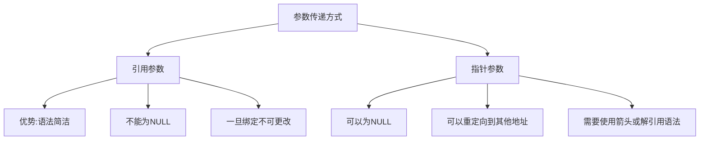

# C++ 引用作为参数

## 引言

在C++编程中，函数参数的传递方式直接影响程序的性能和行为。C++提供了三种主要的参数传递方式：值传递、指针传递和引用传递。本文将重点讲解引用作为函数参数时的特性和应用，这是C++区别于C语言的一个重要特性。

引用参数允许函数直接访问调用者提供的原始变量，而不是操作其副本，这既可以提高效率，又可以实现多值返回的功能。

## 引用参数的基本概念

引用是C++中的一个特性，本质上是变量的别名。当引用作为函数参数使用时，函数内对参数的任何修改都会直接影响到原始变量。

### 引用参数的语法

```cpp
// 语法格式
return_type function_name(data_type &parameter_name) {
    // 函数体
}
```

## 引用参数 vs 值参数

### 值参数（传值）

当使用值传递时，函数会创建参数的一个副本，对副本的任何修改都不会影响原始值。

```cpp
#include <iostream>
using namespace std;

void modifyValue(int x) {
    x = x + 10;  // 修改的是副本
    cout << "在函数内部，x = " << x << endl;
}

int main() {
    int num = 5;
    cout << "调用函数前，num = " << num << endl;
    modifyValue(num);
    cout << "调用函数后，num = " << num << endl;
    return 0;
}
```

输出结果：
```
调用函数前，num = 5
在函数内部，x = 15
调用函数后，num = 5
```

### 引用参数（传引用）

使用引用参数时，函数直接操作原始变量，而不是其副本。

```cpp
#include <iostream>
using namespace std;

void modifyValueByRef(int &x) {
    x = x + 10;  // 直接修改原始变量
    cout << "在函数内部，x = " << x << endl;
}

int main() {
    int num = 5;
    cout << "调用函数前，num = " << num << endl;
    modifyValueByRef(num);
    cout << "调用函数后，num = " << num << endl;
    return 0;
}
```

输出结果：
```
调用函数前，num = 5
在函数内部，x = 15
调用函数后，num = 15
```

## 引用参数的优势

### 1. 避免拷贝大型对象

对于大型对象（如大数组、大结构体或复杂类），值传递会导致性能下降，因为需要复制整个对象。使用引用参数可以避免这种开销。

```cpp
#include <iostream>
using namespace std;

// 大型结构体
struct BigData {
    int data[1000];
};

// 使用引用参数，避免拷贝整个结构体
void processData(BigData &bd) {
    bd.data[0] = 100;  // 直接修改原始数据
}

int main() {
    BigData myData;
    myData.data[0] = 0;
    
    cout << "处理前: " << myData.data[0] << endl;
    processData(myData);
    cout << "处理后: " << myData.data[0] << endl;
    
    return 0;
}
```

输出结果：
```
处理前: 0
处理后: 100
```

### 2. 允许函数修改多个值

通过引用参数，一个函数可以"返回"多个值。

```cpp
#include <iostream>
using namespace std;

// 计算圆的面积和周长
void calculateCircle(double radius, double &area, double &perimeter) {
    const double PI = 3.14159;
    area = PI * radius * radius;
    perimeter = 2 * PI * radius;
}

int main() {
    double radius = 5.0;
    double area, perimeter;
    
    calculateCircle(radius, area, perimeter);
    
    cout << "半径为 " << radius << " 的圆:" << endl;
    cout << "面积 = " << area << endl;
    cout << "周长 = " << perimeter << endl;
    
    return 0;
}
```

输出结果：
```
半径为 5 的圆:
面积 = 78.5398
周长 = 31.4159
```

### 3. 实现函数链式调用

引用返回允许函数链式调用，这在设计流式接口时非常有用。

```cpp
#include <iostream>
#include <string>
using namespace std;

class TextBuilder {
private:
    string text;
    
public:
    TextBuilder() : text("") {}
    
    TextBuilder& append(const string& str) {
        text += str;
        return *this;  // 返回对象的引用
    }
    
    TextBuilder& appendLine(const string& str) {
        text += str + "\n";
        return *this;
    }
    
    string getText() const {
        return text;
    }
};

int main() {
    TextBuilder builder;
    
    // 链式调用
    string result = builder.append("Hello ")
                          .append("C++ ")
                          .appendLine("World!")
                          .append("引用参数很强大")
                          .getText();
                          
    cout << result << endl;
    
    return 0;
}
```

输出结果：
```
Hello C++ World!
引用参数很强大
```

## 常量引用参数

为了防止函数意外修改不应该修改的参数，可以使用常量引用。这结合了引用的高效性和值参数的安全性。

```cpp
#include <iostream>
#include <string>
using namespace std;

// 使用常量引用避免拷贝，同时保护数据不被修改
void printPersonInfo(const string &name, const int &age) {
    // name = "John";  // 错误！不能修改常量引用
    cout << "姓名: " << name << ", 年龄: " << age << endl;
}

int main() {
    string personName = "张三";
    int personAge = 25;
    
    printPersonInfo(personName, personAge);
    
    return 0;
}
```

输出结果：
```
姓名: 张三, 年龄: 25
```

:::tip
对于内置类型（如int, double等）作为只读参数时，通常使用值传递而不是常量引用，因为它们的拷贝开销很小。但对于用户定义的类型（如类、结构体），即使只是读取，也应优先考虑使用常量引用。
:::

## 引用参数的注意事项

### 1. 引用必须初始化

引用在声明时必须初始化，这点与指针不同。

```cpp
int &ref;      // 错误：引用未初始化
int value = 10;
int &ref = value;  // 正确：引用已初始化
```

### 2. 不能为引用重新赋值

一旦引用被初始化，就不能再引用其他对象。

```cpp
#include <iostream>
using namespace std;

int main() {
    int x = 10;
    int y = 20;
    int &ref = x;  // ref引用了x
    
    cout << "ref = " << ref << endl;
    
    ref = y;  // 这不是让ref引用y，而是将y的值赋给x
    
    cout << "修改后 ref = " << ref << endl;
    cout << "修改后 x = " << x << endl;
    cout << "y = " << y << endl;
    
    return 0;
}
```

输出结果：
```
ref = 10
修改后 ref = 20
修改后 x = 20
y = 20
```

### 3. 不要返回局部变量的引用

函数不应返回局部变量的引用，因为局部变量在函数结束时会被销毁。

```cpp
#include <iostream>
using namespace std;

// 错误示范：返回局部变量的引用
int& getLocalRef() {
    int local = 10;
    return local;  // 危险！local会在函数结束时被销毁
}

int main() {
    int &ref = getLocalRef();  // 引用了已销毁的内存
    cout << "ref = " << ref << endl;  // 未定义行为
    
    return 0;
}
```

这段代码的行为是未定义的，可能导致程序崩溃或产生垃圾值。

## 实际应用场景

### 1. 交换两个变量的值

```cpp
#include <iostream>
using namespace std;

void swap(int &a, int &b) {
    int temp = a;
    a = b;
    b = temp;
}

int main() {
    int x = 5, y = 10;
    cout << "交换前: x = " << x << ", y = " << y << endl;
    swap(x, y);
    cout << "交换后: x = " << x << ", y = " << y << endl;
    return 0;
}
```

输出结果：
```
交换前: x = 5, y = 10
交换后: x = 10, y = 5
```

### 2. 字符串处理

```cpp
#include <iostream>
#include <string>
using namespace std;

// 将字符串转换为大写（直接修改原始字符串）
void toUpperCase(string &str) {
    for (size_t i = 0; i < str.length(); i++) {
        str[i] = toupper(str[i]);
    }
}

int main() {
    string message = "Hello, C++ Reference!";
    cout << "原始字符串: " << message << endl;
    
    toUpperCase(message);
    cout << "转换后: " << message << endl;
    
    return 0;
}
```

输出结果：
```
原始字符串: Hello, C++ Reference!
转换后: HELLO, C++ REFERENCE!
```

### 3. 对象传递和修改

```cpp
#include <iostream>
#include <string>
using namespace std;

class Student {
private:
    string name;
    int score;
    
public:
    Student(const string &n, int s) : name(n), score(s) {}
    
    void display() const {
        cout << "学生: " << name << ", 分数: " << score << endl;
    }
    
    friend void addBonus(Student &student, int bonus);
};

// 为学生增加奖励分数
void addBonus(Student &student, int bonus) {
    student.score += bonus;
    cout << "已为 " << student.name << " 添加 " << bonus << " 奖励分" << endl;
}

int main() {
    Student alice("爱丽丝", 85);
    alice.display();
    
    addBonus(alice, 5);
    alice.display();
    
    return 0;
}
```

输出结果：
```
学生: 爱丽丝, 分数: 85
已为 爱丽丝 添加 5 奖励分
学生: 爱丽丝, 分数: 90
```

## 引用参数与指针参数的比较

引用参数与指针参数在某些方面功能类似，但有一些重要区别：



```cpp
#include <iostream>
using namespace std;

// 使用引用参数
void incrementByRef(int &num) {
    num++;
}

// 使用指针参数
void incrementByPtr(int *num) {
    if (num != nullptr) {  // 指针需要检查是否为空
        (*num)++;
    }
}

int main() {
    int value = 10;
    
    incrementByRef(value);
    cout << "使用引用后: " << value << endl;
    
    incrementByPtr(&value);  // 需要传递地址
    cout << "使用指针后: " << value << endl;
    
    // 指针可以为空
    int *nullPtr = nullptr;
    // incrementByRef(*nullPtr);  // 会导致程序崩溃
    incrementByPtr(nullPtr);      // 安全，因为有空检查
    
    return 0;
}
```

输出结果：
```
使用引用后: 11
使用指针后: 12
```

:::caution
虽然引用在大多数情况下是安全的，但如果引用了无效的对象（如已删除的内存），仍会导致未定义行为。引用并不能保证引用的对象总是有效的。
:::

## 总结

引用作为函数参数是C++中一个强大而灵活的特性，它具有以下优势：

1. **避免大型对象的拷贝**，提高程序效率
2. **允许函数修改原始变量**，实现"多值返回"功能
3. **语法简洁易用**，比指针更直观
4. 通过**常量引用**可以兼顾效率和安全性

使用引用参数时需要注意：
- 引用必须在声明时初始化
- 一旦初始化，引用不能再绑定到其他对象
- 不要返回局部变量的引用

对于C++开发者而言，合理使用引用参数可以使代码更加高效、安全和易读。

## 练习题

为了巩固对引用参数的理解，尝试完成以下练习：

1. 编写一个函数，接受一个整型数组和其大小作为参数，计算并返回数组元素的平均值，同时通过引用参数返回最大值和最小值。

2. 创建一个函数，接受一个字符串引用参数，将字符串中的所有小写字母转换为大写，所有大写字母转换为小写。

3. 实现一个函数，交换两个字符串的内容，使用引用参数。

通过这些练习，你将更好地掌握C++中引用参数的使用方法和技巧。