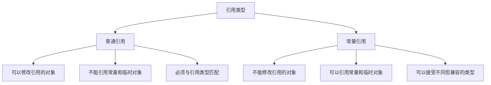

# C++ 常量引用

## 什么是常量引用

常量引用（Const Reference）是C++中一种特殊类型的引用，它结合了**常量**和**引用**两个概念。简单来说，常量引用是一个无法通过它修改所引用对象的引用。

语法形式为：
```cpp
const 数据类型 &引用名 = 变量名;
```

例如：
```cpp
int x = 10;
const int &ref = x; // ref是x的常量引用
```

## 常量引用的特点

### 1. 不能通过常量引用修改原始值

```cpp
int number = 42;
const int &ref = number; // 创建常量引用

// ref = 100;  // 错误！不能通过常量引用修改值
number = 100;  // 正确：可以通过原变量修改值
```

### 2. 可以引用字面值常量

普通引用不能引用字面值常量，但常量引用可以：

```cpp
// int &ref = 42;      // 错误！普通引用不能引用字面值
const int &ref = 42;   // 正确！常量引用可以引用字面值
```

### 3. 可以接受不同类型的参数（临时对象）

```cpp
double pi = 3.14159;
const int &ref = pi;   // 编译器会创建临时int变量存储3
```

当创建`const int &ref = pi;`时，编译器执行以下步骤：
1. 创建一个临时int变量
2. 将pi的值转换为int并存储在临时变量中
3. ref引用这个临时变量

:::note
这种情况在普通引用中是不允许的，因为可能导致意外修改临时变量。
:::

## 常量引用的应用场景

### 1. 函数参数

常量引用最常见的用途是作为函数参数：

```cpp
#include <iostream>
#include <string>

// 使用常量引用作为参数
void printString(const std::string &str) {
    std::cout << str << std::endl;
    // str[0] = 'X';  // 错误！不能修改
}

int main() {
    std::string message = "Hello World";
    printString(message);
    return 0;
}

// 输出:
// Hello World
```

这样做有两个主要好处：
- **避免拷贝**：直接引用原对象，不需创建副本
- **保护参数**：确保函数不会修改传入的参数

### 2. 大对象的传递与返回

对于大型对象，使用常量引用可以显著提高性能：

```cpp
#include <iostream>
#include <vector>

// 低效方式：拷贝整个vector
void processVector1(std::vector<int> data) {
    std::cout << "Size: " << data.size() << std::endl;
}

// 高效方式：使用常量引用
void processVector2(const std::vector<int> &data) {
    std::cout << "Size: " << data.size() << std::endl;
}

int main() {
    std::vector<int> numbers(10000, 1);
    
    processVector1(numbers); // 复制10000个元素
    processVector2(numbers); // 不复制，直接引用
    
    return 0;
}
```

### 3. 常量对象成员函数

在类中定义不修改对象状态的方法时：

```cpp
class Rectangle {
private:
    double width;
    double height;
    
public:
    Rectangle(double w, double h) : width(w), height(h) {}
    
    // 使用常量引用作为返回值
    const double& getWidth() const {
        return width;
    }
    
    // 常量成员函数，使用常量引用计算面积
    double calculateArea() const {
        return width * height;
    }
};
```

## 常量引用与普通引用的对比

下面是常量引用与普通引用的主要区别：



## 实际应用案例

### 字符串处理函数

```cpp
#include <iostream>
#include <string>

// 使用常量引用避免大字符串拷贝
bool containsSubstring(const std::string &text, const std::string &pattern) {
    return text.find(pattern) != std::string::npos;
}

int main() {
    std::string document = "This is a very long document with lots of text...";
    std::string searchTerm = "long";
    
    if (containsSubstring(document, searchTerm)) {
        std::cout << "找到了搜索词!" << std::endl;
    } else {
        std::cout << "未找到搜索词。" << std::endl;
    }
    
    return 0;
}

// 输出:
// 找到了搜索词!
```

### 数据分析中的只读操作

```cpp
#include <iostream>
#include <vector>
#include <numeric>

// 计算向量的平均值，不需要修改向量内容
double calculateAverage(const std::vector<double> &values) {
    if (values.empty()) {
        return 0.0;
    }
    
    double sum = std::accumulate(values.begin(), values.end(), 0.0);
    return sum / values.size();
}

int main() {
    std::vector<double> temperatures = {22.5, 23.7, 24.1, 21.8, 20.9};
    
    std::cout << "平均温度: " << calculateAverage(temperatures) << " 度" << std::endl;
    
    return 0;
}

// 输出:
// 平均温度: 22.6 度
```

## 常量引用的最佳实践

1. **函数参数传递**：对于非基本类型的参数，尤其是大型对象，优先使用常量引用
   ```cpp
   void process(const std::vector<int> &data);  // 好
   void process(std::vector<int> data);         // 差（会复制整个vector）
   ```

2. **不修改数据时一律使用常量引用**：养成良好习惯，如果不需要修改数据，就使用常量引用

3. **返回值**：如果函数返回类中已存在的对象（而非临时创建的），可使用常量引用
   ```cpp
   const std::string& getName() const { return name; }
   ```

4. **循环中处理容器元素**：
   ```cpp
   for (const auto &item : collection) {
       // 使用item但不修改它
   }
   ```

:::caution
返回局部变量的引用是危险的！不要返回函数内部创建的局部变量的引用，因为函数返回后这些变量会被销毁。
:::

## 常见错误

```cpp
// 错误1: 返回局部变量的引用
const std::string& createGreeting() {
    std::string greeting = "Hello";  // 局部变量
    return greeting;  // 危险！函数返回后greeting不存在
}

// 错误2: 试图通过常量引用修改值
void updateValue(const int &value) {
    value = 100;  // 编译错误：不能通过const引用修改
}
```

## 总结

常量引用是C++中一个重要的概念，它提供了一种高效且安全的方式来处理数据：

- 它通过引用避免了不必要的数据复制，提高了程序效率
- 同时通过常量约束保证了数据不会被意外修改
- 特别适合在函数参数传递中使用，特别是大型对象
- 可以引用临时对象和字面常量，比普通引用更加灵活

掌握常量引用的使用，是提高C++代码质量和效率的重要一步。

## 练习

1. 编写一个函数，使用常量引用接收一个字符串，并返回其中的元音字母数量。

2. 创建一个`Person`类，包含姓名和年龄属性，并提供使用常量引用返回姓名的方法。

3. 编写一个函数，接受两个`std::vector<int>`常量引用作为参数，并返回两个向量中相同元素的数量。

4. 修改以下代码使其更高效：
   ```cpp
   void printDetails(std::string name, std::vector<int> scores) {
       std::cout << "Name: " << name << std::endl;
       std::cout << "Scores: ";
       for (int score : scores) {
           std::cout << score << " ";
       }
       std::cout << std::endl;
   }
   ```