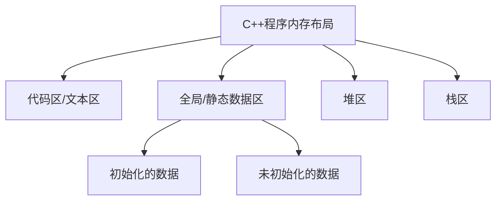

# C++ 内存模型

## 介绍

C++内存模型是理解C++程序如何与计算机内存交互的基础框架。对于任何想要编写高效、无内存泄漏代码的C++程序员来说，理解这一模型至关重要。内存模型不仅定义了程序中变量的存储方式，还规定了多线程环境下内存访问的规则。

在本文中，我们将从基础开始，探索C++内存模型的核心概念，并通过实例深入了解其工作原理。

## C++ 程序的内存布局

C++程序运行时的内存空间通常被分为以下几个区域：



### 代码区（Text Segment）

这里存放程序的机器代码。这个区域通常是只读的，防止程序意外修改自己的指令。

### 全局/静态数据区（Data Segment）

这个区域存储全局变量和静态变量。它又分为：
- 初始化的数据区：存放已初始化的全局变量和静态变量
- 未初始化的数据区（BSS段）：存放未初始化的全局变量和静态变量

### 堆区（Heap）

堆是用于动态内存分配的区域。当你使用`new`、`malloc()`等函数申请内存时，系统会从堆中分配内存。这个区域的内存需要程序员手动管理，即在不需要时释放内存，否则会导致内存泄漏。

### 栈区（Stack）

栈用于存储函数调用过程中的局部变量、函数参数和返回地址等。栈的特点是后进先出（LIFO），当函数执行完毕后，栈上的相关内存会自动释放。

## 变量的存储位置

我们通过一个简单的例子来说明不同类型变量的存储位置：

```cpp
#include <iostream>

// 全局变量：存储在全局数据区
int globalVar = 100;     // 初始化的全局变量
int uninitGlobalVar;     // 未初始化的全局变量

void function() {
    // 静态局部变量：存储在全局数据区，但作用域在函数内
    static int staticVar = 50;
    
    // 局部变量：存储在栈上
    int localVar = 20;
    
    // 动态分配的内存：存储在堆上
    int* heapVar = new int(30);
    
    std::cout << "全局变量: " << globalVar << std::endl;
    std::cout << "静态局部变量: " << staticVar << std::endl;
    std::cout << "局部变量: " << localVar << std::endl;
    std::cout << "堆上变量: " << *heapVar << std::endl;
    
    // 释放堆内存，避免内存泄漏
    delete heapVar;
}

int main() {
    function();
    return 0;
}
```

**输出**:
```
全局变量: 100
静态局部变量: 50
局部变量: 20
堆上变量: 30
```

## 内存分配与释放

在C++中，内存管理主要有两种方式：

### 静态内存管理
编译时就确定了内存的分配，包括全局变量、静态变量和函数内的局部变量。

### 动态内存管理
程序运行时根据需要分配内存。C++提供了以下方式进行动态内存管理：

#### C风格的动态内存管理

```cpp
// 分配内存
int* p = (int*)malloc(sizeof(int));
*p = 10;
  
// 释放内存
free(p);
```

#### C++ 风格的动态内存管理

```cpp
// 分配单个对象的内存
int* p1 = new int(10);
  
// 分配数组的内存
int* p2 = new int[5];
  
// 释放单个对象的内存
delete p1;
  
// 释放数组的内存
delete[] p2;
```

:::warning
在C++中，`new`和`delete`必须配对使用，`new[]`和`delete[]`必须配对使用，否则会导致未定义行为。
:::

## 内存泄漏示例

内存泄漏是指程序分配了内存但没有释放，导致这部分内存在程序运行期间无法再被使用。下面是一个内存泄漏的示例：

```cpp
void memoryLeakExample() {
    int* p = new int(10);
    // 没有相应的delete语句，p指向的内存永远不会被释放
}

int main() {
    for(int i = 0; i < 1000000; i++) {
        memoryLeakExample();  // 调用1000000次，泄漏1000000个int的内存
    }
    return 0;
}
```

:::caution
上述代码会导致严重的内存泄漏问题。在实际应用中，应该确保每次使用`new`分配的内存都有相应的`delete`来释放。
:::

## 智能指针

为了解决手动内存管理容易出错的问题，C++11引入了智能指针。智能指针是封装了原始指针的类，可以在适当的时候自动释放所管理的内存。

C++标准库提供了三种主要的智能指针：

### std::unique_ptr

`std::unique_ptr`是独占所有权的智能指针，这意味着同一时刻只有一个`unique_ptr`可以拥有某块内存的所有权。

```cpp
#include <iostream>
#include <memory>

int main() {
    // 创建unique_ptr
    std::unique_ptr<int> p1 = std::make_unique<int>(10);
    std::cout << "p1指向的值: " << *p1 << std::endl;
    
    // unique_ptr不能复制，但可以移动
    std::unique_ptr<int> p2 = std::move(p1);
    
    // p1现在为nullptr
    if (p1 == nullptr) {
        std::cout << "p1现在为nullptr" << std::endl;
    }
    
    std::cout << "p2指向的值: " << *p2 << std::endl;
    
    // 不需要手动释放内存，当p2离开作用域时，内存会自动释放
    return 0;
}
```

**输出**:
```
p1指向的值: 10
p1现在为nullptr
p2指向的值: 10
```

### std::shared_ptr

`std::shared_ptr`允许多个智能指针共享同一块内存的所有权。内存会在最后一个拥有它的智能指针销毁时释放。

```cpp
#include <iostream>
#include <memory>

int main() {
    // 创建shared_ptr
    std::shared_ptr<int> p1 = std::make_shared<int>(10);
    std::cout << "p1指向的值: " << *p1 << std::endl;
    
    // shared_ptr可以复制
    std::shared_ptr<int> p2 = p1;
    
    std::cout << "引用计数: " << p1.use_count() << std::endl;
    std::cout << "p2指向的值: " << *p2 << std::endl;
    
    // p1和p2都指向同一块内存，只有当两者都离开作用域时，内存才会被释放
    return 0;
}
```

**输出**:
```
p1指向的值: 10
引用计数: 2
p2指向的值: 10
```

### std::weak_ptr

`std::weak_ptr`是一种不控制对象生命周期的智能指针，它必须从`std::shared_ptr`创建。`weak_ptr`主要用于解决循环引用问题。

```cpp
#include <iostream>
#include <memory>

int main() {
    // 创建shared_ptr
    std::shared_ptr<int> p1 = std::make_shared<int>(10);
    
    // 从shared_ptr创建weak_ptr
    std::weak_ptr<int> wp = p1;
    
    std::cout << "引用计数: " << p1.use_count() << std::endl;
    
    // 通过weak_ptr获取shared_ptr
    if (auto sp = wp.lock()) {
        std::cout << "weak_ptr有效，值为: " << *sp << std::endl;
    } else {
        std::cout << "weak_ptr已过期" << std::endl;
    }
    
    // 释放shared_ptr
    p1.reset();
    
    // 再次检查weak_ptr
    if (auto sp = wp.lock()) {
        std::cout << "weak_ptr有效，值为: " << *sp << std::endl;
    } else {
        std::cout << "weak_ptr已过期" << std::endl;
    }
    
    return 0;
}
```

**输出**:
```
引用计数: 1
weak_ptr有效，值为: 10
weak_ptr已过期
```

## 实际应用场景

### 资源管理类（RAII模式）

资源获取即初始化（RAII）是C++中常用的资源管理模式。它确保在对象构造时获取资源，在对象销毁时释放资源。

```cpp
#include <iostream>
#include <fstream>
#include <string>

class FileManager {
private:
    std::ofstream file;
    
public:
    FileManager(const std::string& filename) {
        file.open(filename);
        if (!file.is_open()) {
            throw std::runtime_error("无法打开文件");
        }
        std::cout << "文件已打开" << std::endl;
    }
    
    void write(const std::string& text) {
        file << text;
    }
    
    ~FileManager() {
        if (file.is_open()) {
            file.close();
            std::cout << "文件已关闭" << std::endl;
        }
    }
};

int main() {
    try {
        FileManager fm("example.txt");
        fm.write("Hello, RAII!");
        // 不需要手动关闭文件，当fm离开作用域时，文件会自动关闭
    } catch (const std::exception& e) {
        std::cerr << "发生错误: " << e.what() << std::endl;
    }
    
    return 0;
}
```

**输出**:
```
文件已打开
文件已关闭
```

### 内存池

在需要频繁分配和释放小块内存的场景中，使用内存池可以显著提高性能。内存池一次性分配一大块内存，然后在需要时分配小块内存，减少系统调用的开销。

```cpp
#include <iostream>
#include <vector>
#include <cstddef>

class SimpleMemoryPool {
private:
    std::vector<char*> chunks;
    size_t chunkSize;
    char* currentChunk;
    size_t remainingBytes;
    
public:
    SimpleMemoryPool(size_t initialChunkSize = 1024) 
        : chunkSize(initialChunkSize), currentChunk(nullptr), remainingBytes(0) {
        allocateNewChunk();
    }
    
    ~SimpleMemoryPool() {
        for (char* chunk : chunks) {
            delete[] chunk;
        }
    }
    
    void* allocate(size_t size) {
        if (size > chunkSize) {
            throw std::bad_alloc();  // 请求太大，无法满足
        }
        
        if (size > remainingBytes) {
            allocateNewChunk();
        }
        
        void* result = currentChunk;
        currentChunk += size;
        remainingBytes -= size;
        
        return result;
    }
    
private:
    void allocateNewChunk() {
        currentChunk = new char[chunkSize];
        chunks.push_back(currentChunk);
        remainingBytes = chunkSize;
    }
};

struct MyObject {
    int x, y, z;
    
    MyObject(int a, int b, int c) : x(a), y(b), z(c) {
        std::cout << "MyObject构造: " << x << ", " << y << ", " << z << std::endl;
    }
    
    ~MyObject() {
        std::cout << "MyObject析构: " << x << ", " << y << ", " << z << std::endl;
    }
};

int main() {
    SimpleMemoryPool pool;
    
    // 使用内存池分配内存并构造对象
    void* memory = pool.allocate(sizeof(MyObject));
    MyObject* obj = new(memory) MyObject(1, 2, 3);
    
    std::cout << "对象值: " << obj->x << ", " << obj->y << ", " << obj->z << std::endl;
    
    // 手动调用析构函数，但不释放内存（内存由池管理）
    obj->~MyObject();
    
    return 0;
}
```

**输出**:
```
MyObject构造: 1, 2, 3
对象值: 1, 2, 3
MyObject析构: 1, 2, 3
```

## C++ 11及以后的内存模型

从C++11开始，C++标准引入了多线程内存模型，定义了多线程环境下内存访问的规则。这部分内容较为高级，初学者可以在掌握基础内存管理后再深入学习。

主要概念包括：
- 原子操作（Atomic Operations）
- 内存序（Memory Ordering）
- 内存屏障（Memory Barriers）
- 数据竞争（Data Races）的避免

## 总结

C++内存模型是理解C++程序如何与计算机内存交互的基础。在本文中，我们学习了：

1. C++程序的内存布局（代码区、数据区、堆区和栈区）
2. 变量在内存中的存储位置
3. 动态内存分配与释放的方法
4. 内存泄漏问题及如何避免
5. 智能指针（unique_ptr、shared_ptr、weak_ptr）的使用
6. 实际应用场景中的内存管理技术

掌握好这些概念，能够帮助你编写更加高效、安全的C++程序。随着你对C++的理解不断深入，这些知识将会成为你编程实践中不可或缺的一部分。

## 练习

1. 编写一个程序，创建不同类型的变量（全局变量、静态变量、局部变量和动态分配的变量），并观察它们的地址范围。

2. 实现一个简单的智能指针类，支持自动释放内存。

3. 找出以下代码中的内存泄漏问题，并修复它：
```cpp
void function() {
    int* array = new int[100];
    for (int i = 0; i < 100; i++) {
        array[i] = i;
    }
    if (array[50] == 50) {
        return;  // 这里有问题
    }
    delete[] array;
}
```

4. 使用RAII模式实现一个互斥锁包装类，确保锁在构造时获取，在析构时释放。

## 附加资源

- [C++ Reference: Memory Management](https://en.cppreference.com/w/cpp/memory)
- [C++11内存模型](https://en.cppreference.com/w/cpp/language/memory_model)
- 《Effective Modern C++》by Scott Meyers，特别是关于智能指针的章节
- 《C++ Concurrency in Action》by Anthony Williams，深入讲解C++11内存模型与并发编程