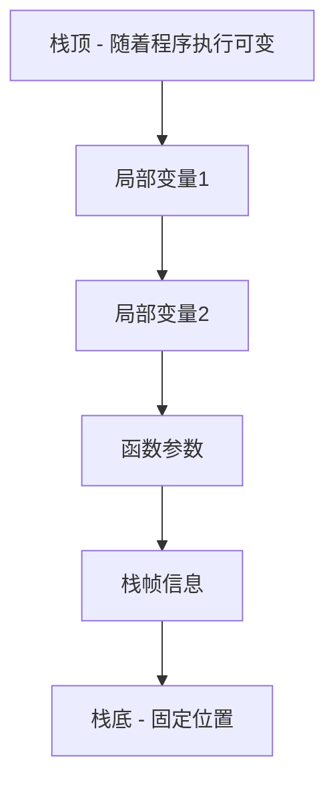
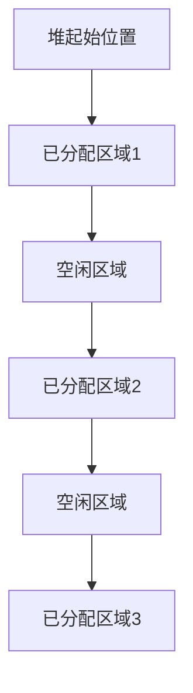

# C++ 栈与堆

在C++程序中，内存管理是一个核心概念，而栈（Stack）和堆（Heap）是两种主要的内存分配方式。理解它们的区别和适用场景对于编写高效、无内存泄漏的程序至关重要。

## 什么是栈和堆？

### 栈内存

栈是一种**后进先出**（LIFO - Last In First Out）的数据结构，在C++中，栈内存是由编译器自动分配和释放的内存区域。当函数被调用时，其局部变量会被存储在栈中，函数执行完成后，这些变量会自动被销毁。



### 堆内存

堆是一种动态分配的内存，需要程序员手动管理。在C++中，使用`new`关键字可以在堆上分配内存，使用`delete`关键字释放内存。与栈不同，堆上的对象生命周期不受限于作用域，需要明确地释放才能回收内存。



## 栈与堆的关键区别

| 特征 | 栈 | 堆 |
|------|------|------|
| 内存管理 | 自动 | 手动 |
| 分配速度 | 非常快 | 相对较慢 |
| 大小限制 | 有限（通常几MB） | 很大（受限于系统可用内存） |
| 碎片化 | 无 | 可能发生 |
| 生命周期 | 函数作用域结束时释放 | 直到显式释放（`delete`/`delete[]`） |
| 线程安全 | 每个线程有自己的栈 | 所有线程共享同一个堆 |

## 在栈上分配内存

在栈上分配内存是最简单的方式，只需要声明一个变量：

```cpp
void functionWithStack() {
    int number = 42;                // 在栈上分配4字节
    double values[10];              // 在栈上分配80字节(10*8)
    std::string name = "C++ Programming"; // 注意：string对象在栈上，但字符数据可能在堆上
}  // 函数结束时所有栈变量自动释放
```

栈上的内存分配有这些特点：
- 速度快：只需要移动栈顶指针
- 自动管理：不需要手动释放
- 大小有限：不适合大型数据结构

## 在堆上分配内存

在堆上分配内存需要使用`new`关键字，并且使用完后必须使用`delete`释放：

```cpp
void functionWithHeap() {
    int* pNumber = new int;        // 在堆上分配4字节
    *pNumber = 42;                 // 给堆上的内存赋值
    
    double* pValues = new double[10]; // 在堆上分配80字节(10*8)
    
    // 使用堆内存
    for(int i = 0; i < 10; i++) {
        pValues[i] = i * 1.5;
    }
    
    // 必须手动释放堆内存，否则会发生内存泄漏
    delete pNumber;      // 释放单个对象
    delete[] pValues;    // 释放数组
}
```

:::warning
在C++中，忘记释放堆内存是常见的错误源头，会导致内存泄漏。
:::

## 何时使用栈与堆

### 使用栈的场景：
1. 局部变量且生命周期短
2. 内存占用小
3. 需要自动内存管理
4. 对象大小在编译时已知

### 使用堆的场景：
1. 需要大内存空间
2. 对象需要在函数调用之外存在
3. 对象大小在运行时确定
4. 实现数据结构如链表、树等

## 实际案例

### 案例1：简单文本编辑器中的缓冲区管理

```cpp
class TextEditor {
private:
    char smallBuffer[100];         // 栈上的小缓冲区，适合小文件
    char* largeBuffer;             // 指向堆上的大缓冲区，适合大文件
    bool usingLargeBuffer;

public:
    TextEditor() : largeBuffer(nullptr), usingLargeBuffer(false) {}
    
    void loadFile(const char* filename) {
        // 假设我们有个函数来获取文件大小
        size_t fileSize = getFileSize(filename);
        
        if (fileSize <= 100) {
            // 小文件: 使用栈上的缓冲区
            loadFileToBuffer(filename, smallBuffer, fileSize);
            usingLargeBuffer = false;
        } else {
            // 大文件: 使用堆上的缓冲区
            largeBuffer = new char[fileSize];
            loadFileToBuffer(filename, largeBuffer, fileSize);
            usingLargeBuffer = true;
        }
    }
    
    ~TextEditor() {
        // 只需要清理堆上的内存
        if (usingLargeBuffer && largeBuffer != nullptr) {
            delete[] largeBuffer;
        }
    }
    
    // 为简化，省略其他函数
};
```

### 案例2：管理动态数量的用户记录

```cpp
struct UserRecord {
    int id;
    std::string name;
    std::string email;
};

class UserManager {
private:
    UserRecord* records;
    size_t count;
    size_t capacity;

public:
    UserManager(size_t initialCapacity = 10) : count(0), capacity(initialCapacity) {
        // 在堆上分配动态数组
        records = new UserRecord[capacity];
    }
    
    void addUser(int id, const std::string& name, const std::string& email) {
        // 检查是否需要扩容
        if (count >= capacity) {
            // 创建更大的数组
            size_t newCapacity = capacity * 2;
            UserRecord* newRecords = new UserRecord[newCapacity];
            
            // 复制现有记录
            for (size_t i = 0; i < count; i++) {
                newRecords[i] = records[i];
            }
            
            // 释放旧数组并使用新数组
            delete[] records;
            records = newRecords;
            capacity = newCapacity;
        }
        
        // 添加新用户
        records[count].id = id;
        records[count].name = name;
        records[count].email = email;
        count++;
    }
    
    ~UserManager() {
        // 释放堆内存
        delete[] records;
    }
};
```

## 使用现代C++管理内存

现代C++提供了多种工具来帮助自动管理堆内存，避免内存泄漏：

### 智能指针

```cpp
#include <memory>

void modernCppExample() {
    // 使用unique_ptr自动管理堆内存
    std::unique_ptr<int> pNumber = std::make_unique<int>(42);
    
    // 使用shared_ptr共享所有权
    std::shared_ptr<double[]> pValues = std::make_shared<double[]>(10);
    
    for(int i = 0; i < 10; i++) {
        pValues[i] = i * 1.5;
    }
    
    // 不需要delete，离开作用域时会自动释放内存
}
```

:::tip
在现代C++中，推荐使用智能指针而非裸指针来管理堆内存。
:::

### 容器

STL容器自动管理其内存：

```cpp
#include <vector>
#include <string>

void stlExample() {
    // vector自动管理内存
    std::vector<int> numbers;
    
    for(int i = 0; i < 1000; i++) {
        numbers.push_back(i);
        // vector自动处理扩容，不需要手动管理内存
    }
    
    // 离开作用域时，vector自动释放所有内存
}
```

## 内存问题及调试

使用堆内存时可能遇到的问题：

1. **内存泄漏**：忘记释放不再使用的内存
2. **悬空指针**：使用已释放的内存
3. **双重释放**：尝试多次释放同一块内存
4. **缓冲区溢出**：写入超出分配空间的内存

调试这些问题的工具：
- **Valgrind**：检测内存泄漏和其他内存错误
- **AddressSanitizer**：检测内存错误
- **Visual Studio调试器**：内存管理工具

## 总结

- **栈内存**是自动管理的，适合短生命周期、小体积的变量
- **堆内存**需要手动管理，适合大型数据结构和需要长生命周期的对象
- 现代C++提供了智能指针和容器来简化堆内存管理
- 正确选择栈或堆可以显著影响程序的性能和稳定性

在实际开发中，通常遵循这些原则：
1. 首选栈内存（如果可行）
2. 使用智能指针管理堆内存
3. 使用STL容器而非手动分配数组
4. 遵循RAII原则（资源获取即初始化）

## 练习

1. 编写一个函数，比较在栈上和堆上创建大型数组的性能差异。
2. 实现一个简单的内存池，减少频繁的堆分配操作。
3. 将使用裸指针的代码重构为使用智能指针。
4. 找出并修复下面代码中的内存问题：

```cpp
void memoryBugExample() {
    int* array1 = new int[10];
    int* array2 = array1;
    delete[] array1;
    array2[0] = 5;  // 问题: 使用已释放的内存
    
    int* number = new int;
    // 这里缺少 delete number; 会导致内存泄漏
}
```

## 进一步阅读

- [C++ Core Guidelines: Memory Management](https://isocpp.github.io/CppCoreGuidelines/CppCoreGuidelines#S-resource)
- Scott Meyers的《Effective Modern C++》
- 了解更多关于C++内存模型的信息

祝你在C++内存管理的学习中取得进步！