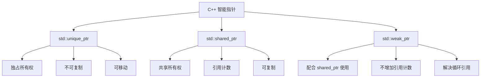

# C++ unique_ptr

## 什么是 unique_ptr？

`std::unique_ptr` 是 C++11 引入的一种智能指针，它实现了**独占式拥有**或**严格拥有**的概念，确保一个对象同一时间只能被一个 `unique_ptr` 所拥有。当 `unique_ptr` 被销毁时，它所管理的对象也会被自动销毁。这种机制有效地避免了内存泄漏问题。

:::note
`unique_ptr` 是 C++11 中引入的，它取代了旧版本中的 `auto_ptr`，后者在 C++17 中被弃用，在 C++20 中被移除。
:::

## 为什么需要 unique_ptr？

在 C++ 中，手动管理内存一直是一项挑战性的任务：

1. 必须记住何时使用 `new` 分配内存
2. 必须确保在适当的时机使用 `delete` 释放内存
3. 必须确保不会出现内存泄漏或双重释放

`unique_ptr` 通过自动化这些操作解决了以上问题。当 `unique_ptr` 离开其作用域时，它会自动释放所管理的资源，无需手动调用 `delete`。

## unique_ptr 的基本用法

### 创建 unique_ptr

创建 `unique_ptr` 通常有以下几种方式：

```cpp
#include <iostream>
#include <memory>

int main() {
    // 方法1：使用 make_unique (推荐，C++14 引入)
    std::unique_ptr<int> p1 = std::make_unique<int>(42);
    
    // 方法2：直接使用构造函数
    std::unique_ptr<int> p2(new int(42));
    
    // 方法3：创建空的 unique_ptr，后续赋值
    std::unique_ptr<int> p3;
    p3 = std::make_unique<int>(42); // C++14
    
    std::cout << *p1 << std::endl; // 输出: 42
    std::cout << *p2 << std::endl; // 输出: 42
    std::cout << *p3 << std::endl; // 输出: 42
    
    return 0;
}
```

输出：
```
42
42
42
```

:::tip 最佳实践
尽可能使用 `std::make_unique` 创建 `unique_ptr`，这样做有以下优势：
- 更简洁清晰
- 异常安全性更好
- 避免了在一行代码中出现两次类型名称
:::

### unique_ptr 的独占性

`unique_ptr` 实现了独占所有权语义，这意味着它不能被复制，只能被移动：

```cpp
#include <iostream>
#include <memory>

int main() {
    std::unique_ptr<int> p1 = std::make_unique<int>(10);
    
    // 错误！unique_ptr 不能被复制
    // std::unique_ptr<int> p2 = p1;
    
    // 正确：通过移动转移所有权
    std::unique_ptr<int> p2 = std::move(p1);
    
    // 此时 p1 不再拥有资源（变为空指针）
    if (p1 == nullptr) {
        std::cout << "p1 is now nullptr" << std::endl;
    }
    
    std::cout << "p2 value: " << *p2 << std::endl;
    
    return 0;
}
```

输出：
```
p1 is now nullptr
p2 value: 10
```

## unique_ptr 的常用操作

### 访问管理的对象

可以使用解引用操作符 `*` 或箭头操作符 `->` 来访问 `unique_ptr` 管理的对象：

```cpp
#include <iostream>
#include <memory>
#include <string>

class Person {
public:
    Person(std::string name) : name_(name) {}
    void sayHello() const {
        std::cout << "Hello, I'm " << name_ << std::endl;
    }
private:
    std::string name_;
};

int main() {
    // 创建指向 Person 对象的 unique_ptr
    std::unique_ptr<Person> person = std::make_unique<Person>("Alice");
    
    // 使用箭头操作符访问成员函数
    person->sayHello();
    
    // 创建指向整数的 unique_ptr
    std::unique_ptr<int> number = std::make_unique<int>(42);
    
    // 使用解引用操作符访问值
    std::cout << "Value: " << *number << std::endl;
    
    // 修改值
    *number = 100;
    std::cout << "Updated value: " << *number << std::endl;
    
    return 0;
}
```

输出：
```
Hello, I'm Alice
Value: 42
Updated value: 100
```

### 释放资源控制权

`unique_ptr` 提供了 `release()` 和 `reset()` 方法来控制资源：

```cpp
#include <iostream>
#include <memory>

int main() {
    std::unique_ptr<int> p1 = std::make_unique<int>(42);
    
    // release() 释放所有权，返回原始指针，但不删除对象
    int* raw_ptr = p1.release();
    
    std::cout << "Raw pointer value: " << *raw_ptr << std::endl;
    std::cout << "Is p1 empty? " << (p1 == nullptr ? "Yes" : "No") << std::endl;
    
    // 必须手动删除 release() 返回的指针，否则会造成内存泄漏
    delete raw_ptr;
    
    // 创建新的 unique_ptr
    std::unique_ptr<int> p2 = std::make_unique<int>(100);
    
    // reset() 删除当前管理的对象，可选择接管新对象
    p2.reset(new int(200));
    std::cout << "p2 after reset: " << *p2 << std::endl;
    
    // reset() 不带参数则只删除当前对象，使指针为空
    p2.reset();
    std::cout << "Is p2 empty after reset()? " << (p2 == nullptr ? "Yes" : "No") << std::endl;
    
    return 0;
}
```

输出：
```
Raw pointer value: 42
Is p1 empty? Yes
p2 after reset: 200
Is p2 empty after reset()? Yes
```

:::caution
调用 `release()` 后，`unique_ptr` 不再管理该资源，需要手动删除返回的原始指针，否则会造成内存泄漏。
:::

## 自定义删除器

默认情况下，`unique_ptr` 使用 `delete` 或 `delete[]` 操作符来释放资源。但有时我们需要自定义删除操作，例如关闭文件、释放网络连接等。

```cpp
#include <iostream>
#include <memory>
#include <cstdio>

int main() {
    // 自定义删除器：关闭文件
    auto file_deleter = [](FILE* file) {
        std::cout << "Closing file..." << std::endl;
        fclose(file);
    };
    
    // 创建管理文件的 unique_ptr
    {
        std::unique_ptr<FILE, decltype(file_deleter)> file(fopen("example.txt", "w"), file_deleter);
        
        if (file) {
            fputs("Hello, world!", file.get());
            std::cout << "File written successfully." << std::endl;
        }
        // 当离开作用域时，file_deleter 会被调用
    }
    
    // 使用 lambda 表达式作为内联删除器
    {
        std::unique_ptr<int, std::function<void(int*)>> ptr(new int(42), 
            [](int* p) {
                std::cout << "Custom deleting " << *p << std::endl;
                delete p;
            }
        );
        
        std::cout << "Using custom-deleted pointer: " << *ptr << std::endl;
        // 作用域结束时，自定义删除器被调用
    }
    
    return 0;
}
```

输出：
```
File written successfully.
Closing file...
Using custom-deleted pointer: 42
Custom deleting 42
```

## unique_ptr 与数组

`unique_ptr` 可以管理单个对象，也可以管理数组：

```cpp
#include <iostream>
#include <memory>

int main() {
    // 管理单个对象
    std::unique_ptr<int> single = std::make_unique<int>(10);
    
    // 管理数组 (C++14)
    std::unique_ptr<int[]> array = std::make_unique<int[]>(5);
    
    // 初始化数组
    for (int i = 0; i < 5; i++) {
        array[i] = i * 10;
    }
    
    // 访问数组元素
    std::cout << "Array elements: ";
    for (int i = 0; i < 5; i++) {
        std::cout << array[i] << " ";
    }
    std::cout << std::endl;
    
    // 不需要显式调用 delete[]，unique_ptr 会自动处理
    
    return 0;
}
```

输出：
```
Array elements: 0 10 20 30 40
```

:::note
对于数组类型的 `unique_ptr`，必须使用 `unique_ptr<T[]>` 形式，这样 `unique_ptr` 会在析构时正确调用 `delete[]` 而非 `delete`。
:::

## 实际应用场景

### 工厂函数

`unique_ptr` 非常适合作为工厂函数的返回类型，因为它可以安全地转移所有权：

```cpp
#include <iostream>
#include <memory>
#include <string>

class Product {
public:
    virtual ~Product() {}
    virtual void use() const = 0;
};

class ConcreteProductA : public Product {
public:
    void use() const override {
        std::cout << "Using ConcreteProductA" << std::endl;
    }
};

class ConcreteProductB : public Product {
public:
    void use() const override {
        std::cout << "Using ConcreteProductB" << std::endl;
    }
};

// 工厂函数
std::unique_ptr<Product> createProduct(const std::string& type) {
    if (type == "A") {
        return std::make_unique<ConcreteProductA>();
    } else if (type == "B") {
        return std::make_unique<ConcreteProductB>();
    }
    return nullptr;
}

int main() {
    auto productA = createProduct("A");
    auto productB = createProduct("B");
    
    if (productA) {
        productA->use();
    }
    
    if (productB) {
        productB->use();
    }
    
    return 0;
}
```

输出：
```
Using ConcreteProductA
Using ConcreteProductB
```

### 资源管理

`unique_ptr` 可用于管理需要在不再使用时自动关闭或释放的资源：

```cpp
#include <iostream>
#include <memory>
#include <fstream>
#include <string>

// 封装文件资源的类
class FileResource {
public:
    FileResource(const std::string& filename) {
        file_.open(filename);
        if (!file_.is_open()) {
            throw std::runtime_error("Failed to open file: " + filename);
        }
        std::cout << "File opened successfully" << std::endl;
    }
    
    ~FileResource() {
        if (file_.is_open()) {
            file_.close();
            std::cout << "File closed automatically" << std::endl;
        }
    }
    
    void write(const std::string& content) {
        file_ << content;
    }
    
private:
    std::ofstream file_;
};

void processFile() {
    try {
        // 自动管理 FileResource 的生命周期
        std::unique_ptr<FileResource> resource = std::make_unique<FileResource>("data.txt");
        
        resource->write("Hello, RAII world!");
        
        // 即使这里出现异常，文件也会被正确关闭
        // throw std::runtime_error("Simulated error");
        
    } catch (const std::exception& e) {
        std::cerr << "Error: " << e.what() << std::endl;
    }
    // 离开作用域时，resource 会自动销毁，文件会自动关闭
}

int main() {
    processFile();
    std::cout << "Processing complete" << std::endl;
    return 0;
}
```

输出：
```
File opened successfully
File closed automatically
Processing complete
```

## 性能考虑

`unique_ptr` 的设计目标是零开销抽象，这意味着它的性能几乎等同于手动内存管理。与原始指针相比：

1. 大小相同（通常是一个指针的大小）
2. 解引用操作性能相同
3. 移动操作非常高效

唯一的开销是在析构时自动调用删除器，但这通常是可以忽略不计的。

## unique_ptr vs. shared_ptr vs. weak_ptr

C++11 引入了三种主要的智能指针，各有不同的用途：



- **unique_ptr**: 独占所有权，较轻量
- **shared_ptr**: 共享所有权，使用引用计数
- **weak_ptr**: 配合 shared_ptr 使用，不增加引用计数

选择原则：
- 默认使用 `unique_ptr`
- 只有当多个对象需要共享所有权时才使用 `shared_ptr`
- 在需要打破循环引用时使用 `weak_ptr`

## 最佳实践

1. **优先使用 make_unique**: 尽可能使用 `std::make_unique` 而不是直接 `new`

   ```cpp
   // 不推荐
   std::unique_ptr<MyClass> p(new MyClass());
   
   // 推荐
   auto p = std::make_unique<MyClass>();
   ```

2. **避免使用 get() 转换为原始指针**: 除非确实需要与接受原始指针的 API 交互

   ```cpp
   void legacy_function(Resource* r);
   
   auto resource = std::make_unique<Resource>();
   // 仅在必要时使用 get()
   legacy_function(resource.get());
   ```

3. **使用移动语义明确表示所有权转移**

   ```cpp
   std::unique_ptr<Resource> createResource();
   
   void processResource(std::unique_ptr<Resource> res);
   
   auto res = createResource();
   processResource(std::move(res)); // 明确表示所有权转移
   // 此处 res 已为 nullptr
   ```

4. **避免超出必要作用域的引用**: 不要保留指向 `unique_ptr` 管理对象的引用或指针，因为对象可能在 `unique_ptr` 销毁时被删除

## 总结

`std::unique_ptr` 是现代 C++ 中最常用的智能指针，它提供了安全高效的内存管理方式，帮助程序员避免内存泄漏、野指针和双重释放等常见内存问题。它的独占所有权模型使得资源管理的责任更加明确，提高了代码的可读性和可维护性。

关键特点回顾：
- 实现独占所有权语义
- 自动管理资源生命周期
- 支持自定义删除器
- 可以管理单个对象或数组
- 零开销抽象，性能等同于原始指针
- 不允许复制，只能移动

## 练习

1. 创建一个简单的程序，使用 `unique_ptr` 管理动态分配的整数数组，并实现数组元素的求和功能。
2. 实现一个简单的资源管理类，使用 `unique_ptr` 和自定义删除器管理某种资源（如文件、网络连接等）。
3. 设计一个简单的树结构，每个节点使用 `unique_ptr` 管理其子节点。
4. 比较使用 `unique_ptr` 和手动内存管理的代码，分析两者在异常安全性方面的差异。

## 扩展阅读

- [C++ 参考文档: std::unique_ptr](https://en.cppreference.com/w/cpp/memory/unique_ptr)
- 《Effective Modern C++》 by Scott Meyers - Item 18-21
- 《C++ Core Guidelines》- [R.20: Use unique_ptr or shared_ptr to represent ownership](https://isocpp.github.io/CppCoreGuidelines/CppCoreGuidelines#r20-use-uniqueptr-or-sharedptr-to-represent-ownership)