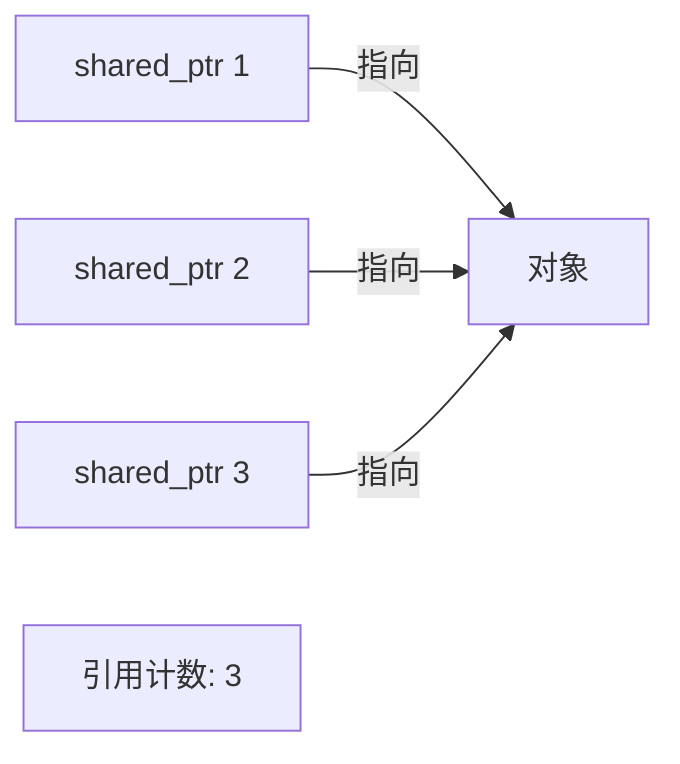

# C++ shared_ptr

## 引言

在 C++ 编程中，内存管理一直是开发者面临的最大挑战之一。不恰当的内存管理会导致内存泄漏、悬空指针以及各种难以调试的问题。为了解决这些问题，C++11 引入了智能指针，其中 `std::shared_ptr` 是最常用的智能指针之一。

`std::shared_ptr` 是一种引用计数型智能指针，允许多个指针指向同一个对象。当最后一个拥有该对象的 `shared_ptr` 被销毁时，这个对象也会被自动删除。这种机制大大简化了内存管理，减少了内存泄漏的风险。

## shared_ptr 基本概念

### 引用计数机制

`shared_ptr` 最核心的特性是其引用计数机制。它的工作原理如下：



- 每当有一个新的 `shared_ptr` 指向对象时，引用计数加 1
- 当一个 `shared_ptr` 离开作用域或被重新赋值时，引用计数减 1
- 当引用计数变为 0 时，对象被自动删除

### 头文件引用

要使用 `shared_ptr`，你需要包含 `<memory>` 头文件：

```cpp
#include <memory>
```

## 创建和使用 shared_ptr

### 基本用法

以下是创建和使用 `shared_ptr` 的几种方法：

```cpp
#include <iostream>
#include <memory>

int main() {
    // 方法1：使用 make_shared 函数（推荐）
    std::shared_ptr<int> ptr1 = std::make_shared<int>(42);
    
    // 方法2：使用构造函数
    std::shared_ptr<int> ptr2(new int(42));
    
    // 方法3：从另一个 shared_ptr 赋值
    std::shared_ptr<int> ptr3 = ptr1;
    
    // 使用 shared_ptr
    std::cout << "ptr1 value: " << *ptr1 << std::endl;
    std::cout << "ptr2 value: " << *ptr2 << std::endl;
    std::cout << "ptr3 value: " << *ptr3 << std::endl;
    
    // 修改值，所有指向同一对象的指针都会看到修改
    *ptr1 = 100;
    std::cout << "After modification:" << std::endl;
    std::cout << "ptr1 value: " << *ptr1 << std::endl;
    std::cout << "ptr3 value: " << *ptr3 << std::endl;
    
    // 查看引用计数
    std::cout << "ptr1 reference count: " << ptr1.use_count() << std::endl;
    std::cout << "ptr2 reference count: " << ptr2.use_count() << std::endl;
    
    return 0;
}
```

输出：
```
ptr1 value: 42
ptr2 value: 42
ptr3 value: 42
After modification:
ptr1 value: 100
ptr3 value: 100
ptr1 reference count: 2
ptr2 reference count: 1
```

:::tip 最佳实践
优先使用 `std::make_shared` 而不是直接使用构造函数，因为它在性能上更优（只需一次内存分配同时创建控制块和对象）。
:::

### 自定义删除器

有时你可能需要在对象被销毁时执行一些特殊操作。这时可以使用自定义删除器：

```cpp
#include <iostream>
#include <memory>

void customDeleter(int* p) {
    std::cout << "Custom deleter called for " << *p << std::endl;
    delete p;
}

int main() {
    // 使用自定义删除器
    std::shared_ptr<int> ptr(new int(42), customDeleter);
    
    // ptr 离开作用域时，将调用 customDeleter
    return 0;
}
```

输出：
```
Custom deleter called for 42
```

## shared_ptr 进阶用法

### 管理数组

从 C++17 开始，`shared_ptr` 可以更方便地管理数组，但在此之前，需要提供自定义删除器：

```cpp
#include <iostream>
#include <memory>

int main() {
    // C++17 之前的数组管理
    std::shared_ptr<int> oldArrayPtr(new int[5], [](int* p) { delete[] p; });
    
    // C++17 及之后的数组管理
    std::shared_ptr<int[]> newArrayPtr(new int[5]);
    
    // 使用数组
    for (int i = 0; i < 5; i++) {
        newArrayPtr[i] = i * 10;
    }
    
    for (int i = 0; i < 5; i++) {
        std::cout << "newArrayPtr[" << i << "] = " << newArrayPtr[i] << std::endl;
    }
    
    return 0;
}
```

输出：
```
newArrayPtr[0] = 0
newArrayPtr[1] = 10
newArrayPtr[2] = 20
newArrayPtr[3] = 30
newArrayPtr[4] = 40
```

### 共享对象的成员函数和变量

使用 `shared_ptr` 可以方便地调用被管理对象的成员函数和访问其成员变量：

```cpp
#include <iostream>
#include <memory>
#include <string>

class Person {
public:
    Person(const std::string& name, int age) : name_(name), age_(age) {
        std::cout << "Person " << name_ << " created" << std::endl;
    }
    
    ~Person() {
        std::cout << "Person " << name_ << " destroyed" << std::endl;
    }
    
    void introduce() const {
        std::cout << "Hi, I'm " << name_ << ", " << age_ << " years old." << std::endl;
    }
    
    void celebrateBirthday() {
        age_++;
        std::cout << name_ << " is now " << age_ << " years old." << std::endl;
    }
    
private:
    std::string name_;
    int age_;
};

int main() {
    // 创建 Person 对象的 shared_ptr
    auto person = std::make_shared<Person>("Alice", 25);
    
    // 使用 -> 访问成员函数
    person->introduce();
    person->celebrateBirthday();
    person->introduce();
    
    std::cout << "End of main function" << std::endl;
    return 0;
}
```

输出：
```
Person Alice created
Hi, I'm Alice, 25 years old.
Alice is now 26 years old.
Hi, I'm Alice, 26 years old.
End of main function
Person Alice destroyed
```

## shared_ptr 常见陷阱和解决方案

### 循环引用问题

`shared_ptr` 最常见的问题之一是循环引用，这会导致内存泄漏：

```cpp
#include <iostream>
#include <memory>

class B; // 前向声明

class A {
public:
    A() { std::cout << "A constructed" << std::endl; }
    ~A() { std::cout << "A destructed" << std::endl; }
    std::shared_ptr<B> b_ptr;
};

class B {
public:
    B() { std::cout << "B constructed" << std::endl; }
    ~B() { std::cout << "B destructed" << std::endl; }
    std::shared_ptr<A> a_ptr;
};

int main() {
    {
        auto a = std::make_shared<A>();
        auto b = std::make_shared<B>();
        
        // 创建循环引用
        a->b_ptr = b;
        b->a_ptr = a;
        
        std::cout << "a use count: " << a.use_count() << std::endl;
        std::cout << "b use count: " << b.use_count() << std::endl;
    }
    
    std::cout << "End of main" << std::endl;
    return 0;
}
```

输出：
```
A constructed
B constructed
a use count: 2
b use count: 2
End of main
```

注意没有调用析构函数，这表明对象没有被释放，因为循环引用导致引用计数永远不会变为0。

### 解决循环引用：使用 weak_ptr

解决循环引用的方法是使用 `std::weak_ptr`，它不会增加引用计数：

```cpp
#include <iostream>
#include <memory>

class B;

class A {
public:
    A() { std::cout << "A constructed" << std::endl; }
    ~A() { std::cout << "A destructed" << std::endl; }
    std::shared_ptr<B> b_ptr;
};

class B {
public:
    B() { std::cout << "B constructed" << std::endl; }
    ~B() { std::cout << "B destructed" << std::endl; }
    std::weak_ptr<A> a_ptr; // 使用 weak_ptr 替代 shared_ptr
};

int main() {
    {
        auto a = std::make_shared<A>();
        auto b = std::make_shared<B>();
        
        a->b_ptr = b;
        b->a_ptr = a;
        
        std::cout << "a use count: " << a.use_count() << std::endl;
        std::cout << "b use count: " << b.use_count() << std::endl;
    }
    
    std::cout << "End of main" << std::endl;
    return 0;
}
```

输出：
```
A constructed
B constructed
a use count: 1
b use count: 2
End of main
B destructed
A destructed
```

这次对象被正确地销毁了，因为 `weak_ptr` 不会增加引用计数。

## 实际应用场景

### 场景1：资源管理

`shared_ptr` 非常适合管理需要在多个位置共享的资源，如数据库连接或配置对象：

```cpp
#include <iostream>
#include <memory>
#include <string>

class DatabaseConnection {
public:
    DatabaseConnection(const std::string& connectionString) 
        : connectionString_(connectionString) {
        std::cout << "Database connection established: " << connectionString_ << std::endl;
    }
    
    ~DatabaseConnection() {
        std::cout << "Database connection closed: " << connectionString_ << std::endl;
    }
    
    void executeQuery(const std::string& query) {
        std::cout << "Executing query on " << connectionString_ << ": " << query << std::endl;
    }
    
private:
    std::string connectionString_;
};

class UserRepository {
public:
    UserRepository(std::shared_ptr<DatabaseConnection> dbConn) : dbConn_(dbConn) {}
    
    void getUserById(int id) {
        dbConn_->executeQuery("SELECT * FROM users WHERE id = " + std::to_string(id));
    }
    
private:
    std::shared_ptr<DatabaseConnection> dbConn_;
};

class ProductRepository {
public:
    ProductRepository(std::shared_ptr<DatabaseConnection> dbConn) : dbConn_(dbConn) {}
    
    void getProductById(int id) {
        dbConn_->executeQuery("SELECT * FROM products WHERE id = " + std::to_string(id));
    }
    
private:
    std::shared_ptr<DatabaseConnection> dbConn_;
};

int main() {
    // 创建一个数据库连接
    auto dbConnection = std::make_shared<DatabaseConnection>("mysql://localhost:3306/mydb");
    
    // 不同的仓库共享同一个连接
    UserRepository userRepo(dbConnection);
    ProductRepository productRepo(dbConnection);
    
    userRepo.getUserById(1);
    productRepo.getProductById(42);
    
    std::cout << "Connection reference count: " << dbConnection.use_count() << std::endl;
    
    return 0; // 连接会在此处自动关闭
}
```

输出：
```
Database connection established: mysql://localhost:3306/mydb
Executing query on mysql://localhost:3306/mydb: SELECT * FROM users WHERE id = 1
Executing query on mysql://localhost:3306/mydb: SELECT * FROM products WHERE id = 42
Connection reference count: 3
Database connection closed: mysql://localhost:3306/mydb
```

### 场景2：实现观察者模式

`shared_ptr` 和 `weak_ptr` 的组合非常适合实现观察者模式：

```cpp
#include <iostream>
#include <memory>
#include <string>
#include <vector>
#include <algorithm>

class Observer;

class Subject {
public:
    void addObserver(std::shared_ptr<Observer> observer);
    void removeObserver(std::weak_ptr<Observer> observer);
    void notifyObservers(const std::string& message);
private:
    std::vector<std::weak_ptr<Observer>> observers_;
};

class Observer {
public:
    virtual void update(const std::string& message) = 0;
    virtual ~Observer() = default;
};

class ConcreteObserver : public Observer {
public:
    ConcreteObserver(const std::string& name) : name_(name) {}
    
    void update(const std::string& message) override {
        std::cout << "Observer " << name_ << " received: " << message << std::endl;
    }
    
private:
    std::string name_;
};

void Subject::addObserver(std::shared_ptr<Observer> observer) {
    observers_.push_back(observer);
}

void Subject::removeObserver(std::weak_ptr<Observer> observerToRemove) {
    observers_.erase(std::remove_if(observers_.begin(), observers_.end(), 
        [observerToRemove](const std::weak_ptr<Observer>& observer) {
            if (observer.expired()) return true;
            return observer.lock() == observerToRemove.lock();
        }), observers_.end());
}

void Subject::notifyObservers(const std::string& message) {
    for (auto it = observers_.begin(); it != observers_.end();) {
        if (auto observer = it->lock()) {
            observer->update(message);
            ++it;
        } else {
            // 移除已经失效的观察者
            it = observers_.erase(it);
        }
    }
}

int main() {
    Subject subject;
    
    // 创建观察者
    auto observer1 = std::make_shared<ConcreteObserver>("Observer 1");
    auto observer2 = std::make_shared<ConcreteObserver>("Observer 2");
    
    // 添加观察者
    subject.addObserver(observer1);
    subject.addObserver(observer2);
    
    // 通知所有观察者
    subject.notifyObservers("Hello Observers!");
    
    // 移除一个观察者
    subject.removeObserver(observer1);
    
    // 再次通知
    subject.notifyObservers("Observer 1 has been removed!");
    
    return 0;
}
```

输出：
```
Observer Observer 1 received: Hello Observers!
Observer Observer 2 received: Hello Observers!
Observer Observer 2 received: Observer 1 has been removed!
```

## 性能考虑

使用 `shared_ptr` 会带来一些性能开销，主要包括：

1. **引用计数操作**：每次复制或销毁 `shared_ptr` 时都需要原子操作来修改引用计数
2. **内存开销**：每个 `shared_ptr` 对象都需要额外的内存来存储控制块
3. **缓存不友好**：控制块和实际对象可能分布在内存不同位置，影响缓存性能

对于性能敏感的应用，需要权衡使用 `shared_ptr` 带来的便利与性能开销。

:::tip 最佳实践
尽可能使用 `std::make_shared` 创建对象，避免不必要的 `shared_ptr` 拷贝，并考虑在函数参数中使用 `const std::shared_ptr<T>&` 而不是值传递。
:::

## 总结

`std::shared_ptr` 是 C++11 引入的强大的智能指针，通过引用计数机制解决了手动内存管理的许多问题。它具有以下关键特点：

- 自动管理对象的生命周期，避免内存泄漏
- 允许多个指针共享同一资源
- 提供线程安全的引用计数
- 可以使用自定义删除器
- 与 `std::weak_ptr` 结合使用可以解决循环引用问题

正确使用 `shared_ptr` 可以显著提高代码的安全性和可维护性，但也需要注意避免循环引用和考虑性能问题。

## 练习

1. 创建一个 `shared_ptr` 管理的整数，将其值设为 100，然后创建另一个 `shared_ptr` 指向同一个整数，并打印引用计数

2. 使用 `shared_ptr` 管理一个动态分配的字符数组，并实现自定义删除器确保正确释放内存

3. 实现一个简单的缓存系统，使用 `shared_ptr` 存储缓存项，并使用 `weak_ptr` 避免循环引用

4. 创建一个类层次结构（如动物 -> 哺乳动物 -> 猫），并使用 `shared_ptr` 和 `dynamic_pointer_cast` 进行类型转换

## 延伸阅读

- C++ 标准库中的其他智能指针：`unique_ptr`, `weak_ptr`
- 了解 `enable_shared_from_this` 的使用场景
- 探索 C++17 中针对智能指针的新特性
- 研究 `shared_ptr` 的线程安全性和性能优化技术

通过掌握 `shared_ptr`，你已经向成为 C++ 内存管理专家迈出了重要的一步！