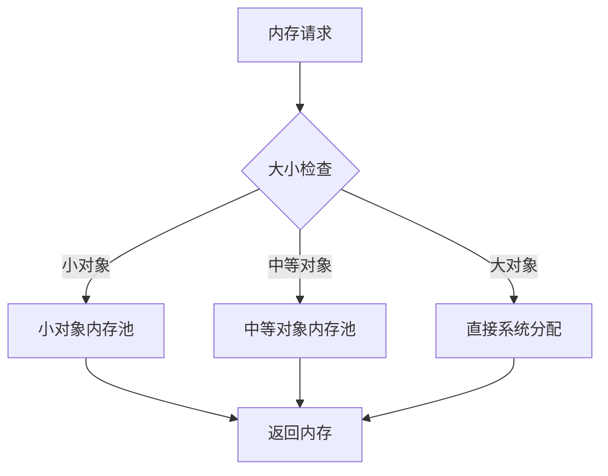

# C++ 自定义内存管理

## 什么是自定义内存管理？

在C++中，内存管理是指程序如何申请、使用和释放内存的过程。默认情况下，我们使用`new`和`delete`操作符来分配和释放堆内存。但在某些情况下，系统提供的标准内存管理可能无法满足特定需求，比如：

- 需要更高的内存分配/释放效率
- 需要对内存布局进行特殊控制
- 需要跟踪内存使用情况
- 需要实现特定的内存池或缓存机制

这时，我们就需要实现自定义内存管理。

:::note
自定义内存管理是高级C++编程的重要部分，虽然初学者可能不会立即用到，但理解其原理对深入学习C++非常有帮助。
:::

## C++ 内存管理基础

在深入自定义内存管理之前，让我们回顾一下C++中内存分配的基本方式：

1. **栈内存**：函数内的局部变量使用栈内存，自动分配和释放
2. **堆内存**：使用`new`/`delete`或`malloc`/`free`手动管理
3. **静态内存**：全局变量和静态变量在程序启动时分配，程序结束时释放

自定义内存管理主要关注的是堆内存的分配和释放过程。

## 重载全局new和delete操作符

最基本的自定义内存管理方式是重载全局的`new`和`delete`操作符：

```cpp
// 重载全局new操作符
void* operator new(size_t size) {
    std::cout << "调用自定义new, 分配 " << size << " 字节" << std::endl;
    // 调用标准库中的malloc分配内存
    void* ptr = malloc(size);
    if (!ptr) {
        throw std::bad_alloc();
    }
    return ptr;
}

// 重载全局delete操作符
void operator delete(void* ptr) noexcept {
    std::cout << "调用自定义delete" << std::endl;
    // 释放内存
    free(ptr);
}
```

使用示例：

```cpp
#include <iostream>

int main() {
    int* p = new int(42);
    std::cout << "值: " << *p << std::endl;
    delete p;
    return 0;
}
```

输出：
```
调用自定义new, 分配 4 字节
值: 42
调用自定义delete
```

:::caution
重载全局`new`和`delete`会影响整个程序中的所有内存分配，应谨慎使用！
:::

## 类特定的内存管理

除了全局重载，我们还可以为特定类重载`new`和`delete`操作符：

```cpp
class MyClass {
private:
    int data;

public:
    MyClass(int d) : data(d) {
        std::cout << "构造 MyClass: " << data << std::endl;
    }
    
    ~MyClass() {
        std::cout << "析构 MyClass: " << data << std::endl;
    }
    
    // 类特定的new操作符重载
    void* operator new(size_t size) {
        std::cout << "MyClass::new 分配 " << size << " 字节" << std::endl;
        void* ptr = malloc(size);
        if (!ptr) {
            throw std::bad_alloc();
        }
        return ptr;
    }
    
    // 类特定的delete操作符重载
    void operator delete(void* ptr) noexcept {
        std::cout << "MyClass::delete" << std::endl;
        free(ptr);
    }
};
```

使用示例：

```cpp
int main() {
    MyClass* obj = new MyClass(100);
    delete obj;
    
    // 普通整数分配不受影响
    int* p = new int(42);
    delete p;
    
    return 0;
}
```

输出：
```
MyClass::new 分配 4 字节
构造 MyClass: 100
析构 MyClass: 100
MyClass::delete
```

## 内存池实现

对于频繁创建和销毁小对象的程序，使用内存池可以显著提高性能。以下是一个简单的内存池实现：

```cpp
class MemoryPool {
private:
    struct Block {
        Block* next;
    };

    void* pool;             // 内存池首地址
    Block* freeList;        // 空闲块链表
    size_t blockSize;       // 每个块的大小
    size_t poolSize;        // 内存池总大小
    size_t blocksPerPool;   // 每个内存池的块数

public:
    MemoryPool(size_t blockSize, size_t blocksPerPool) 
        : blockSize(std::max(blockSize, sizeof(Block))),
          blocksPerPool(blocksPerPool),
          poolSize(this->blockSize * blocksPerPool),
          pool(nullptr),
          freeList(nullptr) {
        expandPool();
    }

    ~MemoryPool() {
        free(pool);
    }

    void* allocate() {
        if (freeList == nullptr) {
            expandPool();
        }
        
        Block* block = freeList;
        freeList = freeList->next;
        return block;
    }

    void deallocate(void* ptr) {
        if (ptr == nullptr) return;
        
        Block* block = static_cast<Block*>(ptr);
        block->next = freeList;
        freeList = block;
    }

private:
    void expandPool() {
        // 分配新的内存块
        pool = malloc(poolSize);
        if (!pool) throw std::bad_alloc();

        // 将新分配的内存划分成块并链接到空闲列表
        char* start = static_cast<char*>(pool);
        size_t i;
        
        for (i = 0; i < blocksPerPool - 1; ++i) {
            Block* current = reinterpret_cast<Block*>(start + i * blockSize);
            Block* next = reinterpret_cast<Block*>(start + (i + 1) * blockSize);
            current->next = next;
        }
        
        // 设置最后一个块
        Block* last = reinterpret_cast<Block*>(start + i * blockSize);
        last->next = nullptr;
        
        // 更新空闲列表指针
        freeList = reinterpret_cast<Block*>(pool);
    }
};
```

使用内存池来管理自定义类：

```cpp
class SmallObject {
private:
    int value;
    static MemoryPool memPool;  // 静态内存池实例

public:
    SmallObject(int v) : value(v) {}
    
    void* operator new(size_t size) {
        return memPool.allocate();
    }
    
    void operator delete(void* ptr) {
        memPool.deallocate(ptr);
    }
    
    int getValue() const { return value; }
};

// 初始化静态成员
MemoryPool SmallObject::memPool(sizeof(SmallObject), 100);  // 100个对象的内存池
```

使用示例：

```cpp
int main() {
    // 创建多个对象
    SmallObject* objects[10];
    
    for (int i = 0; i < 10; ++i) {
        objects[i] = new SmallObject(i);
        std::cout << "创建对象值: " << objects[i]->getValue() << std::endl;
    }
    
    // 删除对象
    for (int i = 0; i < 10; ++i) {
        delete objects[i];
    }
    
    return 0;
}
```

## 实际应用场景

### 1. 游戏开发

在游戏开发中，性能至关重要。自定义内存管理可以帮助：

- 减少内存碎片化
- 提高游戏对象的分配/释放效率
- 优化内存布局，提高缓存命中率

例如，某些游戏引擎会为不同大小的游戏对象创建不同的内存池，以减少内存分配的开销。

### 2. 嵌入式系统

在嵌入式系统中，内存资源通常非常有限：

- 使用内存池预分配固定大小的内存块
- 实现内存边界检查，避免内存越界
- 优化内存使用，减少碎片化

### 3. 高性能服务器

对于需要处理大量请求的服务器：

- 使用线程安全的内存池减少锁竞争
- 为不同大小的对象实现分层的内存分配策略
- 实现请求处理专用的内存分配器，提高吞吐量



## 内存泄漏检测

自定义内存管理还可以帮助检测内存泄漏。以下是一个简单的内存跟踪器：

```cpp
class MemoryTracker {
private:
    struct AllocationInfo {
        void* address;
        size_t size;
        const char* file;
        int line;
        AllocationInfo* next;
    };

    AllocationInfo* allocations;
    size_t totalAllocated;
    
public:
    MemoryTracker() : allocations(nullptr), totalAllocated(0) {}
    
    ~MemoryTracker() {
        reportLeaks();
    }
    
    void addAllocation(void* addr, size_t size, const char* file, int line) {
        AllocationInfo* info = new AllocationInfo;
        info->address = addr;
        info->size = size;
        info->file = file;
        info->line = line;
        info->next = allocations;
        allocations = info;
        
        totalAllocated += size;
    }
    
    void removeAllocation(void* addr) {
        AllocationInfo** curr = &allocations;
        while (*curr) {
            if ((*curr)->address == addr) {
                AllocationInfo* temp = *curr;
                *curr = temp->next;
                totalAllocated -= temp->size;
                delete temp;
                return;
            }
            curr = &((*curr)->next);
        }
    }
    
    void reportLeaks() {
        if (!allocations) {
            std::cout << "没有内存泄漏\n";
            return;
        }
        
        std::cout << "内存泄漏报告:\n";
        AllocationInfo* curr = allocations;
        while (curr) {
            std::cout << "地址: " << curr->address 
                      << " 大小: " << curr->size 
                      << " 文件: " << curr->file 
                      << " 行号: " << curr->line << "\n";
            curr = curr->next;
        }
        std::cout << "总泄漏: " << totalAllocated << " 字节\n";
    }
};

// 全局内存追踪器
MemoryTracker gMemTracker;

// 重定义new和delete以支持调试
#define DEBUG_NEW new(__FILE__, __LINE__)
#define new DEBUG_NEW

void* operator new(size_t size, const char* file, int line) {
    void* ptr = malloc(size);
    if (!ptr) throw std::bad_alloc();
    gMemTracker.addAllocation(ptr, size, file, line);
    return ptr;
}

void operator delete(void* ptr) noexcept {
    if (ptr) {
        gMemTracker.removeAllocation(ptr);
        free(ptr);
    }
}
```

使用示例：

```cpp
int main() {
    int* p1 = new int(10);
    // 忘记删除p1，将导致内存泄漏
    
    double* p2 = new double(3.14);
    delete p2;  // 正确释放
    
    return 0;  // 程序结束时会报告泄漏
}
```

输出示例：
```
内存泄漏报告:
地址: 0x55e882f5b2a0 大小: 4 文件: main.cpp 行号: 10
总泄漏: 4 字节
```

## 性能对比

让我们比较标准内存分配与自定义内存池的性能差异：

```cpp
#include <iostream>
#include <chrono>
#include <vector>

// 使用标准分配器
void standardAllocation(int iterations) {
    auto start = std::chrono::high_resolution_clock::now();
    
    for (int i = 0; i < iterations; ++i) {
        int* p = new int(i);
        delete p;
    }
    
    auto end = std::chrono::high_resolution_clock::now();
    std::chrono::duration<double, std::milli> elapsed = end - start;
    std::cout << "标准分配: " << elapsed.count() << " ms\n";
}

// 使用内存池
void poolAllocation(int iterations, MemoryPool& pool) {
    auto start = std::chrono::high_resolution_clock::now();
    
    for (int i = 0; i < iterations; ++i) {
        void* p = pool.allocate();
        pool.deallocate(p);
    }
    
    auto end = std::chrono::high_resolution_clock::now();
    std::chrono::duration<double, std::milli> elapsed = end - start;
    std::cout << "内存池分配: " << elapsed.count() << " ms\n";
}

int main() {
    const int ITERATIONS = 1000000;
    MemoryPool pool(sizeof(int), ITERATIONS);
    
    standardAllocation(ITERATIONS);
    poolAllocation(ITERATIONS, pool);
    
    return 0;
}
```

典型输出结果可能如下：
```
标准分配: 123.456 ms
内存池分配: 24.321 ms
```

这表明在频繁分配和释放小对象的场景下，内存池可能比标准内存分配器快5倍左右。

## 总结

自定义内存管理是C++中一个强大但也复杂的功能。它允许开发者根据特定需求优化内存使用，提高程序性能。在本文中，我们学习了：

1. 为什么需要自定义内存管理
2. 如何重载全局和类特定的`new`和`delete`操作符
3. 如何实现简单的内存池
4. 如何进行内存泄漏检测
5. 自定义内存管理在实际中的应用场景

:::tip
自定义内存管理是一把双刃剑：它可以显著提高程序性能，但也可能引入额外的复杂性和潜在的错误。请务必确保您完全理解相关概念后再在实际项目中应用。
:::

## 练习

1. 修改内存池实现，使其线程安全。
2. 实现一个可以分配不同大小内存块的分层内存分配器。
3. 扩展内存追踪器，记录每个分配点的分配次数和总大小。
4. 为`std::vector`创建一个自定义分配器，使其使用您的内存池。
5. 比较标准内存分配、内存池和`std::allocator`在不同场景下的性能差异。

## 延伸阅读

- **《Effective C++》** 中关于资源管理的章节
- **《C++ Templates》** 中自定义分配器的部分
- C++标准库中的`std::allocator`和`std::allocator_traits`
- 《Modern C++ Design》中的小对象分配器

通过深入学习自定义内存管理，您将能够编写出更高效、更可靠的C++程序，并更好地理解C++内存模型的工作原理。