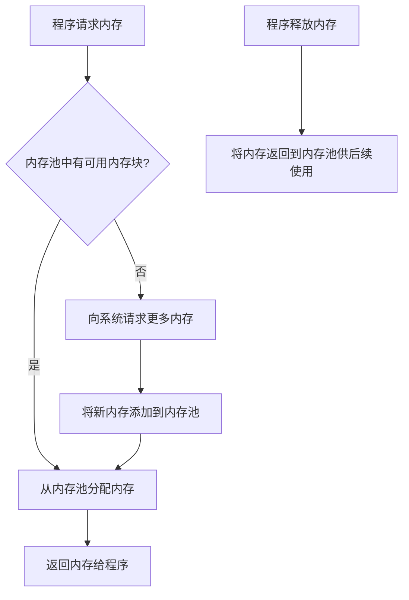

# C++ 内存池

## 什么是内存池？

内存池（Memory Pool）是一种内存分配策略，它通过预先分配一大块内存，然后管理这块内存来满足程序中频繁的小内存块分配需求。相比于直接使用 `new` 和 `delete` 进行内存分配和释放，内存池可以显著提高内存管理的效率，减少内存碎片，提升程序性能。

:::note
在C++中，频繁的内存分配和释放会导致性能下降，而内存池通过减少系统调用和内存碎片来解决这个问题。
:::

## 为什么需要内存池？

标准的内存分配方式（使用 `new`/`delete` 或 `malloc`/`free`）存在以下问题：

1. **性能开销**：每次调用 `new` 或 `malloc` 都需要进行系统调用，这会带来额外的开销。
2. **内存碎片**：频繁的内存分配和释放可能导致内存碎片，降低内存利用率。
3. **分配速度**：当同时需要分配大量小对象时，标准分配器的速度可能不够快。

内存池通过以下方式解决这些问题：

1. 预先分配大块内存，减少系统调用。
2. 统一管理内存，减少内存碎片。
3. 针对特定大小的对象优化分配策略，提高分配速度。

## 内存池的基本原理

内存池的基本工作原理可以用以下图表表示：



## 简单内存池的实现

下面是一个基础内存池的C++实现，适用于固定大小对象的分配：

```cpp
#include <iostream>
#include <vector>
#include <cstddef>

class MemoryPool {
private:
    struct Block {
        Block* next;
    };

    Block* freeList; // 空闲内存块链表
    std::vector<void*> allocatedChunks; // 存储已分配的大块内存
    size_t blockSize; // 每个内存块的大小
    size_t chunksPerBlock; // 每次分配的块数量

public:
    MemoryPool(size_t blockSize, size_t chunksPerBlock = 100) 
        : freeList(nullptr), blockSize(blockSize), chunksPerBlock(chunksPerBlock) {
        // 确保blockSize至少能容纳一个指针
        this->blockSize = std::max(blockSize, sizeof(Block*));
    }

    ~MemoryPool() {
        // 释放所有分配的内存
        for (void* chunk : allocatedChunks) {
            free(chunk);
        }
    }

    void* allocate() {
        // 如果没有可用的内存块，就分配一批新的
        if (freeList == nullptr) {
            allocateChunk();
        }

        // 从空闲列表中取出一个块
        Block* block = freeList;
        freeList = block->next;
        return block;
    }

    void deallocate(void* p) {
        // 将释放的内存块添加回空闲列表
        Block* block = static_cast<Block*>(p);
        block->next = freeList;
        freeList = block;
    }

private:
    void allocateChunk() {
        // 分配一大块内存
        size_t chunkSize = blockSize * chunksPerBlock;
        char* chunk = static_cast<char*>(malloc(chunkSize));
        if (!chunk) throw std::bad_alloc();
        
        allocatedChunks.push_back(chunk);
        
        // 将这块内存分割成多个小块，并添加到空闲列表
        freeList = reinterpret_cast<Block*>(chunk);
        Block* current = freeList;
        
        for (size_t i = 1; i < chunksPerBlock; ++i) {
            char* next = chunk + i * blockSize;
            current->next = reinterpret_cast<Block*>(next);
            current = current->next;
        }
        
        current->next = nullptr;
    }
};

// 示例用法
struct MyObject {
    int data[25]; // 100字节的对象
};

int main() {
    // 创建一个内存池，用于分配MyObject对象
    MemoryPool pool(sizeof(MyObject));
    
    // 分配对象
    MyObject* obj1 = static_cast<MyObject*>(pool.allocate());
    obj1->data[0] = 42;
    std::cout << "obj1->data[0]: " << obj1->data[0] << std::endl;
    
    MyObject* obj2 = static_cast<MyObject*>(pool.allocate());
    obj2->data[0] = 100;
    std::cout << "obj2->data[0]: " << obj2->data[0] << std::endl;
    
    // 释放对象
    pool.deallocate(obj1);
    pool.deallocate(obj2);
    
    return 0;
}
```

输出结果：
```
obj1->data[0]: 42
obj2->data[0]: 100
```

## 高级内存池技术

### 多尺寸内存池

在实际应用中，我们需要分配不同大小的对象，一种常见的解决方案是创建多个固定大小的内存池：

```cpp
#include <iostream>
#include <unordered_map>
#include <memory>

// 简单的内存池类(与前面的实现类似)
class MemoryPool {
    // ... (前面代码的内存池实现)
};

class MultiSizeMemoryPool {
private:
    std::unordered_map<size_t, std::unique_ptr<MemoryPool>> pools;
    
public:
    void* allocate(size_t size) {
        // 查找或创建适当大小的内存池
        auto it = pools.find(size);
        if (it == pools.end()) {
            auto result = pools.emplace(size, std::make_unique<MemoryPool>(size));
            it = result.first;
        }
        
        return it->second->allocate();
    }
    
    void deallocate(void* ptr, size_t size) {
        auto it = pools.find(size);
        if (it != pools.end()) {
            it->second->deallocate(ptr);
        }
    }
};
```

### 线程安全内存池

在多线程环境中，内存池需要处理并发访问：

```cpp
#include <mutex>

class ThreadSafeMemoryPool {
private:
    MemoryPool pool;
    std::mutex mutex;
    
public:
    ThreadSafeMemoryPool(size_t blockSize) : pool(blockSize) {}
    
    void* allocate() {
        std::lock_guard<std::mutex> lock(mutex);
        return pool.allocate();
    }
    
    void deallocate(void* ptr) {
        std::lock_guard<std::mutex> lock(mutex);
        pool.deallocate(ptr);
    }
};
```

## 内存池的实际应用场景

### 1. 游戏开发

游戏开发中常常需要频繁地创建和销毁大量的游戏对象（如子弹、粒子效果等）。使用内存池可以显著提高游戏性能，减少因频繁内存操作导致的卡顿。

```cpp
// 游戏中的粒子系统
class ParticleSystem {
private:
    MemoryPool particlePool;
    // 其他粒子系统数据
    
public:
    ParticleSystem() : particlePool(sizeof(Particle)) {}
    
    void createParticle() {
        Particle* p = static_cast<Particle*>(particlePool.allocate());
        // 初始化粒子
        // ...
    }
    
    void destroyParticle(Particle* p) {
        // 清理粒子资源
        particlePool.deallocate(p);
    }
};
```

### 2. 网络服务器

网络服务器需要处理大量连接请求，每个连接都需要分配内存。使用内存池可以减少内存分配的开销，提高服务器的响应速度和吞吐量。

```cpp
// 网络连接管理器
class ConnectionManager {
private:
    MemoryPool connectionPool;
    
public:
    ConnectionManager() : connectionPool(sizeof(Connection)) {}
    
    Connection* createConnection() {
        Connection* conn = static_cast<Connection*>(connectionPool.allocate());
        // 初始化连接
        return conn;
    }
    
    void closeConnection(Connection* conn) {
        // 关闭连接
        connectionPool.deallocate(conn);
    }
};
```

### 3. 数据库系统

数据库系统需要高效地管理内存，特别是对于索引和缓存。内存池可以优化数据库的内存使用，提高查询性能。

## 内存池的优缺点

### 优点
1. **提高性能**：减少系统调用，加速内存分配。
2. **减少内存碎片**：统一管理内存，提高内存利用率。
3. **预测性能**：内存分配时间相对稳定，减少不可预测的延迟。

### 缺点
1. **实现复杂性**：实现一个高效、安全的内存池需要考虑很多因素。
2. **可能浪费内存**：预分配的内存可能不会全部使用。
3. **调试困难**：由于内存池管理自己的内存，可能使得内存错误更难以发现。

:::caution
内存池虽然强大，但并不适合所有场景。对于不频繁创建和销毁对象的程序，使用标准内存分配器可能更简单高效。
:::

## 何时使用内存池？

考虑在以下场景使用内存池：

1. 需要频繁创建和销毁大量小对象。
2. 性能关键型应用，如游戏和实时系统。
3. 内存碎片是一个问题，特别是对于长时间运行的应用。
4. 需要更可预测的内存分配性能。

## 与C++标准库的关系

C++标准库提供了 `std::allocator`，这是一个内存分配器接口。你可以创建自定义的分配器，利用内存池技术，然后与标准容器一起使用：

```cpp
#include <vector>
#include <list>

// 自定义分配器，使用内存池
template <typename T>
class PoolAllocator {
private:
    MemoryPool pool;

public:
    using value_type = T;
    
    PoolAllocator() : pool(sizeof(T)) {}
    
    T* allocate(size_t n) {
        if (n > 1) {
            // 对于批量分配，回退到标准分配器
            return static_cast<T*>(::operator new(n * sizeof(T)));
        }
        return static_cast<T*>(pool.allocate());
    }
    
    void deallocate(T* p, size_t n) {
        if (n > 1) {
            ::operator delete(p);
        } else {
            pool.deallocate(p);
        }
    }
    
    // 其他必要的allocator成员
    // ...
};

// 使用示例
void usePoolWithStl() {
    // 使用内存池的vector
    std::vector<int, PoolAllocator<int>> poolVector;
    
    // 使用内存池的list
    std::list<double, PoolAllocator<double>> poolList;
}
```

## 总结

内存池是一种强大的内存管理技术，通过预先分配和高效管理内存，可以显著提高C++程序的性能。虽然实现一个健壮的内存池需要考虑许多细节，但其带来的性能提升在特定场景下是非常值得的。

随着对内存池的理解和使用，你可以：
- 提高程序的性能和响应速度
- 减少内存碎片，提高内存利用率
- 为性能关键型应用创建更可预测的内存分配策略

## 练习

1. 修改上述简单内存池实现，使其支持不同大小的内存块分配。
2. 测量使用普通 `new`/`delete` 与使用内存池时分配和释放1,000,000个小对象的性能差异。
3. 设计一个线程安全的内存池，并确保在多线程环境中正常工作。
4. 实现一个能够与STL容器配合使用的自定义分配器，底层使用内存池。
5. 针对特定应用场景（如游戏引擎或网络服务器）设计专用内存池。

## 延伸阅读

- 《Effective C++》和《More Effective C++》中关于内存管理的章节
- C++标准库的分配器设计和实现
- 游戏引擎中的内存管理策略
- 高性能服务器架构中的内存优化技巧

通过掌握内存池技术，你将能够编写更高效、更稳健的C++程序，特别是在需要处理大量对象的性能关键型应用中。