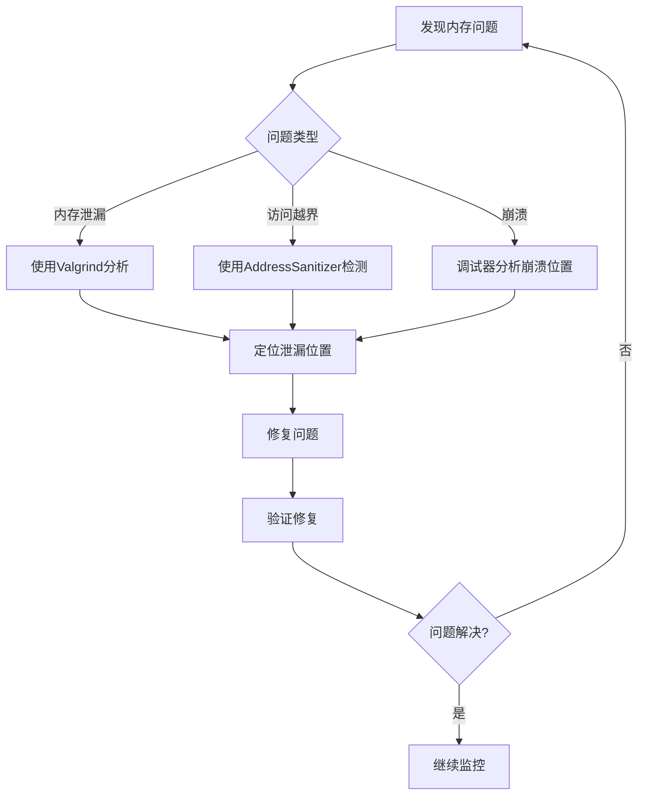

# C++ 内存调试技术

## 介绍

内存问题是C++开发中最常见也最难调试的问题之一。与高级语言不同，C++给予开发者直接管理内存的能力，这意味着你需要自己负责内存的分配和释放。如果这些操作没有正确执行，就会导致内存泄漏、越界访问、悬挂指针等问题。

:::caution 为什么内存错误难以调试?
- 内存错误可能不会立即导致程序崩溃
- 错误的表现形式与根本原因可能相距甚远
- 一些内存错误在特定条件下才会显现
:::

本文将介绍几种常用的C++内存调试技术，帮助你识别并解决程序中的内存问题。

## 常见内存问题类型

在深入内存调试技术之前，先了解一下常见的内存问题类型:

1. **内存泄漏(Memory Leak)**: 申请的内存没有被释放，导致程序长时间运行后可用内存减少
2. **缓冲区溢出(Buffer Overflow)**: 向分配的内存块之外写入数据
3. **悬挂指针(Dangling Pointer)**: 使用已经被释放的内存区域
4. **双重释放(Double Free)**: 对同一内存区域释放两次
5. **未初始化内存(Uninitialized Memory)**: 使用未初始化的内存区域

## 基本的调试技术

### 1. 代码审查

最基本的方法是仔细检查代码，确保每次内存分配都有对应的释放操作。

```cpp
// 不良实践
void badFunction() {
    int* arr = new int[10];
    // 没有对应的delete[] arr，导致内存泄漏
}

// 良好实践
void goodFunction() {
    int* arr = new int[10];
    // 使用arr
    delete[] arr; // 正确释放内存
}
```

### 2. 使用智能指针

使用C++标准库提供的智能指针可以避免许多内存问题：

```cpp
#include <iostream>
#include <memory>

void demonstrateSmartPointers() {
    // 使用unique_ptr，当指针离开作用域时自动释放内存
    std::unique_ptr<int[]> arr = std::make_unique<int[]>(10);
    
    // 使用shared_ptr，多个指针可以共享所有权
    std::shared_ptr<int> shared = std::make_shared<int>(42);
    {
        auto another = shared; // 引用计数加1
        std::cout << "Shared value: " << *another << std::endl;
    } // another离开作用域，引用计数减1，但内存不会被释放
    
    std::cout << "Shared value still accessible: " << *shared << std::endl;
} // 所有智能指针离开作用域，内存被正确释放

int main() {
    demonstrateSmartPointers();
    return 0;
}
```

**输出:**
```
Shared value: 42
Shared value still accessible: 42
```

## 专业内存调试工具

### 1. Valgrind

Valgrind是一个功能强大的内存分析工具，特别是其中的Memcheck组件可以检测：

- 内存泄漏
- 使用未初始化的内存
- 使用已释放的内存
- 双重释放
- 内存越界访问

#### 使用Valgrind的例子

```cpp
// memory_issues.cpp
#include <iostream>

int main() {
    // 内存泄漏示例
    int* leak = new int(5);
    
    // 使用未初始化的内存
    int* uninitialized = new int[10];
    std::cout << "Uninitialized value: " << uninitialized[5] << std::endl;
    
    // 访问越界
    int* array = new int[5];
    array[5] = 10;  // 越界访问
    
    // 释放数组
    delete[] array;
    
    // 使用已释放的内存
    std::cout << "Freed memory: " << array[0] << std::endl;
    
    // 双重释放
    delete[] array;
    
    return 0;
}
```

使用Valgrind检测：

```bash
g++ -g memory_issues.cpp -o memory_issues
valgrind --tool=memcheck --leak-check=yes ./memory_issues
```

Valgrind会输出详细的错误报告，指出所有内存问题的位置。

### 2. AddressSanitizer (ASan)

AddressSanitizer是现代编译器（GCC、Clang）提供的内存错误检测工具。相比Valgrind，它的运行速度更快。

#### 使用AddressSanitizer的例子

```bash
# 使用GCC编译并启用AddressSanitizer
g++ -fsanitize=address -g memory_issues.cpp -o memory_issues_asan

# 运行程序
./memory_issues_asan
```

当程序运行时，AddressSanitizer会检测内存错误并在错误发生时立即报告，包括详细的堆栈跟踪。

### 3. Visual Studio中的内存调试工具

如果你使用Visual Studio，它内置了多种内存调试工具：

1. **内存泄漏检测**: 在调试时查看内存使用情况
2. **堆分析器**: 分析堆分配和泄漏
3. **调试时的特殊检测**: 通过设置可以在调试过程中检测内存问题

```cpp
// 在Visual Studio中启用内存泄漏检测
#define _CRTDBG_MAP_ALLOC
#include <stdlib.h>
#include <crtdbg.h>

int main() {
    _CrtSetDbgFlag(_CRTDBG_ALLOC_MEM_DF | _CRTDBG_LEAK_CHECK_DF);
    
    int* leak = new int(5);
    // 没有delete，将在程序结束时被检测到
    
    return 0;
}
```

## 自定义内存调试技术

### 1. 创建内存分配包装器

你可以创建自己的内存分配包装器来跟踪所有分配和释放：

```cpp
#include <iostream>
#include <map>
#include <string>

class MemoryTracker {
private:
    static std::map<void*, std::pair<size_t, std::string>> allocations;
    
public:
    static void* allocate(size_t size, const std::string& file, int line) {
        void* ptr = ::operator new(size);
        allocations[ptr] = {size, file + ":" + std::to_string(line)};
        return ptr;
    }
    
    static void deallocate(void* ptr) {
        if (allocations.find(ptr) != allocations.end()) {
            allocations.erase(ptr);
            ::operator delete(ptr);
        } else {
            std::cerr << "Attempting to free unallocated memory at " << ptr << std::endl;
        }
    }
    
    static void checkLeaks() {
        if (!allocations.empty()) {
            std::cerr << "Memory leaks detected:" << std::endl;
            for (const auto& alloc : allocations) {
                std::cerr << "  Address: " << alloc.first 
                          << ", Size: " << alloc.second.first 
                          << " bytes, Location: " << alloc.second.second << std::endl;
            }
        } else {
            std::cout << "No memory leaks detected" << std::endl;
        }
    }
};

std::map<void*, std::pair<size_t, std::string>> MemoryTracker::allocations;

// 替换全局new和delete运算符
#define new new(__FILE__, __LINE__)
void* operator new(size_t size, const std::string& file, int line) {
    return MemoryTracker::allocate(size, file, line);
}

void operator delete(void* ptr) noexcept {
    MemoryTracker::deallocate(ptr);
}

int main() {
    int* p1 = new int(42);
    int* p2 = new int[10];
    
    delete p1;
    // 故意忘记释放p2
    
    MemoryTracker::checkLeaks();
    return 0;
}
```

### 2. 自定义内存边界检查

可以添加额外的内存来检测越界访问：

```cpp
#include <iostream>
#include <cstring>

#define GUARD_VALUE 0xDEADBEEF
#define GUARD_SIZE 8 // 字节数

void* safeAlloc(size_t size) {
    // 分配额外的内存用于边界检查
    char* memory = new char[size + 2 * GUARD_SIZE];
    
    // 设置前后哨兵值
    *(uint32_t*)memory = GUARD_VALUE;
    *(uint32_t*)(memory + GUARD_SIZE + size) = GUARD_VALUE;
    
    // 返回实际用于数据的内存地址
    return memory + GUARD_SIZE;
}

bool checkMemory(void* ptr, size_t size) {
    char* memory = (char*)ptr - GUARD_SIZE;
    
    bool frontGuardIntact = (*(uint32_t*)memory == GUARD_VALUE);
    bool backGuardIntact = (*(uint32_t*)(memory + GUARD_SIZE + size) == GUARD_VALUE);
    
    if (!frontGuardIntact) {
        std::cerr << "Memory corruption detected: Front guard damaged!" << std::endl;
    }
    
    if (!backGuardIntact) {
        std::cerr << "Memory corruption detected: Back guard damaged!" << std::endl;
    }
    
    return frontGuardIntact && backGuardIntact;
}

void safeFree(void* ptr, size_t size) {
    if (checkMemory(ptr, size)) {
        char* memory = (char*)ptr - GUARD_SIZE;
        delete[] memory;
    } else {
        std::cerr << "WARNING: Freeing corrupted memory!" << std::endl;
    }
}

int main() {
    // 正常使用
    int* safeArray = (int*)safeAlloc(5 * sizeof(int));
    for (int i = 0; i < 5; i++) {
        safeArray[i] = i;
    }
    
    std::cout << "Memory check before corruption: ";
    if (checkMemory(safeArray, 5 * sizeof(int))) {
        std::cout << "OK" << std::endl;
    }
    
    // 模拟越界写入
    safeArray[5] = 999; // 越界写入
    
    std::cout << "Memory check after corruption: ";
    if (checkMemory(safeArray, 5 * sizeof(int))) {
        std::cout << "OK" << std::endl;
    }
    
    safeFree(safeArray, 5 * sizeof(int));
    return 0;
}
```

**输出:**
```
Memory check before corruption: OK
Memory check after corruption: Memory corruption detected: Back guard damaged!
WARNING: Freeing corrupted memory!
```

## 内存调试的实际案例分析

### 案例一：调试内存泄漏

假设我们有一个图形编辑器应用程序，在长时间运行后内存使用量不断增长。使用Valgrind进行检测，发现问题出在每次打开新文件时分配的资源没有正确释放。

```cpp
// 原始有问题代码
void DocumentManager::openDocument(const std::string& path) {
    Document* doc = new Document(path);
    activeDocuments.push_back(doc);
    // 缺少释放旧文档的代码
}

// 修复后的代码
void DocumentManager::openDocument(const std::string& path) {
    // 先释放之前的文档
    for (Document* doc : activeDocuments) {
        delete doc;
    }
    activeDocuments.clear();
    
    // 打开新文档
    Document* doc = new Document(path);
    activeDocuments.push_back(doc);
}

// 更好的实现：使用智能指针
class DocumentManager {
private:
    std::vector<std::unique_ptr<Document>> activeDocuments;
    
public:
    void openDocument(const std::string& path) {
        activeDocuments.clear(); // 智能指针会自动释放资源
        activeDocuments.push_back(std::make_unique<Document>(path));
    }
};
```

### 案例二：调试缓冲区溢出

假设一个服务器应用程序在处理特定长度的客户端请求时偶尔崩溃：

```cpp
// 有问题的代码
void processRequest(const char* data, size_t length) {
    char buffer[128];
    memcpy(buffer, data, length); // 没有检查length是否超过buffer大小
    // 处理buffer中的数据
}

// 使用AddressSanitizer检测后，修复代码：
void processRequest(const char* data, size_t length) {
    if (length > 128) {
        std::cerr << "Request too large" << std::endl;
        return;
    }
    char buffer[128];
    memcpy(buffer, data, length);
    // 处理buffer中的数据
}

// 更好的实现：使用std::vector
void processRequest(const char* data, size_t length) {
    std::vector<char> buffer(data, data + length);
    // 处理buffer中的数据
}
```

## 关键调试策略总结

1. **使用智能指针**: `std::unique_ptr` 和 `std::shared_ptr` 可以减少内存管理错误
2. **使用专业工具**: Valgrind、AddressSanitizer、Memory Sanitizer等工具可以发现难以察觉的问题
3. **编写RAII类**: 使用资源获取即初始化(RAII)模式确保资源正确释放
4. **通过验证预防错误**: 在关键点添加断言和检查，确保内存操作的有效性
5. **保持简单**: 复杂的内存管理逻辑更容易出错，应尽量简化



## 总结

内存调试是C++编程中至关重要的技能，掌握这些技术将帮助你开发更稳定、更高效的应用程序。最佳实践包括：

- 尽可能使用智能指针和RAII
- 定期使用内存检测工具
- 编写自动化测试来验证内存使用
- 在可能的情况下，选择使用标准容器而不是原始数组
- 了解并避免常见的内存陷阱

通过这些技术和工具的组合使用，你可以显著提高C++程序的质量和可靠性。

## 练习与延伸阅读

### 练习
1. 使用Valgrind或AddressSanitizer检测一个简单程序中的内存泄漏
2. 实现一个简单的智能指针类
3. 修改给定的代码，使用RAII模式修复内存管理问题
4. 编写一个自定义的内存分配器，记录分配和释放操作

### 延伸阅读
- Scott Meyers: 《Effective Modern C++》
- Herb Sutter: 《Exceptional C++》
- 《Valgrind 3.3 - Advanced Debugging and Profiling for GNU/Linux applications》
- C++ Core Guidelines: https://isocpp.github.io/CppCoreGuidelines/CppCoreGuidelines

现在，你已经掌握了C++内存调试的基础知识。随着你的编程经验增长，这些技能将变得越来越重要，帮助你创建更可靠、更专业的C++应用程序。