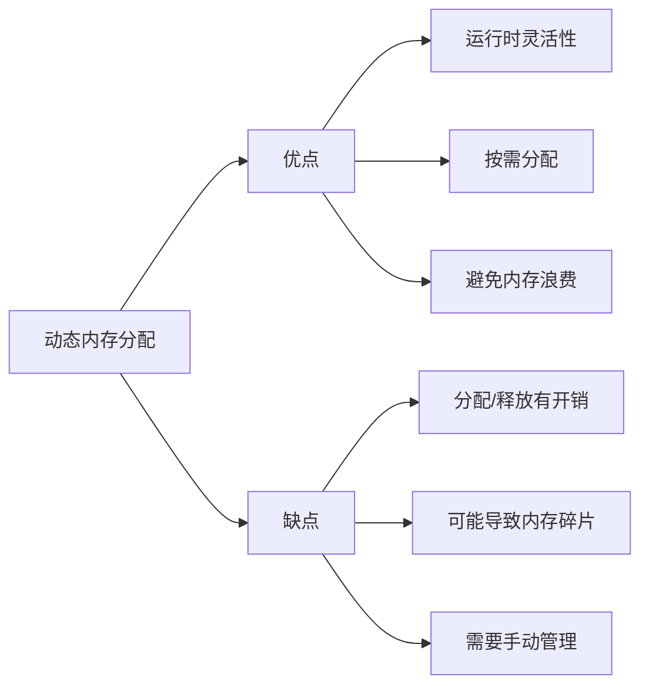

# C++ 动态内存分配

在编写C++程序时，有效管理内存是提高程序性能和稳定性的关键因素。C++提供了强大的动态内存分配功能，允许程序在运行时按需分配和释放内存。本文将全面介绍C++动态内存分配的基本概念、操作方法以及最佳实践。

## 什么是动态内存分配？

在C++中，内存分配主要分为两种类型：

1. **静态内存分配**：在编译时确定大小，程序执行期间内存大小固定
2. **动态内存分配**：在运行时根据需要分配内存，使用完毕后可以释放

动态内存分配允许程序根据实际需求分配内存，这在处理大量数据或事先不知道所需内存大小的情况下特别有用。

:::note
C++中的内存主要分为栈内存和堆内存。静态分配的变量通常存储在栈上，而动态分配的内存则位于堆上。
:::

## C++ 中动态内存的基本操作

### 使用new和delete运算符

C++提供了`new`和`delete`运算符来进行动态内存的分配和释放：

```cpp
// 分配单个对象的内存
int* pInt = new int;
*pInt = 5;
std::cout << "动态分配的整数: " << *pInt << std::endl;
delete pInt;  // 释放内存

// 分配带初始值的对象
double* pDouble = new double(3.14);
std::cout << "动态分配的浮点数: " << *pDouble << std::endl;
delete pDouble;
```

输出：
```
动态分配的整数: 5
动态分配的浮点数: 3.14
```

### 分配和释放数组

使用`new[]`和`delete[]`来分配和释放数组：

```cpp
// 分配整数数组
int* pArray = new int[5];
for (int i = 0; i < 5; i++) {
    pArray[i] = i * 10;
}

std::cout << "动态数组内容: ";
for (int i = 0; i < 5; i++) {
    std::cout << pArray[i] << " ";
}
std::cout << std::endl;

delete[] pArray;  // 使用delete[]释放数组
```

输出：
```
动态数组内容: 0 10 20 30 40
```

:::caution
使用`new[]`分配的内存必须使用`delete[]`释放，否则可能导致内存泄漏或未定义行为。
:::

## 内存分配失败处理

当系统内存不足时，`new`操作可能会失败。在C++中，有两种处理方式：

### 1. 异常处理

默认情况下，当`new`操作失败时会抛出`std::bad_alloc`异常：

```cpp
try {
    int* hugeArray = new int[10000000000]; // 尝试分配大量内存
    // 使用内存...
    delete[] hugeArray;
} catch (const std::bad_alloc& e) {
    std::cerr << "内存分配失败: " << e.what() << std::endl;
}
```

### 2. nothrow形式

使用`nothrow`参数可以让`new`在失败时返回空指针而不是抛出异常：

```cpp
int* ptr = new(std::nothrow) int[1000000000];
if (ptr == nullptr) {
    std::cout << "内存分配失败，返回nullptr" << std::endl;
} else {
    // 使用内存...
    delete[] ptr;
}
```

## 常见问题与注意事项

### 1. 内存泄漏

内存泄漏是指分配的内存没有被正确释放，导致程序长时间运行时可用内存逐渐减少：

```cpp
void memoryLeakExample() {
    int* ptr = new int(42);
    // 没有调用delete，导致内存泄漏
}
```

### 2. 悬挂指针

悬挂指针是指指针指向的内存已被释放，但指针本身没有置为nullptr：

```cpp
int* ptr = new int(42);
delete ptr;
// ptr现在是悬挂指针
// *ptr = 10;  // 危险操作，可能导致程序崩溃
ptr = nullptr; // 正确做法：释放后将指针置为nullptr
```

### 3. 双重释放

对同一内存区域执行多次delete操作会导致未定义行为：

```cpp
int* ptr = new int(42);
delete ptr;
// delete ptr;  // 错误：双重释放
```

## 智能指针

为了避免手动管理内存带来的问题，C++11引入了智能指针。智能指针是对原始指针的封装，能够自动管理内存的生命周期。

### 1. unique_ptr

`std::unique_ptr`实现了独占所有权的概念，确保同一时间只有一个指针可以指向该内存：

```cpp
#include <iostream>
#include <memory>

void useUniquePtr() {
    std::unique_ptr<int> ptr1(new int(42));
    // 更现代的方式
    auto ptr2 = std::make_unique<int>(100); // C++14及以上
    
    std::cout << "ptr1值: " << *ptr1 << std::endl;
    std::cout << "ptr2值: " << *ptr2 << std::endl;
    
    // 转移所有权
    std::unique_ptr<int> ptr3 = std::move(ptr1);
    // 此时ptr1为nullptr
    
    if (!ptr1) {
        std::cout << "ptr1现在为nullptr" << std::endl;
    }
    
    // 离开作用域时，ptr2和ptr3会自动释放内存
}
```

输出：
```
ptr1值: 42
ptr2值: 100
ptr1现在为nullptr
```

### 2. shared_ptr

`std::shared_ptr`实现了共享所有权，多个指针可以指向同一块内存，当最后一个指针被销毁时，内存会被释放：

```cpp
#include <iostream>
#include <memory>

void useSharedPtr() {
    auto ptr1 = std::make_shared<int>(42);
    std::cout << "引用计数: " << ptr1.use_count() << std::endl;
    
    {
        auto ptr2 = ptr1; // 共享所有权
        std::cout << "引用计数: " << ptr1.use_count() << std::endl;
    } // ptr2离开作用域
    
    std::cout << "引用计数: " << ptr1.use_count() << std::endl;
    
    // ptr1离开作用域时，内存会被释放
}
```

输出：
```
引用计数: 1
引用计数: 2
引用计数: 1
```

### 3. weak_ptr

`std::weak_ptr`是一种不控制对象生命周期的智能指针，它指向一个`shared_ptr`管理的对象，但不增加引用计数：

```cpp
#include <iostream>
#include <memory>

void useWeakPtr() {
    auto sharedPtr = std::make_shared<int>(42);
    std::weak_ptr<int> weakPtr = sharedPtr;
    
    std::cout << "shared_ptr引用计数: " << sharedPtr.use_count() << std::endl;
    
    // 使用weak_ptr前先检查它指向的对象是否存在
    if (auto tempShared = weakPtr.lock()) {
        std::cout << "weak_ptr指向的值: " << *tempShared << std::endl;
    } else {
        std::cout << "weak_ptr指向的对象已不存在" << std::endl;
    }
    
    // 释放shared_ptr
    sharedPtr.reset();
    
    // 再次检查weak_ptr
    if (auto tempShared = weakPtr.lock()) {
        std::cout << "weak_ptr指向的值: " << *tempShared << std::endl;
    } else {
        std::cout << "weak_ptr指向的对象已不存在" << std::endl;
    }
}
```

输出：
```
shared_ptr引用计数: 1
weak_ptr指向的值: 42
weak_ptr指向的对象已不存在
```

## 实际应用案例

### 动态数组调整大小

在不知道最终需要多少元素的情况下，动态内存分配非常有用：

```cpp
#include <iostream>

class DynamicArray {
private:
    int* data;
    size_t size;
    size_t capacity;

public:
    DynamicArray(size_t initialCapacity = 10) : size(0), capacity(initialCapacity) {
        data = new int[capacity];
    }
    
    ~DynamicArray() {
        delete[] data;
    }
    
    void add(int value) {
        if (size >= capacity) {
            // 扩容
            size_t newCapacity = capacity * 2;
            int* newData = new int[newCapacity];
            
            // 复制现有数据
            for (size_t i = 0; i < size; i++) {
                newData[i] = data[i];
            }
            
            // 释放旧数据
            delete[] data;
            
            // 更新指针和容量
            data = newData;
            capacity = newCapacity;
            
            std::cout << "数组已扩容至 " << capacity << " 个元素" << std::endl;
        }
        
        data[size++] = value;
    }
    
    void print() const {
        std::cout << "数组内容: ";
        for (size_t i = 0; i < size; i++) {
            std::cout << data[i] << " ";
        }
        std::cout << std::endl;
    }
    
    size_t getSize() const { return size; }
    size_t getCapacity() const { return capacity; }
};

int main() {
    DynamicArray arr;
    
    for (int i = 1; i <= 25; i++) {
        arr.add(i);
    }
    
    arr.print();
    std::cout << "数组大小: " << arr.getSize() << std::endl;
    std::cout << "数组容量: " << arr.getCapacity() << std::endl;
    
    return 0;
}
```

输出：
```
数组已扩容至 20 个元素
数组已扩容至 40 个元素
数组内容: 1 2 3 4 5 6 7 8 9 10 11 12 13 14 15 16 17 18 19 20 21 22 23 24 25 
数组大小: 25
数组容量: 40
```

### 使用智能指针实现树结构

使用智能指针构建安全的树结构：

```cpp
#include <iostream>
#include <memory>
#include <vector>

class TreeNode {
private:
    int value;
    std::vector<std::shared_ptr<TreeNode>> children;

public:
    TreeNode(int val) : value(val) {}
    
    void addChild(int childValue) {
        children.push_back(std::make_shared<TreeNode>(childValue));
    }
    
    void print(int depth = 0) const {
        for (int i = 0; i < depth; i++) {
            std::cout << "  ";
        }
        std::cout << "- " << value << std::endl;
        
        for (const auto& child : children) {
            child->print(depth + 1);
        }
    }
};

int main() {
    auto root = std::make_shared<TreeNode>(1);
    root->addChild(2);
    root->addChild(3);
    root->addChild(4);
    
    std::cout << "树结构:" << std::endl;
    root->print();
    
    return 0;
}
```

输出：
```
树结构:
- 1
  - 2
  - 3
  - 4
```

## 动态内存分配的性能考虑

动态内存分配虽然灵活，但也有性能代价：



在性能敏感的应用中，可以考虑以下优化策略：

1. **内存池**：预分配大块内存，然后从中快速分配小块内存
2. **对象池**：重用对象而不是频繁创建和销毁
3. **最小化分配**：尽可能减少动态分配的次数
4. **合适的初始容量**：为容器预留足够空间，减少重新分配

## 总结

动态内存分配是C++编程中的一个强大特性，它提供了灵活性和效率。本文介绍了：

- 使用`new`和`delete`进行基本的动态内存分配和释放
- 内存分配失败的处理方法
- 常见的内存管理问题（泄漏、悬挂指针、双重释放）
- 智能指针（`unique_ptr`、`shared_ptr`、`weak_ptr`）及其应用
- 实际应用案例
- 性能考虑和优化策略

掌握这些概念和技术，将帮助你编写更安全、更高效的C++程序。

## 练习

1. 实现一个简单的字符串类，使用动态内存分配来存储字符串数据。
2. 编写一个函数，使用智能指针创建和管理一个动态整数数组。
3. 设计一个内存池类，可以高效地分配和释放固定大小的内存块。
4. 分析现有代码中的内存泄漏，并使用智能指针修复它们。
5. 比较使用原始指针和智能指针实现的链表在性能和安全性方面的差异。

:::tip
记住，在现代C++中，应该尽可能使用智能指针而不是原始指针来管理动态内存，除非有明确的性能需求需要使用原始指针。
:::

## 进一步阅读

- [C++参考手册 - 动态内存管理](https://en.cppreference.com/w/cpp/memory)
- 《Effective Modern C++》by Scott Meyers (特别是关于智能指针的章节)
- 《C++ Primer》第12章 - 动态内存