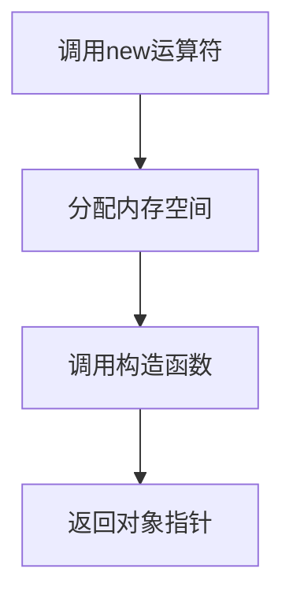

# C++ new运算符

## 引言

在C++程序设计中，内存管理是一项核心技能。相比于静态内存分配（如声明普通变量），动态内存分配允许我们在程序运行时根据需要申请和释放内存。C++提供了`new`运算符来实现这一功能，让我们能够在堆（heap）上分配内存。

本文将详细介绍`new`运算符的使用方法、工作原理以及最佳实践，帮助你更好地理解和应用C++的动态内存管理机制。

## new运算符基础

### 什么是new运算符？

`new`运算符是C++中用于动态分配内存的关键字。它在堆内存中为对象分配空间，并返回指向该空间的指针。

### 基本语法

```cpp
// 分配单个对象
Type* pointer = new Type;

// 分配单个对象并初始化
Type* pointer = new Type(initialValue);

// 分配数组
Type* pointer = new Type[size];
```

### 简单示例

让我们从一个基本示例开始：

```cpp
#include <iostream>

int main() {
    // 动态分配一个整数
    int* pNum = new int;
    
    // 给分配的内存赋值
    *pNum = 10;
    
    // 使用分配的内存
    std::cout << "动态分配的整数值: " << *pNum << std::endl;
    
    // 释放内存
    delete pNum;
    
    return 0;
}
```

**输出结果：**
```
动态分配的整数值: 10
```

:::caution
使用`new`分配的内存必须使用`delete`释放，否则会导致内存泄漏。
:::

## new运算符的工作原理

当我们使用`new`运算符时，实际上发生了三个步骤：



1. **内存分配**：系统在堆上分配足够大的、未使用的空间来存储指定类型的对象。
2. **对象构造**：如果是类类型，调用其构造函数来初始化对象。
3. **返回指针**：`new`表达式返回指向新创建对象的指针。

### new与malloc的区别

尽管`new`和C语言的`malloc`函数都用于内存分配，但它们有几个重要区别：

| 特性 | new | malloc |
|------|-----|--------|
| 类型安全 | 是 | 否 |
| 构造函数调用 | 自动调用 | 不调用 |
| 返回类型 | 类型正确的指针 | void* |
| 内存分配失败 | 抛出异常 | 返回NULL |
| 重载能力 | 可以被重载 | 不能被重载 |

## new运算符的高级用法

### 使用new分配数组

我们可以使用`new[]`语法分配数组：

```cpp
#include <iostream>

int main() {
    // 动态分配包含5个整数的数组
    int* numArray = new int[5];
    
    // 初始化数组
    for(int i = 0; i < 5; i++) {
        numArray[i] = i * 10;
    }
    
    // 使用数组
    for(int i = 0; i < 5; i++) {
        std::cout << "numArray[" << i << "] = " << numArray[i] << std::endl;
    }
    
    // 释放数组内存
    delete[] numArray;
    
    return 0;
}
```

**输出结果：**
```
numArray[0] = 0
numArray[1] = 10
numArray[2] = 20
numArray[3] = 30
numArray[4] = 40
```

:::warning
使用`new[]`分配的数组必须使用`delete[]`释放，而不是`delete`，否则可能导致未定义行为。
:::

### 带初始化的new

C++允许我们在使用`new`时初始化对象：

```cpp
#include <iostream>
#include <string>

class Person {
private:
    std::string name;
    int age;
    
public:
    Person(const std::string& n, int a) : name(n), age(a) {
        std::cout << "构造函数被调用" << std::endl;
    }
    
    void display() {
        std::cout << "姓名: " << name << ", 年龄: " << age << std::endl;
    }
    
    ~Person() {
        std::cout << "析构函数被调用" << std::endl;
    }
};

int main() {
    // 使用new创建并初始化Person对象
    Person* p = new Person("张三", 25);
    
    // 使用对象
    p->display();
    
    // 释放内存
    delete p;
    
    return 0;
}
```

**输出结果：**
```
构造函数被调用
姓名: 张三, 年龄: 25
析构函数被调用
```

### placement new

placement new允许在预先分配的内存位置构造对象：

```cpp
#include <iostream>
#include <new> // 需要包含这个头文件

class Sample {
private:
    int data;
    
public:
    Sample(int d) : data(d) {
        std::cout << "Sample构造函数被调用，data = " << data << std::endl;
    }
    
    ~Sample() {
        std::cout << "Sample析构函数被调用，data = " << data << std::endl;
    }
};

int main() {
    // 分配内存但不构造对象
    char buffer[sizeof(Sample)];
    
    // 使用placement new在预分配内存上构造对象
    Sample* p = new (buffer) Sample(42);
    
    // 手动调用析构函数
    p->~Sample();
    
    return 0;
}
```

**输出结果：**
```
Sample构造函数被调用，data = 42
Sample析构函数被调用，data = 42
```

:::note
使用placement new时，析构函数不会自动调用，需要手动调用。同时，也不需要使用delete，因为内存不是通过new分配的。
:::

## 异常处理与new

当内存分配失败时，`new`会抛出`std::bad_alloc`异常。我们可以使用异常处理来捕获这种情况：

```cpp
#include <iostream>
#include <new>

int main() {
    try {
        // 尝试分配大量内存
        int* largeArray = new int[1000000000000]; // 非常大，可能失败
        delete[] largeArray;
    }
    catch (const std::bad_alloc& e) {
        std::cout << "内存分配失败: " << e.what() << std::endl;
    }
    
    return 0;
}
```

如果你不想使用异常，也可以使用`nothrow`版本的`new`：

```cpp
#include <iostream>
#include <new>

int main() {
    // 使用nothrow版本的new，分配失败时返回nullptr而不是抛出异常
    int* largeArray = new (std::nothrow) int[1000000000000];
    
    if (largeArray == nullptr) {
        std::cout << "内存分配失败" << std::endl;
    } else {
        delete[] largeArray;
    }
    
    return 0;
}
```

## 常见问题与最佳实践

### 内存泄漏

内存泄漏是指程序分配了内存但从未释放它：

```cpp
void memoryLeak() {
    int* p = new int(10); // 分配内存
    
    // 函数结束时没有delete p，导致内存泄漏
}
```

:::caution
每次使用`new`分配内存后，确保在适当的时候使用对应的`delete`释放内存。
:::

### 野指针与悬空指针

使用已经被释放的内存会导致未定义行为：

```cpp
int main() {
    int* p = new int(10);
    delete p; // p现在是悬空指针
    
    *p = 20; // 危险操作！访问已释放的内存
    
    return 0;
}
```

:::tip
释放内存后，将指针设为nullptr可以帮助避免悬空指针问题。
```cpp
int* p = new int(10);
delete p;
p = nullptr; // 好习惯
```
:::

### 使用智能指针

从C++11开始，建议使用智能指针来管理动态内存，以避免内存泄漏：

```cpp
#include <iostream>
#include <memory>

int main() {
    // 使用unique_ptr自动管理内存
    std::unique_ptr<int> p = std::make_unique<int>(10);
    
    std::cout << "值: " << *p << std::endl;
    
    // 不需要手动delete，离开作用域时会自动释放内存
    
    return 0;
}
```

## 实际应用案例

### 实现动态增长的数组

```cpp
#include <iostream>

class DynamicArray {
private:
    int* data;
    size_t size;
    size_t capacity;
    
public:
    DynamicArray(size_t initialCapacity = 10) 
        : size(0), capacity(initialCapacity) {
        data = new int[capacity];
    }
    
    ~DynamicArray() {
        delete[] data;
    }
    
    void push_back(int value) {
        if (size >= capacity) {
            // 容量不足，需要扩展
            size_t newCapacity = capacity * 2;
            int* newData = new int[newCapacity];
            
            // 复制旧数据
            for (size_t i = 0; i < size; ++i) {
                newData[i] = data[i];
            }
            
            // 释放旧内存并更新指针
            delete[] data;
            data = newData;
            capacity = newCapacity;
        }
        
        // 添加新元素
        data[size++] = value;
    }
    
    int get(size_t index) const {
        if (index >= size) {
            throw std::out_of_range("索引超出范围");
        }
        return data[index];
    }
    
    size_t getSize() const {
        return size;
    }
    
    size_t getCapacity() const {
        return capacity;
    }
};

int main() {
    DynamicArray arr;
    
    // 添加元素
    for (int i = 0; i < 20; ++i) {
        arr.push_back(i * 10);
        std::cout << "添加元素: " << i * 10 
                  << ", 大小: " << arr.getSize() 
                  << ", 容量: " << arr.getCapacity() << std::endl;
    }
    
    // 访问元素
    for (size_t i = 0; i < arr.getSize(); ++i) {
        std::cout << "arr[" << i << "] = " << arr.get(i) << std::endl;
    }
    
    return 0;
}
```

这个例子展示了如何使用`new`和`delete`实现一个类似于`std::vector`的动态数组，当容量不足时，它会自动分配更多内存并复制现有元素。

### 工厂模式实现

`new`运算符在实现设计模式如工厂模式时非常有用：

```cpp
#include <iostream>
#include <string>
#include <memory>

// 产品基类
class Product {
public:
    virtual void use() = 0;
    virtual ~Product() {}
};

// 具体产品A
class ConcreteProductA : public Product {
public:
    void use() override {
        std::cout << "使用产品A" << std::endl;
    }
};

// 具体产品B
class ConcreteProductB : public Product {
public:
    void use() override {
        std::cout << "使用产品B" << std::endl;
    }
};

// 工厂类
class Factory {
public:
    static Product* createProduct(const std::string& type) {
        if (type == "A") {
            return new ConcreteProductA();
        }
        else if (type == "B") {
            return new ConcreteProductB();
        }
        return nullptr;
    }
};

int main() {
    // 创建产品A
    Product* productA = Factory::createProduct("A");
    if (productA) {
        productA->use();
        delete productA; // 使用完毕后释放内存
    }
    
    // 创建产品B
    Product* productB = Factory::createProduct("B");
    if (productB) {
        productB->use();
        delete productB; // 使用完毕后释放内存
    }
    
    return 0;
}
```

在这个工厂模式实现中，`new`运算符用于动态创建对象，而客户端代码不需要直接使用具体类的构造函数，降低了代码的耦合性。

## 总结

`new`运算符是C++动态内存管理的基础，它使我们能够在程序运行时按需分配内存。本文中，我们学习了：

- `new`运算符的基本用法和工作原理
- 如何使用`new`和`delete`正确管理内存
- 分配数组和初始化对象的技巧
- placement new的特殊用途
- 处理内存分配失败的方法
- 常见的内存管理问题及最佳实践
- 实际应用案例

:::tip
在现代C++中，推荐使用智能指针（如`std::unique_ptr`和`std::shared_ptr`）代替裸指针，以简化内存管理并避免常见的内存问题。
:::

## 练习

1. 编写一个程序，使用`new`动态分配一个包含10个整数的数组，初始化为1到10，然后计算它们的平均值。
2. 创建一个`Person`类，使用`new`创建5个`Person`对象并存储在数组中，然后正确释放内存。
3. 实现一个简单的字符串类，使用`new`和`delete`管理字符缓冲区，并实现复制构造函数和赋值运算符。
4. 编写一个程序，故意尝试分配大量内存并使用异常处理来捕获可能的`std::bad_alloc`异常。

## 进一步学习资源

- 《C++ Primer》第12章：动态内存
- 《Effective C++》Item 16：使用相同形式的new和delete
- 《The C++ Programming Language》第11章：内存分配
- C++标准库中的智能指针（`std::unique_ptr`, `std::shared_ptr`, `std::weak_ptr`）