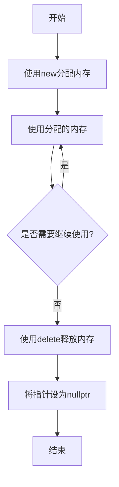

# C++ delete运算符

## 基本概念

在C++中，`delete`运算符用于释放动态分配的内存。当我们使用`new`运算符分配内存后，如果不再需要这块内存，应该使用`delete`运算符将其释放，以避免内存泄漏。

:::note
内存泄漏是指程序分配的内存由于某种原因无法被释放，导致系统可用内存逐渐减少，最终可能导致程序或系统崩溃。
:::

`delete`运算符执行以下两个主要操作：
1. 调用对象的析构函数（如果是类对象）
2. 释放对象占用的内存

## 基本语法

`delete`运算符的基本语法如下：

```cpp
delete pointer;       // 删除单个对象
delete[] pointer;     // 删除数组
```

其中`pointer`是指向动态分配内存的指针。

## 使用delete释放单个对象

当使用`new`分配单个对象的内存时，应该使用`delete`（不带方括号）来释放：

```cpp
#include <iostream>
using namespace std;

int main() {
    // 动态分配一个整数
    int* p = new int;
    
    // 使用该整数
    *p = 10;
    cout << "动态分配的整数值: " << *p << endl;
    
    // 释放内存
    delete p;
    
    // 将指针置为nullptr
    p = nullptr;
    
    return 0;
}
```

**输出：**
```
动态分配的整数值: 10
```

:::tip
释放内存后，将指针设为`nullptr`是一个良好的编程习惯，可以避免悬挂指针（dangling pointer）问题。
:::

## 使用delete[]释放数组

当使用`new[]`分配数组时，必须使用`delete[]`（带方括号）来释放：

```cpp
#include <iostream>
using namespace std;

int main() {
    // 动态分配一个整数数组
    int* arr = new int[5];
    
    // 初始化数组
    for(int i = 0; i < 5; i++) {
        arr[i] = i * 10;
    }
    
    // 输出数组元素
    cout << "数组元素: ";
    for(int i = 0; i < 5; i++) {
        cout << arr[i] << " ";
    }
    cout << endl;
    
    // 释放数组内存
    delete[] arr;
    
    // 将指针置为nullptr
    arr = nullptr;
    
    return 0;
}
```

**输出：**
```
数组元素: 0 10 20 30 40
```

:::caution
使用`delete`释放`new[]`分配的内存，或使用`delete[]`释放`new`分配的内存，都会导致未定义行为（undefined behavior）。
:::

## 对类对象使用delete

当我们删除一个类对象时，`delete`运算符会先调用对象的析构函数，然后释放内存：

```cpp
#include <iostream>
using namespace std;

class MyClass {
public:
    MyClass() {
        cout << "构造函数被调用" << endl;
    }
    
    ~MyClass() {
        cout << "析构函数被调用" << endl;
    }
    
    void display() {
        cout << "MyClass对象的方法被调用" << endl;
    }
};

int main() {
    // 动态创建一个MyClass对象
    MyClass* obj = new MyClass();
    
    // 使用对象
    obj->display();
    
    // 删除对象并释放内存
    delete obj;
    
    return 0;
}
```

**输出：**
```
构造函数被调用
MyClass对象的方法被调用
析构函数被调用
```

## 常见错误与陷阱

### 1. 内存泄漏

忘记释放动态分配的内存是一个常见错误：

```cpp
void createMemoryLeak() {
    int* p = new int[100];  // 分配内存
    
    // 函数结束时没有释放内存，导致内存泄漏
}
```

### 2. 重复释放（double delete）

多次删除同一个指针会导致未定义行为：

```cpp
int* p = new int;
delete p;  // 正确的释放
delete p;  // 错误：重复释放同一指针
```

### 3. 使用已释放的内存（use-after-free）

```cpp
int* p = new int;
*p = 10;
delete p;    // 释放内存
*p = 20;     // 错误：访问已释放的内存
```

### 4. 删除空指针

删除`nullptr`是安全的，不会有任何效果：

```cpp
int* p = nullptr;
delete p;  // 安全，没有效果
```

## 智能指针：现代C++的内存管理解决方案

在现代C++（C++11及以后）中，推荐使用智能指针来自动管理内存，避免手动调用`delete`：

```cpp
#include <iostream>
#include <memory>
using namespace std;

int main() {
    // 使用unique_ptr
    unique_ptr<int> p1(new int(10));
    cout << "unique_ptr管理的值: " << *p1 << endl;
    
    // 使用shared_ptr
    shared_ptr<int> p2 = make_shared<int>(20);
    cout << "shared_ptr管理的值: " << *p2 << endl;
    
    // 函数结束时，智能指针会自动释放内存
    return 0;
}
```

**输出：**
```
unique_ptr管理的值: 10
shared_ptr管理的值: 20
```

## 内存管理图解

以下是一个`new`和`delete`内存管理过程的示意图：



## 实际应用案例

### 动态数据结构实现

以下是一个简单的链表节点实现，展示了`delete`在数据结构中的应用：

```cpp
#include <iostream>
using namespace std;

// 链表节点
struct Node {
    int data;
    Node* next;
    
    Node(int val) : data(val), next(nullptr) {}
};

// 简单的链表类
class LinkedList {
private:
    Node* head;
    
public:
    LinkedList() : head(nullptr) {}
    
    // 析构函数中释放所有节点
    ~LinkedList() {
        Node* current = head;
        while (current != nullptr) {
            Node* next = current->next;
            delete current;  // 释放节点内存
            current = next;
        }
        head = nullptr;
    }
    
    // 在链表头添加新节点
    void addFront(int val) {
        Node* newNode = new Node(val);  // 动态分配新节点
        newNode->next = head;
        head = newNode;
    }
    
    // 删除指定值的节点
    bool remove(int val) {
        if (head == nullptr) return false;
        
        // 如果要删除的是头节点
        if (head->data == val) {
            Node* temp = head;
            head = head->next;
            delete temp;  // 释放节点内存
            return true;
        }
        
        // 查找待删除节点
        Node* current = head;
        while (current->next != nullptr && current->next->data != val) {
            current = current->next;
        }
        
        // 若找到目标节点
        if (current->next != nullptr) {
            Node* temp = current->next;
            current->next = temp->next;
            delete temp;  // 释放节点内存
            return true;
        }
        
        return false;
    }
    
    // 打印链表内容
    void print() {
        Node* current = head;
        while (current != nullptr) {
            cout << current->data << " -> ";
            current = current->next;
        }
        cout << "nullptr" << endl;
    }
};

int main() {
    LinkedList list;
    
    // 添加元素
    list.addFront(30);
    list.addFront(20);
    list.addFront(10);
    
    cout << "初始链表: ";
    list.print();
    
    // 删除元素
    list.remove(20);
    
    cout << "删除20后: ";
    list.print();
    
    return 0;
}
```

**输出：**
```
初始链表: 10 -> 20 -> 30 -> nullptr
删除20后: 10 -> 30 -> nullptr
```

## 总结

`delete`运算符是C++中用于释放动态分配内存的关键工具。正确使用`delete`可以避免内存泄漏、提高程序性能，并确保资源得到适当管理。以下是本文的关键要点：

1. `delete`用于释放单个对象，`delete[]`用于释放数组
2. `delete`会自动调用对象的析构函数（如果存在）
3. 释放内存后应将指针设为`nullptr`
4. 避免重复释放（double delete）和使用已释放的内存
5. 在现代C++中，考虑使用智能指针（`unique_ptr`、`shared_ptr`）替代手动内存管理

## 练习

1. 编写一个程序，动态分配一个整数数组，填充一些值，然后正确释放它。
2. 创建一个简单的类，在构造函数和析构函数中添加输出语句，然后使用`new`和`delete`创建和删除该类的实例。
3. 实现一个简单的动态字符串类，使用`new`和`delete`管理字符数组。
4. 尝试找出并修复以下代码中的内存泄漏问题：
   ```cpp
   void problem() {
       int* array1 = new int[10];
       int* array2 = new int[20];
       array2 = array1;  // 这里有问题
   }
   ```
5. 将上述链表示例改写，使用智能指针替代原始指针，消除手动调用`delete`的需要。

## 额外资源

- [C++ Reference on delete operator](https://en.cppreference.com/w/cpp/language/delete)
- 《C++ Primer》第12章：动态内存
- 《Effective C++》中关于资源管理的条款