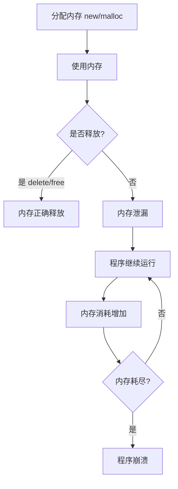

# C++ 内存泄漏

内存泄漏是C++编程中常见且棘手的问题，尤其对初学者而言。当程序分配了内存但未能正确释放时，就会发生内存泄漏。这些"泄漏"的内存无法被程序再次使用，也无法被操作系统回收，直到程序终止。长时间运行的程序中的内存泄漏可能导致系统资源耗尽，最终造成程序崩溃或系统不稳定。

## 什么是内存泄漏？

内存泄漏指的是程序中已动态分配的堆内存由于某种原因程序未释放或无法释放，导致程序运行过程中内存消耗持续增加的现象。

:::note
在C++中，内存管理主要依赖程序员手动完成，这与具有自动垃圾回收机制的语言（如Java、Python）有很大不同。
:::

## 为什么内存泄漏会发生？

内存泄漏主要有以下几种常见原因：

1. **忘记释放内存**：使用`new`分配内存后，未使用对应的`delete`释放
2. **丢失指针引用**：指向已分配内存的指针被覆盖或超出作用域
3. **循环引用**：在使用智能指针时，多个对象互相引用导致无法自动释放
4. **异常发生时未释放资源**：在异常处理路径上忘记释放内存
5. **不正确的资源管理**：对同一内存区域重复释放或释放未分配的内存

## 内存泄漏示例

### 1. 基本内存泄漏

```cpp
void memoryLeakExample() {
    int* ptr = new int(10); // 分配内存
    
    // 使用ptr
    *ptr = 20;
    cout << "Value: " << *ptr << endl;
    
    // 函数结束，但没有释放内存
    // 应该加上 delete ptr;
}

int main() {
    memoryLeakExample();
    // ptr指向的内存已经泄漏
    return 0;
}
```

**输出：**
```
Value: 20
```

在这个示例中，`new int(10)`分配的内存永远不会被释放，因为我们忘记调用`delete`。虽然`ptr`变量本身是局部变量，会在函数结束时被销毁，但它指向的堆内存不会自动释放。

### 2. 在循环中的内存泄漏

```cpp
void leakInLoop() {
    for (int i = 0; i < 1000; i++) {
        int* numbers = new int[100]; // 每次循环分配内存
        // 处理numbers数组
        // 缺少 delete[] numbers; 
    }
}
```

这段代码每次循环都分配了一个新的数组，但从未释放它们。运行该函数会泄漏1000个数组，共100,000个整数的内存空间！

### 3. 异常导致的内存泄漏

```cpp
void exceptionLeak() {
    int* ptr = new int[100];
    
    // 可能抛出异常的代码
    try {
        processSomething(); // 假设此函数可能抛出异常
    }
    catch (const std::exception& e) {
        std::cerr << "Exception occurred: " << e.what() << std::endl;
        // 没有释放ptr
        // 应该加上 delete[] ptr;
        throw; // 重新抛出异常
    }
    
    delete[] ptr; // 如果发生异常，这行代码永远不会执行
}
```

## 如何检测内存泄漏？

检测内存泄漏有多种方法：

1. **使用内存检测工具**：
   - Valgrind (Linux/macOS)
   - Dr. Memory (Windows)
   - Visual Studio内置的内存泄漏检测器
   - AddressSanitizer (ASAN)

2. **手动跟踪内存分配**：
   创建自定义内存分配和释放函数，记录每次分配和释放

```cpp
// 简单的内存跟踪示例
#include <iostream>
#include <map>

std::map<void*, std::string> allocations;

void* operator new(size_t size, const char* file, int line) {
    void* ptr = malloc(size);
    allocations[ptr] = std::string(file) + ":" + std::to_string(line);
    return ptr;
}

#define new new(__FILE__, __LINE__)

void operator delete(void* ptr) noexcept {
    allocations.erase(ptr);
    free(ptr);
}

void checkLeaks() {
    if (allocations.empty()) {
        std::cout << "No memory leaks detected" << std::endl;
    } else {
        std::cout << "Memory leaks detected:" << std::endl;
        for (const auto& pair : allocations) {
            std::cout << "Address: " << pair.first << ", allocated at: " << pair.second << std::endl;
        }
    }
}
```

## 防止内存泄漏的最佳实践

### 1. 使用智能指针

C++11引入了智能指针，它们能自动管理内存：

```cpp
#include <memory>

void smartPointerExample() {
    // 使用unique_ptr - 自动释放内存
    std::unique_ptr<int> ptr1(new int(10));
    
    // 更现代的写法
    auto ptr2 = std::make_unique<int>(20);
    
    // 使用shared_ptr - 引用计数
    std::shared_ptr<int> ptr3 = std::make_shared<int>(30);
    
    {
        // ptr4与ptr3共享所有权
        auto ptr4 = ptr3;
        std::cout << "Inside block, count: " << ptr3.use_count() << std::endl; // 2
    } // ptr4超出作用域，引用计数减1
    
    std::cout << "Outside block, count: " << ptr3.use_count() << std::endl; // 1
    
} // 所有指针超出作用域，内存自动释放
```

**输出：**
```
Inside block, count: 2
Outside block, count: 1
```

### 2. 遵循RAII原则

RAII (Resource Acquisition Is Initialization) 是C++中管理资源的重要原则，它确保资源在对象构造时获取，在对象析构时释放。

```cpp
class ResourceManager {
private:
    int* resource;
    
public:
    ResourceManager() : resource(new int[100]) {
        std::cout << "Resource acquired" << std::endl;
    }
    
    ~ResourceManager() {
        delete[] resource;
        std::cout << "Resource released" << std::endl;
    }
    
    // 禁止复制，防止多次释放同一资源
    ResourceManager(const ResourceManager&) = delete;
    ResourceManager& operator=(const ResourceManager&) = delete;
};

void raiiExample() {
    {
        ResourceManager rm;
        // 使用资源
        // 无需担心异常发生时的资源释放
    } // rm超出作用域，资源自动释放
    
    std::cout << "After block" << std::endl;
}
```

**输出：**
```
Resource acquired
Resource released
After block
```

### 3. 避免裸指针管理资源

尽量不要直接使用`new`和`delete`管理资源，而是使用容器、智能指针和RAII类。

```cpp
// 不推荐
void badPractice() {
    int* array = new int[10];
    // 使用array
    delete[] array;
}

// 推荐
void goodPractice() {
    // 使用容器
    std::vector<int> array(10);
    // 使用array
    // 自动清理
}
```

### 4. 使用内存安全的容器

标准库容器（如`vector`, `string`, `map`等）自动管理它们的内存。

```cpp
void containerExample() {
    // 不需要手动管理内存
    std::vector<int> numbers;
    
    for (int i = 0; i < 100; i++) {
        numbers.push_back(i);
    }
    
    // 即使发生异常，vector也会正确释放内存
}
```

## 实际案例：内存泄漏分析

假设我们有一个简单的文本编辑器应用程序，它允许用户打开多个文档：

```cpp
class Document {
private:
    char* content;
    size_t size;

public:
    Document(const char* filename) {
        // 假设loadFile分配内存并返回指针和大小
        content = loadFile(filename, &size);
    }
    
    // 缺少析构函数！应该添加:
    // ~Document() { delete[] content; }
};

class Editor {
private:
    std::vector<Document*> documents;

public:
    void openDocument(const char* filename) {
        documents.push_back(new Document(filename));
    }
    
    void closeDocument(int index) {
        // 只移除了指针，没有释放内存!
        if (index >= 0 && index < documents.size()) {
            // 应该: delete documents[index];
            documents.erase(documents.begin() + index);
        }
    }
    
    ~Editor() {
        // 没有清理documents中的指针
    }
};
```

这个编辑器有两个主要的内存泄漏问题：

1. `Document`类没有析构函数来释放`content`指针
2. `Editor`类在关闭文档时没有释放`Document`对象，也没有在析构函数中清理

### 修复后的代码

```cpp
class Document {
private:
    char* content;
    size_t size;

public:
    Document(const char* filename) {
        content = loadFile(filename, &size);
    }
    
    // 添加析构函数
    ~Document() {
        delete[] content; // 释放内容
    }
};

class Editor {
private:
    std::vector<std::unique_ptr<Document>> documents; // 使用智能指针

public:
    void openDocument(const char* filename) {
        documents.push_back(std::make_unique<Document>(filename));
    }
    
    void closeDocument(int index) {
        if (index >= 0 && index < documents.size()) {
            documents.erase(documents.begin() + index); // 智能指针会自动释放Document
        }
    }
    
    // 不需要显式清理，智能指针会处理
};
```

## 内存泄漏的影响

1. **性能下降**：随着泄漏内存的增加，可用内存减少，系统可能开始使用虚拟内存（交换空间），导致性能大幅下降
2. **程序崩溃**：最终，当可用内存耗尽时，程序将无法分配新内存，导致崩溃
3. **系统不稳定**：大量内存泄漏可能影响整个系统的稳定性
4. **资源浪费**：即使程序没有崩溃，泄漏的内存也无法被其他应用程序使用

## 内存泄漏的生命周期



## 总结

内存泄漏是C++程序中常见且危险的问题。作为初学者，理解和防止内存泄漏对于编写健壮的C++程序至关重要。关键点包括：

1. 每次使用`new`分配内存时，确保使用`delete`释放它
2. 使用现代C++特性如智能指针、标准容器和RAII原则
3. 学会使用内存泄漏检测工具
4. 尽量避免直接管理内存，而是依赖已经处理好内存管理的库和工具

通过遵循这些最佳实践，你可以显著减少C++程序中的内存泄漏问题，编写出更稳定、更高效的代码。

## 练习

1. 找出并修复以下代码中的内存泄漏：
   ```cpp
   void function() {
       int* array = new int[50];
       for (int i = 0; i < 50; i++) {
           array[i] = i * 2;
       }
       if (array[10] > 15) {
           return; // 内存泄漏！
       }
       delete[] array;
   }
   ```

2. 重写以下函数，使用智能指针避免内存泄漏：
   ```cpp
   class Resource {
   public:
       void doSomething() { /* ... */ }
   };

   Resource* createAndUseResource() {
       Resource* res = new Resource();
       res->doSomething();
       return res; // 调用者可能忘记释放
   }
   ```

3. 使用Valgrind或类似工具检测你自己写的一个C++程序中的内存泄漏。

## 附加资源

- [Valgrind内存调试工具官方文档](https://valgrind.org/docs/manual/mc-manual.html)
- [C++ Core Guidelines: 内存管理](https://isocpp.github.io/CppCoreGuidelines/CppCoreGuidelines#r-resource-management)
- 《Effective Modern C++》by Scott Meyers - 关于智能指针和资源管理的章节
- 《C++ Primer》第5版 - 动态内存和智能指针章节

:::tip
记住，现代C++提供了许多工具来帮助我们避免手动内存管理。养成良好的习惯，优先使用智能指针和容器等高级抽象，而不是原始指针和手动内存管理。
:::