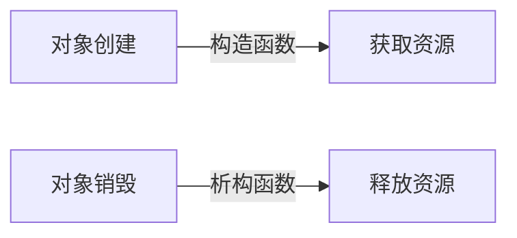

# C++ RAII原则

## 什么是RAII？

RAII (Resource Acquisition Is Initialization) 是C++中的一种资源管理技术，直译为"资源获取即初始化"。这是C++特有的资源管理方式，它将资源的生命周期与对象的生命周期绑定，确保资源在对象创建时获取，在对象销毁时释放。

:::tip 核心思想
让类的构造函数负责获取资源，析构函数负责释放资源，从而确保资源管理的安全性和自动化。
:::

## 为什么需要RAII？

在不使用RAII的情况下，资源管理往往是这样的：

```cpp
void functionWithoutRAII() {
    // 分配资源
    int* array = new int[10];
    
    // 使用资源
    array[0] = 10;
    
    // 如果这里发生异常或提前返回，会导致内存泄漏！
    
    // 释放资源
    delete[] array;
}
```

这种方式有几个明显的问题：
1. 如果函数中间发生异常，资源不会被释放
2. 如果函数有多个返回点，每个返回前都需要记得释放资源
3. 代码冗长且容易出错

## RAII如何工作

RAII通过将资源封装在类中，利用C++对象生命周期的确定性来管理资源：



## RAII基本实现

下面是一个简单的RAII示例，展示了如何管理动态内存：

```cpp
class ArrayWrapper {
private:
    int* data;
    
public:
    // 构造函数获取资源
    ArrayWrapper(size_t size) {
        data = new int[size];
        std::cout << "Resource acquired" << std::endl;
    }
    
    // 析构函数释放资源
    ~ArrayWrapper() {
        delete[] data;
        std::cout << "Resource released" << std::endl;
    }
    
    // 提供访问资源的接口
    int& at(size_t index) {
        return data[index];
    }
};

void functionWithRAII() {
    // 资源管理被封装在对象中
    ArrayWrapper arr(10);
    
    // 使用资源
    arr.at(0) = 10;
    
    // 不需要手动释放资源，对象离开作用域时会自动调用析构函数
}
```

输出：
```
Resource acquired
Resource released
```

## RAII的优势

1. **自动资源管理**：不需要手动释放资源
2. **异常安全**：即使发生异常，资源也会被正确释放
3. **代码简化**：减少样板代码，提高可读性
4. **防止资源泄漏**：确保资源总是被释放

## 常见的RAII应用场景

### 1. 内存管理

标准库中的智能指针是RAII的典型应用：

```cpp
#include <memory>

void smartPointerExample() {
    // std::unique_ptr自动管理内存
    std::unique_ptr<int[]> arr(new int[10]);
    
    arr[0] = 42;
    
    // 不需要delete，离开作用域时自动释放内存
}
```

### 2. 文件操作

```cpp
#include <fstream>
#include <string>

void fileHandlingExample() {
    // std::fstream是RAII类，自动管理文件资源
    std::ofstream file("example.txt");
    
    if (file.is_open()) {
        file << "Hello, RAII!";
    }
    
    // 不需要手动关闭文件，离开作用域时自动关闭
}
```

### 3. 互斥锁

```cpp
#include <mutex>

std::mutex mtx;

void lockExample() {
    // std::lock_guard是RAII类，自动管理锁
    std::lock_guard<std::mutex> lock(mtx);
    
    // 这里的代码是互斥的
    
    // 不需要手动解锁，离开作用域时自动解锁
}
```

### 4. 数据库连接

```cpp
class DbConnection {
public:
    DbConnection() {
        std::cout << "Database connected" << std::endl;
        // 实际代码会连接到数据库
    }
    
    ~DbConnection() {
        std::cout << "Database disconnected" << std::endl;
        // 实际代码会断开数据库连接
    }
    
    void query(const std::string& sql) {
        std::cout << "Executing: " << sql << std::endl;
        // 实际执行SQL查询
    }
};

void databaseExample() {
    DbConnection db;
    db.query("SELECT * FROM users");
    // 离开作用域时自动断开连接
}
```

## 实现自定义RAII类

下面是一个更完整的RAII类示例，用于管理文件句柄：

```cpp
#include <iostream>
#include <stdexcept>

class FileHandler {
private:
    FILE* file;
    bool closed;

public:
    FileHandler(const char* filename, const char* mode) : closed(false) {
        file = fopen(filename, mode);
        if (!file) {
            throw std::runtime_error("Could not open file");
        }
        std::cout << "File opened successfully" << std::endl;
    }
    
    ~FileHandler() {
        close();
    }
    
    // 禁止复制
    FileHandler(const FileHandler&) = delete;
    FileHandler& operator=(const FileHandler&) = delete;
    
    // 允许移动
    FileHandler(FileHandler&& other) noexcept : file(other.file), closed(other.closed) {
        other.file = nullptr;
        other.closed = true;
    }
    
    FileHandler& operator=(FileHandler&& other) noexcept {
        if (this != &other) {
            close();
            file = other.file;
            closed = other.closed;
            other.file = nullptr;
            other.closed = true;
        }
        return *this;
    }
    
    void write(const std::string& data) {
        if (closed || !file) {
            throw std::runtime_error("File already closed");
        }
        fputs(data.c_str(), file);
    }
    
    void close() {
        if (!closed && file) {
            fclose(file);
            closed = true;
            std::cout << "File closed" << std::endl;
        }
    }
    
    bool is_open() const {
        return !closed && file;
    }
};

void fileExample() {
    try {
        FileHandler file("example.txt", "w");
        file.write("Hello, RAII!");
        // 文件会在离开作用域时自动关闭
    }
    catch (const std::exception& e) {
        std::cerr << "Error: " << e.what() << std::endl;
    }
}
```

## RAII与异常安全

RAII是C++异常安全编程的基石。看下面的例子：

```cpp
void exceptionSafetyExample() {
    try {
        std::unique_ptr<int[]> arr(new int[1000]);
        
        // 假设这里抛出异常
        throw std::runtime_error("Something went wrong!");
        
        // 即使未执行到这一行，内存也会被释放
    }
    catch (const std::exception& e) {
        std::cout << "Exception caught: " << e.what() << std::endl;
        // arr已经被正确释放，没有内存泄漏
    }
}
```

## RAII的最佳实践

1. **封装单一资源**：每个RAII类应该只管理一种资源
2. **禁止或谨慎处理拷贝**：资源通常不应该被复制
3. **考虑移动语义**：C++11后，可以实现移动构造函数和移动赋值运算符
4. **提供显式关闭方法**：有时需要在对象生命周期结束前释放资源
5. **保持简单**：RAII类应该专注于资源管理，不要混入过多的业务逻辑

:::caution 注意
RAII对象应该放在栈上，而不是堆上（不要用new创建RAII对象）。否则，你还需要管理RAII对象本身的生命周期。
:::

## 常见RAII标准库类

| 类名 | 头文件 | 管理的资源 |
|------|--------|-----------|
| `std::unique_ptr` | `<memory>` | 动态分配的内存（独占所有权）|
| `std::shared_ptr` | `<memory>` | 动态分配的内存（共享所有权）|
| `std::weak_ptr` | `<memory>` | 不影响所有权的shared_ptr引用 |
| `std::lock_guard` | `<mutex>` | 互斥锁 |
| `std::unique_lock` | `<mutex>` | 可移动的互斥锁 |
| `std::fstream` | `<fstream>` | 文件资源 |

## 总结

RAII是C++中管理资源的强大技术，它利用对象的生命周期来自动化资源的获取和释放。RAII的使用可以：

1. 防止资源泄漏
2. 提供异常安全保证
3. 使代码更简洁、更可维护
4. 减少bug和错误

正确使用RAII是编写健壮C++代码的关键。如果你需要管理任何类型的资源（内存、文件、锁等），都应该考虑使用RAII技术。

## 练习

1. 创建一个简单的RAII类来管理动态数组，并提供基本的数组操作（如获取元素、设置元素值）
2. 编写一个RAII类来管理互斥锁
3. 使用RAII设计一个简单的资源池（如数据库连接池）
4. 为现有的非RAII资源（如C语言风格的文件处理）创建RAII封装

## 延伸阅读

- C++标准库中的智能指针详解
- C++中的异常安全性级别
- RAII与移动语义结合使用
- 设计模式与RAII的结合

通过掌握RAII，你将能够编写更安全、更健壮的C++代码，避免资源泄露和相关错误，这是成为专业C++程序员的重要一步。