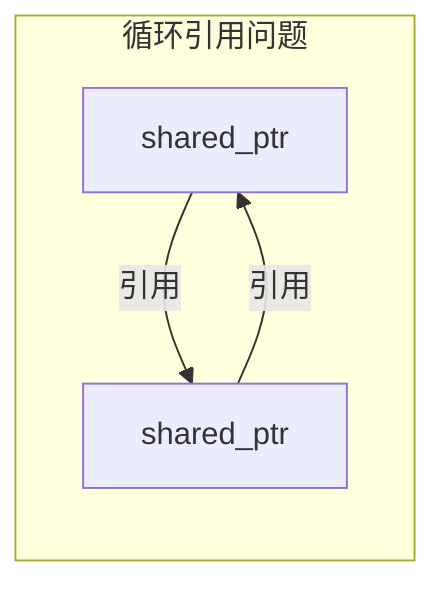
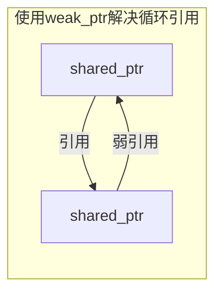

# C++ 智能指针详解

## 智能指针简介

在C++编程中，内存管理一直是一个重要且容易出错的方面。使用传统的`new`和`delete`操作符进行手动内存管理往往导致各种问题，如内存泄漏、悬挂指针（dangling pointers）和重复释放内存等。

智能指针是C++标准库提供的一种自动化内存管理工具，它们能够在适当的时机自动释放所指向的内存，从而避免上述问题。智能指针本质上是对原始指针的封装，通过RAII（Resource Acquisition Is Initialization，资源获取即初始化）技术实现自动内存管理。

:::tip
智能指针是现代C++（C++11及以后）推荐的内存管理方式，能够有效减少内存泄漏和提高代码安全性。
:::

## C++ 中的智能指针类型

C++11标准库中提供了三种主要的智能指针：

1. `std::unique_ptr` - 独占所有权
2. `std::shared_ptr` - 共享所有权
3. `std::weak_ptr` - 弱引用，配合`shared_ptr`使用

这些智能指针定义在`<memory>`头文件中。

## std::unique_ptr

`std::unique_ptr`是一种独占所有权的智能指针，它确保一个对象只能被一个指针拥有，当该指针被销毁时，它所指向的对象也会被自动删除。

### 基本用法

```cpp
#include <iostream>
#include <memory>

int main() {
    // 创建unique_ptr
    std::unique_ptr<int> ptr1(new int(10));
    
    // 推荐使用make_unique (C++14)
    std::unique_ptr<int> ptr2 = std::make_unique<int>(20);
    
    // 访问指针指向的值
    std::cout << "ptr1指向的值: " << *ptr1 << std::endl;
    std::cout << "ptr2指向的值: " << *ptr2 << std::endl;
    
    // 修改指针指向的值
    *ptr1 = 30;
    std::cout << "修改后ptr1指向的值: " << *ptr1 << std::endl;
    
    // unique_ptr不支持拷贝，但支持移动
    // std::unique_ptr<int> ptr3 = ptr1;  // 编译错误
    std::unique_ptr<int> ptr3 = std::move(ptr1);  // 移动所有权
    
    // ptr1现在为空
    if (!ptr1) {
        std::cout << "ptr1现在为空" << std::endl;
    }
    
    std::cout << "ptr3指向的值: " << *ptr3 << std::endl;
    
    return 0;  // 自动释放ptr2和ptr3指向的内存
}
```

输出结果：
```
ptr1指向的值: 10
ptr2指向的值: 20
修改后ptr1指向的值: 30
ptr1现在为空
ptr3指向的值: 30
```

### 管理数组

`unique_ptr`也能管理数组：

```cpp
#include <iostream>
#include <memory>

int main() {
    // 创建管理数组的unique_ptr
    std::unique_ptr<int[]> array = std::make_unique<int[]>(5);
    
    // 设置数组元素
    for (int i = 0; i < 5; ++i) {
        array[i] = i * 10;
    }
    
    // 访问数组元素
    for (int i = 0; i < 5; ++i) {
        std::cout << "array[" << i << "] = " << array[i] << std::endl;
    }
    
    return 0;  // 数组会被自动删除
}
```

输出结果：
```
array[0] = 0
array[1] = 10
array[2] = 20
array[3] = 30
array[4] = 40
```

### 自定义删除器

`unique_ptr`支持自定义删除器：

```cpp
#include <iostream>
#include <memory>

void customDeleter(int* ptr) {
    std::cout << "自定义删除器被调用，删除值: " << *ptr << std::endl;
    delete ptr;
}

int main() {
    // 使用自定义删除器
    std::unique_ptr<int, decltype(&customDeleter)> ptr(new int(100), customDeleter);
    
    std::cout << "ptr指向的值: " << *ptr << std::endl;
    
    return 0;
}
```

输出结果：
```
ptr指向的值: 100
自定义删除器被调用，删除值: 100
```

## std::shared_ptr

`std::shared_ptr`实现了共享所有权概念，多个`shared_ptr`可以指向同一个对象，当最后一个指向对象的`shared_ptr`被销毁时，该对象才会被删除。

### 基本用法

```cpp
#include <iostream>
#include <memory>

int main() {
    // 创建shared_ptr
    std::shared_ptr<int> ptr1(new int(42));
    
    // 推荐使用make_shared
    std::shared_ptr<int> ptr2 = std::make_shared<int>(42);
    
    // 查看引用计数
    std::cout << "ptr2的引用计数: " << ptr2.use_count() << std::endl;
    
    // 共享所有权
    std::shared_ptr<int> ptr3 = ptr2;
    std::cout << "共享后ptr2的引用计数: " << ptr2.use_count() << std::endl;
    
    // 修改值
    *ptr3 = 100;
    std::cout << "通过ptr3修改后，ptr2指向的值: " << *ptr2 << std::endl;
    
    // ptr3释放对象的所有权
    ptr3.reset();
    std::cout << "ptr3重置后，ptr2的引用计数: " << ptr2.use_count() << std::endl;
    
    return 0;  // ptr1和ptr2会正确释放内存
}
```

输出结果：
```
ptr2的引用计数: 1
共享后ptr2的引用计数: 2
通过ptr3修改后，ptr2指向的值: 100
ptr3重置后，ptr2的引用计数: 1
```

### shared_ptr与自定义删除器

```cpp
#include <iostream>
#include <memory>

struct Person {
    std::string name;
    int age;
    
    Person(std::string n, int a) : name(std::move(n)), age(a) {
        std::cout << "Person " << name << " 被创建" << std::endl;
    }
    
    ~Person() {
        std::cout << "Person " << name << " 被删除" << std::endl;
    }
};

int main() {
    // 创建自定义对象的shared_ptr
    auto person1 = std::make_shared<Person>("Alice", 25);
    
    {
        // 在内部作用域创建共享所有权的指针
        auto person2 = person1;
        std::cout << "person1的引用计数: " << person1.use_count() << std::endl;
        std::cout << "person2 name: " << person2->name << ", age: " << person2->age << std::endl;
    } // person2超出作用域
    
    std::cout << "内部作用域结束后，person1的引用计数: " << person1.use_count() << std::endl;
    
    return 0;
} // person1超出作用域，Person对象被删除
```

输出结果：
```
Person Alice 被创建
person1的引用计数: 2
person2 name: Alice, age: 25
内部作用域结束后，person1的引用计数: 1
Person Alice 被删除
```

## std::weak_ptr

`std::weak_ptr`是一种不控制所指向对象生命周期的智能指针。它必须从`std::shared_ptr`创建，并且不会增加引用计数。主要用于解决`shared_ptr`可能出现的循环引用问题。

### 基本用法和循环引用问题

```cpp
#include <iostream>
#include <memory>

class B; // 前向声明

class A {
public:
    std::shared_ptr<B> b_ptr;
    
    A() { std::cout << "A 被创建" << std::endl; }
    ~A() { std::cout << "A 被销毁" << std::endl; }
};

class B {
public:
    std::weak_ptr<A> a_ptr; // 使用weak_ptr避免循环引用
    
    B() { std::cout << "B 被创建" << std::endl; }
    ~B() { std::cout << "B 被销毁" << std::endl; }
};

int main() {
    // 创建对象
    std::shared_ptr<A> a = std::make_shared<A>();
    std::shared_ptr<B> b = std::make_shared<B>();
    
    // 建立关系
    a->b_ptr = b;
    b->a_ptr = a;
    
    std::cout << "a的引用计数: " << a.use_count() << std::endl;
    std::cout << "b的引用计数: " << b.use_count() << std::endl;
    
    // 检查weak_ptr指向的对象是否存在
    if (auto a_locked = b->a_ptr.lock()) {
        std::cout << "A对象仍然存在，引用计数: " << a_locked.use_count() << std::endl;
    } else {
        std::cout << "A对象已被销毁" << std::endl;
    }
    
    return 0;
} // 程序结束时a和b被正确销毁
```

输出结果：
```
A 被创建
B 被创建
a的引用计数: 1
b的引用计数: 2
A对象仍然存在，引用计数: 2
B 被销毁
A 被销毁
```

:::caution
如果在上面的例子中，B类也使用`shared_ptr`指向A类，那么a和b对象会形成循环引用，导致它们的引用计数永远不会变为0，造成内存泄漏。
:::

### 循环引用问题的图示





## 智能指针的最佳实践

1. **优先使用`std::make_unique`和`std::make_shared`**：它们比直接使用`new`更安全，性能也更好。

2. **使用`std::unique_ptr`作为独占资源的默认选择**：当你需要独占一个资源，并且不需要共享时，使用`unique_ptr`。

3. **仅在需要共享所有权时使用`std::shared_ptr`**：共享指针有额外的开销，只在必要时使用。

4. **使用`std::weak_ptr`处理循环引用问题**：在可能发生循环引用的地方，至少将其中一个`shared_ptr`改为`weak_ptr`。

5. **避免对同一原始指针创建多个智能指针**：

```cpp
int* raw_ptr = new int(10);
std::shared_ptr<int> sp1(raw_ptr);
std::shared_ptr<int> sp2(raw_ptr); // 错误！会导致double-free
```

6. **不要使用`get()`返回的指针创建新的智能指针**：

```cpp
std::shared_ptr<int> sp1 = std::make_shared<int>(10);
std::shared_ptr<int> sp2(sp1.get()); // 错误！会导致double-free
```

## 实际应用案例

### 案例1：资源管理

智能指针非常适合管理文件、数据库连接等资源：

```cpp
#include <iostream>
#include <memory>
#include <fstream>
#include <vector>

class FileManager {
private:
    std::unique_ptr<std::ifstream> file;
    
public:
    FileManager(const std::string& filename) {
        file = std::make_unique<std::ifstream>(filename);
        if (!file->is_open()) {
            throw std::runtime_error("无法打开文件: " + filename);
        }
    }
    
    std::vector<std::string> readLines() {
        std::vector<std::string> lines;
        std::string line;
        
        while (std::getline(*file, line)) {
            lines.push_back(line);
        }
        
        return lines;
    }
    
    // 不需要显式关闭文件，智能指针会自动处理
    // 析构函数也不需要特别编写
};

int main() {
    try {
        FileManager fm("example.txt");
        auto lines = fm.readLines();
        
        for (const auto& line : lines) {
            std::cout << line << std::endl;
        }
    } catch (const std::exception& e) {
        std::cerr << "错误: " << e.what() << std::endl;
    }
    
    return 0;
}
```

### 案例2：工厂模式

智能指针在设计模式中也非常有用：

```cpp
#include <iostream>
#include <memory>
#include <string>
#include <unordered_map>

// 产品接口
class Product {
public:
    virtual ~Product() = default;
    virtual void use() = 0;
};

// 具体产品A
class ConcreteProductA : public Product {
public:
    void use() override {
        std::cout << "使用产品A" << std::endl;
    }
};

// 具体产品B
class ConcreteProductB : public Product {
public:
    void use() override {
        std::cout << "使用产品B" << std::endl;
    }
};

// 工厂类
class Factory {
private:
    // 缓存创建的产品
    std::unordered_map<std::string, std::shared_ptr<Product>> cache;
    
public:
    std::shared_ptr<Product> createProduct(const std::string& type) {
        // 先检查缓存
        auto it = cache.find(type);
        if (it != cache.end()) {
            std::cout << "返回缓存的产品: " << type << std::endl;
            return it->second;
        }
        
        // 创建新产品
        std::shared_ptr<Product> product;
        if (type == "A") {
            product = std::make_shared<ConcreteProductA>();
        } else if (type == "B") {
            product = std::make_shared<ConcreteProductB>();
        } else {
            throw std::invalid_argument("未知的产品类型: " + type);
        }
        
        // 加入缓存
        cache[type] = product;
        std::cout << "创建新产品: " << type << std::endl;
        return product;
    }
};

int main() {
    Factory factory;
    
    // 创建产品
    auto productA1 = factory.createProduct("A");
    auto productB = factory.createProduct("B");
    auto productA2 = factory.createProduct("A"); // 将返回缓存的产品
    
    // 使用产品
    productA1->use();
    productB->use();
    productA2->use();
    
    return 0;
}
```

输出结果：
```
创建新产品: A
创建新产品: B
返回缓存的产品: A
使用产品A
使用产品B
使用产品A
```

## 总结

智能指针是C++中非常重要的内存管理工具，可以显著减少内存泄漏的风险，并使代码更加安全、健壮。

- **std::unique_ptr**：适用于独占所有权的场景，不允许复制，但支持移动。
- **std::shared_ptr**：适用于共享所有权的场景，通过引用计数维护对象生命周期。
- **std::weak_ptr**：不参与引用计数，主要用于解决循环引用问题。

在现代C++编程中，应该优先考虑使用智能指针而不是原始指针，特别是在需要动态分配内存的情况下。

:::tip
如果你正在学习C++，掌握智能指针的使用是一项非常重要的技能，它将帮助你写出更加安全、更少bug的代码。
:::

## 练习题

1. 创建一个使用`std::unique_ptr`管理资源的程序，并尝试移动所有权。

2. 实现一个使用`std::shared_ptr`的简单计数器，多个对象共享同一个计数值。

3. 尝试创建一个有循环引用问题的程序，然后使用`std::weak_ptr`解决它。

4. 为自定义的类实现一个释放函数，并将其作为自定义删除器与智能指针一起使用。

## 附加资源

- [C++ Reference - Smart Pointers](https://en.cppreference.com/w/cpp/memory)
- 《Effective Modern C++》第四章：智能指针
- C++核心准则：[资源管理](https://isocpp.github.io/CppCoreGuidelines/CppCoreGuidelines#S-resource)