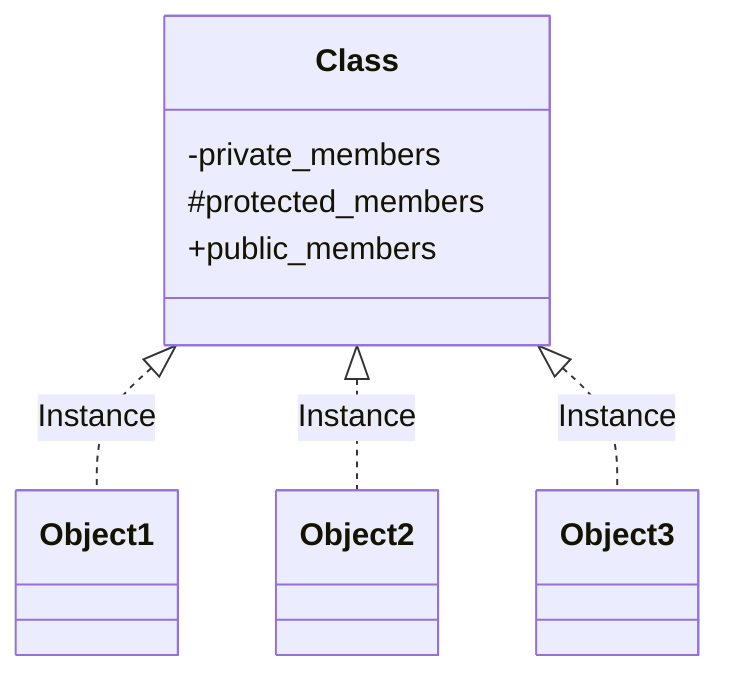

# C++ 类与对象

---
title: C++ 类与对象
description: 介绍C++面向对象编程中的类与对象基础概念，包括类的定义、对象的创建、成员变量和成员函数的使用，以及构造函数和析构函数的基本知识。
---

## 引言

在C++中，类和对象是面向对象编程的核心概念。类是用户自定义的数据类型，它是对象的模板或蓝图，定义了对象可以包含的数据和可以执行的操作。对象则是类的实例，是根据类的定义创建的实体。理解类和对象的概念对于掌握C++的面向对象编程至关重要。

## 类的基本概念

类是一种用户定义的数据类型，它将数据和操作数据的函数封装在一起。通过类，我们可以创建新的数据类型，这些数据类型具有自己的数据成员和成员函数。

### 类的定义

在C++中，使用关键字`class`来定义类：

```cpp
class ClassName {
    // 访问说明符
    private:
        // 私有成员
    
    public:
        // 公有成员
    
    protected:
        // 受保护成员
};
```

### 访问说明符

C++中有三种访问说明符：
- **private**：只能在类内部访问
- **public**：可以在类外部访问
- **protected**：只能在类内部和派生类中访问

:::note
如果没有指定访问说明符，类默认为private，而结构体默认为public。
:::

## 创建类和对象

让我们创建一个简单的`Student`类作为示例：

```cpp
#include <iostream>
#include <string>
using namespace std;

class Student {
private:
    string name;
    int age;
    double gpa;

public:
    // 成员函数声明
    void setInfo(string studentName, int studentAge, double studentGpa);
    void displayInfo();
};

// 成员函数定义
void Student::setInfo(string studentName, int studentAge, double studentGpa) {
    name = studentName;
    age = studentAge;
    gpa = studentGpa;
}

void Student::displayInfo() {
    cout << "学生姓名: " << name << endl;
    cout << "年龄: " << age << endl;
    cout << "平均成绩: " << gpa << endl;
}

int main() {
    // 创建对象
    Student student1;
    
    // 使用对象调用成员函数
    student1.setInfo("张三", 20, 3.8);
    student1.displayInfo();
    
    return 0;
}
```

输出结果：
```
学生姓名: 张三
年龄: 20
平均成绩: 3.8
```

### 类的组成部分

1. **成员变量（数据成员）**：用于存储对象的数据。
2. **成员函数（方法）**：用于操作和访问成员变量的函数。

## 构造函数和析构函数

### 构造函数

构造函数是一种特殊的成员函数，它在创建对象时自动调用，用于初始化对象的数据成员。

特点：
- 与类同名
- 没有返回类型，甚至不是void
- 可以重载（多个构造函数）

```cpp
class Student {
private:
    string name;
    int age;
    double gpa;

public:
    // 默认构造函数
    Student() {
        name = "未命名";
        age = 0;
        gpa = 0.0;
    }
    
    // 带参数的构造函数
    Student(string studentName, int studentAge, double studentGpa) {
        name = studentName;
        age = studentAge;
        gpa = studentGpa;
    }
    
    void displayInfo() {
        cout << "学生姓名: " << name << endl;
        cout << "年龄: " << age << endl;
        cout << "平均成绩: " << gpa << endl;
    }
};

int main() {
    // 使用默认构造函数
    Student student1;
    student1.displayInfo();
    
    // 使用带参数的构造函数
    Student student2("李四", 22, 3.5);
    student2.displayInfo();
    
    return 0;
}
```

输出结果：
```
学生姓名: 未命名
年龄: 0
平均成绩: 0
学生姓名: 李四
年龄: 22
平均成绩: 3.5
```

### 析构函数

析构函数是在对象被销毁时自动调用的特殊成员函数，用于释放对象占用的资源。

特点：
- 名称为类名前加上波浪号`~`
- 没有返回类型和参数
- 一个类只能有一个析构函数

```cpp
class DynamicArray {
private:
    int* array;
    int size;

public:
    // 构造函数
    DynamicArray(int arraySize) {
        size = arraySize;
        array = new int[size]; // 动态分配内存
        cout << "创建了大小为 " << size << " 的动态数组" << endl;
    }
    
    // 析构函数
    ~DynamicArray() {
        delete[] array; // 释放动态分配的内存
        cout << "释放了动态数组的内存" << endl;
    }
    
    void setValue(int index, int value) {
        if(index >= 0 && index < size)
            array[index] = value;
    }
    
    int getValue(int index) {
        if(index >= 0 && index < size)
            return array[index];
        return -1;
    }
};

int main() {
    {
        DynamicArray arr(5);
        arr.setValue(0, 10);
        cout << "arr[0] = " << arr.getValue(0) << endl;
    } // arr对象离开作用域，析构函数被调用
    
    cout << "程序继续执行..." << endl;
    return 0;
}
```

输出结果：
```
创建了大小为 5 的动态数组
arr[0] = 10
释放了动态数组的内存
程序继续执行...
```

## 类的内联成员函数

内联成员函数是在类定义内部定义的成员函数，编译器会尝试将其内联展开，这可以提高程序的执行效率。

```cpp
class Counter {
private:
    int count;
    
public:
    // 内联成员函数（在类内定义）
    Counter() { count = 0; }
    
    void increment() { count++; }
    void decrement() { count--; }
    
    int getCount() { return count; }
};
```

## 对象作为函数参数与返回值

### 对象作为函数参数

```cpp
class Point {
public:
    int x, y;
    
    Point(int a = 0, int b = 0) {
        x = a;
        y = b;
    }
};

// 按值传递对象
void displayPoint(Point p) {
    cout << "点坐标：(" << p.x << ", " << p.y << ")" << endl;
}

// 按引用传递对象
void movePoint(Point &p, int dx, int dy) {
    p.x += dx;
    p.y += dy;
}

int main() {
    Point point1(5, 10);
    
    displayPoint(point1); // 按值传递
    
    movePoint(point1, 2, 3); // 按引用传递
    displayPoint(point1);
    
    return 0;
}
```

输出结果：
```
点坐标：(5, 10)
点坐标：(7, 13)
```

### 对象作为函数返回值

```cpp
class Complex {
public:
    double real, imag;
    
    Complex(double r = 0, double i = 0) {
        real = r;
        imag = i;
    }
    
    void display() {
        cout << real << " + " << imag << "i" << endl;
    }
};

// 返回一个Complex对象
Complex addComplex(Complex c1, Complex c2) {
    Complex result;
    result.real = c1.real + c2.real;
    result.imag = c1.imag + c2.imag;
    return result;
}

int main() {
    Complex num1(3.0, 4.0);
    Complex num2(2.5, 1.5);
    
    cout << "num1 = ";
    num1.display();
    
    cout << "num2 = ";
    num2.display();
    
    Complex sum = addComplex(num1, num2);
    cout << "sum = ";
    sum.display();
    
    return 0;
}
```

输出结果：
```
num1 = 3 + 4i
num2 = 2.5 + 1.5i
sum = 5.5 + 5.5i
```

## 类的组合

类的组合是将一个类的对象作为另一个类的成员变量，这种方式可以实现复杂的数据结构。

```cpp
class Date {
private:
    int day, month, year;
    
public:
    Date(int d = 1, int m = 1, int y = 2000) {
        day = d;
        month = m;
        year = y;
    }
    
    void display() {
        cout << day << "/" << month << "/" << year;
    }
};

class Person {
private:
    string name;
    Date birthDate; // 组合：Date类对象作为Person类的成员
    
public:
    Person(string n, int d, int m, int y)
        : name(n), birthDate(d, m, y) {
    }
    
    void display() {
        cout << "姓名: " << name << endl;
        cout << "出生日期: ";
        birthDate.display();
        cout << endl;
    }
};

int main() {
    Person person("王五", 15, 6, 1995);
    person.display();
    
    return 0;
}
```

输出结果：
```
姓名: 王五
出生日期: 15/6/1995
```

## 实际案例：图书管理系统

下面是一个简单的图书管理系统的示例，展示类和对象在实际应用中的使用：

```cpp
#include <iostream>
#include <string>
#include <vector>
using namespace std;

class Book {
private:
    string title;
    string author;
    string isbn;
    bool available;

public:
    Book(string t, string a, string i)
        : title(t), author(a), isbn(i), available(true) {
    }
    
    string getTitle() const { return title; }
    string getAuthor() const { return author; }
    string getISBN() const { return isbn; }
    bool isAvailable() const { return available; }
    
    void borrow() {
        if (available) {
            available = false;
            cout << "《" << title << "》借阅成功!" << endl;
        } else {
            cout << "《" << title << "》已被借出，无法借阅!" << endl;
        }
    }
    
    void returnBook() {
        if (!available) {
            available = true;
            cout << "《" << title << "》归还成功!" << endl;
        } else {
            cout << "《" << title << "》未被借出，无需归还!" << endl;
        }
    }
    
    void display() const {
        cout << "书名: " << title << endl;
        cout << "作者: " << author << endl;
        cout << "ISBN: " << isbn << endl;
        cout << "状态: " << (available ? "可借阅" : "已借出") << endl;
        cout << "-------------------------" << endl;
    }
};

class Library {
private:
    vector<Book> books;
    string name;

public:
    Library(string n) : name(n) {}
    
    void addBook(const Book& book) {
        books.push_back(book);
        cout << "图书《" << book.getTitle() << "》已添加到" << name << endl;
    }
    
    void displayAllBooks() const {
        cout << "\n" << name << "的所有图书:" << endl;
        cout << "=========================" << endl;
        for (const auto& book : books) {
            book.display();
        }
    }
    
    Book* findBook(string title) {
        for (auto& book : books) {
            if (book.getTitle() == title) {
                return &book;
            }
        }
        return nullptr;
    }
};

int main() {
    Library library("城市中央图书馆");
    
    Book book1("C++程序设计", "张三", "978-7-302-12345-6");
    Book book2("数据结构", "李四", "978-7-302-67890-1");
    Book book3("算法导论", "王五", "978-7-115-12345-6");
    
    library.addBook(book1);
    library.addBook(book2);
    library.addBook(book3);
    
    library.displayAllBooks();
    
    // 借书和还书操作
    Book* foundBook = library.findBook("C++程序设计");
    if (foundBook) {
        foundBook->borrow();
    } else {
        cout << "未找到该图书!" << endl;
    }
    
    library.displayAllBooks();
    
    foundBook = library.findBook("C++程序设计");
    if (foundBook) {
        foundBook->returnBook();
    }
    
    library.displayAllBooks();
    
    return 0;
}
```

输出结果：
```
图书《C++程序设计》已添加到城市中央图书馆
图书《数据结构》已添加到城市中央图书馆
图书《算法导论》已添加到城市中央图书馆

城市中央图书馆的所有图书:
=========================
书名: C++程序设计
作者: 张三
ISBN: 978-7-302-12345-6
状态: 可借阅
-------------------------
书名: 数据结构
作者: 李四
ISBN: 978-7-302-67890-1
状态: 可借阅
-------------------------
书名: 算法导论
作者: 王五
ISBN: 978-7-115-12345-6
状态: 可借阅
-------------------------
《C++程序设计》借阅成功!

城市中央图书馆的所有图书:
=========================
书名: C++程序设计
作者: 张三
ISBN: 978-7-302-12345-6
状态: 已借出
-------------------------
书名: 数据结构
作者: 李四
ISBN: 978-7-302-67890-1
状态: 可借阅
-------------------------
书名: 算法导论
作者: 王五
ISBN: 978-7-115-12345-6
状态: 可借阅
-------------------------
《C++程序设计》归还成功!

城市中央图书馆的所有图书:
=========================
书名: C++程序设计
作者: 张三
ISBN: 978-7-302-12345-6
状态: 可借阅
-------------------------
书名: 数据结构
作者: 李四
ISBN: 978-7-302-67890-1
状态: 可借阅
-------------------------
书名: 算法导论
作者: 王五
ISBN: 978-7-115-12345-6
状态: 可借阅
-------------------------
```

## 类与对象的关系图



## 总结

在这篇教程中，我们学习了C++中类和对象的基础知识：

1. 类是用户定义的数据类型，是对象的蓝图。
2. 对象是类的实例，是按照类定义创建的实体。
3. 类包含数据成员（变量）和成员函数（方法）。
4. 访问说明符控制成员的可见性：`private`、`public`和`protected`。
5. 构造函数在对象创建时初始化对象，析构函数在对象销毁时清理资源。
6. 对象可以作为函数参数和返回值使用。
7. 类的组合可以实现复杂的数据结构。

通过图书管理系统的实例，我们看到了类和对象在实际应用中的使用方式。

## 练习

1. 创建一个`Rectangle`类，具有长度和宽度属性，以及计算面积和周长的方法。
2. 实现一个`BankAccount`类，包含账户号码、余额和用户姓名，实现存款和取款功能。
3. 设计一个`Time`类，包含小时、分钟和秒钟，实现时间的加减操作。
4. 扩展图书管理系统，添加用户类和借阅记录类，实现用户借阅历史的管理。

## 进一步学习资源

- C++标准库的`string`、`vector`和其他容器类的使用
- 深入学习构造函数的初始化列表
- 静态成员变量和静态成员函数
- 友元函数和友元类
- 运算符重载
- 继承与多态

掌握类和对象是深入学习C++面向对象编程的基础，通过不断实践，你将能够设计和实现更复杂的程序。