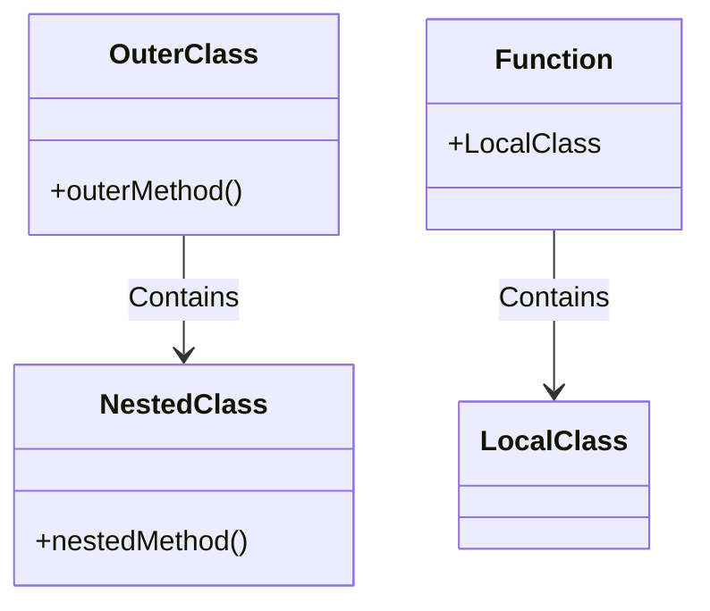

# C++ 局部类

## 什么是局部类？

在C++中，局部类（Local Class）是指定义在函数内部的类。与全局作用域中定义的类或者在其他类中定义的嵌套类不同，局部类的可见性和生命周期仅限于定义它的函数内部。

局部类是C++面向对象编程中一个比较特殊的特性，它允许开发者在需要的时候创建仅在特定函数内部使用的类型。

:::note
局部类虽然不常用，但了解它可以帮助你更全面地掌握C++的类定义机制。
:::

## 局部类的基本语法

局部类的定义方式与普通类相似，只是它被放置在函数的作用域内：

```cpp
void someFunction() {
    // 局部类的定义
    class LocalClass {
    private:
        int data;
    public:
        LocalClass(int val) : data(val) {}
        void display() {
            std::cout << "Data: " << data << std::endl;
        }
    };
    
    // 使用局部类
    LocalClass obj(42);
    obj.display();
}
```

## 局部类的特性与限制

### 1. 作用域限制

局部类只在定义它的函数内部可见，函数外部无法使用此类型：

```cpp
void functionWithLocalClass() {
    class MyLocalClass {
        // 类定义
    };
    
    MyLocalClass obj; // 正确，在函数内部使用
}

void anotherFunction() {
    MyLocalClass obj; // 错误！此作用域无法访问MyLocalClass
}
```

### 2. 访问封闭函数的变量

局部类可以访问封闭函数的静态变量和全局变量，但不能直接访问函数的非静态局部变量：

```cpp
void exampleFunction() {
    int nonStaticVar = 10;      // 非静态局部变量
    static int staticVar = 20;  // 静态局部变量
    
    class LocalClass {
    public:
        void method() {
            // std::cout << nonStaticVar; // 错误！不能访问非静态局部变量
            std::cout << staticVar;       // 正确，可以访问静态变量
        }
    };
    
    LocalClass obj;
    obj.method();
}
```

### 3. 成员函数的限制

局部类的所有成员函数必须在类内部定义。不能在类外部定义局部类的成员函数：

```cpp
void someFunction() {
    class LocalClass {
    public:
        // 必须在类内部定义方法
        void method() {
            std::cout << "Method inside local class" << std::endl;
        }
    };
    
    /* 错误写法：
    void LocalClass::method() {
        // 不能在类外部定义局部类的方法
    }
    */
}
```

### 4. 静态成员的限制

局部类不能包含静态数据成员：

```cpp
void functionWithLocalClass() {
    class LocalClass {
    private:
        // static int staticMember; // 错误！局部类不能有静态数据成员
    public:
        void method() {}
    };
}
```

### 5. 友元关系

局部类可以声明友元，也可以被声明为其他类的友元：

```cpp
class OuterClass {
private:
    int outerData;
public:
    void someMethod() {
        class LocalClass {
        public:
            void accessOuter(OuterClass& outer) {
                std::cout << outer.outerData; // 错误，没有访问权限
            }
        };
    }
    
    void anotherMethod() {
        class LocalClass {
        public:
            // 局部类被声明为友元
            friend class OuterClass;
            
            int localData;
        };
        
        LocalClass lc;
        lc.localData = 100; // OuterClass可以访问LocalClass的私有成员
    }
};
```

## 完整示例

下面是一个使用局部类的完整示例，展示了它的定义和使用方式：

```cpp
#include <iostream>
#include <string>

void processData(const std::string& data) {
    // 定义一个用于解析数据的局部类
    class DataParser {
    private:
        std::string rawData;
        bool isValid;
        
    public:
        DataParser(const std::string& data) : rawData(data) {
            // 简单的验证逻辑
            isValid = !data.empty();
        }
        
        bool validate() const {
            return isValid;
        }
        
        void parse() {
            if (!validate()) {
                std::cout << "Invalid data!" << std::endl;
                return;
            }
            
            std::cout << "Parsing data: " << rawData << std::endl;
            // 实际解析逻辑...
        }
    };
    
    // 使用局部类
    DataParser parser(data);
    if (parser.validate()) {
        parser.parse();
    } else {
        std::cout << "Data validation failed." << std::endl;
    }
}

int main() {
    processData("Sample data");
    processData("");
    return 0;
}
```

**输出结果：**
```
Parsing data: Sample data
Data validation failed.
```

在这个例子中，`DataParser`类只在`processData`函数内有效，它专门用于处理该函数的输入数据，体现了局部类的封装性。

## 局部类的实际应用场景

虽然局部类在实际编程中不如其他类型常见，但在以下场景中可能有用：

### 1. 一次性解析或转换

当需要在函数内部执行复杂的数据解析或转换，且该逻辑不会在其他地方复用时：

```cpp
void parseConfigFile(const std::string& filename) {
    class ConfigParser {
        // 解析逻辑
    };
    
    ConfigParser parser;
    // 使用parser解析配置
}
```

### 2. 函数专用的回调接口

当需要为特定函数创建回调处理器时：

```cpp
void registerCallbacks() {
    class EventHandler {
    public:
        void onEvent(int eventType) {
            // 处理事件
        }
    };
    
    EventHandler handler;
    registerEvent(1, [&handler](int eventType) {
        handler.onEvent(eventType);
    });
}
```

### 3. 隐藏实现细节

当需要隐藏某些实现细节，不希望其被外部函数访问时：

```cpp
std::vector<int> processList(const std::vector<int>& input) {
    class ListProcessor {
        // 复杂的处理逻辑
    };
    
    ListProcessor processor;
    return processor.process(input);
}
```

:::tip
虽然这些场景可以使用局部类，但在许多情况下，使用lambda表达式或普通类可能是更简洁或更合适的选择。
:::

## 局部类与匿名类

C++中的局部类必须有名称，不同于Java等语言中的匿名内部类。如果需要类似匿名类的功能，可以考虑使用lambda表达式：

```cpp
void functionsWithLambda() {
    auto processor = [](int x) {
        return x * x;
    };
    
    std::cout << processor(5) << std::endl; // 输出25
}
```

## 局部类与嵌套类的区别

局部类和嵌套类（在另一个类内部定义的类）有一些重要区别：



1. **作用域**：
   - 嵌套类：在包含它的类的作用域内可见
   - 局部类：仅在定义它的函数内部可见

2. **生命周期**：
   - 嵌套类：与外部类相同
   - 局部类：仅在函数执行期间存在

3. **成员函数定义**：
   - 嵌套类：可以在类外部定义成员函数
   - 局部类：必须在类内部定义所有成员函数

4. **静态成员**：
   - 嵌套类：可以有静态成员
   - 局部类：不能有静态成员

## 最佳实践与注意事项

1. **适度使用**：局部类是C++中较为特殊的特性，不应过度使用。

2. **考虑替代方案**：在许多情况下，使用普通类、结构体或lambda表达式可能更为简洁和清晰。

3. **注意性能**：局部类在每次函数调用时都会重新定义，但这通常不会导致性能问题，因为类定义本身不会产生运行时开销。

4. **不要返回局部类类型**：不要从函数中返回局部类的对象或指针，因为局部类类型在函数外不可见。

:::warning
避免将局部类作为API的一部分暴露给函数外部，这会导致接口不清晰且可能引发编译错误。
:::

## 总结

局部类是C++中一个有趣但不常用的特性，它允许在函数内部定义类，从而将类的可见性限制在函数作用域内。虽然局部类有一些限制（如不能有静态成员、所有成员函数必须在类内定义等），但在特定场景下它可以帮助我们更好地组织代码，隐藏实现细节。

理解局部类可以帮助你更全面地掌握C++的类定义机制，但在实际编程中，应该根据具体情况选择最合适的工具，有时lambda表达式或普通类可能是更好的选择。

## 练习题

1. 创建一个函数，使用局部类实现简单的字符串分词器，将输入字符串按空格分割成多个单词并打印出来。

2. 尝试在局部类中添加静态成员，并观察编译器的错误信息。

3. 编写一个程序，在一个函数中定义局部类，然后尝试在函数外部使用该类，理解作用域限制。

4. 比较局部类和lambda表达式的使用场景，并提供一个例子，说明何时使用局部类可能比使用lambda更合适。

5. 探索局部类作为算法辅助工具的应用场景，编写一个使用局部类实现的排序函数。

祝你学习愉快！