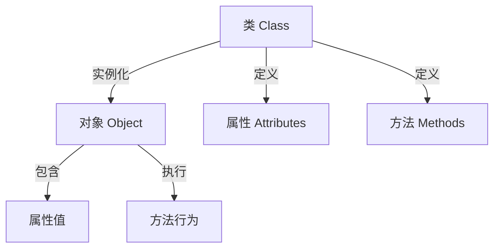

# C++ 对象创建

在C++的面向对象编程中，对象是类的实例，对象创建是将类蓝图转化为实际可用实体的过程。理解对象创建的机制是掌握面向对象编程的基础。本文将全面介绍C++中创建对象的各种方法及其背后的工作原理。

## 对象创建的基础概念

对象是类的具体实例，包含数据成员（属性）和成员函数（方法）。在C++中，创建对象意味着分配内存并初始化该对象。

### 对象与类的关系



## 基本对象创建方式

### 静态创建对象

最简单的对象创建方式是在栈上静态创建：

```cpp
class Student {
public:
    // 属性
    std::string name;
    int age;
    
    // 方法
    void introduce() {
        std::cout << "我是 " << name << "，今年 " << age << " 岁。" << std::endl;
    }
};

int main() {
    // 创建对象
    Student student1;
    
    // 访问对象属性并赋值
    student1.name = "张三";
    student1.age = 18;
    
    // 调用对象方法
    student1.introduce();
    
    return 0;
}
```

**输出：**
```
我是 张三，今年 18 岁。
```

:::note
静态创建的对象在程序执行离开其作用域时会自动销毁，不需要手动释放内存。
:::

### 动态创建对象

在堆上动态创建对象，使用 `new` 关键字：

```cpp
int main() {
    // 动态创建对象
    Student* student2 = new Student;
    
    // 使用指针访问属性和方法
    student2->name = "李四";
    student2->age = 20;
    student2->introduce();
    
    // 必须手动释放内存
    delete student2;
    
    return 0;
}
```

**输出：**
```
我是 李四，今年 20 岁。
```

:::warning
使用 `new` 创建的对象必须使用 `delete` 释放，否则会导致内存泄漏。
:::

## 使用构造函数创建对象

构造函数是一种特殊的成员函数，在对象创建时自动调用，用于初始化对象的状态。

### 默认构造函数

```cpp
class Student {
public:
    std::string name;
    int age;
    
    // 默认构造函数
    Student() {
        name = "未命名";
        age = 0;
        std::cout << "调用了默认构造函数" << std::endl;
    }
    
    void introduce() {
        std::cout << "我是 " << name << "，今年 " << age << " 岁。" << std::endl;
    }
};

int main() {
    Student student;  // 调用默认构造函数
    student.introduce();
    
    return 0;
}
```

**输出：**
```
调用了默认构造函数
我是 未命名，今年 0 岁。
```

### 带参数的构造函数

```cpp
class Student {
public:
    std::string name;
    int age;
    
    // 默认构造函数
    Student() {
        name = "未命名";
        age = 0;
    }
    
    // 带参数的构造函数
    Student(std::string studentName, int studentAge) {
        name = studentName;
        age = studentAge;
        std::cout << "调用了带参数的构造函数" << std::endl;
    }
    
    void introduce() {
        std::cout << "我是 " << name << "，今年 " << age << " 岁。" << std::endl;
    }
};

int main() {
    Student student1;  // 调用默认构造函数
    Student student2("王五", 22);  // 调用带参数的构造函数
    
    student1.introduce();
    student2.introduce();
    
    return 0;
}
```

**输出：**
```
调用了带参数的构造函数
我是 未命名，今年 0 岁。
我是 王五，今年 22 岁。
```

### 初始化列表

构造函数还可以使用初始化列表，这通常是更高效的初始化方式：

```cpp
class Student {
public:
    std::string name;
    int age;
    const int id;  // 常量成员必须在初始化列表中初始化
    
    // 使用初始化列表的构造函数
    Student(std::string studentName, int studentAge, int studentId) 
        : name(studentName), age(studentAge), id(studentId) {
        std::cout << "使用初始化列表创建了学生对象，ID: " << id << std::endl;
    }
    
    void introduce() {
        std::cout << "我是 " << name << "，今年 " << age << " 岁，学号: " << id << std::endl;
    }
};
```

:::tip
初始化列表是初始化类成员的首选方式，尤其对于常量成员和引用成员，必须使用初始化列表。
:::

## 复制构造函数

复制构造函数用于从同一类的另一个对象创建新对象：

```cpp
class Student {
public:
    std::string name;
    int age;
    
    Student(std::string studentName, int studentAge) 
        : name(studentName), age(studentAge) {}
    
    // 复制构造函数
    Student(const Student& other) {
        name = other.name;
        age = other.age;
        std::cout << "复制构造函数被调用" << std::endl;
    }
    
    void introduce() {
        std::cout << "我是 " << name << "，今年 " << age << " 岁。" << std::endl;
    }
};

int main() {
    Student student1("赵六", 25);
    Student student2 = student1;  // 调用复制构造函数
    
    student1.introduce();
    student2.introduce();
    
    // 修改student2不会影响student1
    student2.name = "小赵";
    
    student1.introduce();
    student2.introduce();
    
    return 0;
}
```

**输出：**
```
复制构造函数被调用
我是 赵六，今年 25 岁。
我是 赵六，今年 25 岁。
我是 赵六，今年 25 岁。
我是 小赵，今年 25 岁。
```

## 移动构造函数（C++11）

C++11引入了移动构造函数，可以"偷取"其他对象的资源，避免不必要的复制操作：

```cpp
class ResourceHolder {
public:
    int* resource;
    
    // 普通构造函数
    ResourceHolder(int value) {
        resource = new int(value);
        std::cout << "创建资源: " << *resource << std::endl;
    }
    
    // 复制构造函数
    ResourceHolder(const ResourceHolder& other) {
        resource = new int(*other.resource);
        std::cout << "复制资源: " << *resource << std::endl;
    }
    
    // 移动构造函数
    ResourceHolder(ResourceHolder&& other) noexcept {
        resource = other.resource;      // 接管资源
        other.resource = nullptr;       // 防止原对象释放资源
        std::cout << "移动资源: " << *resource << std::endl;
    }
    
    ~ResourceHolder() {
        if (resource != nullptr) {
            std::cout << "释放资源: " << *resource << std::endl;
            delete resource;
        } else {
            std::cout << "资源已被移动，无需释放" << std::endl;
        }
    }
};

int main() {
    ResourceHolder r1(100);
    
    // 使用移动构造函数
    ResourceHolder r2 = std::move(r1);
    
    // 此时r1的资源已被移动到r2
    
    return 0;
}
```

**输出：**
```
创建资源: 100
移动资源: 100
资源已被移动，无需释放
释放资源: 100
```

## 析构函数

析构函数在对象被销毁时自动调用，用于释放资源：

```cpp
class Resource {
public:
    Resource() {
        std::cout << "资源被创建" << std::endl;
    }
    
    ~Resource() {
        std::cout << "资源被释放" << std::endl;
    }
};

void function() {
    std::cout << "函数开始执行" << std::endl;
    Resource r;  // 创建对象
    std::cout << "函数即将结束" << std::endl;
}  // 离开作用域，r被销毁

int main() {
    std::cout << "程序开始执行" << std::endl;
    function();
    std::cout << "程序继续执行" << std::endl;
    
    return 0;
}
```

**输出：**
```
程序开始执行
函数开始执行
资源被创建
函数即将结束
资源被释放
程序继续执行
```

## 实际案例：学生管理系统

下面通过一个简单的学生管理系统来演示对象创建的实际应用：

```cpp
#include <iostream>
#include <string>
#include <vector>

class Course {
public:
    std::string name;
    int credit;
    
    Course(std::string courseName, int courseCredit)
        : name(courseName), credit(courseCredit) {}
};

class Student {
private:
    std::string name;
    int id;
    std::vector<Course> enrolledCourses;
    
public:
    // 构造函数
    Student(std::string studentName, int studentId)
        : name(studentName), id(studentId) {
        std::cout << "创建学生: " << name << ", ID: " << id << std::endl;
    }
    
    // 复制构造函数
    Student(const Student& other)
        : name(other.name), id(other.id), enrolledCourses(other.enrolledCourses) {
        std::cout << "复制学生: " << name << std::endl;
    }
    
    // 移动构造函数
    Student(Student&& other) noexcept
        : name(std::move(other.name)), id(other.id) {
        enrolledCourses = std::move(other.enrolledCourses);
        std::cout << "移动学生对象" << std::endl;
    }
    
    // 析构函数
    ~Student() {
        std::cout << "学生对象 " << name << " 被销毁" << std::endl;
    }
    
    // 添加课程
    void enrollCourse(const Course& course) {
        enrolledCourses.push_back(course);
        std::cout << name << " 选修了课程: " << course.name << std::endl;
    }
    
    // 显示学生信息
    void display() const {
        std::cout << "学生信息 - 姓名: " << name << ", ID: " << id << std::endl;
        std::cout << "已选修课程:" << std::endl;
        
        for (const auto& course : enrolledCourses) {
            std::cout << "  - " << course.name << " (" << course.credit << "学分)" << std::endl;
        }
    }
};

class StudentRegistry {
private:
    std::vector<Student*> students;
    
public:
    void addStudent(Student* student) {
        students.push_back(student);
    }
    
    void displayAllStudents() const {
        for (const auto& student : students) {
            student->display();
            std::cout << "------------------------" << std::endl;
        }
    }
    
    ~StudentRegistry() {
        for (auto student : students) {
            delete student;
        }
        std::cout << "学生注册表已清空" << std::endl;
    }
};

int main() {
    // 创建学生注册表
    StudentRegistry registry;
    
    // 动态创建学生对象
    Student* student1 = new Student("张三", 10001);
    Student* student2 = new Student("李四", 10002);
    
    // 创建课程
    Course math("高等数学", 4);
    Course physics("大学物理", 3);
    Course programming("C++编程", 5);
    
    // 为学生选课
    student1->enrollCourse(math);
    student1->enrollCourse(programming);
    
    student2->enrollCourse(physics);
    student2->enrollCourse(math);
    
    // 添加学生到注册表
    registry.addStudent(student1);
    registry.addStudent(student2);
    
    // 显示所有学生信息
    registry.displayAllStudents();
    
    return 0;  // 程序结束时会调用registry的析构函数，释放所有学生对象
}
```

**可能的输出：**
```
创建学生: 张三, ID: 10001
创建学生: 李四, ID: 10002
张三 选修了课程: 高等数学
张三 选修了课程: C++编程
李四 选修了课程: 大学物理
李四 选修了课程: 高等数学
学生信息 - 姓名: 张三, ID: 10001
已选修课程:
  - 高等数学 (4学分)
  - C++编程 (5学分)
------------------------
学生信息 - 姓名: 李四, ID: 10002
已选修课程:
  - 大学物理 (3学分)
  - 高等数学 (4学分)
------------------------
学生对象 张三 被销毁
学生对象 李四 被销毁
学生注册表已清空
```

## 总结

在C++中创建对象是面向对象编程的基本操作。本文介绍了：

1. 对象的基本创建方式（静态与动态）
2. 构造函数的类型与用途（默认、带参数、复制、移动）
3. 初始化列表的使用方法
4. 析构函数的工作原理
5. 通过实际案例展示了创建和管理对象的完整流程

正确理解并使用这些概念，是编写高质量C++面向对象程序的基础。

## 练习题

1. 创建一个 `Rectangle` 类，包含 `length` 和 `width` 两个属性，并提供计算面积和周长的方法。分别使用默认构造函数和带参数构造函数创建对象。

2. 为上述 `Rectangle` 类添加复制构造函数，创建一个新的矩形作为原矩形的副本。

3. 创建一个 `DynamicArray` 类，在构造函数中动态分配内存，在析构函数中释放内存，并实现复制构造函数和移动构造函数。

4. 设计一个简单的银行账户管理系统，包含 `Account` 类和 `Bank` 类。`Account` 类具有账号、余额等属性，`Bank` 类管理多个账户。通过对象创建和管理实现开户、存款、取款等功能。

:::tip
在实践这些练习时，特别注意内存管理和资源释放，确保没有内存泄漏。使用智能指针（如 `std::unique_ptr` 或 `std::shared_ptr`）可以简化内存管理。
:::