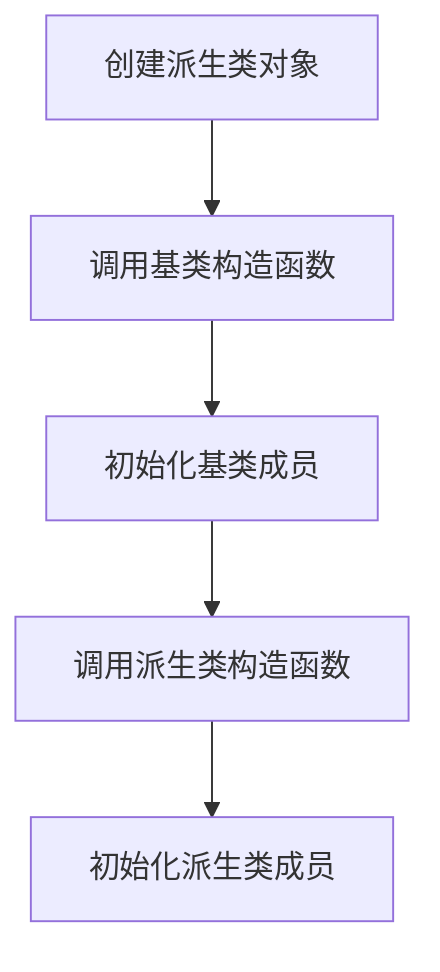

# C++ 构造函数

## 什么是构造函数？

构造函数是一种特殊的成员函数，当创建类的新对象时，构造函数会自动被调用。它的主要作用是初始化对象的数据成员，确保对象在创建时处于有效状态。构造函数的名称必须与类名相同，并且没有返回类型（即使是void也不需要）。

:::note 构造函数的特点
- 名称与类名完全相同
- 没有返回类型
- 可以有参数，也可以没有参数
- 可以被重载（即一个类可以有多个构造函数）
- 在对象创建时自动调用
:::

## 构造函数的基本语法

```cpp
class ClassName {
public:
    // 构造函数
    ClassName() {
        // 初始化代码
    }
};
```

## 构造函数的种类

### 1. 默认构造函数

默认构造函数是不带参数的构造函数，或者所有参数都有默认值的构造函数。

```cpp
class Student {
private:
    std::string name;
    int age;
public:
    // 默认构造函数
    Student() {
        name = "未命名";
        age = 0;
    }
    
    void display() {
        std::cout << "姓名：" << name << ", 年龄：" << age << std::endl;
    }
};

int main() {
    Student s1; // 调用默认构造函数
    s1.display();
    return 0;
}
```

**输出结果：**
```
姓名：未命名, 年龄：0
```

:::tip
如果你没有为类定义任何构造函数，编译器会自动生成一个默认构造函数。但这个自动生成的构造函数不会初始化成员变量（基本数据类型会有未定义的值，而类对象会调用它们自己的默认构造函数）。
:::

### 2. 带参数的构造函数

带参数的构造函数允许我们在创建对象时提供初始值。

```cpp
class Student {
private:
    std::string name;
    int age;
public:
    // 带参数的构造函数
    Student(std::string n, int a) {
        name = n;
        age = a;
    }
    
    void display() {
        std::cout << "姓名：" << name << ", 年龄：" << age << std::endl;
    }
};

int main() {
    Student s1("张三", 20); // 调用带参数的构造函数
    s1.display();
    return 0;
}
```

**输出结果：**
```
姓名：张三, 年龄：20
```

### 3. 拷贝构造函数

拷贝构造函数用于从另一个同类型的对象创建新对象。它接收一个同类对象的引用作为参数。

```cpp
class Student {
private:
    std::string name;
    int age;
public:
    Student(std::string n, int a) {
        name = n;
        age = a;
    }
    
    // 拷贝构造函数
    Student(const Student &obj) {
        name = obj.name;
        age = obj.age;
        std::cout << "拷贝构造函数被调用" << std::endl;
    }
    
    void display() {
        std::cout << "姓名：" << name << ", 年龄：" << age << std::endl;
    }
};

int main() {
    Student s1("张三", 20);
    Student s2 = s1; // 调用拷贝构造函数
    // 或者: Student s2(s1);
    s2.display();
    return 0;
}
```

**输出结果：**
```
拷贝构造函数被调用
姓名：张三, 年龄：20
```

### 4. 初始化列表

初始化列表是一种更高效的初始化成员变量的方式，尤其是对于那些必须在声明时初始化的成员（如常量或引用）。

```cpp
class Rectangle {
private:
    const double length;
    const double width;
public:
    // 使用初始化列表
    Rectangle(double l, double w) : length(l), width(w) {
        // 函数体可以是空的，因为使用初始化列表已完成初始化
    }
    
    double getArea() {
        return length * width;
    }
};

int main() {
    Rectangle rect(5.0, 3.0);
    std::cout << "矩形面积：" << rect.getArea() << std::endl;
    return 0;
}
```

**输出结果：**
```
矩形面积：15
```

## 构造函数的重载

一个类可以有多个构造函数，只要它们的参数列表不同（参数数量或类型不同），这称为构造函数的重载。

```cpp
class Box {
private:
    double length;
    double width;
    double height;
public:
    // 无参构造函数
    Box() {
        length = 0.0;
        width = 0.0;
        height = 0.0;
    }
    
    // 一个参数的构造函数（所有维度相同）
    Box(double side) {
        length = side;
        width = side;
        height = side;
    }
    
    // 三个参数的构造函数
    Box(double l, double w, double h) {
        length = l;
        width = w;
        height = h;
    }
    
    double volume() {
        return length * width * height;
    }
};

int main() {
    Box box1;
    Box box2(10.0);
    Box box3(10.0, 20.0, 30.0);
    
    std::cout << "box1体积：" << box1.volume() << std::endl;
    std::cout << "box2体积：" << box2.volume() << std::endl;
    std::cout << "box3体积：" << box3.volume() << std::endl;
    
    return 0;
}
```

**输出结果：**
```
box1体积：0
box2体积：1000
box3体积：6000
```

## 构造函数的执行顺序

在继承关系中，构造函数的调用顺序是从基类到派生类。先执行基类的构造函数，再执行派生类的构造函数。



## 实际应用案例

### 银行账户系统

下面是一个使用构造函数的银行账户类示例：

```cpp
#include <iostream>
#include <string>

class BankAccount {
private:
    std::string accountNumber;
    std::string ownerName;
    double balance;
    
public:
    // 默认构造函数
    BankAccount() : accountNumber(""), ownerName(""), balance(0.0) {}
    
    // 带参数的构造函数
    BankAccount(std::string accNo, std::string name, double initialBalance) 
        : accountNumber(accNo), ownerName(name), balance(initialBalance) {}
    
    // 拷贝构造函数
    BankAccount(const BankAccount &account) 
        : accountNumber(account.accountNumber), 
          ownerName(account.ownerName), 
          balance(account.balance) {
        std::cout << "账户复制完成：" << accountNumber << std::endl;
    }
    
    // 存款
    void deposit(double amount) {
        if (amount > 0) {
            balance += amount;
            std::cout << "存款 " << amount << " 元成功" << std::endl;
        } else {
            std::cout << "存款金额必须为正数" << std::endl;
        }
    }
    
    // 取款
    bool withdraw(double amount) {
        if (amount > 0 && amount <= balance) {
            balance -= amount;
            std::cout << "取款 " << amount << " 元成功" << std::endl;
            return true;
        } else {
            std::cout << "取款失败，金额无效或余额不足" << std::endl;
            return false;
        }
    }
    
    // 显示账户信息
    void displayInfo() const {
        std::cout << "账号: " << accountNumber << std::endl;
        std::cout << "户主: " << ownerName << std::endl;
        std::cout << "余额: " << balance << " 元" << std::endl;
    }
};

int main() {
    // 使用默认构造函数
    BankAccount account1;
    account1.displayInfo();
    std::cout << std::endl;
    
    // 使用带参数的构造函数
    BankAccount account2("6225123456789", "张三", 1000.0);
    account2.displayInfo();
    account2.deposit(500.0);
    account2.withdraw(200.0);
    account2.displayInfo();
    std::cout << std::endl;
    
    // 使用拷贝构造函数
    BankAccount account3 = account2;
    account3.displayInfo();
    
    return 0;
}
```

**输出结果：**
```
账号: 
户主: 
余额: 0 元

账号: 6225123456789
户主: 张三
余额: 1000 元
存款 500 元成功
取款 200 元成功
账号: 6225123456789
户主: 张三
余额: 1300 元

账户复制完成：6225123456789
账号: 6225123456789
户主: 张三
余额: 1300 元
```

这个例子展示了如何在实际应用中使用不同类型的构造函数来创建和初始化银行账户对象。

## 总结

构造函数是C++面向对象编程中非常重要的概念，它确保对象在创建时能正确初始化。通过本节内容，我们了解了：

1. 构造函数的基本概念和特点
2. 不同类型的构造函数（默认构造函数、带参数构造函数、拷贝构造函数）
3. 初始化列表的使用
4. 构造函数的重载
5. 构造函数在继承中的执行顺序
6. 构造函数在实际应用中的使用

:::caution
- 一旦你定义了任何构造函数，编译器就不会再自动生成默认构造函数
- 初始化列表比在构造函数体内赋值更高效
- 拷贝构造函数很重要，尤其是当类包含指针成员时，需要考虑深拷贝问题
:::

## 练习

1. 创建一个`Person`类，包含姓名和年龄成员变量，编写默认构造函数、带参数构造函数和拷贝构造函数。
2. 创建一个`Time`类，包含小时、分钟和秒成员变量，使用初始化列表来初始化它们，并添加一个显示时间的方法。
3. 创建一个`Computer`类，包含CPU、内存、硬盘等成员变量，实现多个重载构造函数，允许用不同的参数组合初始化对象。

## 进一步阅读

- 《C++ Primer》第15章：构造函数和析构函数
- 《Effective C++》条款5：了解C++默默编写和调用哪些函数
- 《C++核心准则》关于构造函数的建议

深入理解和掌握构造函数的使用，是成为一名优秀的C++程序员的重要一步。在接下来的学习中，我们将探索析构函数、继承、多态等更多面向对象的高级概念。