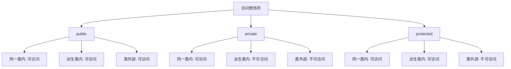

# C++ 访问修饰符

在C++面向对象编程中，访问修饰符是控制类成员（数据成员和成员函数）可见性和访问权限的关键机制。理解不同访问修饰符的作用，对于正确设计类结构、实现数据封装和保护至关重要。

## 什么是访问修饰符？

访问修饰符决定了类的成员对外部代码的可见性和可访问性。C++提供了三种主要的访问修饰符：

1. **public** - 公有成员
2. **private** - 私有成员
3. **protected** - 保护成员

## 三种访问修饰符详解

### 1. public（公有）

使用`public`关键字声明的成员可以被任何函数访问，包括类外部的函数。

```cpp
class Student {
public:
    // 公有成员
    std::string name;
    
    void displayDetails() {
        std::cout << "Name: " << name << std::endl;
        std::cout << "ID: " << id << std::endl;  // 可以访问私有成员
    }
};

int main() {
    Student s1;
    s1.name = "Alice";  // 正确：可以直接访问公有成员
    s1.displayDetails(); // 正确：可以调用公有方法
    return 0;
}
```

### 2. private（私有）

`private`成员只能被该类的成员函数访问，类的外部无法直接访问。这是实现**封装**的关键要素。

```cpp
class Student {
private:
    // 私有成员
    int id;
    double gpa;
    
public:
    void setId(int studentId) {
        id = studentId;  // 类内部可以访问私有成员
    }
    
    int getId() {
        return id;  // 通过公有方法间接访问私有数据
    }
};

int main() {
    Student s1;
    s1.setId(101);  // 正确：通过公有方法设置私有成员
    // s1.id = 102;  // 错误：不能直接访问私有成员
    std::cout << "ID: " << s1.getId() << std::endl;  // 正确：间接访问
    return 0;
}
```

### 3. protected（保护）

`protected`成员可以被当前类的成员函数和该类的派生类访问，但不能被类外的其他函数访问。

```cpp
class Person {
protected:
    std::string name;
    int age;
    
public:
    Person(std::string n, int a) : name(n), age(a) {}
    
    void display() {
        std::cout << "Name: " << name << ", Age: " << age << std::endl;
    }
};

class Student : public Person {
private:
    int studentId;
    
public:
    Student(std::string n, int a, int id) : Person(n, a), studentId(id) {}
    
    void updateInfo(std::string newName, int newAge) {
        name = newName;  // 正确：派生类可以访问基类的protected成员
        age = newAge;    // 正确：派生类可以访问基类的protected成员
    }
    
    void displayStudentInfo() {
        std::cout << "Student ID: " << studentId << std::endl;
        display();  // 调用基类的公有方法
    }
};

int main() {
    Student s1("Bob", 20, 12345);
    // s1.name = "Alice";  // 错误：protected成员在类外不可访问
    s1.updateInfo("Alice", 21);  // 正确：通过公有方法修改
    s1.displayStudentInfo();
    return 0;
}
```

## 访问修饰符的作用域

在C++类定义中，访问修饰符的作用范围是从该修饰符出现的位置开始，直到下一个访问修饰符出现或类定义结束。

```cpp
class Example {
public:
    int a;  // 公有成员
    double b;  // 公有成员
    
private:
    int c;  // 私有成员
    double d;  // 私有成员
    
public:
    void func1();  // 公有方法
    
protected:
    int e;  // 保护成员
    void func2();  // 保护方法
};
```

## 类成员的默认访问级别

不同类型的C++类具有不同的默认访问级别：

1. **class** - 默认为`private`
2. **struct** - 默认为`public`
3. **union** - 默认为`public`

```cpp
class DefaultClass {
    int x;  // 默认是private
};

struct DefaultStruct {
    int y;  // 默认是public
};
```

## 访问修饰符的实际应用

### 数据封装

封装是面向对象编程的核心原则之一，通过将数据成员设置为私有，提供公有的访问方法（getter和setter），可以实现数据的保护和验证。

```cpp
class BankAccount {
private:
    std::string accountNumber;
    double balance;
    
public:
    // 构造函数
    BankAccount(std::string accNum, double initialBalance) 
        : accountNumber(accNum), balance(initialBalance) {}
    
    // Getter方法
    std::string getAccountNumber() const {
        return accountNumber;
    }
    
    double getBalance() const {
        return balance;
    }
    
    // Setter方法（带验证）
    void deposit(double amount) {
        if (amount > 0) {
            balance += amount;
            std::cout << "Deposited: $" << amount << std::endl;
        } else {
            std::cout << "Invalid deposit amount" << std::endl;
        }
    }
    
    void withdraw(double amount) {
        if (amount > 0 && amount <= balance) {
            balance -= amount;
            std::cout << "Withdrawn: $" << amount << std::endl;
        } else {
            std::cout << "Invalid withdrawal amount or insufficient funds" << std::endl;
        }
    }
};

int main() {
    BankAccount acc("12345678", 1000.0);
    std::cout << "Account: " << acc.getAccountNumber() << std::endl;
    std::cout << "Initial balance: $" << acc.getBalance() << std::endl;
    
    acc.deposit(500.0);
    acc.withdraw(200.0);
    std::cout << "Current balance: $" << acc.getBalance() << std::endl;
    
    // 尝试非法操作
    acc.deposit(-100.0);  // 会被拒绝
    acc.withdraw(2000.0);  // 会被拒绝
    
    return 0;
}
```

**输出：**
```
Account: 12345678
Initial balance: $1000
Deposited: $500
Withdrawn: $200
Current balance: $1300
Invalid deposit amount
Invalid withdrawal amount or insufficient funds
```

### 继承与保护成员

在继承关系中，`protected`成员允许派生类访问基类的一些内部实现，同时对外部代码保持隐藏。

```cpp
class Shape {
protected:
    int width;
    int height;
    
public:
    Shape(int w, int h) : width(w), height(h) {}
    
    virtual double area() = 0;  // 纯虚函数
};

class Rectangle : public Shape {
public:
    Rectangle(int w, int h) : Shape(w, h) {}
    
    double area() override {
        return width * height;  // 访问基类的protected成员
    }
};

class Triangle : public Shape {
public:
    Triangle(int w, int h) : Shape(w, h) {}
    
    double area() override {
        return 0.5 * width * height;  // 访问基类的protected成员
    }
};

int main() {
    Rectangle rect(5, 4);
    Triangle tri(5, 4);
    
    std::cout << "Rectangle Area: " << rect.area() << std::endl;
    std::cout << "Triangle Area: " << tri.area() << std::endl;
    
    return 0;
}
```

**输出：**
```
Rectangle Area: 20
Triangle Area: 10
```

## 访问修饰符的选择原则

:::tip 设计原则
1. **最小特权原则**: 成员应该拥有完成其任务所需的最小访问级别
2. **数据隐藏**: 数据成员通常应该是私有的
3. **接口暴露**: 需要被外部调用的方法应该是公有的
4. **继承考虑**: 可能被派生类使用但不应被外部访问的成员应设为保护的
:::

## 友元（Friend）

有时我们需要让特定的外部函数或类访问当前类的私有或保护成员。C++的`friend`关键字允许我们声明这种特殊权限。

```cpp
class Box {
private:
    double width;
    double height;
    double depth;
    
public:
    Box(double w, double h, double d) : width(w), height(h), depth(d) {}
    
    // 友元函数声明
    friend double calculateVolume(const Box& box);
    
    // 友元类声明
    friend class BoxFactory;
};

// 友元函数定义
double calculateVolume(const Box& box) {
    // 可以直接访问Box的私有成员
    return box.width * box.height * box.depth;
}

// 友元类
class BoxFactory {
public:
    Box createCube(double side) {
        return Box(side, side, side);
    }
    
    void resizeBox(Box& box, double factor) {
        // 可以直接访问Box的私有成员
        box.width *= factor;
        box.height *= factor;
        box.depth *= factor;
    }
};

int main() {
    Box myBox(2.0, 3.0, 4.0);
    std::cout << "Box volume: " << calculateVolume(myBox) << std::endl;
    
    BoxFactory factory;
    Box cube = factory.createCube(5.0);
    std::cout << "Cube volume: " << calculateVolume(cube) << std::endl;
    
    factory.resizeBox(cube, 2.0);
    std::cout << "Resized cube volume: " << calculateVolume(cube) << std::endl;
    
    return 0;
}
```

**输出：**
```
Box volume: 24
Cube volume: 125
Resized cube volume: 1000
```

:::caution 注意
虽然友元提供了一种灵活的方式来访问私有成员，但应谨慎使用，因为它可能破坏封装性。
:::

## 访问修饰符对比

下表总结了三种访问修饰符的访问权限：



## 总结

C++访问修饰符是面向对象编程中实现封装和数据隐藏的基础机制：

1. **public**: 类外可访问，没有限制
2. **private**: 仅类内可访问，提供最高级别的封装
3. **protected**: 类内和派生类可访问，适用于需继承的成员

正确使用访问修饰符可以：
- 保护数据不被非法修改
- 隐藏实现细节
- 控制类接口的暴露
- 支持类的演化和维护

## 练习题

1. 编写一个`Person`类，使用私有成员存储姓名和年龄，并提供公有的getter和setter方法。
2. 创建一个`Vehicle`基类和派生类`Car`，使用适当的访问修饰符实现继承关系。
3. 设计一个`Circle`类，隐藏半径数据，只暴露计算周长和面积的方法。

## 进一步阅读资源

- C++ Core Guidelines关于类和类层次结构的建议：[C++ Core Guidelines](https://isocpp.github.io/CppCoreGuidelines/CppCoreGuidelines#c-classes-and-class-hierarchies)
- 关于封装和信息隐藏的设计模式
- 深入了解C++中的继承和多态