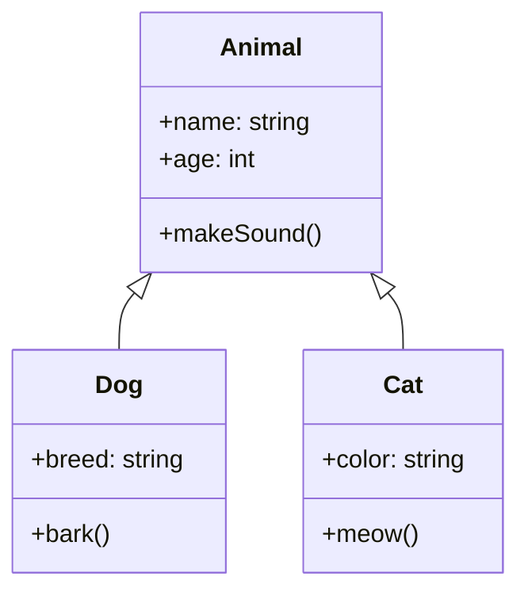

# C++ 继承

## 什么是继承？

继承是面向对象编程的三大特性之一（封装、继承、多态），它允许我们基于现有的类创建新类，从而实现代码的重用和层次化设计。通过继承，新创建的类（称为"派生类"或"子类"）可以自动获得已有类（称为"基类"或"父类"）的属性和方法，同时还可以添加自己特有的功能。

继承体现了"is-a"（是一个）的关系。例如，"狗是一种动物"、"轿车是一种车辆"。



## 继承的基本语法

在C++中，定义派生类的基本语法如下：

```cpp
class 派生类名 : 继承方式 基类名 {
    // 派生类的新成员和方法
};
```

继承方式主要有三种：
- `public`：最常用，派生类可以访问基类的public和protected成员
- `protected`：基类的public成员在派生类中变为protected成员
- `private`：基类的public和protected成员在派生类中都变为private成员

### 示例：基本继承

```cpp
#include <iostream>
using namespace std;

// 基类
class Person {
public:
    string name;
    int age;
    
    void introduce() {
        cout << "我叫 " << name << "，今年 " << age << " 岁。" << endl;
    }
};

// 派生类
class Student : public Person {
public:
    string school;
    int grade;
    
    void study() {
        cout << name << " 在 " << school << " 学习，现在是 " << grade << " 年级。" << endl;
    }
};

int main() {
    Student s;
    s.name = "张三";
    s.age = 15;
    s.school = "第一中学";
    s.grade = 9;
    
    s.introduce();  // 调用从基类继承的方法
    s.study();      // 调用派生类自己的方法
    
    return 0;
}
```

输出结果：
```
我叫 张三，今年 15 岁。
张三 在 第一中学 学习，现在是 9 年级。
```

## 继承的访问控制

继承方式决定了基类成员在派生类中的访问权限：

| 基类成员  | public继承 | protected继承 | private继承 |
|-----------|-----------|--------------|------------|
| public    | public    | protected    | private    |
| protected | protected | protected    | private    |
| private   | 不可访问   | 不可访问      | 不可访问    |

:::important
无论哪种继承方式，基类的private成员都不能在派生类中直接访问。
:::

## 构造函数和析构函数

在继承关系中，当创建派生类对象时：
1. 首先调用基类的构造函数
2. 然后调用派生类的构造函数
3. 销毁对象时则相反：先调用派生类的析构函数，再调用基类的析构函数

### 初始化基类构造函数

派生类需要使用初始化列表来初始化基类的构造函数。

```cpp
#include <iostream>
using namespace std;

class Base {
private:
    int data;
public:
    Base(int d) : data(d) {
        cout << "Base构造函数被调用，data = " << data << endl;
    }
    
    ~Base() {
        cout << "Base析构函数被调用" << endl;
    }
};

class Derived : public Base {
private:
    int derivedData;
public:
    Derived(int d, int dd) : Base(d), derivedData(dd) {
        cout << "Derived构造函数被调用，derivedData = " << derivedData << endl;
    }
    
    ~Derived() {
        cout << "Derived析构函数被调用" << endl;
    }
};

int main() {
    Derived obj(5, 10);
    return 0;
}
```

输出结果：
```
Base构造函数被调用，data = 5
Derived构造函数被调用，derivedData = 10
Derived析构函数被调用
Base析构函数被调用
```

## 多重继承

C++支持一个类继承自多个基类，这称为"多重继承"。

```cpp
class Derived : public Base1, public Base2 {
    // ...
};
```

:::caution
多重继承可能导致菱形继承问题，当两个派生类继承自同一个基类，而第三个类同时继承这两个派生类时，会导致基类的成员在第三个类中出现两次。
:::

### 菱形继承和虚继承

为了解决菱形继承问题，C++提供了虚继承机制：

```cpp
#include <iostream>
using namespace std;

class Animal {
public:
    int age;
    Animal() : age(0) { cout << "Animal构造函数" << endl; }
};

// 使用virtual关键字实现虚继承
class Mammal : virtual public Animal {
public:
    Mammal() { cout << "Mammal构造函数" << endl; }
};

class Bird : virtual public Animal {
public:
    Bird() { cout << "Bird构造函数" << endl; }
};

class Bat : public Mammal, public Bird {
public:
    Bat() { cout << "Bat构造函数" << endl; }
};

int main() {
    Bat b;
    
    // 如果不使用虚继承，以下赋值会产生歧义
    b.age = 3;
    cout << "蝙蝠的年龄: " << b.age << endl;
    
    return 0;
}
```

输出结果：
```
Animal构造函数
Mammal构造函数
Bird构造函数
Bat构造函数
蝙蝠的年龄: 3
```

## 实际应用场景

### 场景一：图形界面库设计

在图形用户界面（GUI）库中，继承被广泛应用。例如，可以有一个基本的`Widget`类，然后派生出`Button`、`TextBox`、`CheckBox`等类。

```cpp
class Widget {
protected:
    int x, y;
    int width, height;
public:
    Widget(int x, int y, int w, int h) : x(x), y(y), width(w), height(h) {}
    virtual void draw() = 0;  // 纯虚函数，使Widget成为抽象类
    void move(int newX, int newY) {
        x = newX;
        y = newY;
    }
};

class Button : public Widget {
private:
    string label;
public:
    Button(int x, int y, int w, int h, string lbl) 
        : Widget(x, y, w, h), label(lbl) {}
    
    void draw() override {
        cout << "绘制按钮在位置(" << x << "," << y << ")，大小为"
             << width << "x" << height << "，标签为\"" << label << "\"" << endl;
    }
    
    void click() {
        cout << "按钮\"" << label << "\"被点击" << endl;
    }
};
```

### 场景二：游戏开发中的角色系统

在游戏开发中，不同的角色类型可以继承自基本角色类，并拥有各自特定的能力。

```cpp
class GameCharacter {
protected:
    string name;
    int health;
    int position_x, position_y;
    
public:
    GameCharacter(string n, int h) : name(n), health(h), position_x(0), position_y(0) {}
    
    void move(int x, int y) {
        position_x += x;
        position_y += y;
        cout << name << "移动到位置(" << position_x << "," << position_y << ")" << endl;
    }
    
    virtual void attack() = 0;
};

class Warrior : public GameCharacter {
private:
    int strength;
    
public:
    Warrior(string n, int h, int s) : GameCharacter(n, h), strength(s) {}
    
    void attack() override {
        cout << name << "使用剑攻击，造成" << strength * 2 << "点伤害!" << endl;
    }
    
    void shield() {
        cout << name << "举起盾牌进行防御!" << endl;
    }
};

class Mage : public GameCharacter {
private:
    int mana;
    
public:
    Mage(string n, int h, int m) : GameCharacter(n, h), mana(m) {}
    
    void attack() override {
        cout << name << "施放火球术，消耗" << 10 << "点魔法，造成" << mana * 3 << "点伤害!" << endl;
        mana -= 10;
    }
    
    void teleport(int x, int y) {
        position_x = x;
        position_y = y;
        cout << name << "闪现到位置(" << position_x << "," << position_y << ")，消耗20点魔法!" << endl;
        mana -= 20;
    }
};
```

## 总结

继承是C++面向对象编程的核心特性之一，它允许我们：

1. 实现代码重用，避免重复编写相似功能
2. 建立类之间的层次关系，形成有组织的类结构
3. 通过扩展现有类创建新类，实现软件的可扩展性
4. 支持多态性，使代码更加灵活和通用

掌握继承机制对于理解大型C++程序的结构和设计模式至关重要。在实际开发中，继承应当谨慎使用，应该优先考虑"组合"而非"继承"原则，以避免过度使用继承导致的耦合问题。

## 练习

1. 创建一个基类`Vehicle`，包含属性如`brand`和`year`，以及方法`displayInfo()`，然后创建派生类`Car`和`Motorcycle`，添加各自特有的属性和方法。

2. 修改上述练习，使用构造函数和析构函数，观察它们的调用顺序。

3. 设计一个简单的图形类层次结构，包括基类`Shape`以及派生类`Circle`、`Rectangle`和`Triangle`，实现计算面积和周长的方法。

## 进一步学习资源

- 《C++ Primer》第15章：面向对象程序设计
- 《Effective C++》Item 32-40：继承与面向对象设计
- [cppreference - 继承](https://en.cppreference.com/w/cpp/language/derived_class)
- [C++ 菜鸟教程 - 继承](https://www.runoob.com/cplusplus/cpp-inheritance.html)