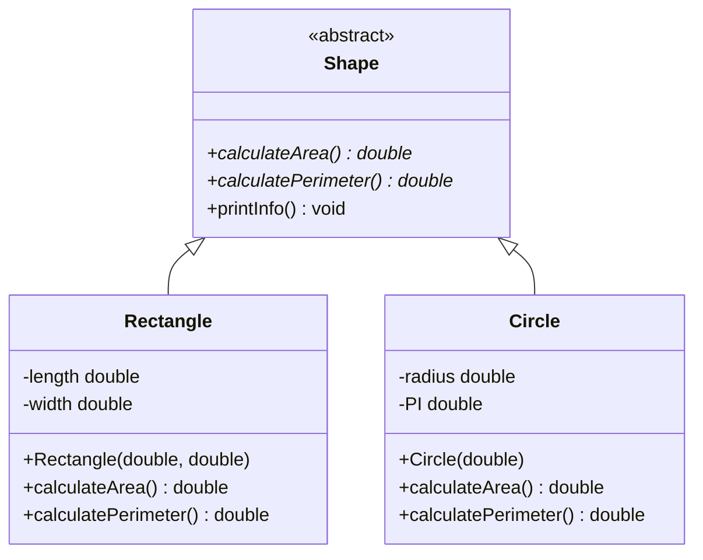

# C++ 抽象类

## 什么是抽象类？

抽象类是C++面向对象编程中的一个重要概念，它是一种特殊的类，至少包含一个纯虚函数（pure virtual function）。抽象类的主要作用是为其派生类提供一个公共的、标准化的接口，从而实现多态性。

:::note
抽象类不能被直接实例化，只能作为基类被其他类继承。继承抽象类的派生类必须实现所有纯虚函数，否则该派生类也会成为抽象类。
:::

## 抽象类的核心特点

1. **包含至少一个纯虚函数**：使用 `virtual` 关键字声明，并在函数声明结尾添加 `= 0`
2. **不能创建抽象类的对象**：抽象类是不完整的，需要派生类来完成其功能
3. **可以有指向抽象类的指针和引用**：这些指针和引用可以指向抽象类的派生类对象
4. **可以包含数据成员和普通成员函数**：抽象类除了纯虚函数外，还可以拥有普通的成员

## 纯虚函数的声明方式

纯虚函数是抽象类的核心，它使用特殊的语法声明：

```cpp
virtual 返回类型 函数名(参数列表) = 0;
```

这里的 `= 0` 表明这是一个纯虚函数，必须由派生类实现。

## 抽象类基本实现

下面是一个简单的抽象类示例：

```cpp
#include <iostream>
using namespace std;

// 抽象类
class Shape {
public:
    // 纯虚函数
    virtual double calculateArea() = 0;
    virtual double calculatePerimeter() = 0;
    
    // 普通成员函数
    void printInfo() {
        cout << "Area: " << calculateArea() << endl;
        cout << "Perimeter: " << calculatePerimeter() << endl;
    }
};

// 派生类 - 矩形
class Rectangle : public Shape {
private:
    double length;
    double width;

public:
    Rectangle(double l, double w) : length(l), width(w) {}
    
    // 实现纯虚函数
    double calculateArea() override {
        return length * width;
    }
    
    double calculatePerimeter() override {
        return 2 * (length + width);
    }
};

// 派生类 - 圆形
class Circle : public Shape {
private:
    double radius;
    const double PI = 3.14159;

public:
    Circle(double r) : radius(r) {}
    
    // 实现纯虚函数
    double calculateArea() override {
        return PI * radius * radius;
    }
    
    double calculatePerimeter() override {
        return 2 * PI * radius;
    }
};

int main() {
    // Shape shape;  // 错误！不能创建抽象类的对象
    
    Rectangle rect(5.0, 4.0);
    Circle circle(3.0);
    
    cout << "Rectangle information:" << endl;
    rect.printInfo();
    
    cout << "\nCircle information:" << endl;
    circle.printInfo();
    
    // 通过抽象类指针实现多态
    Shape* shapePtr;
    
    shapePtr = &rect;
    cout << "\nThrough pointer (Rectangle):" << endl;
    shapePtr->printInfo();
    
    shapePtr = &circle;
    cout << "\nThrough pointer (Circle):" << endl;
    shapePtr->printInfo();
    
    return 0;
}
```

**输出结果：**

```
Rectangle information:
Area: 20
Perimeter: 18

Circle information:
Area: 28.2743
Perimeter: 18.8495

Through pointer (Rectangle):
Area: 20
Perimeter: 18

Through pointer (Circle):
Area: 28.2743
Perimeter: 18.8495
```

## 抽象类与接口

在C++中，抽象类可以实现类似于其他语言中"接口"的功能。当一个抽象类中只包含纯虚函数，没有数据成员和函数实现时，它就类似于一个接口。

:::tip
在C++中通常将只包含纯虚函数的抽象类称为"接口类"，它定义了一组必须实现的方法，但不提供具体实现。
:::

## 抽象类的实际应用场景

### 1. 框架设计与插件系统

抽象类非常适合用于设计插件系统或框架，其中基类定义接口，而具体功能由插件或模块实现。

```cpp
// 音频播放器插件接口
class AudioPlayerPlugin {
public:
    virtual bool init() = 0;
    virtual void playFile(const std::string& filename) = 0;
    virtual void stop() = 0;
    virtual void cleanup() = 0;
    virtual ~AudioPlayerPlugin() {} // 虚析构函数很重要
};

// MP3插件实现
class MP3Plugin : public AudioPlayerPlugin {
public:
    bool init() override { /* 初始化MP3解码器 */ return true; }
    void playFile(const std::string& filename) override { /* MP3播放逻辑 */ }
    void stop() override { /* 停止MP3播放 */ }
    void cleanup() override { /* 清理资源 */ }
};

// WAV插件实现
class WAVPlugin : public AudioPlayerPlugin {
    // 类似实现...
};
```

### 2. 设计模式中的应用

抽象类在多种设计模式中扮演着重要角色，比如工厂模式：

```cpp
// 产品抽象类
class Document {
public:
    virtual void open() = 0;
    virtual void save() = 0;
    virtual void close() = 0;
    virtual ~Document() {}
};

// 具体产品类
class PDFDocument : public Document {
public:
    void open() override { cout << "Opening PDF document" << endl; }
    void save() override { cout << "Saving PDF document" << endl; }
    void close() override { cout << "Closing PDF document" << endl; }
};

class WordDocument : public Document {
    // 类似实现...
};

// 文档工厂抽象类
class DocumentFactory {
public:
    virtual Document* createDocument() = 0;
    virtual ~DocumentFactory() {}
};

// 具体工厂类
class PDFFactory : public DocumentFactory {
public:
    Document* createDocument() override {
        return new PDFDocument();
    }
};
```

### 3. 绘图应用示例

```cpp
#include <iostream>
#include <vector>
#include <memory>
using namespace std;

// 绘图元素抽象类
class DrawableElement {
public:
    virtual void draw() const = 0;
    virtual void resize(double factor) = 0;
    virtual ~DrawableElement() = default;
};

// 具体绘图元素 - 线
class Line : public DrawableElement {
private:
    double length;
public:
    Line(double l) : length(l) {}
    
    void draw() const override {
        cout << "Drawing a line of length " << length << endl;
    }
    
    void resize(double factor) override {
        length *= factor;
        cout << "Line resized to length " << length << endl;
    }
};

// 具体绘图元素 - 圆
class Circle : public DrawableElement {
private:
    double radius;
public:
    Circle(double r) : radius(r) {}
    
    void draw() const override {
        cout << "Drawing a circle with radius " << radius << endl;
    }
    
    void resize(double factor) override {
        radius *= factor;
        cout << "Circle resized to radius " << radius << endl;
    }
};

// 绘图画布
class Canvas {
private:
    vector<unique_ptr<DrawableElement>> elements;
    
public:
    void addElement(DrawableElement* element) {
        elements.emplace_back(element);
    }
    
    void drawAll() const {
        for (const auto& element : elements) {
            element->draw();
        }
    }
    
    void resizeAll(double factor) {
        for (auto& element : elements) {
            element->resize(factor);
        }
    }
};

int main() {
    Canvas canvas;
    
    canvas.addElement(new Line(10.0));
    canvas.addElement(new Circle(5.0));
    
    cout << "Initial drawing:" << endl;
    canvas.drawAll();
    
    cout << "\nAfter resizing (factor 1.5):" << endl;
    canvas.resizeAll(1.5);
    canvas.drawAll();
    
    return 0;
}
```

**输出结果：**

```
Initial drawing:
Drawing a line of length 10
Drawing a circle with radius 5

After resizing (factor 1.5):
Line resized to length 15
Circle resized to radius 7.5
Drawing a line of length 15
Drawing a circle with radius 7.5
```

## 抽象类的设计原则

在设计抽象类时，应遵循以下原则：

1. **单一职责原则**：抽象类应该只有一个职责或者目的
2. **接口分离原则**：多个特定的接口比一个通用的接口更好
3. **设计清晰的层次结构**：抽象类应该是一个清晰的概念，其派生类应该是"是一种"关系
4. **提供虚析构函数**：避免内存泄漏问题



## 抽象类与普通类的区别

| 特性 | 抽象类 | 普通类 |
|------|--------|--------|
| 实例化 | 不能直接实例化 | 可以直接实例化 |
| 纯虚函数 | 至少包含一个 | 没有或可选 |
| 用途 | 定义接口，提供部分实现 | 提供完整实现 |
| 派生类要求 | 必须实现所有纯虚函数 | 可以直接使用基类功能 |

## 常见问题与解决方案

### 问题1：抽象类能有构造函数吗？

**解决方案**：抽象类可以有构造函数，尽管它不能被直接实例化。构造函数通常用于初始化抽象类中的数据成员，这些成员会被派生类继承。

```cpp
class AbstractBase {
protected:
    int value;
public:
    AbstractBase(int v) : value(v) {
        cout << "AbstractBase constructor called with value: " << value << endl;
    }
    virtual void display() = 0; // 纯虚函数
};

class Derived : public AbstractBase {
public:
    Derived(int v) : AbstractBase(v) {} // 调用抽象类构造函数
    void display() override {
        cout << "Value in derived: " << value << endl;
    }
};
```

### 问题2：如何处理多层继承中的抽象类？

**解决方案**：在多层继承中，只有实现了所有纯虚函数的类才能被实例化。中间层可以选择实现部分或不实现纯虚函数。

```cpp
class Base {
public:
    virtual void func1() = 0;
    virtual void func2() = 0;
};

class Intermediate : public Base {
public:
    // 只实现了func1，所以Intermediate仍是抽象类
    void func1() override {
        cout << "Intermediate::func1()" << endl;
    }
};

class Concrete : public Intermediate {
public:
    // 实现了剩余的纯虚函数，现在可以实例化了
    void func2() override {
        cout << "Concrete::func2()" << endl;
    }
};
```

## 总结

抽象类是C++面向对象编程中一个强大的工具，可以帮助我们设计出更加灵活和可维护的代码：

1. 抽象类通过定义纯虚函数创建，不能被直接实例化
2. 它们为派生类提供了一个统一的接口，促进了代码的一致性
3. 抽象类是实现多态性的重要机制
4. 抽象类既可以包含纯虚函数，也可以包含普通成员和已实现的函数
5. 在实际应用中，抽象类常用于框架设计、插件系统和各种设计模式中

:::caution
在使用抽象类时，一定要记得提供虚析构函数，以确保当通过基类指针删除派生类对象时能够正确调用派生类的析构函数。
:::

## 练习题

1. 创建一个`Vehicle`抽象类，包含纯虚函数`startEngine()`和`stopEngine()`，然后派生`Car`和`Motorcycle`类并实现这些方法。

2. 设计一个简单的游戏角色系统，使用抽象类`Character`定义基本行为，然后创建如`Warrior`、`Mage`等派生类。

3. 实现一个使用抽象类的简单工厂模式，创建不同类型的数据库连接（如MySQL、SQLite等）。

## 进一步学习资源

- 《C++ Primer》中的抽象类和虚函数章节
- 《Effective C++》中关于继承和多态的条款
- 《Design Patterns》中的策略模式、工厂模式等使用抽象类的设计模式

通过掌握抽象类的概念和应用，你将能够设计出更加灵活、可维护的面向对象程序，为进一步学习高级C++编程打下坚实基础。