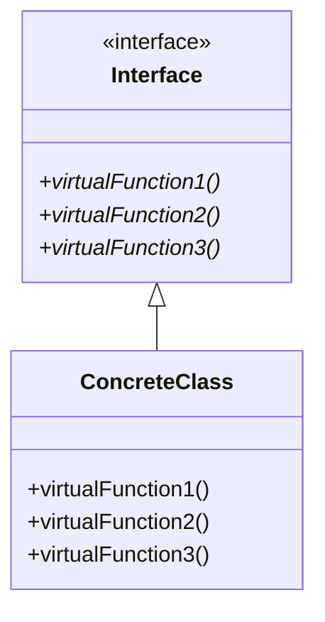

# C++ 接口类

## 介绍

在面向对象编程中，接口是定义对象之间如何交互的关键概念。虽然C++不像Java或C#那样有专门的`interface`关键字，但我们可以通过**抽象类**和**纯虚函数**来实现接口的概念。接口类在C++中为程序设计提供了灵活性、可扩展性和解耦能力，是高级面向对象编程的重要工具。

:::note
与Java和C#中的接口不同，C++的接口类是通过特殊的类实现的，这为开发者提供了更多的灵活性。
:::

## 什么是接口类？

接口类是一种特殊的抽象类，它：
- 只包含纯虚函数（没有实现的虚函数）
- 不包含数据成员
- 不提供任何实现
- 作为子类必须实现的契约或规范

从概念上讲，接口类定义了"能做什么"，而不关注"如何做"。



## C++ 中如何定义接口类

在C++中，我们使用包含纯虚函数的抽象类来创建接口：

```cpp
// 接口类定义
class IShape {
public:
    // 纯虚函数（注意 = 0）
    virtual double calculateArea() const = 0;
    virtual double calculatePerimeter() const = 0;
    
    // 虚析构函数（重要！）
    virtual ~IShape() {}
};
```

这个`IShape`类就是一个接口类，它：
- 使用前缀`I`表示这是一个接口（这是一种常见的命名约定）
- 包含两个纯虚函数（使用`= 0`表示）
- 包含一个虚析构函数（这很重要，我们稍后会解释）

## 接口类的实现

任何继承接口的类必须实现接口中定义的所有纯虚函数，否则该类也会变成抽象类。

```cpp
// 实现接口的具体类
class Circle : public IShape {
private:
    double radius;

public:
    Circle(double r) : radius(r) {}
    
    // 实现接口中的纯虚函数
    double calculateArea() const override {
        return 3.14159 * radius * radius;
    }
    
    double calculatePerimeter() const override {
        return 2 * 3.14159 * radius;
    }
};

class Rectangle : public IShape {
private:
    double width;
    double height;

public:
    Rectangle(double w, double h) : width(w), height(h) {}
    
    // 实现接口中的纯虚函数
    double calculateArea() const override {
        return width * height;
    }
    
    double calculatePerimeter() const override {
        return 2 * (width + height);
    }
};
```

## 使用接口类

接口类的主要优点是允许多态行为。我们可以通过接口指针或引用操作不同的具体类，而不需要知道它们的具体类型：

```cpp
#include <iostream>
#include <vector>

int main() {
    // 创建不同形状
    Circle circle(5.0);
    Rectangle rectangle(4.0, 6.0);
    
    // 使用接口指针
    IShape* shape1 = &circle;
    IShape* shape2 = &rectangle;
    
    // 通过接口调用方法
    std::cout << "Circle area: " << shape1->calculateArea() << std::endl;
    std::cout << "Rectangle area: " << shape2->calculateArea() << std::endl;
    
    // 使用容器和接口实现多态
    std::vector<IShape*> shapes;
    shapes.push_back(&circle);
    shapes.push_back(&rectangle);
    
    // 计算所有形状的总面积
    double totalArea = 0.0;
    for (const auto& shape : shapes) {
        totalArea += shape->calculateArea();
    }
    
    std::cout << "Total area of all shapes: " << totalArea << std::endl;
    return 0;
}
```

输出:
```
Circle area: 78.5398
Rectangle area: 24
Total area of all shapes: 102.54
```

## 接口类的关键特性

### 1. 纯虚析构函数

为什么接口类需要虚析构函数？当通过基类指针删除派生类对象时，如果基类没有虚析构函数，则只会调用基类的析构函数，可能导致资源泄漏。

```cpp
class Interface {
public:
    // 也可以将析构函数定义为纯虚函数，但必须提供实现
    virtual ~Interface() = 0;
};

// 纯虚析构函数的实现
Interface::~Interface() {
    // 通常为空
}
```

### 2. 多继承

C++允许多继承，这意味着一个类可以实现多个接口：

```cpp
class IDrawable {
public:
    virtual void draw() const = 0;
    virtual ~IDrawable() {}
};

class IMovable {
public:
    virtual void move(double x, double y) = 0;
    virtual ~IMovable() {}
};

// 实现多个接口
class GameCharacter : public IDrawable, public IMovable {
public:
    void draw() const override {
        std::cout << "Drawing character" << std::endl;
    }
    
    void move(double x, double y) override {
        std::cout << "Moving character to (" << x << ", " << y << ")" << std::endl;
    }
};
```

### 3. 默认实现

有时候，接口可能提供一些默认实现，这在C++中是允许的（这与Java或C#中的接口有所不同）：

```cpp
class ILogger {
public:
    virtual void logError(const std::string& message) = 0;
    virtual void logWarning(const std::string& message) = 0;
    
    // 提供默认实现的非纯虚函数
    virtual void logInfo(const std::string& message) {
        std::cout << "INFO: " << message << std::endl;
    }
    
    virtual ~ILogger() {}
};
```

## 实际应用场景

### 1. 插件系统

接口类是创建可扩展插件系统的理想选择：

```cpp
// 插件接口
class IPlugin {
public:
    virtual void initialize() = 0;
    virtual void shutdown() = 0;
    virtual std::string getName() const = 0;
    virtual ~IPlugin() {}
};

// 插件管理器
class PluginManager {
private:
    std::vector<IPlugin*> plugins;
    
public:
    void registerPlugin(IPlugin* plugin) {
        plugins.push_back(plugin);
        plugin->initialize();
    }
    
    void shutdownAllPlugins() {
        for (auto plugin : plugins) {
            plugin->shutdown();
        }
    }
    
    void listPlugins() {
        for (auto plugin : plugins) {
            std::cout << "Plugin: " << plugin->getName() << std::endl;
        }
    }
};
```

### 2. 策略模式

接口类在实现设计模式时非常有用，比如策略模式：

```cpp
// 排序策略接口
class ISortStrategy {
public:
    virtual void sort(std::vector<int>& data) = 0;
    virtual std::string getName() const = 0;
    virtual ~ISortStrategy() {}
};

// 具体排序策略
class BubbleSort : public ISortStrategy {
public:
    void sort(std::vector<int>& data) override {
        // 冒泡排序实现
        std::cout << "Performing bubble sort" << std::endl;
        // ...
    }
    
    std::string getName() const override {
        return "Bubble Sort";
    }
};

class QuickSort : public ISortStrategy {
public:
    void sort(std::vector<int>& data) override {
        // 快速排序实现
        std::cout << "Performing quick sort" << std::endl;
        // ...
    }
    
    std::string getName() const override {
        return "Quick Sort";
    }
};

// 使用排序策略的上下文
class SortContext {
private:
    ISortStrategy* strategy;
    
public:
    SortContext(ISortStrategy* strategy) : strategy(strategy) {}
    
    void setStrategy(ISortStrategy* newStrategy) {
        strategy = newStrategy;
    }
    
    void performSort(std::vector<int>& data) {
        std::cout << "Using " << strategy->getName() << std::endl;
        strategy->sort(data);
    }
};
```

### 3. 依赖注入

接口类促进了低耦合和依赖注入原则：

```cpp
// 数据存储接口
class IDataStorage {
public:
    virtual void save(const std::string& key, const std::string& data) = 0;
    virtual std::string load(const std::string& key) = 0;
    virtual ~IDataStorage() {}
};

// 具体实现：文件存储
class FileStorage : public IDataStorage {
public:
    void save(const std::string& key, const std::string& data) override {
        // 保存到文件
    }
    
    std::string load(const std::string& key) override {
        // 从文件加载
        return "data from file";
    }
};

// 具体实现：数据库存储
class DatabaseStorage : public IDataStorage {
public:
    void save(const std::string& key, const std::string& data) override {
        // 保存到数据库
    }
    
    std::string load(const std::string& key) override {
        // 从数据库加载
        return "data from database";
    }
};

// 使用存储接口的服务
class UserService {
private:
    IDataStorage* storage;
    
public:
    // 依赖注入
    UserService(IDataStorage* storage) : storage(storage) {}
    
    void saveUserData(const std::string& userId, const std::string& userData) {
        storage->save(userId, userData);
    }
    
    std::string getUserData(const std::string& userId) {
        return storage->load(userId);
    }
};
```

## 接口类的最佳实践

1. **命名约定**：使用前缀 `I` 来表示接口类（如`IShape`）。

2. **纯虚析构函数**：始终为接口提供虚析构函数，以确保正确的内存管理。

3. **无数据成员**：接口类应该只包含函数声明，不应包含数据成员。

4. **文档注释**：详细记录接口的预期行为，以便实现类知道如何正确地实现它们。

5. **接口隔离原则**：保持接口小巧和专注，而不是创建大型的"万能"接口。

```cpp
// 不好的做法：过于臃肿的接口
class IBloatedInterface {
public:
    virtual void doThis() = 0;
    virtual void doThat() = 0;
    virtual void doSomethingElse() = 0;
    virtual void andEvenMore() = 0;
    // ... 更多与不同职责相关的方法
    virtual ~IBloatedInterface() {}
};

// 好的做法：分离为多个专注的接口
class IDataReader {
public:
    virtual void read() = 0;
    virtual ~IDataReader() {}
};

class IDataWriter {
public:
    virtual void write() = 0;
    virtual ~IDataWriter() {}
};
```

:::tip
遵循接口隔离原则：客户端不应该被迫依赖于它们不使用的接口。
:::

## 常见陷阱和解决方案

### 1. 忘记虚析构函数

```cpp
// 错误：没有虚析构函数
class IErrorProne {
public:
    virtual void method() = 0;
    // 缺少虚析构函数
};

// 修正：添加虚析构函数
class ISafeDeletion {
public:
    virtual void method() = 0;
    virtual ~ISafeDeletion() {}  // 添加虚析构函数
};
```

### 2. 钻石继承问题

```cpp
class IA {
public:
    virtual void method() = 0;
    virtual ~IA() {}
};

class IB : public IA {
public:
    virtual void anotherMethod() = 0;
};

class IC : public IA {
public:
    virtual void yetAnotherMethod() = 0;
};

// 钻石继承问题
class D : public IB, public IC {  // D现在有IA的两个副本
public:
    void method() override { /* ... */ }           // 歧义：IB::method 还是 IC::method?
    void anotherMethod() override { /* ... */ }
    void yetAnotherMethod() override { /* ... */ }
};

// 解决方案：使用虚继承
class IBetter : public virtual IA { /* ... */ };
class ICBetter : public virtual IA { /* ... */ };
class DBetter : public IBetter, public ICBetter { /* ... */ };
```

### 3. 接口膨胀

随着时间的推移，接口可能会增加越来越多的方法，导致实现类负担过重：

```cpp
// 解决方案：使用接口组合而非单一大接口
class IMinimal {
public:
    virtual void coreFunction() = 0;
    virtual ~IMinimal() {}
};

class IExtended : public IMinimal {
public:
    virtual void additionalFunction() = 0;
};

// 只需要实现必要的接口
class BasicImplementation : public IMinimal {
public:
    void coreFunction() override { /* ... */ }
};
```

## 总结

接口类是C++中实现多态和设计灵活系统的强大工具。通过纯虚函数，我们可以定义对象之间交互的契约，而不必关注具体实现。主要优点包括：

- **松耦合**：依赖于接口而非具体实现
- **可扩展性**：容易添加新的实现而不影响现有代码
- **可测试性**：便于创建模拟对象进行测试
- **代码组织**：明确定义类的责任和能力

虽然C++没有专门的`interface`关键字，但使用抽象类和纯虚函数可以实现相同的功能，甚至提供更大的灵活性。

## 练习

1. 创建一个`IAnimal`接口，包含`makeSound()`和`move()`方法，然后实现几个具体的动物类。

2. 设计一个简单的音乐播放器系统，使用接口类定义`IAudioFile`、`IPlaylist`和`IPlayer`等组件。

3. 实现一个命令模式，使用`ICommand`接口，包含`execute()`和`undo()`方法。

4. 创建一个工厂模式实现，使用接口类来定义产品族。

## 附加资源

- C++ Core Guidelines关于接口的建议: [C++ Core Guidelines: Interfaces](https://isocpp.github.io/CppCoreGuidelines/CppCoreGuidelines#S-interfaces)
- Design Patterns in Modern C++
- Effective C++, 第三版，Item 34："区分接口继承和实现继承"

:::caution
记住，接口类是强大的抽象工具，但并非所有情况都需要它们。在小型或简单的项目中，过度使用接口可能会导致不必要的复杂性。始终根据实际需求选择合适的设计方法。
:::