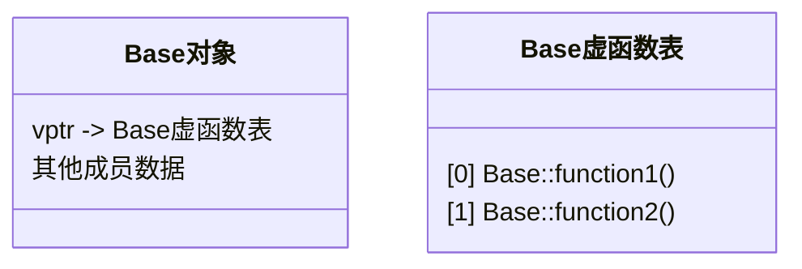
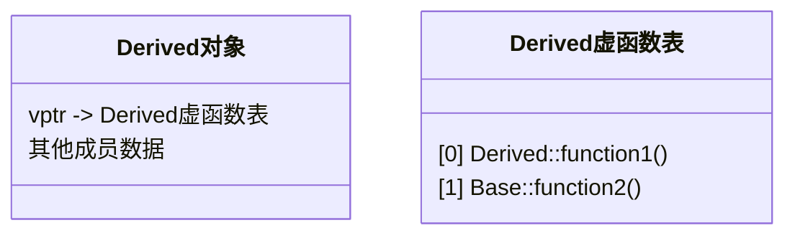

# C++ 虚函数表

## 什么是虚函数表？

在面向对象编程中，C++的多态性是一个强大的特性，而**虚函数表**（Virtual Function Table，简称vtable或vftable）是C++实现多态的核心机制。虚函数表是编译器为每个包含虚函数的类创建的一个表，其中存储了该类所有虚函数的地址。

:::note
虚函数表不是C++标准的一部分，而是大多数C++编译器用来实现虚函数调用的通用实现方式。
:::

## 基础概念

当我们在类中声明一个函数为虚函数（使用`virtual`关键字）时，编译器会为该类创建一个虚函数表。这个表包含指向该类所有虚函数的指针。此外，编译器还会在每个对象的内存布局中添加一个隐藏的指针，称为**vptr**（虚表指针），指向该类的虚函数表。

```cpp
class Base {
public:
    virtual void function1() {
        std::cout << "Base::function1" << std::endl;
    }
    
    virtual void function2() {
        std::cout << "Base::function2" << std::endl;
    }
};
```

上面的类`Base`会有一个虚函数表，包含`function1`和`function2`的地址。

## 虚函数表的内存布局

让我们通过图表来理解虚函数表的内存布局：



当创建一个`Base`类的对象时，其内存布局中的第一个位置通常是vptr，它指向Base的虚函数表，表中存储了虚函数的地址。

## 继承与虚函数表

当我们创建一个派生类并重写基类的虚函数时，虚函数表的机制就显示出其核心价值：

```cpp
class Derived : public Base {
public:
    void function1() override {
        std::cout << "Derived::function1" << std::endl;
    }
    
    // function2继承自Base，不重写
};
```

`Derived`类的虚函数表布局如下：



注意到，`Derived`的虚函数表中，`function1`指向了`Derived::function1()`，而`function2`仍指向`Base::function2()`，因为它没有被重写。

## 实际运行机制

当我们通过基类指针或引用调用虚函数时，C++会执行以下步骤：

1. 通过对象的vptr找到虚函数表
2. 在虚函数表中查找对应函数的地址
3. 调用找到的函数

这就是所谓的**动态绑定**或**晚期绑定**，它使得程序能在运行时确定要调用的函数，而不是在编译时。

```cpp
Base* ptr = new Derived();
ptr->function1();  // 输出: Derived::function1
ptr->function2();  // 输出: Base::function2
```

在上面的代码中，`ptr`是`Base`类型的指针，但它指向`Derived`对象。当调用`function1()`时，程序会通过`Derived`对象的vptr找到`Derived`的虚函数表，然后调用表中的`Derived::function1()`。

## 完整代码示例

以下是一个完整的例子，展示了虚函数表的工作原理：

```cpp
#include <iostream>

class Base {
public:
    virtual void function1() {
        std::cout << "Base::function1" << std::endl;
    }
    
    virtual void function2() {
        std::cout << "Base::function2" << std::endl;
    }
    
    virtual ~Base() {
        std::cout << "Base destructor" << std::endl;
    }
};

class Derived : public Base {
public:
    void function1() override {
        std::cout << "Derived::function1" << std::endl;
    }
    
    // 没有重写function2
    
    ~Derived() override {
        std::cout << "Derived destructor" << std::endl;
    }
};

int main() {
    std::cout << "Creating Base object:" << std::endl;
    Base baseObj;
    baseObj.function1();  // 输出: Base::function1
    baseObj.function2();  // 输出: Base::function2
    
    std::cout << "\nCreating Derived object:" << std::endl;
    Derived derivedObj;
    derivedObj.function1();  // 输出: Derived::function1
    derivedObj.function2();  // 输出: Base::function2
    
    std::cout << "\nUsing Base pointer to Derived object:" << std::endl;
    Base* ptr = new Derived();
    ptr->function1();  // 输出: Derived::function1
    ptr->function2();  // 输出: Base::function2
    delete ptr;  // 输出: Derived destructor, 然后是 Base destructor
    
    return 0;
}
```

**输出结果：**

```
Creating Base object:
Base::function1
Base::function2

Creating Derived object:
Derived::function1
Base::function2

Using Base pointer to Derived object:
Derived::function1
Base::function2
Derived destructor
Base destructor
```

## 虚函数表的实际应用场景

### 1. 框架设计

在大型软件框架中，通常会定义抽象基类作为接口，然后让具体实现类继承这些基类。虚函数表使得框架可以通过基类指针调用派生类的具体实现，而无需知道派生类的具体类型。

例如，在游戏引擎中的渲染系统：

```cpp
class Renderable {
public:
    virtual void render() = 0;  // 纯虚函数
};

class Sprite : public Renderable {
public:
    void render() override {
        // 精灵渲染逻辑
    }
};

class Model3D : public Renderable {
public:
    void render() override {
        // 3D模型渲染逻辑
    }
};

// 渲染系统可以处理任何Renderable对象
void RenderSystem::processObjects(std::vector<Renderable*> objects) {
    for (auto obj : objects) {
        obj->render();  // 多态调用
    }
}
```

### 2. 插件系统

虚函数表机制使得C++能够实现动态加载的插件系统：

```cpp
// 插件接口
class Plugin {
public:
    virtual void initialize() = 0;
    virtual void shutdown() = 0;
    virtual const char* getName() = 0;
    virtual ~Plugin() {}
};

// 在动态库中实现的具体插件
class AudioPlugin : public Plugin {
public:
    void initialize() override { /* 初始化音频系统 */ }
    void shutdown() override { /* 关闭音频系统 */ }
    const char* getName() override { return "Audio Plugin"; }
};
```

## 虚函数表的性能考量

虚函数调用相比普通函数调用有一些性能开销：

1. **内存开销**：每个包含虚函数的类对象都需要额外存储一个vptr指针
2. **调用开销**：虚函数调用需要额外的间接访问（通过vptr和虚函数表）
3. **缓存不友好**：虚函数调用可能导致CPU缓存命中率降低

:::caution
在性能关键的代码中，如果某个虚函数被频繁调用，可以考虑是否有必要使用虚函数。
:::

## 虚函数表与多重继承

在多重继承情况下，虚函数表的结构会更加复杂。一个派生自多个基类的类可能有多个虚函数表或者一个复杂的合并虚函数表，具体取决于编译器的实现。

```cpp
class Base1 {
public:
    virtual void function1() { /* ... */ }
};

class Base2 {
public:
    virtual void function2() { /* ... */ }
};

class Derived : public Base1, public Base2 {
public:
    void function1() override { /* ... */ }
    void function2() override { /* ... */ }
};
```

在这种情况下，`Derived`对象可能有多个vptr，分别指向不同的虚函数表。

## 总结

虚函数表是C++实现多态的核心机制，它允许程序在运行时确定调用的函数，而不是在编译时。虽然虚函数表的使用会带来一些性能开销，但它提供的灵活性和可扩展性使其成为面向对象编程中不可或缺的工具。

理解虚函数表的工作原理对于编写高效、可维护的C++代码非常重要，特别是在涉及复杂继承层次结构的项目中。

## 练习

1. 编写一个简单的程序，创建一个包含虚函数的基类和两个派生类。通过基类指针调用这些虚函数，观察多态行为。

2. 修改上面的程序，尝试分析对象的内存布局，特别是vptr的位置。（提示：可以使用类似`sizeof`运算符和指针操作来探索）

3. 创建一个包含虚函数的基类和派生类，测量调用虚函数和非虚函数的性能差异。

## 延伸阅读

- C++中的RTTI（Run-Time Type Information）机制
- 虚继承与虚基类
- 纯虚函数与抽象类
- 虚函数表在不同编译器中的实现差异