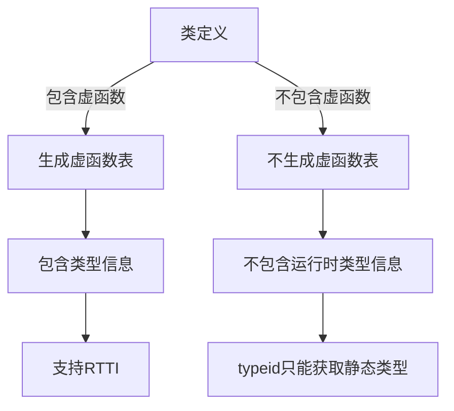

# C++ RTTI机制

## 什么是RTTI？

RTTI(Run-Time Type Information)是C++提供的运行时类型识别机制，允许程序在运行时确定对象的类型。在面向对象编程中，多态性允许使用基类指针或引用来操作派生类对象。有时候，我们需要知道这个指针或引用实际指向的对象类型，这时就需要RTTI机制了。

C++提供了三种主要的RTTI操作符/函数：

1. **typeid操作符**：获取对象的实际类型
2. **dynamic_cast操作符**：安全地将基类指针/引用转换为派生类指针/引用
3. **type_info类**：存储类型信息并提供比较类型的方法

:::note
RTTI功能只在启用虚函数的类层次结构中才能完全发挥作用，因为它依赖于虚函数表中存储的类型信息。
:::

## typeid操作符

`typeid`操作符返回一个常量引用，指向一个`std::type_info`类对象，这个对象包含了给定类型或表达式的类型信息。

### 基本用法

```cpp
#include <iostream>
#include <typeinfo>

class Base {
public:
    virtual ~Base() {} // 必须有虚函数才能使RTTI正常工作
};

class Derived : public Base {
};

int main() {
    Base* ptr = new Derived();
    
    // 使用typeid获取对象的实际类型
    std::cout << "类型名称: " << typeid(*ptr).name() << std::endl;
    
    // 比较类型
    if(typeid(*ptr) == typeid(Derived)) {
        std::cout << "ptr指向的是Derived类型的对象" << std::endl;
    } else {
        std::cout << "ptr不是指向Derived类型的对象" << std::endl;
    }
    
    delete ptr;
    return 0;
}
```

**输出：**
```
类型名称: 7Derived
ptr指向的是Derived类型的对象
```

:::caution
注意：不同编译器输出的类型名称可能不同。上面的`7Derived`是一些编译器的输出方式，表示类名为`Derived`且长度为7。
:::

## dynamic_cast操作符

`dynamic_cast`是一个类型转换操作符，用于在继承体系中进行安全的向下转型（从基类到派生类）。如果转换失败，对于指针，它会返回`nullptr`；对于引用，会抛出`std::bad_cast`异常。

### 基本用法

```cpp
#include <iostream>
#include <typeinfo>

class Base {
public:
    virtual ~Base() {} // 必须有虚函数才能使dynamic_cast正常工作
    virtual void print() { std::cout << "Base::print()" << std::endl; }
};

class Derived1 : public Base {
public:
    void print() override { std::cout << "Derived1::print()" << std::endl; }
    void derived1Function() { std::cout << "Derived1特有的函数" << std::endl; }
};

class Derived2 : public Base {
public:
    void print() override { std::cout << "Derived2::print()" << std::endl; }
};

int main() {
    Base* b1 = new Derived1();
    Base* b2 = new Derived2();
    
    // 使用dynamic_cast进行类型转换
    Derived1* d1 = dynamic_cast<Derived1*>(b1); // 成功，b1实际指向Derived1
    Derived1* d2 = dynamic_cast<Derived1*>(b2); // 失败，b2实际指向Derived2
    
    if(d1) {
        std::cout << "转换b1成功!" << std::endl;
        d1->derived1Function(); // 可以调用Derived1特有的函数
    } else {
        std::cout << "转换b1失败!" << std::endl;
    }
    
    if(d2) {
        std::cout << "转换b2成功!" << std::endl;
        d2->derived1Function();
    } else {
        std::cout << "转换b2失败!" << std::endl;
    }
    
    // 清理内存
    delete b1;
    delete b2;
    
    return 0;
}
```

**输出：**
```
转换b1成功!
Derived1特有的函数
转换b2失败!
```

### 引用的dynamic_cast

对引用使用`dynamic_cast`时，失败会抛出异常：

```cpp
#include <iostream>
#include <typeinfo>

class Base {
public:
    virtual ~Base() {}
};

class Derived : public Base {};

int main() {
    Base* basePtr = new Base();
    
    try {
        // 尝试将Base引用转换为Derived引用（这会失败）
        Derived& derivedRef = dynamic_cast<Derived&>(*basePtr);
        std::cout << "转换成功" << std::endl; // 不会执行到这里
    } catch(const std::bad_cast& e) {
        std::cout << "转换失败: " << e.what() << std::endl;
    }
    
    delete basePtr;
    return 0;
}
```

**输出：**
```
转换失败: std::bad_cast
```

## type_info类

`std::type_info`类保存类型的信息，由`typeid`操作符返回。它提供了一些有用的方法：

- `name()`：返回类型的名称（具体格式依赖于编译器）
- `operator==`和`operator!=`：比较两个类型是否相同
- `before()`：用于排序，比较两个类型的顺序

```cpp
#include <iostream>
#include <typeinfo>

class Base {
public:
    virtual ~Base() {}
};

class Derived : public Base {};

int main() {
    Base b;
    Derived d;
    
    const std::type_info& ti1 = typeid(b);
    const std::type_info& ti2 = typeid(d);
    
    std::cout << "ti1的名称: " << ti1.name() << std::endl;
    std::cout << "ti2的名称: " << ti2.name() << std::endl;
    
    if(ti1 == ti2) {
        std::cout << "类型相同" << std::endl;
    } else {
        std::cout << "类型不同" << std::endl;
    }
    
    // 检查类型顺序
    if(ti1.before(ti2)) {
        std::cout << ti1.name() << " 在 " << ti2.name() << " 之前" << std::endl;
    } else if(ti2.before(ti1)) {
        std::cout << ti2.name() << " 在 " << ti1.name() << " 之前" << std::endl;
    }
    
    return 0;
}
```

**输出可能类似于：**
```
ti1的名称: 4Base
ti2的名称: 7Derived
类型不同
4Base 在 7Derived 之前
```

## RTTI的实际应用场景

### 1. 插件系统

在插件架构中，可以使用RTTI来识别和验证加载的组件类型：

```cpp
#include <iostream>
#include <typeinfo>
#include <vector>
#include <memory>

// 插件基类
class Plugin {
public:
    virtual ~Plugin() {}
    virtual void execute() = 0;
};

// 具体插件实现
class ImagePlugin : public Plugin {
public:
    void execute() override { 
        std::cout << "处理图像..." << std::endl; 
    }
    
    void applyFilter() { 
        std::cout << "应用滤镜效果" << std::endl; 
    }
};

class AudioPlugin : public Plugin {
public:
    void execute() override { 
        std::cout << "处理音频..." << std::endl; 
    }
    
    void adjustVolume() { 
        std::cout << "调整音量" << std::endl; 
    }
};

// 插件管理器
class PluginManager {
private:
    std::vector<std::unique_ptr<Plugin>> plugins;
    
public:
    void addPlugin(Plugin* plugin) {
        plugins.emplace_back(plugin);
    }
    
    void executeAll() {
        for(auto& plugin : plugins) {
            plugin->execute();
            
            // 根据插件类型执行特定操作
            if(typeid(*plugin) == typeid(ImagePlugin)) {
                ImagePlugin* imgPlugin = dynamic_cast<ImagePlugin*>(plugin.get());
                if(imgPlugin) {
                    imgPlugin->applyFilter();
                }
            }
            else if(typeid(*plugin) == typeid(AudioPlugin)) {
                AudioPlugin* audioPlugin = dynamic_cast<AudioPlugin*>(plugin.get());
                if(audioPlugin) {
                    audioPlugin->adjustVolume();
                }
            }
        }
    }
};

int main() {
    PluginManager manager;
    
    manager.addPlugin(new ImagePlugin());
    manager.addPlugin(new AudioPlugin());
    
    manager.executeAll();
    
    return 0;
}
```

**输出：**
```
处理图像...
应用滤镜效果
处理音频...
调整音量
```

### 2. 对象序列化

在序列化/反序列化系统中，可以使用RTTI来确定对象的类型：

```cpp
#include <iostream>
#include <typeinfo>
#include <string>
#include <map>
#include <memory>

// 可序列化对象的基类
class Serializable {
public:
    virtual ~Serializable() {}
    virtual std::string serialize() const = 0;
    virtual void deserialize(const std::string& data) = 0;
};

// 用户类
class User : public Serializable {
    std::string name;
    int age;
    
public:
    User(std::string n = "", int a = 0) : name(n), age(a) {}
    
    std::string serialize() const override {
        return name + ":" + std::to_string(age);
    }
    
    void deserialize(const std::string& data) override {
        size_t pos = data.find(':');
        if(pos != std::string::npos) {
            name = data.substr(0, pos);
            age = std::stoi(data.substr(pos + 1));
        }
    }
    
    void printInfo() const {
        std::cout << "用户: " << name << ", 年龄: " << age << std::endl;
    }
};

// 产品类
class Product : public Serializable {
    std::string name;
    double price;
    
public:
    Product(std::string n = "", double p = 0.0) : name(n), price(p) {}
    
    std::string serialize() const override {
        return name + ":" + std::to_string(price);
    }
    
    void deserialize(const std::string& data) override {
        size_t pos = data.find(':');
        if(pos != std::string::npos) {
            name = data.substr(0, pos);
            price = std::stod(data.substr(pos + 1));
        }
    }
    
    void printInfo() const {
        std::cout << "产品: " << name << ", 价格: " << price << std::endl;
    }
};

// 序列化管理器
class SerializationManager {
public:
    template<typename T>
    std::string serializeWithTypeInfo(const T& obj) {
        // 保存类型信息和序列化数据
        return std::string(typeid(T).name()) + "|" + obj.serialize();
    }
    
    std::unique_ptr<Serializable> deserialize(const std::string& data) {
        size_t pos = data.find('|');
        if(pos != std::string::npos) {
            std::string typeInfo = data.substr(0, pos);
            std::string objData = data.substr(pos + 1);
            
            // 根据类型信息创建对应的对象
            if(typeInfo == typeid(User).name()) {
                auto user = std::make_unique<User>();
                user->deserialize(objData);
                return user;
            }
            else if(typeInfo == typeid(Product).name()) {
                auto product = std::make_unique<Product>();
                product->deserialize(objData);
                return product;
            }
        }
        return nullptr;
    }
};

int main() {
    SerializationManager manager;
    
    // 创建对象
    User user("张三", 30);
    Product product("笔记本电脑", 5999.99);
    
    // 序列化
    std::string userData = manager.serializeWithTypeInfo(user);
    std::string productData = manager.serializeWithTypeInfo(product);
    
    std::cout << "序列化用户数据: " << userData << std::endl;
    std::cout << "序列化产品数据: " << productData << std::endl;
    
    // 反序列化
    auto obj1 = manager.deserialize(userData);
    auto obj2 = manager.deserialize(productData);
    
    // 使用dynamic_cast确定对象类型并调用特定方法
    if(User* userPtr = dynamic_cast<User*>(obj1.get())) {
        std::cout << "反序列化用户成功: ";
        userPtr->printInfo();
    }
    
    if(Product* productPtr = dynamic_cast<Product*>(obj2.get())) {
        std::cout << "反序列化产品成功: ";
        productPtr->printInfo();
    }
    
    return 0;
}
```

**输出类似于：**
```
序列化用户数据: 4User|张三:30
序列化产品数据: 7Product|笔记本电脑:5999.990000
反序列化用户成功: 用户: 张三, 年龄: 30
反序列化产品成功: 产品: 笔记本电脑, 价格: 5999.99
```

## RTTI的效率考虑

虽然RTTI很有用，但它也有一些性能开销：

1. **内存开销**：需要在虚函数表中存储类型信息
2. **运行时开销**：`dynamic_cast`和`typeid`操作需要在运行时进行类型比较和检查
3. **代码膨胀**：可能导致生成的二进制文件变大

:::tip
在性能敏感的应用中，可以考虑其他替代方案，如自定义类型ID系统。不过对于大多数应用，RTTI的开销是可以接受的。
:::

## RTTI与虚函数的关系

RTTI的完整功能只能在带有至少一个虚函数的类中使用。这是因为：

1. 带有虚函数的类会生成虚函数表(vtable)
2. 类型信息存储在虚函数表中
3. 没有虚函数的类不会生成这些数据结构，因此无法在运行时进行完整的类型识别



## 总结

RTTI是C++提供的强大工具，使程序能够在运行时检查和确定对象的类型。主要包括：

- **typeid操作符**：获取类型信息
- **dynamic_cast**：进行安全的向下转型
- **type_info类**：存储和比较类型信息

RTTI主要应用于以下场景：
1. 处理多态对象集合时需要区分具体类型
2. 插件系统和模块化架构
3. 对象序列化和反序列化
4. 类工厂模式的实现

正确使用RTTI可以使代码更加灵活和健壮，尤其是在处理复杂的类层次结构时。

## 练习题

1. 编写一个程序，创建多个形状类（圆形、矩形等），使用RTTI来识别每个形状并计算相应的面积。

2. 实现一个简单的类工厂，它可以根据类型名称（字符串）创建相应的对象。

3. 修改本文的插件系统示例，添加一个新类型的插件，并使用RTTI正确处理它。

## 相关资源

- [C++ Reference - typeid](https://en.cppreference.com/w/cpp/language/typeid)
- [C++ Reference - dynamic_cast](https://en.cppreference.com/w/cpp/language/dynamic_cast)
- [C++ Reference - std::type_info](https://en.cppreference.com/w/cpp/types/type_info)

通过掌握RTTI机制，你将能更加灵活地处理面向对象编程中的各种场景，特别是在处理复杂的类层次结构和多态性时。不过，也要记住在必要的时候使用RTTI，避免过度依赖它导致设计不良的代码结构。