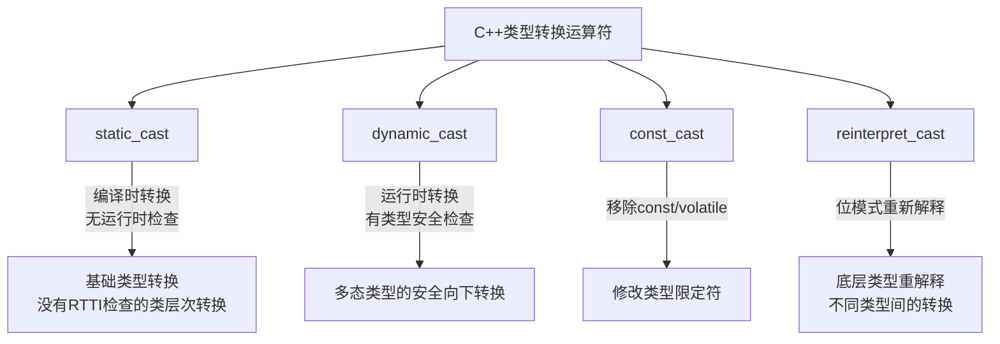

# C++ dynamic_cast 运算符

## 引言

在C++面向对象编程中，类型转换是一个常见而重要的操作。特别是在处理继承层次结构时，我们经常需要在基类和派生类之间进行安全的类型转换。`dynamic_cast` 是C++提供的四种类型转换运算符之一，专门用于处理多态类型的安全向下转换（downcasting）。

本文将为你详细解析 `dynamic_cast` 的工作原理、语法和使用场景，帮助你在正确的时机选择这个强大的工具。

## dynamic_cast 基础知识

### 什么是 dynamic_cast？

`dynamic_cast` 是一个在运行时执行的类型转换操作符，主要用于处理多态类对象的安全转换。它能够将一个基类指针或引用安全地转换为派生类指针或引用，前提是该对象确实是派生类的实例。

### 语法

```cpp
dynamic_cast<target_type>(expression)
```

其中：
- `target_type` 是目标类型，通常是带有 `*` 或 `&` 的类类型
- `expression` 是要转换的表达式（通常是指针或引用）

### 工作原理

`dynamic_cast` 在运行时检查类型转换是否安全：

1. 如果转换是安全的（对象确实是目标类型的实例），转换成功
2. 如果转换不安全：
   - 对于指针转换，返回空指针（nullptr）
   - 对于引用转换，抛出 `std::bad_cast` 异常

:::note
`dynamic_cast` 要求类至少有一个虚函数，因为它依赖于RTTI（运行时类型信息）机制，而RTTI信息存储在带有虚函数的类的虚函数表中。
:::

## dynamic_cast 详解与示例

### 基本使用示例

下面是一个简单的例子，展示了 `dynamic_cast` 的基本用法：

```cpp
#include <iostream>

// 基类（包含至少一个虚函数）
class Base {
public:
    virtual void print() {
        std::cout << "这是基类" << std::endl;
    }
    virtual ~Base() {}  // 虚析构函数是良好实践
};

// 第一个派生类
class Derived1 : public Base {
public:
    void print() override {
        std::cout << "这是派生类1" << std::endl;
    }
    
    void derived1Method() {
        std::cout << "派生类1的特殊方法" << std::endl;
    }
};

// 第二个派生类
class Derived2 : public Base {
public:
    void print() override {
        std::cout << "这是派生类2" << std::endl;
    }
    
    void derived2Method() {
        std::cout << "派生类2的特殊方法" << std::endl;
    }
};

int main() {
    Base* b1 = new Derived1();
    Base* b2 = new Derived2();
    Base* b3 = new Base();
    
    // 尝试将基类指针转换为派生类指针
    Derived1* d1 = dynamic_cast<Derived1*>(b1);  // 成功
    Derived1* d2 = dynamic_cast<Derived1*>(b2);  // 失败，返回nullptr
    Derived1* d3 = dynamic_cast<Derived1*>(b3);  // 失败，返回nullptr
    
    // 检查转换是否成功
    if (d1) {
        std::cout << "转换b1成功！" << std::endl;
        d1->derived1Method();  // 安全调用派生类方法
    } else {
        std::cout << "转换b1失败！" << std::endl;
    }
    
    if (d2) {
        std::cout << "转换b2成功！" << std::endl;
    } else {
        std::cout << "转换b2失败！" << std::endl;
    }
    
    if (d3) {
        std::cout << "转换b3成功！" << std::endl;
    } else {
        std::cout << "转换b3失败！" << std::endl;
    }
    
    // 释放内存
    delete b1;
    delete b2;
    delete b3;
    
    return 0;
}
```

**输出结果：**
```
转换b1成功！
派生类1的特殊方法
转换b2失败！
转换b3失败！
```

### 使用引用的 dynamic_cast

当使用引用进行 `dynamic_cast` 时，失败会抛出异常：

```cpp
#include <iostream>
#include <stdexcept>

// 使用上面的类定义

int main() {
    Base b;
    Derived1 d1;
    
    Base& rb = b;
    Base& rd = d1;
    
    try {
        // 尝试引用转换
        Derived1& ref1 = dynamic_cast<Derived1&>(rd);  // 成功
        std::cout << "rd转换成功" << std::endl;
        ref1.derived1Method();
        
        Derived1& ref2 = dynamic_cast<Derived1&>(rb);  // 失败，抛出异常
        std::cout << "这一行不会执行" << std::endl;
    }
    catch (const std::bad_cast& e) {
        std::cout << "转换失败：" << e.what() << std::endl;
    }
    
    return 0;
}
```

**输出结果：**
```
rd转换成功
派生类1的特殊方法
转换失败：std::bad_cast
```

## dynamic_cast 使用场景与注意事项

### 适用场景

1. **安全的向下转换**：当你有一个基类指针/引用，并且想转换为派生类指针/引用时
2. **运行时类型检查**：当你需要确定一个多态对象的实际类型时
3. **跨层次结构转换**：在某些复杂的继承结构中，实现横向转换

### 不适用场景

1. **向上转换**：从派生类到基类的转换，可以隐式完成或使用 `static_cast`
2. **非多态类型**：对于没有虚函数的类，不能使用 `dynamic_cast`
3. **性能关键的代码**：`dynamic_cast` 有一定的运行时开销

### 与其他类型转换运算符的比较



## 实际应用案例：多态对象处理系统

让我们看一个稍复杂但实用的例子，展示 `dynamic_cast` 在真实场景中的应用：

```cpp
#include <iostream>
#include <vector>
#include <memory>

// 基础图形类
class Shape {
public:
    virtual void draw() const = 0;
    virtual double area() const = 0;
    virtual ~Shape() {}
};

// 圆形
class Circle : public Shape {
private:
    double radius;

public:
    Circle(double r) : radius(r) {}
    
    void draw() const override {
        std::cout << "绘制圆形" << std::endl;
    }
    
    double area() const override {
        return 3.14159 * radius * radius;
    }
    
    double getRadius() const {
        return radius;
    }
    
    void scale(double factor) {
        radius *= factor;
    }
};

// 矩形
class Rectangle : public Shape {
private:
    double width, height;

public:
    Rectangle(double w, double h) : width(w), height(h) {}
    
    void draw() const override {
        std::cout << "绘制矩形" << std::endl;
    }
    
    double area() const override {
        return width * height;
    }
    
    double getWidth() const { return width; }
    double getHeight() const { return height; }
    
    void resize(double newWidth, double newHeight) {
        width = newWidth;
        height = newHeight;
    }
};

// 图形处理系统
class GraphicSystem {
public:
    void processShapes(const std::vector<std::shared_ptr<Shape>>& shapes) {
        for (const auto& shape : shapes) {
            // 绘制所有图形
            shape->draw();
            std::cout << "面积: " << shape->area() << std::endl;
            
            // 尝试根据类型进行特殊处理
            if (auto circle = dynamic_cast<Circle*>(shape.get())) {
                std::cout << "检测到圆形！半径为: " << circle->getRadius() << std::endl;
                circle->scale(1.5);
                std::cout << "放大后半径为: " << circle->getRadius() << std::endl;
            }
            else if (auto rectangle = dynamic_cast<Rectangle*>(shape.get())) {
                std::cout << "检测到矩形！尺寸为: " << rectangle->getWidth() 
                          << " x " << rectangle->getHeight() << std::endl;
                rectangle->resize(rectangle->getWidth() * 2, rectangle->getHeight());
                std::cout << "调整后尺寸为: " << rectangle->getWidth() 
                          << " x " << rectangle->getHeight() << std::endl;
            }
            
            std::cout << "处理后面积: " << shape->area() << std::endl;
            std::cout << "------------------------" << std::endl;
        }
    }
};

int main() {
    std::vector<std::shared_ptr<Shape>> shapes;
    
    shapes.push_back(std::make_shared<Circle>(5.0));
    shapes.push_back(std::make_shared<Rectangle>(4.0, 6.0));
    shapes.push_back(std::make_shared<Circle>(2.5));
    
    GraphicSystem system;
    system.processShapes(shapes);
    
    return 0;
}
```

**输出结果：**
```
绘制圆形
面积: 78.5398
检测到圆形！半径为: 5
放大后半径为: 7.5
处理后面积: 176.715
------------------------
绘制矩形
面积: 24
检测到矩形！尺寸为: 4 x 6
调整后尺寸为: 8 x 6
处理后面积: 48
------------------------
绘制圆形
面积: 19.635
检测到圆形！半径为: 2.5
放大后半径为: 3.75
处理后面积: 44.1796
------------------------
```

在这个例子中：
1. 我们创建了一个多态的图形系统
2. 使用 `dynamic_cast` 来检测具体的图形类型
3. 根据检测到的类型，调用特定子类的方法
4. 这一切都在运行时安全地完成，没有类型错误风险

## dynamic_cast 的限制和性能考虑

### 限制

1. **必须有虚函数**：只能用于至少有一个虚函数的类
2. **不能跨库使用**：跨DLL或共享库的 `dynamic_cast` 可能会出问题
3. **不支持多重继承中的私有继承**：在这种情况下转换会失败

### 性能影响

`dynamic_cast` 相比其他转换有一定性能开销：

1. 它需要遍历类的RTTI信息来验证类型兼容性
2. 在深层次的继承结构中，开销可能更大
3. 在性能敏感的代码中（如游戏引擎的主循环），应谨慎使用

:::tip
如果你确切知道对象的类型，可以考虑使用 `static_cast` 来避免运行时开销。但要记住，`static_cast` 不会进行运行时类型检查，使用不当会导致未定义行为。
:::

## 最佳实践

1. **优先使用虚函数**：通过虚函数来实现多态行为，尽量减少使用 `dynamic_cast`
2. **检查转换结果**：始终检查 `dynamic_cast` 的返回值是否为 nullptr
3. **异常处理**：当使用引用转换时，添加适当的异常处理
4. **避免在热点代码中频繁使用**：这可能导致性能问题
5. **考虑设计模式**：有时，访问者模式或双派发可以替代 `dynamic_cast`

## 总结

`dynamic_cast` 是C++中一个强大的运行时类型安全机制，它允许我们在继承层次结构中安全地向下转换指针和引用。尽管它有一定的性能开销，但在许多场景下，这种安全性是值得的。通过本文的学习，你应该能够：

- 理解 `dynamic_cast` 的基本原理和语法
- 知道何时使用和不使用 `dynamic_cast`
- 掌握使用 `dynamic_cast` 的最佳实践
- 理解其与其他类型转换运算符的区别

记住，良好的面向对象设计通常可以减少对类型转换的需求，但当确实需要时，`dynamic_cast` 提供了一种安全的方式来处理类型转换。

## 练习

1. 创建一个 `Animal` 基类和几个派生类，如 `Dog`、`Cat` 和 `Bird`。使用 `dynamic_cast` 实现一个函数，根据不同动物类型执行特定操作。

2. 实现一个简单的对象工厂，返回 `Shape` 基类的指针，然后使用 `dynamic_cast` 识别实际类型。

3. 研究一个使用 `dynamic_cast` 可能导致性能问题的场景，并尝试重构代码以避免这种情况。

## 进一步阅读

- C++ 标准库中的 RTTI 机制
- 类型安全和 `typeid` 运算符
- 设计模式替代方案（访问者模式、双派发）
- 现代C++中的类型安全技术

通过深入理解 `dynamic_cast`，你将能更有效地处理C++中的多态对象，写出更安全、更健壮的代码。