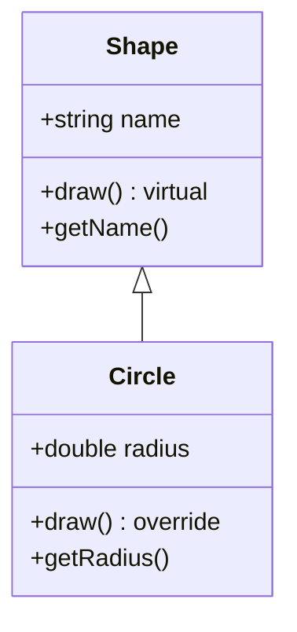

# C++ 对象切片

## 什么是对象切片？

对象切片(Object Slicing)是C++面向对象编程中一个重要但容易被忽视的现象。当我们将一个派生类对象赋值给一个基类对象时，派生类中特有的成员会被"切掉"，只保留基类部分的数据。这种现象称为对象切片。

:::warning
对象切片可能导致意外的程序行为，因为它会使派生类特有的数据和行为丢失！
:::

## 对象切片发生的条件

对象切片主要发生在以下情况：

1. 将派生类对象直接赋值给基类对象
2. 将派生类对象作为值参数传递给接受基类对象的函数
3. 函数按值返回派生类对象到基类对象

## 对象切片示例

让我们通过一个简单的例子来理解对象切片：

```cpp
#include <iostream>
#include <string>

class Shape {
protected:
    std::string name;
public:
    Shape(const std::string& n) : name(n) {}
    
    virtual void draw() {
        std::cout << "Drawing a shape: " << name << std::endl;
    }
    
    std::string getName() const {
        return name;
    }
};

class Circle : public Shape {
private:
    double radius;
public:
    Circle(const std::string& n, double r) : Shape(n), radius(r) {}
    
    void draw() override {
        std::cout << "Drawing a circle: " << name << " with radius " << radius << std::endl;
    }
    
    double getRadius() const {
        return radius;
    }
};

int main() {
    Circle circle("My Circle", 5.0);
    Shape shape = circle;  // 对象切片发生在这里！
    
    std::cout << "通过Circle对象调用:" << std::endl;
    circle.draw();  // 使用Circle的draw()
    
    std::cout << "\n通过Shape对象调用:" << std::endl;
    shape.draw();   // 使用Shape的draw()，尽管它是虚函数
    
    // 无法访问radius，因为它已被"切掉"
    std::cout << "\nCircle半径: " << circle.getRadius() << std::endl;
    // shape.getRadius();  // 编译错误：Shape类没有getRadius()方法
    
    return 0;
}
```

**输出结果：**
```
通过Circle对象调用:
Drawing a circle: My Circle with radius 5

通过Shape对象调用:
Drawing a shape: My Circle

Circle半径: 5
```

### 解释

在上面的例子中：

1. 我们创建了一个`Circle`对象，它继承自`Shape`
2. 当我们执行`Shape shape = circle;`时，发生了对象切片
3. 切片后，`shape`对象只包含来自`Shape`类的成员，`Circle`类中特有的`radius`成员被"切掉"
4. 尽管`draw()`是虚函数，但由于对象切片，调用`shape.draw()`仍然执行的是`Shape`的版本

## 通过图解理解对象切片



当对象切片发生时：

```mermaid
graph TD
    A[Circle对象<br/>name="My Circle"<br/>radius=5.0] --> B[对象切片<br/>Shape shape = circle;]
    B --> C[Shape对象<br/>name="My Circle"<br/>❌radius已丢失]
```

## 如何避免对象切片

### 1. 使用指针或引用

最常见的避免对象切片的方法是使用指针或引用：

```cpp
Circle circle("My Circle", 5.0);

// 不会发生对象切片，因为使用了引用
Shape& shapeRef = circle;
shapeRef.draw();  // 调用Circle::draw()

// 不会发生对象切片，因为使用了指针
Shape* shapePtr = &circle;
shapePtr->draw();  // 调用Circle::draw()
```

**输出:**
```
Drawing a circle: My Circle with radius 5
Drawing a circle: My Circle with radius 5
```

### 2. 使用智能指针

现代C++推荐使用智能指针：

```cpp
#include <memory>

std::shared_ptr<Shape> shapePtr = std::make_shared<Circle>("Smart Circle", 7.5);
shapePtr->draw();  // 调用Circle::draw()
```

### 3. 避免按值传递和返回多态对象

```cpp
// 错误示例 - 会发生对象切片
void processShape(Shape shape) {
    shape.draw();  // 始终调用Shape::draw()
}

// 正确示例 - 避免对象切片
void processShape(const Shape& shape) {
    shape.draw();  // 调用适当的派生类draw()
}
```

## 对象切片的实际应用场景

尽管对象切片通常被视为需要避免的问题，但在某些场景下它可能是有意为之的行为：

### 1. 创建对象容器时的性能优化

当需要存储大量对象且不需要多态行为时，对象切片可以提高性能：

```cpp
std::vector<Shape> shapes;  // 存储Shape对象，不是指针

// 如果我们只关心基类功能，这可能更高效
for (const auto& shape : shapes) {
    std::cout << shape.getName() << std::endl;
}
```

### 2. 复制派生类的基类部分

有时我们只想复制一个对象的基类部分：

```cpp
Circle circle("Complex Circle", 10.0);
// 只保留基类信息创建新对象
Shape simpleShape = circle;  // 有意使用对象切片
```

:::caution
这些用例相对少见。通常，避免对象切片是更好的实践。
:::

## 对象切片的检测

不幸的是，C++没有内置机制可以在编译时自动检测所有对象切片。以下是一些实践建议：

1. 使用编译器警告选项（如`-Wslicing`，在支持的编译器上）
2. 代码审查时特别注意按值传递的对象
3. 考虑将基类的拷贝构造函数和赋值运算符声明为`protected`或`private`，阻止意外切片

## 总结

对象切片是C++多态机制中一个重要的概念，它发生在将派生类对象赋值给基类对象时。主要要点包括：

- 对象切片会导致派生类特有的成员丢失
- 虽然基类使用虚函数，但切片后仍然会调用基类版本
- 使用指针、引用或智能指针可以避免对象切片
- 按引用传递参数而不是按值传递可以防止函数调用中的对象切片
- 在特定场景下，对象切片可能是故意的设计选择

## 练习

1. 创建一个`Animal`基类和`Dog`派生类，演示对象切片并观察其影响。
2. 修改上面的例子，使用引用和指针避免对象切片。
3. 实现一个函数，以三种不同方式接收对象（按值、按引用、按指针），观察并解释不同的行为。
4. 尝试使用`private`拷贝构造函数设计一个防止对象切片的类层次结构。

:::tip
对象切片是面向对象编程中容易被忽略的细节，但理解并正确处理它对于编写健壮的C++程序至关重要！
:::

## 更多学习资源

- Effective C++（Item 13: Use objects to manage resources）
- C++ Primer（第15章：面向对象编程）
- Inside the C++ Object Model（关于对象布局的深入讨论）