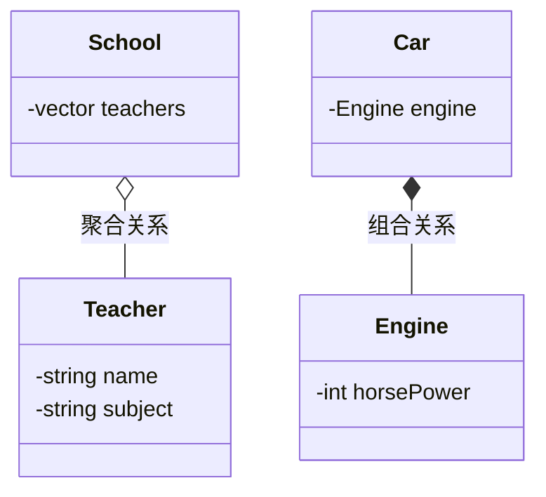

# C++ 对象组合

## 什么是对象组合

对象组合是面向对象编程中的一种基本技术，它指的是在一个类中包含其他类的对象作为成员变量。通过组合，我们可以在不继承的情况下复用已有的类功能，构建更加复杂和灵活的程序结构。

对象组合体现了"有一个"（HAS-A）的关系，与继承的"是一个"（IS-A）关系不同。例如，汽车"有一个"引擎，而不是"是一个"引擎。

:::tip 组合与继承的选择
有一条设计原则：**"组合优于继承"**。这是因为组合通常能提供更好的封装性，降低代码之间的耦合度。
:::

## 组合的基本语法

在C++中实现组合非常简单，只需要在一个类中声明另一个类的对象作为成员变量：

```cpp
class Component {
    // Component类的定义
public:
    void componentFunction() {
        std::cout << "Component function called" << std::endl;
    }
};

class Composite {
private:
    Component component; // 组合关系：Composite类包含Component对象
public:
    void compositeFunction() {
        std::cout << "Composite function called" << std::endl;
        component.componentFunction(); // 调用组合对象的方法
    }
};
```

## 组合的类型

对象组合主要分为两种类型：

1. **聚合（Aggregation）**：表示"弱"拥有关系，被组合的对象可以独立存在。例如，一个学校有多名教师，但教师离开学校后仍然是教师。

2. **组合（Composition）**：表示"强"拥有关系，被组合对象是组合对象的一部分，生命周期通常与组合对象相同。例如，一辆车有一个引擎，引擎是车的组成部分，车不存在了，引擎通常也就没有意义了。



## 实际案例：汽车与组件

让我们通过一个更完整的例子来理解对象组合。假设我们正在设计一个汽车模拟系统：

```cpp
#include <iostream>
#include <string>

// 引擎类
class Engine {
private:
    int horsePower;
public:
    Engine(int hp) : horsePower(hp) {}
    
    void start() {
        std::cout << "引擎启动，马力：" << horsePower << "HP" << std::endl;
    }
    
    void stop() {
        std::cout << "引擎停止" << std::endl;
    }
};

// 轮胎类
class Wheel {
private:
    std::string manufacturer;
public:
    Wheel(const std::string& maker) : manufacturer(maker) {}
    
    void inflate() {
        std::cout << manufacturer << "轮胎充气完毕" << std::endl;
    }
};

// 汽车类，由引擎和四个轮胎组成
class Car {
private:
    Engine engine;
    Wheel frontLeft;
    Wheel frontRight;
    Wheel rearLeft;
    Wheel rearRight;
    std::string model;
    
public:
    // 构造函数
    Car(const std::string& carModel, int enginePower, const std::string& wheelMaker)
        : engine(enginePower),
          frontLeft(wheelMaker), frontRight(wheelMaker),
          rearLeft(wheelMaker), rearRight(wheelMaker),
          model(carModel) {}
    
    // 准备汽车
    void prepare() {
        std::cout << "准备" << model << "汽车" << std::endl;
        frontLeft.inflate();
        frontRight.inflate();
        rearLeft.inflate();
        rearRight.inflate();
    }
    
    // 启动汽车
    void start() {
        std::cout << model << "准备出发" << std::endl;
        engine.start();
    }
    
    // 停止汽车
    void stop() {
        std::cout << model << "停车" << std::endl;
        engine.stop();
    }
};

int main() {
    // 创建一辆汽车
    Car myCar("特斯拉Model S", 670, "米其林");
    
    // 使用汽车
    myCar.prepare();
    std::cout << "-----------" << std::endl;
    myCar.start();
    std::cout << "-----------" << std::endl;
    myCar.stop();
    
    return 0;
}
```

**输出结果：**

```
准备特斯拉Model S汽车
米其林轮胎充气完毕
米其林轮胎充气完毕
米其林轮胎充气完毕
米其林轮胎充气完毕
-----------
特斯拉Model S准备出发
引擎启动，马力：670HP
-----------
特斯拉Model S停车
引擎停止
```

在这个例子中：
- `Car`类通过组合包含了一个`Engine`对象和四个`Wheel`对象
- 每个类负责自己的职责，实现了良好的封装
- 通过组合，`Car`类可以使用`Engine`和`Wheel`类提供的功能，而不需要重新实现这些功能

## 对象组合的优势

1. **代码复用**：可以使用现有类的功能，而无需复制或继承代码
2. **更高的灵活性**：可以在运行时动态更改组合关系
3. **更好的封装**：各个类只需要关注自己的责任
4. **降低耦合度**：组合比继承产生的类之间耦合度更低

## 组合与继承的比较

| 特性 | 组合 | 继承 |
|------|------|------|
| 关系 | "有一个" (HAS-A) | "是一个" (IS-A) |
| 代码复用 | 通过包含对象实现 | 通过扩展基类实现 |
| 灵活性 | 高（可以动态更改组合） | 相对较低（继承在编译时确定）|
| 访问限制 | 只能访问公共接口 | 可以访问protected成员 |
| 耦合度 | 低 | 高 |

:::caution 重要提示
虽然组合有诸多优点，但这并不意味着应该完全避免继承。在表示"是一个"关系时，继承是更自然的选择。最好的设计通常是组合与继承的适当结合。
:::

## 多重组合和委托

在更复杂的系统中，我们经常会看到多重组合，即一个类包含多个不同类型的对象。这种设计模式也称为"委托"，类将特定的任务委托给其包含的对象：

```cpp
class Dashboard {
public:
    void display() {
        std::cout << "显示仪表盘信息" << std::endl;
    }
};

class GPS {
public:
    void navigate() {
        std::cout << "GPS导航中..." << std::endl;
    }
};

// 增强的汽车类，包含更多组件
class AdvancedCar {
private:
    Engine engine;
    Dashboard dashboard;
    GPS navigationSystem;
    // 其他组件...

public:
    AdvancedCar() : engine(500) {}
    
    void displayInfo() {
        dashboard.display(); // 委托给Dashboard对象
    }
    
    void startNavigation() {
        navigationSystem.navigate(); // 委托给GPS对象
    }
};
```

## 总结

对象组合是C++面向对象编程中的一种强大技术，它允许我们：

1. 通过"有一个"关系构建复杂的类结构
2. 复用现有的代码而不是从头编写
3. 创建更加灵活、可维护的软件设计

掌握对象组合是成为高效C++程序员的关键步骤。在设计类时，应该优先考虑组合，只有在真正表示"是一个"关系时才使用继承。

## 练习

1. 设计一个`Computer`类，它通过组合包含`CPU`、`Memory`和`Storage`类。每个类都应该有相应的方法来模拟其功能。
2. 创建一个`Library`类，包含多本`Book`对象。实现添加书籍、删除书籍和查找书籍的功能。
3. 设计一个`SmartHome`系统，其中包含多个智能设备（如灯、恒温器、安全系统等）作为组件。实现控制这些设备的方法。

## 进一步阅读资源

- 《设计模式》（Gang of Four）中的组合模式
- 《Effective C++》第三版，条款32：确定你的public继承塑模出is-a关系
- 《C++ Primer》中关于类设计的章节