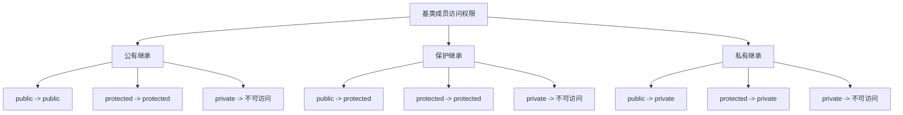

# C++ 继承类型

继承是面向对象编程的重要特性之一，它允许我们基于已有的类创建新类，从而实现代码的重用和层次化设计。C++支持三种不同类型的继承：公有继承(public)、保护继承(protected)和私有继承(private)。本文将详细介绍这三种继承类型的特点、区别和使用场景。

## 继承的基本概念

在C++中，我们将被继承的类称为**基类**(base class)或**父类**(parent class)，而继承基类的类称为**派生类**(derived class)或**子类**(child class)。

继承的基本语法如下：

```cpp
class 派生类名 : 继承方式 基类名 {
    // 派生类的成员
};
```

其中，继承方式可以是`public`、`protected`或`private`。

## 不同类型的继承

### 公有继承 (public)

公有继承是最常用的一种继承方式。在公有继承中，基类的**公有成员**在派生类中仍然是**公有的**，基类的**保护成员**在派生类中仍然是**保护的**，而基类的**私有成员**在派生类中**不可直接访问**。

```cpp
#include <iostream>
using namespace std;

class Base {
public:
    int publicVar;
    void publicFunction() {
        cout << "Base class public function" << endl;
    }
    
protected:
    int protectedVar;
    
private:
    int privateVar;
};

class Derived : public Base {  // 公有继承
public:
    void accessBaseMembers() {
        publicVar = 10;        // 可以访问基类的公有成员
        publicFunction();      // 可以访问基类的公有成员
        protectedVar = 20;     // 可以访问基类的保护成员
        // privateVar = 30;    // 错误：无法访问基类的私有成员
    }
};

int main() {
    Derived d;
    d.publicVar = 100;         // 外部可以访问基类的公有成员
    d.publicFunction();        // 外部可以访问基类的公有成员
    // d.protectedVar = 200;   // 错误：外部不能访问保护成员
    // d.privateVar = 300;     // 错误：外部不能访问私有成员
    
    return 0;
}
```

输出：
```
Base class public function
```

:::tip
公有继承建立了一个"是一个"(is-a)的关系，即派生类是基类的一个特例。例如，如果"鸟"是基类，"麻雀"是派生类，则可以说"麻雀是一种鸟"。
:::

### 保护继承 (protected)

在保护继承中，基类的**公有成员**和**保护成员**在派生类中都变成了**保护成员**，而基类的**私有成员**在派生类中仍然**不可直接访问**。

```cpp
#include <iostream>
using namespace std;

class Base {
public:
    int publicVar;
    
protected:
    int protectedVar;
    
private:
    int privateVar;
};

class Derived : protected Base {  // 保护继承
public:
    void accessBaseMembers() {
        publicVar = 10;        // 可以访问，但在Derived中是protected
        protectedVar = 20;     // 可以访问，在Derived中仍是protected
        // privateVar = 30;    // 错误：无法访问基类的私有成员
    }
};

class GrandDerived : public Derived {
public:
    void accessBaseMembers() {
        publicVar = 100;       // 可以访问，因为在Derived中是protected
        protectedVar = 200;    // 可以访问，因为在Derived中是protected
    }
};

int main() {
    Derived d;
    // d.publicVar = 100;      // 错误：在Derived中publicVar变为protected
    // d.protectedVar = 200;   // 错误：外部不能访问保护成员
    
    return 0;
}
```

:::note
保护继承通常用于需要在继承层次中保留访问权限，但不希望外部用户直接访问基类成员的情况。
:::

### 私有继承 (private)

在私有继承中，基类的**公有成员**和**保护成员**在派生类中都变成了**私有成员**，而基类的**私有成员**在派生类中仍然**不可直接访问**。

```cpp
#include <iostream>
using namespace std;

class Base {
public:
    int publicVar;
    
protected:
    int protectedVar;
    
private:
    int privateVar;
};

class Derived : private Base {  // 私有继承
public:
    void accessBaseMembers() {
        publicVar = 10;        // 可以访问，但在Derived中是private
        protectedVar = 20;     // 可以访问，但在Derived中是private
        // privateVar = 30;    // 错误：无法访问基类的私有成员
    }
    
    // 提供公有接口以访问基类成员
    void setPublicVar(int val) {
        publicVar = val;
    }
};

class GrandDerived : public Derived {
public:
    void accessBaseMembers() {
        // publicVar = 100;    // 错误：无法访问，因为在Derived中是private
        // protectedVar = 200; // 错误：无法访问，因为在Derived中是private
    }
};

int main() {
    Derived d;
    // d.publicVar = 100;      // 错误：在Derived中publicVar变为private
    d.setPublicVar(100);       // 通过公有接口访问
    
    return 0;
}
```

:::caution
私有继承建立了一个"用...来实现"(implemented-in-terms-of)的关系，而不是"是一个"的关系。这意味着派生类通过基类的功能来实现自己的功能，但派生类对象不能被视为基类对象。
:::

## 继承类型的选择

以下是选择不同继承类型的一般准则：

1. **公有继承**：当派生类是基类的一种特例，即存在"是一个"的关系时使用。这是最常见的继承方式。

2. **保护继承**：当希望基类的公有成员对派生类可见，但对外部隐藏时使用。适用于多层继承的中间层。

3. **私有继承**：当不希望表达"是一个"的关系，而只是想利用基类的实现时使用。在这种情况下，组合通常是更好的选择。

## 继承类型的比较

下表总结了不同继承类型对基类成员访问权限的影响：



## 实际应用案例

### 案例1：公有继承 - 形状层次结构

假设我们正在开发一个图形编辑应用程序，需要处理各种形状。我们可以定义一个基类`Shape`，然后从它派生出特定的形状类。

```cpp
#include <iostream>
#include <vector>
#include <cmath>
using namespace std;

class Shape {
public:
    virtual double area() const = 0;
    virtual double perimeter() const = 0;
    virtual void draw() const {
        cout << "Drawing a shape" << endl;
    }
    virtual ~Shape() {}
};

class Circle : public Shape {
private:
    double radius;
    
public:
    Circle(double r) : radius(r) {}
    
    double area() const override {
        return M_PI * radius * radius;
    }
    
    double perimeter() const override {
        return 2 * M_PI * radius;
    }
    
    void draw() const override {
        cout << "Drawing a circle with radius " << radius << endl;
    }
};

class Rectangle : public Shape {
private:
    double width;
    double height;
    
public:
    Rectangle(double w, double h) : width(w), height(h) {}
    
    double area() const override {
        return width * height;
    }
    
    double perimeter() const override {
        return 2 * (width + height);
    }
    
    void draw() const override {
        cout << "Drawing a rectangle with width " << width 
             << " and height " << height << endl;
    }
};

int main() {
    vector<Shape*> shapes;
    shapes.push_back(new Circle(5.0));
    shapes.push_back(new Rectangle(4.0, 6.0));
    
    for (const auto& shape : shapes) {
        shape->draw();
        cout << "Area: " << shape->area() << endl;
        cout << "Perimeter: " << shape->perimeter() << endl << endl;
    }
    
    // 释放内存
    for (auto& shape : shapes) {
        delete shape;
    }
    
    return 0;
}
```

输出：
```
Drawing a circle with radius 5
Area: 78.5398
Perimeter: 31.4159

Drawing a rectangle with width 4 and height 6
Area: 24
Perimeter: 20
```

### 案例2：私有继承 - Stack实现

有时我们可能想要使用现有类的功能，但不希望展示"是一个"的关系。例如，我们可以使用`std::vector`来实现一个栈，但我们不想让用户能够访问`std::vector`的所有方法。

```cpp
#include <iostream>
#include <vector>
using namespace std;

template <typename T>
class Stack : private vector<T> {
public:
    void push(const T& value) {
        this->push_back(value);  // 使用vector的push_back方法
    }
    
    void pop() {
        if (!empty()) {
            this->pop_back();  // 使用vector的pop_back方法
        }
    }
    
    const T& top() const {
        return this->back();  // 使用vector的back方法
    }
    
    bool empty() const {
        return vector<T>::empty();  // 使用vector的empty方法
    }
    
    size_t size() const {
        return vector<T>::size();  // 使用vector的size方法
    }
};

int main() {
    Stack<int> stack;
    stack.push(1);
    stack.push(2);
    stack.push(3);
    
    cout << "Stack size: " << stack.size() << endl;
    cout << "Top element: " << stack.top() << endl;
    
    stack.pop();
    cout << "After popping, top element: " << stack.top() << endl;
    
    // 以下操作不允许，因为vector的方法在Stack中是私有的
    // stack.push_back(4);  // 错误
    // stack[0] = 5;        // 错误
    
    return 0;
}
```

输出：
```
Stack size: 3
Top element: 3
After popping, top element: 2
```

## 总结

C++提供了三种继承类型，每种类型都有其特定的用途：

1. **公有继承**：保持基类成员的原有访问权限，建立"是一个"的关系。
2. **保护继承**：将基类的公有成员变为派生类的保护成员，适用于多层继承的中间层。
3. **私有继承**：将基类的公有和保护成员变为派生类的私有成员，建立"用...来实现"的关系。

在实际开发中，公有继承是最常见的，因为它符合面向对象设计的直觉。而保护继承和私有继承则在特定场景下有其用途。

:::tip
记住：继承应该表示"是一个"的关系。如果不符合这种关系，考虑使用组合而不是继承。
:::

## 练习

1. 创建一个基类`Vehicle`，包含公有方法`start()`和`stop()`，以及保护成员`speed`。从`Vehicle`公有继承出`Car`和`Motorcycle`类，并添加特定于各自类的方法。

2. 使用保护继承，创建一个基类`Database`和派生类`SecureDatabase`，然后再从`SecureDatabase`公有继承出`UserDatabase`，展示多层继承中保护继承的作用。

3. 使用私有继承，实现一个`Queue`类，该类使用`std::deque`作为其底层容器，但只提供队列的标准操作（enqueue, dequeue, front, isEmpty）。

## 进一步学习资源

- C++标准库中的继承使用案例（如`std::runtime_error`的派生类）
- 设计模式中的继承应用（如工厂模式、策略模式等）
- 多重继承和虚继承（C++特有的高级继承特性）

通过深入理解这些继承类型，你将能够更好地设计和实现类层次结构，从而编写更清晰、更可维护的C++代码。