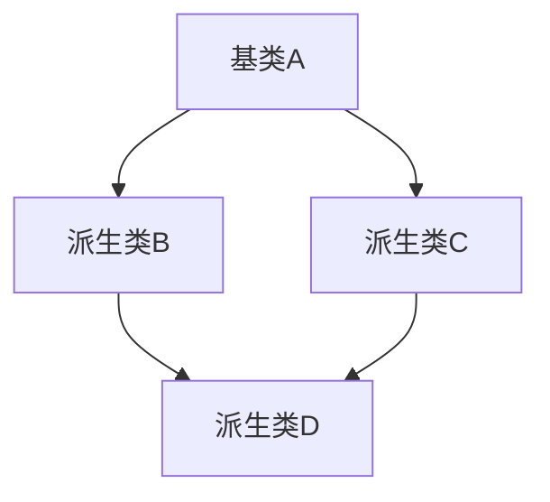

# C++ 多重继承

## 概述

多重继承是C++面向对象编程中的一个高级特性，允许一个类同时从多个基类继承属性和方法。与单继承（一个类只从一个基类继承）不同，多重继承使得派生类可以组合多个基类的功能，实现代码的高度复用和功能的组合。

:::note
多重继承是C++特有的特性，很多其他面向对象语言（如Java、C#）并不直接支持多重继承，而是通过接口等机制实现类似功能。
:::

## 基本语法

多重继承的基本语法如下：

```cpp
class BaseClass1 {
    // 基类1的成员
};

class BaseClass2 {
    // 基类2的成员
};

// 多重继承语法
class DerivedClass : public BaseClass1, public BaseClass2 {
    // 派生类的成员
};
```

上述代码中，`DerivedClass` 同时继承了 `BaseClass1` 和 `BaseClass2` 的公有成员。

## 多重继承的基本实例

下面是一个简单的多重继承示例：

```cpp
#include <iostream>
using namespace std;

// 第一个基类
class Animal {
public:
    Animal() {
        cout << "Animal构造函数被调用" << endl;
    }
    
    void eat() {
        cout << "动物需要吃东西" << endl;
    }
    
    virtual ~Animal() {
        cout << "Animal析构函数被调用" << endl;
    }
};

// 第二个基类
class Vehicle {
public:
    Vehicle() {
        cout << "Vehicle构造函数被调用" << endl;
    }
    
    void move() {
        cout << "交通工具可以移动" << endl;
    }
    
    virtual ~Vehicle() {
        cout << "Vehicle析构函数被调用" << endl;
    }
};

// 派生类同时继承Animal和Vehicle
class Horse : public Animal, public Vehicle {
public:
    Horse() {
        cout << "Horse构造函数被调用" << endl;
    }
    
    void makeSound() {
        cout << "马儿嘶鸣" << endl;
    }
    
    ~Horse() {
        cout << "Horse析构函数被调用" << endl;
    }
};

int main() {
    Horse myHorse;
    
    // 调用继承自Animal的方法
    myHorse.eat();
    
    // 调用继承自Vehicle的方法
    myHorse.move();
    
    // 调用自己的方法
    myHorse.makeSound();
    
    return 0;
}
```

**输出结果：**
```
Animal构造函数被调用
Vehicle构造函数被调用
Horse构造函数被调用
动物需要吃东西
交通工具可以移动
马儿嘶鸣
Horse析构函数被调用
Vehicle析构函数被调用
Animal析构函数被调用
```

从输出结果可以看出：
1. 构造函数的调用顺序：先基类，后派生类（若有多个基类，按照声明顺序调用）
2. 析构函数的调用顺序：先派生类，后基类（与构造函数顺序相反）
3. 派生类可以访问所有基类的公有成员

## 多重继承中的访问控制

与单继承类似，多重继承中也有三种继承方式：
- **public继承**：基类的public成员在派生类中仍为public，protected成员仍为protected
- **protected继承**：基类的public和protected成员在派生类中均变为protected
- **private继承**：基类的public和protected成员在派生类中均变为private

```cpp
// 不同继承方式的示例
class DerivedClass1 : public BaseClass1, public BaseClass2 {
    // 两个基类的public成员在这里仍是public
};

class DerivedClass2 : public BaseClass1, protected BaseClass2 {
    // BaseClass1的public成员在这里仍是public
    // BaseClass2的public成员在这里变成protected
};

class DerivedClass3 : private BaseClass1, public BaseClass2 {
    // BaseClass1的public成员在这里变成private
    // BaseClass2的public成员在这里仍是public
};
```

## 菱形继承问题

多重继承的主要问题之一是所谓的"菱形继承"（Diamond Problem）。当一个类通过多条继承路径继承同一个基类时，就会出现这个问题。



下面是一个菱形继承的代码示例：

```cpp
#include <iostream>
using namespace std;

// 最顶层基类
class Animal {
public:
    Animal() : age(0) {
        cout << "Animal构造函数被调用" << endl;
    }
    
    void setAge(int a) {
        age = a;
    }
    
    int getAge() const {
        return age;
    }
    
protected:
    int age;
};

// 中间层派生类1
class Mammal : public Animal {
public:
    Mammal() {
        cout << "Mammal构造函数被调用" << endl;
    }
    
    void giveBirth() {
        cout << "哺乳动物可以生育" << endl;
    }
};

// 中间层派生类2
class WingedAnimal : public Animal {
public:
    WingedAnimal() {
        cout << "WingedAnimal构造函数被调用" << endl;
    }
    
    void flap() {
        cout << "有翅膀的动物可以拍打翅膀" << endl;
    }
};

// 最底层派生类，同时继承Mammal和WingedAnimal
class Bat : public Mammal, public WingedAnimal {
public:
    Bat() {
        cout << "Bat构造函数被调用" << endl;
    }
};

int main() {
    Bat bat;
    
    // 错误：age成员存在二义性
    // bat.setAge(3); // 编译错误
    
    // 必须明确指定路径
    bat.Mammal::setAge(3);
    cout << "通过Mammal路径访问age: " << bat.Mammal::getAge() << endl;
    
    bat.WingedAnimal::setAge(4);
    cout << "通过WingedAnimal路径访问age: " << bat.WingedAnimal::getAge() << endl;
    
    // 可以调用各自特有的方法
    bat.giveBirth();
    bat.flap();
    
    return 0;
}
```

**输出结果：**
```
Animal构造函数被调用
Mammal构造函数被调用
Animal构造函数被调用
WingedAnimal构造函数被调用
Bat构造函数被调用
通过Mammal路径访问age: 3
通过WingedAnimal路径访问age: 4
哺乳动物可以生育
有翅膀的动物可以拍打翅膀
```

从上面的例子可以看出，`Bat` 类中包含了两份 `Animal` 类的实例，这可能导致数据冗余和访问二义性。要访问 `Animal` 的成员，必须明确指定访问路径。

## 虚继承解决菱形继承问题

C++提供了虚继承（virtual inheritance）机制来解决菱形继承问题：

```cpp
#include <iostream>
using namespace std;

// 最顶层基类
class Animal {
public:
    Animal() : age(0) {
        cout << "Animal构造函数被调用" << endl;
    }
    
    void setAge(int a) {
        age = a;
    }
    
    int getAge() const {
        return age;
    }
    
protected:
    int age;
};

// 使用虚继承
class Mammal : virtual public Animal {
public:
    Mammal() {
        cout << "Mammal构造函数被调用" << endl;
    }
    
    void giveBirth() {
        cout << "哺乳动物可以生育" << endl;
    }
};

// 使用虚继承
class WingedAnimal : virtual public Animal {
public:
    WingedAnimal() {
        cout << "WingedAnimal构造函数被调用" << endl;
    }
    
    void flap() {
        cout << "有翅膀的动物可以拍打翅膀" << endl;
    }
};

// 最底层派生类
class Bat : public Mammal, public WingedAnimal {
public:
    Bat() {
        cout << "Bat构造函数被调用" << endl;
    }
};

int main() {
    Bat bat;
    
    // 虚继承后，可以直接访问Animal的成员，不存在二义性
    bat.setAge(3);
    cout << "年龄: " << bat.getAge() << endl;
    
    bat.giveBirth();
    bat.flap();
    
    return 0;
}
```

**输出结果：**
```
Animal构造函数被调用
Mammal构造函数被调用
WingedAnimal构造函数被调用
Bat构造函数被调用
年龄: 3
哺乳动物可以生育
有翅膀的动物可以拍打翅膀
```

通过虚继承，`Animal` 在 `Bat` 类中只有一个实例，解决了数据冗余和访问二义性的问题。

:::warning
使用虚继承时，构造函数的调用顺序会发生变化：虚基类的构造函数总是先于非虚基类的构造函数被调用，无论它们在继承列表中的位置如何。
:::

## 多重继承中的构造函数和析构函数

在多重继承中，构造函数和析构函数的调用顺序遵循以下规则：

1. **构造函数顺序**：
   - 首先调用虚基类的构造函数（如果有），按照它们在类继承图中出现的顺序
   - 然后调用非虚基类的构造函数，按照它们在继承列表中声明的顺序
   - 最后调用派生类的构造函数

2. **析构函数顺序**：
   - 与构造函数顺序相反，先派生类，后基类
   - 先非虚基类，后虚基类

```cpp
#include <iostream>
using namespace std;

class Base1 {
public:
    Base1() { cout << "Base1构造函数" << endl; }
    virtual ~Base1() { cout << "Base1析构函数" << endl; }
};

class Base2 {
public:
    Base2() { cout << "Base2构造函数" << endl; }
    virtual ~Base2() { cout << "Base2析构函数" << endl; }
};

class Derived : public Base1, public Base2 {
public:
    Derived() : Base2(), Base1() { // 注意：这里的顺序不影响实际构造顺序
        cout << "Derived构造函数" << endl;
    }
    ~Derived() { cout << "Derived析构函数" << endl; }
};

int main() {
    Derived d;
    return 0;
}
```

**输出结果：**
```
Base1构造函数
Base2构造函数
Derived构造函数
Derived析构函数
Base2析构函数
Base1析构函数
```

:::caution
即使在初始化列表中改变基类构造函数的顺序（如示例中的 `Base2(), Base1()`），构造函数的实际调用顺序仍然取决于继承声明的顺序（`public Base1, public Base2`）。
:::

## 多重继承的实际应用场景

虽然多重继承有其复杂性，但在某些场景下非常有用：

### 1. 接口组合

多重继承最常见的应用是组合多个接口（纯虚类）：

```cpp
// 可序列化接口
class ISerializable {
public:
    virtual ~ISerializable() {}
    virtual void serialize() = 0;
    virtual void deserialize() = 0;
};

// 可克隆接口
class IClonable {
public:
    virtual ~IClonable() {}
    virtual IClonable* clone() = 0;
};

// 实现多个接口
class Document : public ISerializable, public IClonable {
public:
    void serialize() override {
        cout << "序列化文档" << endl;
    }
    
    void deserialize() override {
        cout << "反序列化文档" << endl;
    }
    
    IClonable* clone() override {
        cout << "克隆文档" << endl;
        return new Document(*this);
    }
};
```

### 2. 混入（Mixin）模式

多重继承可以用于实现混入模式，即将可重用的功能组合到类中：

```cpp
// 日志记录功能
class LoggerMixin {
public:
    void log(const string& message) {
        cout << "日志: " << message << endl;
    }
};

// 性能计时功能
class TimerMixin {
public:
    void startTimer() {
        cout << "计时开始" << endl;
    }
    
    void stopTimer() {
        cout << "计时结束" << endl;
    }
};

// 组合功能
class DatabaseOperation : public LoggerMixin, public TimerMixin {
public:
    void executeQuery(const string& query) {
        log("执行查询: " + query);
        startTimer();
        
        // 执行查询...
        cout << "执行查询: " << query << endl;
        
        stopTimer();
        log("查询完成");
    }
};
```

### 3. 模拟多重继承的设计模式

如果担心多重继承的复杂性，可以使用以下设计模式来模拟多重继承：

#### 组合优于继承

```cpp
class Engine {
public:
    void start() { cout << "引擎启动" << endl; }
};

class Radio {
public:
    void playMusic() { cout << "播放音乐" << endl; }
};

// 使用组合而不是多重继承
class Car {
private:
    Engine engine;
    Radio radio;
    
public:
    void startEngine() { engine.start(); }
    void playRadio() { radio.playMusic(); }
};
```

## 多重继承的最佳实践

1. **尽量避免多继承非接口类**
   - 如果可能，只多重继承纯虚类（接口）

2. **使用虚继承解决菱形继承问题**
   - 当无法避免菱形继承时，使用虚继承

3. **注意命名冲突**
   - 避免在不同基类中使用相同的方法名或数据成员名

4. **显式指定基类**
   - 在访问从多个基类继承的同名方法时，明确指定基类

5. **考虑替代设计模式**
   - 组合模式、委托模式或Mixin模式可能是更好的选择

## 总结

C++的多重继承是一个强大但复杂的特性，它允许一个类同时从多个基类继承功能。虽然它提供了代码复用和功能组合的灵活性，但也带来了一些复杂性，如菱形继承问题和命名冲突。

在实际开发中：
- 谨慎使用多重继承
- 优先考虑接口继承（纯虚类）
- 适当使用虚继承解决菱形继承问题
- 考虑组合或其他设计模式作为替代方案

多重继承是C++区别于其他面向对象语言的重要特性之一，掌握它将有助于您在特定场景下设计出更灵活、更强大的程序。

## 练习

1. 创建一个多重继承的层次结构，包含 `Printable`、`Savable` 和 `Document` 类，其中 `Document` 同时继承前两个类。
2. 实现一个菱形继承的示例，并使用虚继承解决数据冗余问题。
3. 在不使用多重继承的情况下，使用组合模式重新设计练习1中的类层次结构。

## 附加资源

- 《Effective C++》中关于多重继承的章节
- 《C++ Primer》中的继承与派生部分
- ISO C++标准关于继承的规范