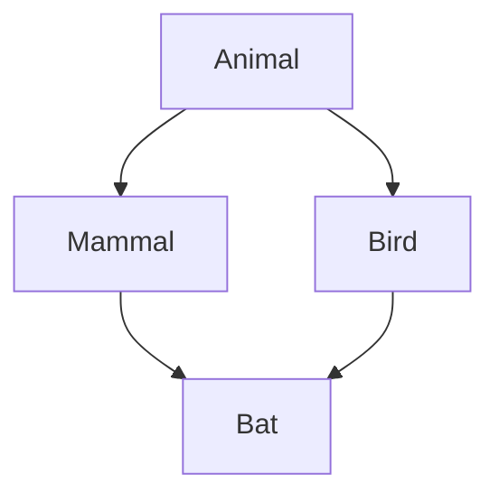
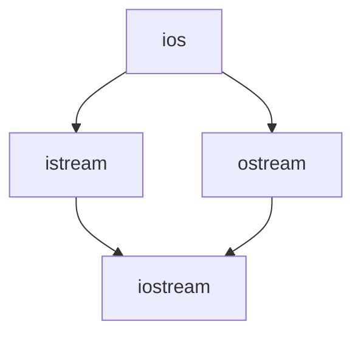

# C++ 虚拟继承

## 引言

在C++面向对象编程中，继承是一个基础且强大的概念。然而，当我们涉及到多重继承时，可能会遇到一些问题，比如"菱形继承"问题。C++虚拟继承(Virtual Inheritance)就是为了解决这类问题而设计的一种特殊继承方式。

在本文中，我们将详细讲解什么是虚拟继承，为什么需要它，以及如何在代码中正确使用它。

## 什么是菱形继承问题？

在了解虚拟继承之前，我们需要先理解它要解决的问题——菱形继承问题（也称为钻石继承问题）。

假设我们有以下继承结构：



在这种结构中：

1. `Animal` 是基类
2. `Mammal` 和 `Bird` 都继承自 `Animal`
3. `Bat` 同时继承自 `Mammal` 和 `Bird`

这就形成了一个菱形结构。问题来了：`Bat` 会包含两份 `Animal` 的数据成员，一份来自 `Mammal`，另一份来自 `Bird`。这会导致数据冗余和访问歧义。

## 虚拟继承解决方案

C++提供了虚拟继承来解决菱形继承问题。通过使用 `virtual` 关键字声明继承，可以确保共同基类只存在一个实例：

```cpp
class Animal {
public:
    int age;
    void eat() {
        std::cout << "Animal is eating\n";
    }
};

class Mammal : virtual public Animal {
public:
    void giveBirth() {
        std::cout << "Mammal is giving birth\n";
    }
};

class Bird : virtual public Animal {
public:
    void layEggs() {
        std::cout << "Bird is laying eggs\n";
    }
};

class Bat : public Mammal, public Bird {
public:
    void fly() {
        std::cout << "Bat is flying\n";
    }
};
```

在上述代码中，`Mammal` 和 `Bird` 都通过 `virtual` 关键字虚拟继承了 `Animal`。这样，`Bat` 类中就只会包含一份 `Animal` 的数据。

## 虚拟继承的工作原理

虚拟继承的关键在于：

1. 当类通过虚拟继承派生时，该类的对象会包含一个虚拟基类指针（vbptr）
2. 这个指针指向一个虚拟基类表（VBTABLE）
3. VBTABLE包含了虚拟基类子对象相对于当前对象的偏移量
4. 通过这种机制，编译器可以找到唯一的虚拟基类实例

:::note
虽然虚拟继承解决了数据冗余问题，但它也带来了一些性能开销，因为需要通过指针间接访问虚拟基类。
:::

## 实际示例

让我们通过一个完整的例子来看看虚拟继承的效果：

```cpp
#include <iostream>

class Animal {
public:
    int age;
    Animal() : age(1) {
        std::cout << "Animal constructor called\n";
    }
    void eat() {
        std::cout << "Animal is eating\n";
    }
};

class Mammal : virtual public Animal {
public:
    Mammal() {
        std::cout << "Mammal constructor called\n";
    }
    void giveBirth() {
        std::cout << "Mammal is giving birth\n";
    }
};

class Bird : virtual public Animal {
public:
    Bird() {
        std::cout << "Bird constructor called\n";
    }
    void layEggs() {
        std::cout << "Bird is laying eggs\n";
    }
};

class Bat : public Mammal, public Bird {
public:
    Bat() {
        std::cout << "Bat constructor called\n";
    }
    void fly() {
        std::cout << "Bat is flying\n";
    }
};

int main() {
    Bat bat;
    
    // 使用Animal的成员
    std::cout << "Bat's age: " << bat.age << "\n";
    bat.eat();
    
    // 使用Mammal和Bird的成员
    bat.giveBirth();
    bat.layEggs();
    
    // 使用Bat自己的成员
    bat.fly();
    
    return 0;
}
```

输出结果：

```
Animal constructor called
Mammal constructor called
Bird constructor called
Bat constructor called
Bat's age: 1
Animal is eating
Mammal is giving birth
Bird is laying eggs
Bat is flying
```

注意到 `Animal` 构造函数只被调用了一次，这证明在 `Bat` 对象中只有一个 `Animal` 实例。

## 虚拟继承的构造顺序

使用虚拟继承时，构造函数的调用顺序有点特殊：

1. 首先调用虚拟基类的构造函数
2. 然后按照声明顺序调用非虚拟基类的构造函数
3. 之后按照声明顺序调用普通基类的构造函数
4. 最后调用派生类的构造函数

这与普通继承的构造顺序不同，需要特别注意。

## 虚拟继承的实际应用场景

虚拟继承在一些复杂的类层次结构中非常有用，特别是在以下场景：

1. **UI框架**：许多UI框架使用复杂的继承层次，虚拟继承可以避免重复的基类组件。

2. **标准库实现**：C++标准库的iostream继承体系中使用了虚拟继承：



在这种情况下，`ios` 就是通过虚拟继承来避免在 `iostream` 中出现两次的。

3. **设计模式**：在一些设计模式实现中，如桥接模式或装饰器模式，可能会用到虚拟继承来避免接口的重复。

## 虚拟继承的注意事项

使用虚拟继承时，需要注意以下几点：

1. **性能开销**：虚拟继承会引入额外的内存开销和间接访问成本。

2. **构造函数调用顺序**：如前所述，虚拟继承改变了构造函数的调用顺序。

3. **初始化责任**：最终的派生类负责初始化虚拟基类，中间的派生类对虚拟基类的初始化会被忽略。

```cpp
class Bat : public Mammal, public Bird {
public:
    // 直接负责初始化虚拟基类Animal
    Bat() : Animal(10), Mammal(), Bird() {
        std::cout << "Bat constructor called\n";
    }
};
```

4. **避免过度使用**：虚拟继承应该谨慎使用，只在真正需要解决菱形继承问题时才使用。

:::caution
过度使用虚拟继承可能会导致代码复杂性增加、性能下降，应该在必要时才使用。
:::

## 练习

为了巩固对虚拟继承的理解，试试以下练习：

1. 创建一个没有使用虚拟继承的菱形继承结构，观察成员访问的歧义性。
2. 修改上面的代码，加入虚拟继承，解决歧义问题。
3. 尝试在菱形继承结构中跟踪构造函数的调用顺序，分别使用普通继承和虚拟继承。
4. 实现一个简单的UI组件继承结构，其中一些基本功能（如绘制边框）在虚拟基类中定义。

## 总结

C++虚拟继承是解决菱形继承问题的有效机制。通过确保共同基类只在派生类中存在一个实例，它消除了数据冗余和访问歧义。虽然虚拟继承很强大，但也带来了一些复杂性和性能开销，应该在真正需要时才使用。

理解虚拟继承是掌握C++高级面向对象编程的重要一步，它展示了C++设计的灵活性和处理复杂继承关系的能力。

## 进一步学习资源

- 《Effective C++》by Scott Meyers
- 《Inside the C++ Object Model》by Stanley Lippman
- C++ 标准库源码，特别是iostream的实现
- 《C++ Primer》中的多重继承和虚拟继承章节

对于想要深入理解C++内存模型和对象布局的开发者，建议研究虚拟继承在不同编译器中的实现细节。